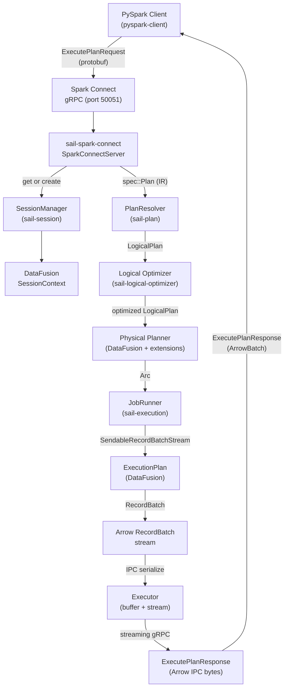

# Chapter 1: Architecture Overview

## The Problem Space

Apache Spark is the de-facto standard for large-scale data processing. Its DataFrame API and Spark SQL dialect are understood by millions of engineers, embedded in thousands of pipelines, and wrapped by dozens of downstream tools. The problem is not the API — the problem is the runtime. The JVM carries significant overhead: slow startup, non-deterministic GC pauses, memory management via off-heap tricks, and a deployment model that requires spinning up JVM processes on every worker.

Sail's thesis is that the Spark API is worth keeping and the Spark runtime is worth replacing. The Spark Connect protocol, introduced in Spark 3.4, makes that substitution possible: it separates the client (PySpark) from the server with a well-defined gRPC boundary. A client that speaks Spark Connect can be pointed at any conforming server — including one written entirely in Rust.

## The Query Path

Here is what happens when a PySpark program executes `df.filter(col("amount") > 100).show()` against a Sail server.



Each box in this diagram corresponds to one or more Rust crates. The hand-off points — the types crossing crate boundaries — are the interesting design choices, and most of this book is about them.

## The Crate Landscape

Sail's workspace contains ~35 crates under `crates/`. They fall into a few natural groups.

### Protocol and Entry Points

| Crate | Role |
|---|---|
| `sail-spark-connect` | Implements the `SparkConnectService` gRPC trait from the Spark Connect protobuf. This is the primary entry point for PySpark clients. |
| `sail-flight` | Implements Apache Arrow Flight SQL. An alternative entry point for ADBC/JDBC clients that speak Flight SQL rather than Spark Connect. |
| `sail-server` | Low-level gRPC server builder, actor system, retry logic. Used by both entry points. |
| `sail-cli` | The `sail` binary — parses command-line arguments and starts either server. |
| `sail-python` | PyO3 bindings. The `pysail._native` Python module that starts the embedded Rust server from Python. |

### Planning

| Crate | Role |
|---|---|
| `sail-sql-parser` | Custom SQL parser built with `chumsky` (Pratt combinator library). Contains its own lexer, token types, AST, and keyword codegen — no `sqlparser-rs` dependency. |
| `sail-sql-analyzer` | Converts the SQL AST into `sail-common`'s internal `spec` IR: statement-level conversion, type inference, interval/date/timestamp parsing. |
| `sail-plan` | The main planning crate: `PlanResolver` translates `spec::Plan` → DataFusion `LogicalPlan`, then drives optimization and physical planning. Contains `resolve_and_execute_plan`. Also houses the `ScalarFunctionBuilder` DSL and the 400+ function registry. |
| `sail-plan-lakehouse` | Bridges write operations (Delta/Iceberg) to physical plans. Contains `ExpandRowLevelOp` logical optimizer rule and `DeltaExtensionPlanner`. |
| `sail-logical-plan` | 17 custom `UserDefinedLogicalNodeCore` implementations: `RangeNode`, `ExplicitRepartitionNode`, `ShowStringNode`, `MapPartitionsNode`, `FileWriteNode`, `BarrierNode`, 5 streaming nodes, and more. |
| `sail-physical-plan` | Corresponding custom `ExecutionPlan` implementations for all 17 logical nodes. |
| `sail-logical-optimizer` | Custom logical optimizer rules, e.g. `DecorrelateLateralProjection`. |
| `sail-physical-optimizer` | Rebuilds the entire physical optimizer pipeline from scratch, embedding all DataFusion rules in order plus custom rules: `JoinReorder` (DP algorithm), `RewriteExplicitRepartition`, `RewriteCollectLeftHashJoin`, `EnforceBarrierPartitioning`. |
| `sail-session` | Session lifecycle and the physical planning bridge: `ExtensionQueryPlanner`, `ExtensionPhysicalPlanner` (dispatches all 17 custom nodes to their physical counterparts), `SessionFactory`, `SessionManager`. |

### Execution

| Crate | Role |
|---|---|
| `sail-execution` | The distributed execution engine. Implements `JobRunner` with two backends: `LocalJobRunner` (single-process) and `ClusterJobRunner` (driver/worker cluster). Contains the `DriverActor`, `WorkerActor`, task scheduling, and inter-node stream transport. |
| `sail-common-datafusion` | Shared DataFusion utilities: `SessionExtension`/`SessionExtensionAccessor` traits, `JobRunner`/`JobService` traits, `TableFormat` trait and `TableFormatRegistry`, catalog display helpers. |

### Catalogs

| Crate | Role |
|---|---|
| `sail-catalog` | The `CatalogProvider` trait and shared catalog utilities. |
| `sail-catalog-memory` | In-memory catalog (default). |
| `sail-catalog-glue` | AWS Glue Data Catalog. |
| `sail-catalog-hms` | Hive Metastore (Thrift). |
| `sail-catalog-iceberg` | Apache Iceberg REST catalog. |
| `sail-catalog-unity` | Databricks Unity Catalog. |
| `sail-catalog-onelake` | Microsoft OneLake / Fabric. |
| `sail-catalog-system` | Built-in system catalog (`spark_catalog`). |

### Table Formats and Data Sources

| Crate | Role |
|---|---|
| `sail-delta-lake` | Delta Lake: read, append/overwrite write, MERGE (via row-level write), Variant Shredding, Deletion Vectors. Basic delete/update route through Delta's physical planner; optimize/vacuum/CDC are not yet implemented. |
| `sail-iceberg` | Iceberg table read via `iceberg-rust`; write not yet implemented. |
| `sail-data-source` | File-based sources (Parquet, CSV, JSON, ORC, Avro), schema/compression inference, listing table source. |
| `sail-object-store` | Object store adapters (S3, GCS, Azure Blob) with Spark-compatible URI schemes. |

### Supporting

| Crate | Role |
|---|---|
| `sail-common` | Cross-cutting primitives: `spec` IR (2,476 lines, 74 named types), config, error types, datetime utilities. |
| `sail-function` | Spark function implementations (scalar, aggregate, window, table). Used by `sail-plan`'s function registry. |
| `sail-sql-macro` | Proc-macros for the SQL parser: `#[derive(TreeParser)]`, `#[derive(TreeSyntax)]`, `#[derive(TreeText)]` — derive recursive-descent parsers and unparser from annotated AST structs. |
| `sail-python-udf` | PyO3-based Python UDF/UDTF execution; supports batch, Arrow-batch, Pandas scalar, grouped map, co-grouped map UDF types. |
| `sail-telemetry` | OpenTelemetry tracing and metrics. |
| `sail-gold-test` | Golden-file test infrastructure: generates test suites from Spark's own function documentation, diffs Sail output against Spark output. |
| `sail-build-scripts` | Build script utilities for codegen. |

## The Internal IR: `spec`

One design choice that shapes the whole codebase is the existence of a crate-internal intermediate representation: the `spec` module in `sail-common`. When `sail-spark-connect` receives a protobuf `Plan`, it does not hand the raw protobuf types to the plan resolver. Instead, it converts them into `spec::Plan`, `spec::QueryNode`, `spec::CommandNode`, `spec::Expr`, etc. — Rust types that capture the same semantics but without the protobuf boilerplate.

The spec IR is larger than it might appear: `spec/plan.rs` is 1,356 lines with 74 named types. The `QueryNode` enum has 50+ variants (Filter, Join, Aggregate, Pivot, Unpivot, GroupMap, CoGroupMap, ApplyInPandasWithState, WithWatermark, StatSampleBy, …); the `CommandNode` enum covers everything from `CreateTable` to `MergeInto` to `AlterColumnType`. This is a full Spark relational algebra IR.

`sail-plan`'s resolver has no `prost` dependency; it works with clean Rust enums. The same `spec` types are used by `sail-flight` and `sail-sql-analyzer`, so all three entry points converge to the same planning code.

## Dependency Layering

The crate dependency graph is strictly layered to prevent cycles:

```
sail-python  →  sail-spark-connect  →  sail-plan  →  sail-common
                sail-flight         →  sail-sql-analyzer
                                    →  sail-logical-plan
                                    →  sail-physical-plan
                                    →  sail-execution
                                    →  sail-catalog-*
```

`sail-common` has no dependencies on other Sail crates. `sail-plan` does not import from `sail-spark-connect`. The execution engine (`sail-execution`) is likewise isolated from the protocol layer — it receives a `Arc<dyn ExecutionPlan>` and produces a `SendableRecordBatchStream`; it has no knowledge of Spark Connect.

This layering is enforced by the Cargo workspace. Circular dependencies would cause a compile error.

## The Two Runtimes

Sail runs two Tokio runtimes: a *primary* runtime for the server (gRPC, session management, query planning) and a *worker* runtime for execution tasks. The `RuntimeHandle` type in `sail-common` wraps both and is threaded through the codebase wherever a handle to the right runtime is needed. This separation allows the execution layer to be offloaded to its own thread pool without interfering with the server's responsiveness.

When running in embedded Python mode (`SparkConnectServer` via PyO3), there is an additional constraint: the Python GIL. Python UDFs must be able to call back into the Python interpreter, which requires releasing the GIL on the Rust side at the right points. `sail-python/src/spark/server.rs` handles this by running the Tokio server on a dedicated OS thread and using `py.detach(...)` to release the GIL when blocking on server shutdown.

## Summary

A PySpark query enters Sail as a protobuf message, is decoded into the `spec` IR, resolved and optimized by DataFusion's planner plus Sail's custom nodes and rules, dispatched to a job runner that produces a RecordBatch stream, serialized into Arrow IPC, and streamed back over gRPC. Every stage of this pipeline is a Rust crate with a clean interface. The rest of this book zooms into each stage in turn.
