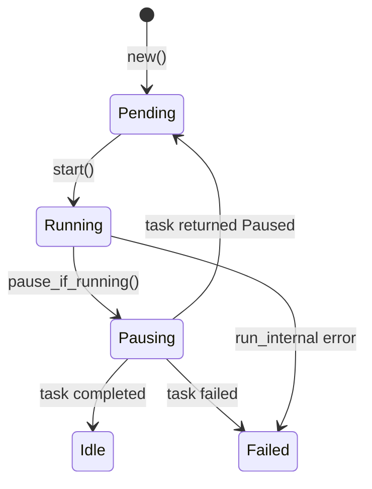

# Chapter 2: The Spark Connect Protocol

## Why Spark Connect Matters

Before Spark 3.4, the only way to talk to a Spark cluster from Python was through the Py4J bridge: PySpark would serialize Python objects into JVM objects using a local socket, execute on the JVM, and deserialize results back. This architecture tied the client tightly to the server — same version, same JVM, same cluster. There was no stable binary protocol, no way to implement an alternative server.

Spark Connect changed this. It defines a gRPC service with a protobuf schema that describes Spark's entire logical plan space: every relation type (scan, join, aggregate, window, ...), every expression type (literal, column reference, function call, ...), every command (write, create view, register UDF, ...). The Python client constructs a `Plan` protobuf on the local machine and sends it to the server; the server runs it and streams results back as Arrow IPC. Client and server are now separate processes speaking a documented protocol.

For Sail, this is the foundation. Sail is the server. It does not need to ship with Spark, match Spark's JVM version, or run Scala code. It just needs to implement the `SparkConnectService` gRPC interface faithfully.

## The Protobuf Schema

The Spark Connect proto files define several services and message types. The key service:

```protobuf
service SparkConnectService {
  rpc ExecutePlan(ExecutePlanRequest) returns (stream ExecutePlanResponse);
  rpc AnalyzePlan(AnalyzePlanRequest) returns (AnalyzePlanResponse);
  rpc Config(ConfigRequest) returns (ConfigResponse);
  rpc AddArtifacts(stream AddArtifactsRequest) returns (AddArtifactsResponse);
  rpc ArtifactStatuses(ArtifactStatusesRequest) returns (ArtifactStatusesResponse);
  rpc Interrupt(InterruptRequest) returns (InterruptResponse);
  rpc ReattachExecute(ReattachExecuteRequest) returns (stream ExecutePlanResponse);
  rpc ReleaseExecute(ReleaseExecuteRequest) returns (ReleaseExecuteResponse);
  rpc ReleaseSession(ReleaseSessionRequest) returns (ReleaseSessionResponse);
  rpc FetchErrorDetails(FetchErrorDetailsRequest) returns (FetchErrorDetailsResponse);
}
```

Notice that `ExecutePlan` returns a *stream* of responses — this is how large result sets are chunked. `ReattachExecute` is a Spark Connect innovation: if the client loses its connection mid-stream, it can reconnect and resume from where it left off using the `response_id` values in each chunk. This requires the server to buffer recent responses.

In Sail, the protos are compiled at build time with `tonic`'s `include_proto!` macro. The generated types live behind the `crate::spark::connect` path:

```rust
// crates/sail-spark-connect/src/lib.rs
pub mod spark {
    #[expect(clippy::all, clippy::allow_attributes)]
    pub mod connect {
        tonic::include_proto!("spark.connect");
        tonic::include_proto!("spark.connect.serde");
        pub const FILE_DESCRIPTOR_SET: &[u8] =
            tonic::include_file_descriptor_set!("spark_connect_descriptor");
    }
    #[expect(clippy::doc_markdown)]
    pub mod config {
        include!(concat!(env!("OUT_DIR"), "/spark_config.rs"));
    }
}
```

The `#[expect(clippy::all)]` annotation is necessary because generated code does not follow Sail's strict Clippy configuration (which bans `unwrap`, `expect`, and `panic` in non-generated code).

## `SparkConnectServer`: The gRPC Handler

The heart of `sail-spark-connect` is `SparkConnectServer` in `crates/sail-spark-connect/src/server.rs`. It holds a single field — a `SessionManager` — and implements the `SparkConnectService` trait generated from the proto:

```rust
#[derive(Debug)]
pub struct SparkConnectServer {
    session_manager: SessionManager,
}

#[tonic::async_trait]
impl SparkConnectService for SparkConnectServer {
    type ExecutePlanStream = ExecutePlanResponseStream;

    async fn execute_plan(
        &self,
        request: Request<ExecutePlanRequest>,
    ) -> Result<Response<Self::ExecutePlanStream>, Status> {
        let request = request.into_inner();
        let session_id = request.session_id;
        let user_id = request.user_context.map(|u| u.user_id).unwrap_or_default();
        let metadata = ExecutorMetadata {
            operation_id: request
                .operation_id
                .unwrap_or_else(|| Uuid::new_v4().to_string()),
            tags: request.tags,
            reattachable: is_reattachable(&request.request_options),
        };
        let ctx = self
            .session_manager
            .get_or_create_session_context(session_id, user_id)
            .await
            .map_err(SparkError::from)?;
        let Plan { op_type: op } = request.plan.required("plan")?;
        let op = op.required("plan op")?;
        let stream = match op {
            plan::OpType::Root(relation) => {
                service::handle_execute_relation(&ctx, relation, metadata).await?
            }
            plan::OpType::Command(Command { command_type: command }) => {
                let command = command.required("command")?;
                handle_command(&ctx, command, metadata).await?
            }
            plan::OpType::CompressedOperation(_) => {
                return Err(Status::unimplemented("compressed operation plan"));
            }
        };
        Ok(Response::new(stream))
    }
    // ...
}
```

The flow is:
1. Extract `session_id` and `user_id` from the request.
2. Call `get_or_create_session_context` — this either returns an existing DataFusion `SessionContext` or creates a fresh one, fully initialized with Spark semantics.
3. Inspect the plan's `op_type`: it is either a `Root` (a query/relation to execute) or a `Command` (a mutation like a write, DDL, or UDF registration).
4. Delegate to the appropriate handler in the `service` module.
5. Return a `Response::new(stream)` — the stream is `ExecutePlanResponseStream`, a wrapper around a tokio channel that produces `ExecutePlanResponse` values.

### Routing Commands

The `handle_command` function routes protobuf `CommandType` variants to typed handlers:

```rust
async fn handle_command(
    ctx: &SessionContext,
    command: crate::spark::connect::command::CommandType,
    metadata: ExecutorMetadata,
) -> SparkResult<ExecutePlanResponseStream> {
    use crate::spark::connect::command::CommandType;

    match command {
        CommandType::RegisterFunction(udf) => {
            service::handle_execute_register_function(ctx, udf, metadata).await
        }
        CommandType::WriteOperation(write) => {
            service::handle_execute_write_operation(ctx, write, metadata).await
        }
        CommandType::CreateDataframeView(view) => {
            service::handle_execute_create_dataframe_view(ctx, view, metadata).await
        }
        CommandType::WriteOperationV2(write) => {
            service::handle_execute_write_operation_v2(ctx, write, metadata).await
        }
        CommandType::SqlCommand(sql) => {
            service::handle_execute_sql_command(ctx, sql, metadata).await
        }
        CommandType::MergeIntoTableCommand(command) => {
            service::handle_execute_merge_into_table_command(ctx, command, metadata).await
        }
        CommandType::MlCommand(_) => Err(SparkError::todo("ml command")),
        // ... many more arms
    }
}
```

The pattern is consistent: each protobuf variant maps to a `service::handle_*` function that converts the protobuf type to the internal `spec` IR and calls into `sail-plan`. Unimplemented variants return `SparkError::todo(...)` which becomes a gRPC `UNIMPLEMENTED` status.

### `AnalyzePlan`: Schema and Explain Without Executing

Not every Spark call triggers execution. `df.schema`, `df.explain()`, `df.isStreaming` — these call `AnalyzePlan`, a request/response RPC (no streaming). The server resolves the plan to a logical plan, inspects it, and returns the result without running the physical plan:

```rust
async fn analyze_plan(
    &self,
    request: Request<AnalyzePlanRequest>,
) -> Result<Response<AnalyzePlanResponse>, Status> {
    let analyze = request.analyze.required("analyze")?;
    let result = match analyze {
        Analyze::Schema(schema) => {
            let schema = service::handle_analyze_schema(&ctx, schema).await?;
            Some(analyze_plan_response::Result::Schema(schema))
        }
        Analyze::Explain(explain) => {
            let explain = service::handle_analyze_explain(&ctx, explain).await?;
            Some(analyze_plan_response::Result::Explain(explain))
        }
        Analyze::SparkVersion(version) => {
            let version = service::handle_analyze_spark_version(&ctx, version).await?;
            Some(analyze_plan_response::Result::SparkVersion(version))
        }
        // ...
    };
    Ok(Response::new(AnalyzePlanResponse { result, .. }))
}
```

## Session Management

Each PySpark client has a session identified by a UUID string and an optional user ID. Sail stores all per-session state — configuration, active executors, streaming queries — in a `SparkSession` struct that is embedded as an extension on DataFusion's `SessionContext`.

### `SparkSession` as a `SessionExtension`

DataFusion's `SessionContext` has an extension map: `Arc<dyn Any + Send + Sync>`. Sail uses this to hang Spark-specific state off a DataFusion context without modifying DataFusion itself:

```rust
// crates/sail-spark-connect/src/session.rs
pub(crate) struct SparkSession {
    session_id: String,
    user_id: String,
    options: SparkSessionOptions,
    state: Mutex<SparkSessionState>,
}

impl SessionExtension for SparkSession {
    fn name() -> &'static str {
        "spark session"
    }
}
```

`SessionExtension` is a Sail trait (in `sail-common-datafusion`) that provides a typed `ctx.extension::<SparkSession>()` accessor. Concretely it downcasts from `Arc<dyn Any>` using the concrete type.

`SparkSessionState` contains:
- `config: SparkRuntimeConfig` — a map of `spark.*` configuration keys and values
- `executors: HashMap<String, Arc<Executor>>` — in-flight query operations, keyed by operation ID
- `streaming_queries: StreamingQueryManager` — active streaming queries

### Creating Sessions

Session creation happens in `session_manager.rs`. The interesting logic is in `SparkSessionMutator`, which intercepts the DataFusion `SessionContext` at construction time and adds the Spark extension:

```rust
impl ServerSessionMutator for SparkSessionMutator {
    fn mutate_config(
        &self,
        config: SessionConfig,
        info: &ServerSessionInfo,
    ) -> Result<SessionConfig> {
        let plan_service = PlanService::new(
            Box::new(DefaultCatalogDisplay::<SparkCatalogObjectDisplay>::default()),
            Box::new(SparkPlanFormatter),
        );
        let spark = SparkSession::try_new(
            info.session_id.clone(),
            info.user_id.clone(),
            SparkSessionOptions {
                execution_heartbeat_interval: Duration::from_secs(
                    self.config.spark.execution_heartbeat_interval_secs,
                ),
            },
        )?;
        Ok(config
            .with_extension(Arc::new(plan_service))
            .with_extension(Arc::new(spark)))
    }
}
```

Two extensions are added: a `PlanService` (which holds the `JobRunner`) and the `SparkSession`. Any code that has a `&SessionContext` can retrieve either of these with `ctx.extension::<SparkSession>()`.

## The Executor: Buffering and Reattachment

Spark Connect's reattachment feature requires the server to remember what it has already sent. When a client calls `ReattachExecute`, it passes a `last_response_id`; the server replays everything after that ID.

This is implemented in `crates/sail-spark-connect/src/executor.rs`. The `Executor` manages a tokio task that drains a `SendableRecordBatchStream` (DataFusion's streaming result type) and feeds a channel, while also recording every output in a ring buffer:

```rust
pub(crate) struct Executor {
    pub(crate) metadata: ExecutorMetadata,
    state: Mutex<ExecutorState>,
}

enum ExecutorState {
    Idle,
    Pending { context: ExecutorTaskContext, span: Span },
    Running { task: ExecutorTask, span: Span },
    Pausing,
    Failed(SparkError),
}
```

The state machine transitions:



The `run_internal` method serializes each `RecordBatch` to Arrow IPC format and sends it down the channel. Between batches it selects on a heartbeat timer, sending empty batches to keep the connection alive:

```rust
async fn run_internal(
    context: &mut ExecutorTaskContext,
    tx: mpsc::Sender<ExecutorOutput>,
) -> SparkResult<()> {
    // Replay any buffered outputs (for reattach)
    for out in context.replay_outputs()? {
        tx.send(out).await?;
    }
    // Send the schema first
    let schema = to_spark_schema(context.stream.schema())?;
    let out = ExecutorOutput::new(ExecutorBatch::Schema(Box::new(schema)));
    context.save_output(&out)?;
    tx.send(out).await?;

    let mut empty = true;
    while let Some(batch) = context.next().await? {
        let batch = to_arrow_batch(&batch)?;
        let out = ExecutorOutput::new(ExecutorBatch::ArrowBatch(batch));
        context.save_output(&out)?;
        tx.send(out).await?;
        empty = false;
    }
    // Send at least one empty batch for zero-row results
    if empty {
        let batch = RecordBatch::new_empty(context.stream.schema());
        let out = ExecutorOutput::new(ExecutorBatch::ArrowBatch(to_arrow_batch(&batch)?));
        context.save_output(&out)?;
        tx.send(out).await?;
    }

    let out = ExecutorOutput::new(ExecutorBatch::Complete);
    context.save_output(&out)?;
    tx.send(out).await?;
    Ok(())
}
```

The `context.next()` method uses `tokio::select!` to either pull the next batch or emit a heartbeat after `heartbeat_interval`:

```rust
async fn next(&mut self) -> SparkResult<Option<RecordBatch>> {
    tokio::select! {
        batch = self.stream.next() => Ok(batch.transpose()?),
        _ = tokio::time::sleep(self.heartbeat_interval) => {
            Ok(Some(RecordBatch::new_empty(self.stream.schema())))
        }
    }
}
```

## Serializing to Arrow IPC

The final step before data leaves the server is serialization. Arrow IPC (the "stream" format, not the "file" format) is what Spark Connect uses for `ArrowBatch` payloads. The conversion is in `executor.rs`:

```rust
pub(crate) fn to_arrow_batch(batch: &RecordBatch) -> SparkResult<ArrowBatch> {
    let mut output = ArrowBatch::default();
    {
        let cursor = Cursor::new(&mut output.data);
        let mut writer = StreamWriter::try_new(cursor, batch.schema().as_ref())?;
        writer.write(batch)?;
        output.row_count += batch.num_rows() as i64;
        writer.finish()?;
    }
    Ok(output)
}
```

`ArrowBatch` is a protobuf message with a `data: bytes` field and a `row_count: i64`. The `StreamWriter` writes the Arrow IPC stream format into a `Vec<u8>` via a `Cursor`. The protobuf is then embedded in the `ExecutePlanResponse` and sent over gRPC.

On the PySpark side, `pyspark-client` reads the `data` bytes with `pyarrow.ipc.open_stream(...)` and reconstructs the `RecordBatch`.

## Config Management

PySpark frequently reads and writes Spark configuration keys (`spark.sql.shuffle.partitions`, etc.) via the `Config` RPC. Sail stores these per-session in `SparkRuntimeConfig`, a typed wrapper around a `HashMap<String, String>` with validation. The `config` RPC handler in `server.rs` dispatches to helpers like `handle_config_get`, `handle_config_set`, `handle_config_unset`, etc., all of which operate on the `SparkSession` embedded in the `SessionContext`.

## The `service` Module

The actual conversion from protobuf to `spec::Plan` happens in `crates/sail-spark-connect/src/service/`. The module is organized into:

- `plan_executor.rs` — defines `ExecutePlanResponseStream` (the gRPC stream type) and the `handle_execute_relation` / `handle_execute_*` functions
- `plan_analyzer.rs` — `handle_analyze_*` functions for non-executing introspection
- `config_manager.rs` — config RPC handlers
- `artifact_manager.rs` — artifact upload (JARs, Python files)

The execute-relation path, for example, converts a protobuf `Relation` (the Spark Connect representation of a `DataFrame`) into a `spec::Relation`, wraps it in a `spec::Plan::Query`, then calls `resolve_and_execute_plan` from `sail-plan` to get back a physical plan and a `SendableRecordBatchStream`. This stream is handed to a new `Executor`, which is stored in the session and starts running.

## Summary

`sail-spark-connect` translates the Spark Connect gRPC protocol into Rust. Its responsibilities are:

- Implementing the `SparkConnectService` trait with all nine RPC methods
- Managing sessions: creating, retrieving, and destroying DataFusion `SessionContext` instances
- Routing logical plans and commands to planning code in `sail-plan`
- Buffering executor output for reattachable streams
- Serializing Arrow `RecordBatch` values to IPC bytes for the wire

The crate knows nothing about how queries are planned or executed — that is the responsibility of `sail-plan` and `sail-execution`, described in the chapters that follow.
