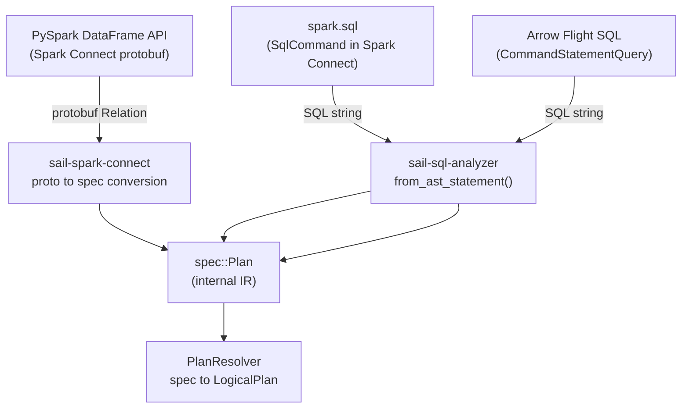
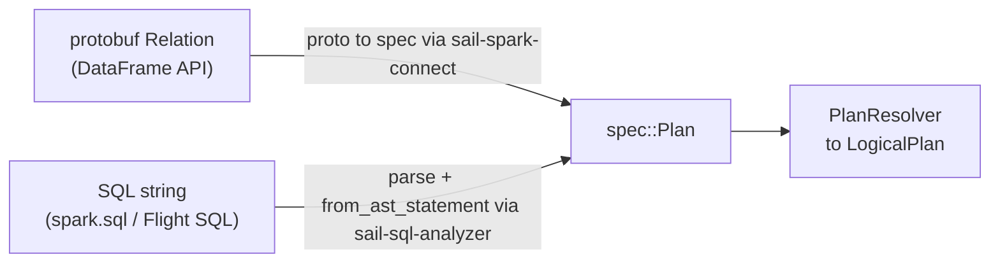

# Chapter 2b: The SQL Pipeline

## Three Roads to One IR

Sail has three entry points for queries. All of them converge on `spec::Plan`, the internal IR, before reaching the planning layer:



Chapter 2 covered the protobuf path. This chapter covers the SQL text path — what happens when `spark.sql("SELECT avg(amount) FROM orders WHERE dt > '2024-01'")` arrives.

## `sail-sql-parser`: A Custom Parser

The SQL parser in Sail is entirely custom — not `sqlparser-rs`, not a fork of Calcite, not ANTLR. It is built with [`chumsky`](https://crates.io/crates/chumsky) 0.12.0, a Rust parser combinator library with support for Pratt (top-down operator precedence) parsing.

The reason for a custom parser is full control over Spark SQL syntax. Spark SQL has significant divergences from standard SQL: `LATERAL VIEW`, `PIVOT`, `UNPIVOT`, `CLUSTER BY`, `DISTRIBUTE BY`, `SORT BY`, `REFRESH TABLE`, `ANALYZE TABLE`, `CACHE TABLE`, Hive compatibility syntax (`STORED AS`, `ROW FORMAT DELIMITED`, `SERDE`), and others. A general-purpose SQL parser would need extensive monkey-patching to handle all of these correctly; a bespoke parser is cleaner.

### Keyword Codegen

The parser starts at build time. `crates/sail-sql-parser/build.rs` reads `data/keywords.txt` — a list of 368 SQL keywords in ASCII order:

```
# data/keywords.txt (excerpt)
ADD
AFTER
ALL
ALTER
ALWAYS
...
YEAR
YEARS
ZONE
```

The build script generates two Rust macros into `$OUT_DIR/keywords.rs`:

```rust
// Generated by build.rs
macro_rules! for_all_keywords {
    ($callback:ident) => { $callback!([("ADD", Add), ("AFTER", After), /* ... 368 total */]); }
}

macro_rules! keyword_map {
    ($value:ident) => { phf::phf_map! { "ADD" => $value!(Add), "AFTER" => $value!(After), /* ... */ } }
}
```

Each keyword becomes a zero-sized Rust struct in `ast/keywords.rs` (e.g. `struct Add;`, `struct After;`). The `#[derive(TreeParser)]` proc-macro (described below) knows how to parse these — matching the keyword string against the lexed token stream. `phf::phf_map!` generates a perfect hash map for O(1) keyword lookup at parse time.

### The Lexer

`crates/sail-sql-parser/src/lexer.rs` defines the token types and the lexer function. The lexer recognizes:
- Keywords (looked up in the keyword perfect hash map)
- Identifiers (unquoted and backtick-quoted)
- String literals (single-quoted, with escape sequences and Unicode escape support: `U&"..."`)
- Number literals (integer, decimal, hex)
- Operators and punctuation
- Comments (line and block, stripped from the token stream)
- Dollar-sign parameters (`$1`, `?` for parameterized queries)

The lexer itself is a `chumsky` parser over `char` input that produces `Vec<(Token, Span)>`.

### The `sail-sql-macro` Proc-Macros

`crates/sail-sql-macro/` defines three proc-macros that reduce the boilerplate of defining the grammar:

**`#[derive(TreeParser)]`** — generates a `chumsky` parser for the annotated type. For an enum, it generates a `choice(...)` over all variants. For a struct, it generates a sequential `then(...)` chain. The annotation attributes control dependencies (for recursive types) and custom parser functions:

```rust
// crates/sail-sql-parser/src/ast/query.rs
#[derive(Debug, Clone, TreeParser, TreeSyntax, TreeText)]
#[parser(dependency = "(Query, Expr, TableWithJoins)", label = TokenLabel::Query)]
pub struct Query {
    #[parser(function = |(q, _, _), o| compose(q, o))]
    pub with: Option<WithClause>,
    #[parser(function = |(q, e, t), o| boxed(compose((q, e, t), o)))]
    pub body: Box<QueryBody>,
    #[parser(function = |(_, e, _), o| compose(e, o))]
    pub modifiers: Vec<QueryModifier>,
}
```

`dependency = "(Query, Expr, TableWithJoins)"` means the generated `Query::parser()` method takes a tuple of parsers for these types as its argument — this is how `chumsky`'s `Recursive::declare()` / `Recursive::define()` cycle is handled without compiler errors on recursive types.

**`#[derive(TreeSyntax)]`** — generates a `syntax()` method that returns a human-readable grammar description of the type (used for error messages).

**`#[derive(TreeText)]`** — generates a `text()` method that unparses the AST back to normalized SQL text. The unparser is used in the gold tests to verify round-trip correctness.

### Pratt Parsing for Expressions

SQL expressions have operator precedence — `a + b * c` must parse as `a + (b * c)`. `chumsky`'s Pratt module handles this elegantly. The `Expr` type uses manual `impl TreeParser` rather than `#[derive(TreeParser)]` because its grammar has left recursion:

```rust
// crates/sail-sql-parser/src/ast/expression.rs
use chumsky::pratt::{infix, left, postfix, prefix, Operator};

// Expr implements TreeParser manually using chumsky's Pratt combinator
```

The Pratt parser defines operators with explicit precedences and associativities (`infix(left(...))`, `prefix(...)`, `postfix(...)`), producing the correct parse tree for complex expressions including: `IS NULL`, `IS NOT DISTINCT FROM`, `BETWEEN`, `LIKE`, `ILIKE`, `RLIKE`, `IN`, window functions, cast (`::` shorthand), subscript (`[...]`), and field access (`.`).

### The Recursive Parser Structure

The top-level parser in `crates/sail-sql-parser/src/parser.rs` manually declares and defines recursive parsers for mutually-recursive types:

```rust
fn statement<'a, I, E>(options: &'a ParserOptions) -> impl Parser<'a, I, Statement, E> + Clone {
    let mut statement  = Recursive::declare();
    let mut query      = Recursive::declare();
    let mut expression = Recursive::declare();
    let mut data_type  = Recursive::declare();
    let mut table_with_joins = Recursive::declare();

    statement.define(Statement::parser(
        (statement.clone(), query.clone(), expression.clone(), data_type.clone()),
        options,
    ));
    query.define(Query::parser(
        (query.clone(), expression.clone(), table_with_joins.clone()),
        options,
    ));
    expression.define(Expr::parser(
        (expression.clone(), query.clone(), data_type.clone()),
        options,
    ));
    // ...
    statement
}
```

`Recursive::declare()` creates a parser placeholder; `define()` fills it in. This two-step process allows the parser to refer to itself without triggering infinite loops at construction time.

### Public API

`crates/sail-sql-analyzer/src/parser.rs` re-exports the parsing entry points:

```rust
// crates/sail-sql-analyzer/src/parser.rs
pub fn parse_one_statement(s: &str) -> SqlResult<Statement> { /* ... */ }
pub fn parse_statements(s: &str) -> SqlResult<Vec<Statement>> { /* ... */ }
pub fn parse_expression(s: &str) -> SqlResult<Expr> { /* ... */ }
pub fn parse_data_type(s: &str) -> SqlResult<DataType> { /* ... */ }
pub fn parse_interval(s: &str) -> SqlResult<IntervalValue> { /* ... */ }
pub fn parse_date(s: &str) -> SqlResult<DateValue> { /* ... */ }
pub fn parse_timestamp(s: &str) -> SqlResult<TimestampValue<'_>> { /* ... */ }
```

These are used throughout Sail: `parse_one_statement` in `sail-flight`'s `get_flight_info_statement`, `parse_data_type` in the plan resolver for DDL statements, `parse_date`/`parse_timestamp` in literal expression resolution.

## `sail-sql-analyzer`: AST → `spec::Plan`

`sail-sql-analyzer` converts the `sail-sql-parser` AST into `sail-common`'s `spec::Plan`. This is where semantic structure is made explicit: a flat list of tokens becomes a typed IR node.

### Statement Conversion

The entry point is `from_ast_statement` in `crates/sail-sql-analyzer/src/statement.rs`:

```rust
pub fn from_ast_statement(statement: Statement) -> SqlResult<spec::Plan> {
    match statement {
        Statement::Query(query) => {
            let plan = from_ast_query(query)?;
            Ok(spec::Plan::Query(plan))
        }
        Statement::SetCatalog { name, .. } => {
            Ok(spec::Plan::Command(spec::CommandPlan::new(
                spec::CommandNode::SetCurrentCatalog { catalog: name.into() }
            )))
        }
        Statement::CreateDatabase { name, if_not_exists, clauses, .. } => {
            let CreateDatabaseClauses { comment, location, properties } = clauses.try_into()?;
            Ok(spec::Plan::Command(spec::CommandPlan::new(
                spec::CommandNode::CreateDatabase {
                    database: from_ast_object_name(name)?,
                    definition: spec::DatabaseDefinition {
                        if_not_exists: if_not_exists.is_some(),
                        comment: comment.map(from_ast_string).transpose()?,
                        location: location.map(from_ast_string).transpose()?,
                        properties: /* ... */,
                    },
                }
            )))
        }
        Statement::AlterDatabase { .. } => Err(SqlError::todo("ALTER DATABASE")),
        // ... 50+ more arms
    }
}
```

Each `Statement` variant maps to a `spec::Plan::Command(CommandPlan { node: CommandNode::... })` or a `spec::Plan::Query(QueryPlan { node: QueryNode::... })`. Unimplemented paths return `SqlError::todo(...)`.

### Data Type Conversion

`from_ast_data_type` converts the parser's `DataType` AST node into `spec::DataType`. The parser supports all Spark SQL and ANSI SQL type aliases:

```rust
// crates/sail-sql-analyzer/src/data_type.rs
pub fn from_ast_data_type(sql_type: DataType) -> SqlResult<spec::DataType> {
    match sql_type {
        DataType::Null(_) | DataType::Void(_) => Ok(spec::DataType::Null),
        DataType::Boolean(_) | DataType::Bool(_) => Ok(spec::DataType::Boolean),
        DataType::TinyInt(None, _) | DataType::Byte(None, _) | DataType::Int8(_) => {
            Ok(spec::DataType::Int8)
        }
        DataType::BigInt(None, _) | DataType::Long(None, _) | DataType::Int64(_) => {
            Ok(spec::DataType::Int64)
        }
        DataType::TinyInt(Some(_), _) => Ok(spec::DataType::UInt8),  // UNSIGNED modifier
        DataType::Decimal(_, info) => {
            let (precision, scale) = /* parse from AST */ ?;
            Ok(spec::DataType::Decimal128 { precision, scale })
        }
        // ... handles UNSIGNED integers, CHAR, VARCHAR, BINARY,
        //     TIMESTAMP, TIMESTAMP_LTZ, TIMESTAMP_NTZ, DATE, TIME,
        //     INTERVAL YEAR TO MONTH, INTERVAL DAY TO SECOND,
        //     ARRAY<T>, MAP<K,V>, STRUCT<f: T>, ...
    }
}
```

`DataType::TinyInt(Some(_))` matches `TINYINT UNSIGNED` — the `Some(_)` captures the `UNSIGNED` keyword. This is an example of the parser preserving syntax details (unsigned modifier) that the analyzer uses for semantic mapping.

### Expression Conversion

`from_ast_expression` in `crates/sail-sql-analyzer/src/expression.rs` handles the deeply nested `Expr` AST. It recursively converts each expression variant into a `spec::Expr`. For example, window functions:

```rust
Expr::WindowFunction(func, over) => {
    // func is a FunctionExpr (name + args)
    // over is an OverClause (PARTITION BY, ORDER BY, WINDOW FRAME)
    let window_spec = from_ast_window_spec(over.spec)?;
    let function = from_ast_function_expr(func)?;
    Ok(spec::Expr::Window { function: Box::new(function), window_spec })
}
```

Lambda expressions (for `TRANSFORM`, `FILTER`, `AGGREGATE`) are handled specially because they introduce named variables that are not column references:

```rust
Expr::Lambda(params, arrow, body) => {
    let variables = from_ast_lambda_params(params)?;
    let function = Box::new(from_ast_expression(*body)?);
    Ok(spec::Expr::Lambda { function, arguments: variables })
}
```

### Interval, Date, and Timestamp Parsing

Interval literals in Spark SQL have complex syntax: `INTERVAL '1-3' YEAR TO MONTH`, `INTERVAL 5 DAYS`, `INTERVAL '01:30:00' HOUR TO SECOND`. The analyzer has dedicated parsers for these in `crates/sail-sql-analyzer/src/literal/`:

```rust
// crates/sail-sql-analyzer/src/parser.rs
pub fn parse_interval(s: &str) -> SqlResult<IntervalValue> {
    parse_unqualified_interval_string(s, false)
}
pub fn parse_date(s: &str) -> SqlResult<DateValue> {
    parse_simple!(s, create_date_parser)
}
pub fn parse_timestamp(s: &str) -> SqlResult<TimestampValue<'_>> {
    parse_simple!(s, create_timestamp_parser)
}
```

These standalone parsers are used by the plan resolver when it encounters date/timestamp literals in expressions, ensuring Spark-compatible parsing of formats like `'2024-01-15'` and `'2024-01-15 10:30:00.123'`.

## The SqlCommand Path

When a Spark Connect client sends `spark.sql("SELECT ...")`, it arrives as a `CommandType::SqlCommand` in `execute_plan`. The handler in `sail-spark-connect/src/service/plan_executor.rs`:

```rust
CommandType::SqlCommand(sql) => {
    service::handle_execute_sql_command(ctx, sql, metadata).await
}
```

`handle_execute_sql_command` extracts the SQL string, calls `parse_one_statement`, then `from_ast_statement`, producing a `spec::Plan` that goes through the same `resolve_and_execute_plan` pipeline as a protobuf-originated plan. The two paths are completely symmetric from the resolver's perspective.

## The Three Paths Converge



`PlanResolver` in `sail-plan` consumes `spec::Plan` exclusively. It has no knowledge of whether the plan came from a Spark Connect protobuf or a SQL string — the IR is the same. This is the key design property that allows Sail to add new entry points (e.g. a future REST API, or the existing Flight SQL endpoint) without touching the planning layer.

## Gold Tests and the Parser

`sail-gold-test` uses `parse_one_statement` + `from_ast_statement` to replay Spark's function documentation examples as SQL queries. Each function's docstring examples become test cases: parse the SQL, execute against Sail, compare output against Spark's expected output. This is how Sail verifies SQL-level compatibility systematically.

The parser's `TreeText` derive also enables a round-trip check: `parse_one_statement(sql)?.text()` should be equivalent (modulo whitespace) to the original SQL. The test suite in `sail-sql-analyzer` verifies this:

```rust
#[test]
fn test_unparse() -> SqlResult<()> {
    assert_eq!(
        parse_one_statement("/* */ SELECT 1+1")?.text(),
        "SELECT 1 + 1 "
    );
    assert_eq!(
        parse_one_statement("SELECT foo(0), cast(1L as decimal(10, -1)) FROM a.b")?.text(),
        "SELECT foo ( 0 ) , CAST ( 1L AS DECIMAL ( 10 , -1 ) ) FROM a . b "
    );
    Ok(())
}
```

## Summary

`sail-sql-parser` is a complete, from-scratch SQL parser using `chumsky`:
- 368 keywords generated at build time into a perfect hash map
- Proc-macros derive recursive-descent parsers from annotated AST structs
- Pratt parsing handles operator precedence in expressions
- The AST preserves full syntactic detail (keyword positions, whitespace spans) for unparser fidelity

`sail-sql-analyzer` converts the AST to `spec::Plan` with full Spark semantic mapping — handling UNSIGNED types, interval subtypes, lambda parameters, and the full DDL/DML statement set. Together they form the SQL entry path that parallels the protobuf path, converging at `spec::Plan` before reaching `PlanResolver`.
