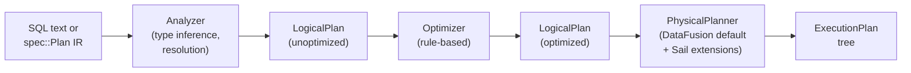

# Chapter 4: Apache DataFusion — The Query Engine Core

## Why DataFusion?

DataFusion is an in-process, extensible query engine written in Rust. It provides: a SQL parser, an expression type system, a rule-based logical optimizer, a physical planner, and a streaming execution runtime built on Arrow and tokio. It is the foundation that Sail's query planning is built on.

The choice of DataFusion is important to understand. Sail does not re-implement query planning from scratch. Instead, it extends DataFusion in well-defined ways:
- Custom `UserDefinedLogicalNodeCore` nodes for Spark-specific logical plan constructs
- Custom `ExecutionPlan` implementations for Spark-specific physical operators
- Custom optimizer rules for Spark-specific rewrites
- Custom catalog implementations behind DataFusion's catalog trait
- A session extension mechanism to layer Spark state onto DataFusion contexts

This architecture means that everything DataFusion does well — predicate pushdown, projection pruning, join reordering, aggregate partial computation, Parquet column pruning — Sail gets for free. Sail focuses its engineering on the Spark-specific layer.

## The Planning Pipeline

DataFusion's planning pipeline has three stages:



Sail adds a fourth stage before SQL parsing — the conversion from Spark Connect's protobuf through `spec::Plan` to DataFusion's `LogicalPlan`. This is `PlanResolver`.

### `resolve_and_execute_plan`

The central function that drives the full pipeline is in `crates/sail-plan/src/lib.rs`:

```rust
pub async fn resolve_and_execute_plan(
    ctx: &SessionContext,
    config: Arc<PlanConfig>,
    plan: spec::Plan,
) -> PlanResult<(Arc<dyn ExecutionPlan>, Vec<StringifiedPlan>)> {
    let mut info = vec![];
    let resolver = PlanResolver::new(ctx, config);
    let NamedPlan { plan, fields } = resolver.resolve_named_plan(plan).await?;
    info.push(plan.to_stringified(PlanType::InitialLogicalPlan));

    let df = execute_logical_plan(ctx, plan).await?;
    let (session_state, plan) = df.into_parts();
    let plan = session_state.optimize(&plan)?;

    let plan = if is_streaming_plan(&plan)? {
        rewrite_streaming_plan(plan)?
    } else {
        plan
    };
    info.push(plan.to_stringified(PlanType::FinalLogicalPlan));

    let plan = session_state
        .query_planner()
        .create_physical_plan(&plan, &session_state)
        .await?;
    let plan = if let Some(fields) = fields {
        rename_physical_plan(plan, &fields)?
    } else {
        plan
    };
    info.push(StringifiedPlan::new(
        PlanType::FinalPhysicalPlan,
        displayable(plan.as_ref()).indent(true).to_string(),
    ));
    Ok((plan, info))
}
```

The steps:
1. **Resolve**: `PlanResolver::resolve_named_plan` converts `spec::Plan` → DataFusion `LogicalPlan`.
2. **Execute-to-DataFrame**: `ctx.execute_logical_plan(plan)` — this is DataFusion's entry point; it runs the analyzer.
3. **Optimize**: `session_state.optimize(&plan)` — runs the optimizer rule chain.
4. **Streaming check**: if the plan is a streaming plan, rewrite it for the streaming physical executor.
5. **Physical plan**: `session_state.query_planner().create_physical_plan(...)` — runs the physical planner.
6. **Rename**: if the query had user-facing column aliases, apply them to the physical plan's schema.

The `Vec<StringifiedPlan>` return carries explain-plan strings for each stage: initial logical, final logical, and final physical. These are used by `df.explain()`.

## `PlanResolver`: spec::Plan → LogicalPlan

`PlanResolver` in `crates/sail-plan/src/resolver/` is the largest single piece of planning code. It converts every Spark Connect relation type and expression type into DataFusion's equivalents.

The entry point:

```rust
// crates/sail-plan/src/resolver/plan.rs
impl PlanResolver<'_> {
    pub async fn resolve_named_plan(&self, plan: spec::Plan) -> PlanResult<NamedPlan> {
        let mut state = PlanResolverState::new();
        match plan {
            spec::Plan::Query(query) => {
                let plan = self.resolve_query_plan(query, &mut state).await?;
                let fields = Some(Self::get_field_names(plan.schema(), &state)?);
                Ok(NamedPlan { plan, fields })
            }
            spec::Plan::Command(command) => {
                let plan = self.resolve_command_plan(command, &mut state).await?;
                Ok(NamedPlan { plan, fields: None })
            }
        }
    }
}
```

`PlanResolverState` carries resolution state that is accumulated during traversal: field aliases, column renaming maps, and context flags. It is threaded through the recursive resolver methods.

The resolver handles dozens of relation types. For example, a `Filter` relation (corresponding to `df.filter(...)`) is resolved by recursively resolving the input relation and the filter expression:

```rust
spec::Relation::Filter(filter) => {
    let input = self.resolve_query_plan(*filter.input, state).await?;
    let predicate = self.resolve_expression(&filter.condition, input.schema(), state)?;
    Ok(LogicalPlan::Filter(Filter::try_new(predicate, Arc::new(input))?))
}
```

## Custom Logical Plan Nodes

Spark has concepts that do not map cleanly to DataFusion's built-in `LogicalPlan` variants. Sail adds them as `UserDefinedLogicalNodeCore` implementations in `crates/sail-logical-plan/`.

### `RangeNode`: Spark's `spark.range()`

`spark.range(start, end, step, numPartitions)` generates a sequence of integers. DataFusion has no built-in for this. Sail implements it as a leaf logical node:

```rust
// crates/sail-logical-plan/src/range.rs
#[derive(Clone, Debug, PartialEq, Eq, Hash, Educe)]
#[educe(PartialOrd)]
pub struct RangeNode {
    range: Range,
    num_partitions: usize,
    #[educe(PartialOrd(ignore))]
    schema: DFSchemaRef,
}

impl UserDefinedLogicalNodeCore for RangeNode {
    fn name(&self) -> &str { "Range" }

    fn inputs(&self) -> Vec<&LogicalPlan> { vec![] }  // leaf node

    fn schema(&self) -> &DFSchemaRef { &self.schema }

    fn expressions(&self) -> Vec<Expr> { vec![] }

    fn fmt_for_explain(&self, f: &mut Formatter) -> std::fmt::Result {
        write!(f, "Range: start={}, end={}, step={}, num_partitions={}",
            self.range.start, self.range.end, self.range.step, self.num_partitions)
    }

    fn with_exprs_and_inputs(&self, exprs: Vec<Expr>, inputs: Vec<LogicalPlan>) -> Result<Self> {
        exprs.zero()?;
        inputs.zero()?;
        Ok(self.clone())
    }
}
```

The `Range` struct also implements partitioning logic for splitting the range across workers:

```rust
impl Range {
    pub fn partition(&self, partition: usize, num_partitions: usize) -> Self {
        let start = self.start as i128;
        let end   = self.end   as i128;
        let step  = self.step  as i128;
        let num_elements = /* ... element count, accounting for direction */;
        let num_partitions = num_partitions as i128;
        let partition      = partition      as i128;
        let partition_start = partition       * num_elements / num_partitions * step + start;
        let partition_end   = (partition + 1) * num_elements / num_partitions * step + start;
        Range { start: partition_start as i64, end: partition_end as i64, step: step as i64 }
    }
}
```

### `ExplicitRepartitionNode`: Coalesce, RoundRobin, Hash

Spark's `coalesce()`, `repartition()`, and `repartitionByRange()` have specific semantics. Sail models these as a single logical node with a `kind` discriminant:

```rust
// crates/sail-logical-plan/src/repartition.rs
#[derive(Clone, Copy, Debug, Eq, PartialEq, Hash, PartialOrd, Ord)]
pub enum ExplicitRepartitionKind {
    Coalesce,
    RoundRobin,
    Hash,
}

#[derive(Clone, Debug, Eq, PartialEq, Hash, PartialOrd)]
pub struct ExplicitRepartitionNode {
    input: Arc<LogicalPlan>,
    num_partitions: Option<usize>,
    kind: ExplicitRepartitionKind,
    partitioning_expressions: Vec<Expr>,
}

impl UserDefinedLogicalNodeCore for ExplicitRepartitionNode {
    fn name(&self) -> &str { "ExplicitRepartition" }

    fn inputs(&self) -> Vec<&LogicalPlan> { vec![&self.input] }

    fn schema(&self) -> &DFSchemaRef { self.input.schema() }

    fn necessary_children_exprs(&self, output_columns: &[usize]) -> Option<Vec<Vec<usize>>> {
        Some(vec![output_columns.to_vec()])
    }

    fn with_exprs_and_inputs(&self, exprs: Vec<Expr>, mut inputs: Vec<LogicalPlan>) -> Result<Self> {
        let (Some(input), true) = (inputs.pop(), inputs.is_empty()) else {
            return plan_err!("{} expects exactly one input", self.name());
        };
        Ok(Self::new(Arc::new(input), self.num_partitions, self.kind, exprs))
    }
}
```

The `necessary_children_exprs` method tells the optimizer which output columns are needed from the child, enabling projection pushdown even through repartition nodes.

## The Logical Optimizer

DataFusion's logical optimizer runs a rule chain over the `LogicalPlan` tree. Sail has two distinct optimizer layers: *logical* (in `sail-logical-optimizer`) and *physical* (in `sail-physical-optimizer`). They are separate pipelines with different insertion points.

### `DecorrelateLateralProjection` (Logical)

Spark supports `LATERAL` subqueries. DataFusion's `DecorrelateLateralJoin` rule handles the general case (outer references in filters and aggregates), but not the simple case where an outer reference appears only in a `Projection`:

```sql
SELECT *, (SELECT t1.a + 1)
FROM t1
LATERAL VIEW explode(arr) tmp AS val
```

Sail's `DecorrelateLateralProjection` handles this simpler case first, rewriting it into a `CrossJoin + Projection` before DataFusion's more expensive rule runs. Sail's rule is *prepended* to DataFusion's list because it must run before `DecorrelateLateralJoin`:

```rust
// crates/sail-logical-optimizer/src/lib.rs
pub fn default_optimizer_rules() -> Vec<Arc<dyn OptimizerRule + Send + Sync>> {
    let Optimizer { rules } = Optimizer::default();
    // Custom rules are prepended so they run before DataFusion's built-in rules.
    // `DecorrelateLateralProjection` must run before `DecorrelateLateralJoin`
    // because it handles the simple case where OuterRef only appears in
    // Projection expressions (e.g. `LATERAL (SELECT t1.a + 1)`), rewriting
    // it into a CrossJoin + Projection. The remaining complex cases (OuterRef
    // in Filter/Aggregate) are left for DataFusion's `DecorrelateLateralJoin`.
    let mut custom: Vec<Arc<dyn OptimizerRule + Send + Sync>> =
        vec![Arc::new(DecorrelateLateralProjection::new())];
    custom.extend(rules);
    custom
}
```

### `ExpandRowLevelOp` (Logical, in `sail-plan-lakehouse`)

There is a second logical optimizer rule for Delta/Iceberg write operations: `ExpandRowLevelOp` in `crates/sail-plan-lakehouse/src/optimizer.rs`. It rewrites `MergeIntoNode` and `FileDeleteNode` for lakehouse formats into `RowLevelWriteNode`, which routes to format-specific physical planners:

```rust
// crates/sail-plan-lakehouse/src/optimizer.rs
impl OptimizerRule for ExpandRowLevelOp {
    fn rewrite(&self, plan: LogicalPlan, _config: &dyn OptimizerConfig)
        -> Result<Transformed<LogicalPlan>>
    {
        plan.transform_up(|plan| {
            if let LogicalPlan::Extension(ext) = &plan {
                // MERGE expansion for lakehouse formats
                if let Some(node) = ext.node.as_any().downcast_ref::<MergeIntoNode>() {
                    if !is_lakehouse_format(&node.options().target.format) {
                        return Ok(Transformed::no(plan));
                    }
                    return expand_merge_node(node);
                }
                // DELETE → RowLevelWriteNode for lakehouse formats
                if let Some(node) = ext.node.as_any().downcast_ref::<FileDeleteNode>() {
                    if !is_lakehouse_format(node.options().format.as_str()) {
                        return Ok(Transformed::no(plan));
                    }
                    return expand_delete_node(node);
                }
            }
            Ok(Transformed::no(plan))
        })
    }
}
```

Non-lakehouse DELETE and MERGE fall through to the standard file-based planners.

## The Physical Optimizer

The physical optimizer (`sail-physical-optimizer`) does not prepend to DataFusion's default pipeline. It reconstructs the **entire** physical optimizer pipeline from scratch, embedding all DataFusion rules at their canonical positions and inserting Sail's custom rules after them:

```rust
// crates/sail-physical-optimizer/src/lib.rs
pub fn get_physical_optimizers(options: PhysicalOptimizerOptions)
    -> Vec<Arc<dyn PhysicalOptimizerRule + Send + Sync>>
{
    let mut rules: Vec<Arc<dyn PhysicalOptimizerRule + Send + Sync>> = vec![];

    rules.push(Arc::new(OutputRequirements::new_add_mode()));
    rules.push(Arc::new(AggregateStatistics::new()));
    if options.enable_join_reorder {
        rules.push(Arc::new(JoinReorder::new(options.join_reorder)));
    }
    rules.push(Arc::new(JoinSelection::new()));
    rules.push(Arc::new(LimitedDistinctAggregation::new()));
    rules.push(Arc::new(FilterPushdown::new()));
    rules.push(Arc::new(EnforceDistribution::new()));
    rules.push(Arc::new(CombinePartialFinalAggregate::new()));
    rules.push(Arc::new(EnforceSorting::new()));
    rules.push(Arc::new(OptimizeAggregateOrder::new()));
    rules.push(Arc::new(ProjectionPushdown::new()));
    rules.push(Arc::new(OutputRequirements::new_remove_mode()));
    rules.push(Arc::new(TopKAggregation::new()));
    rules.push(Arc::new(LimitPushPastWindows::new()));
    rules.push(Arc::new(LimitPushdown::new()));
    rules.push(Arc::new(ProjectionPushdown::new()));
    rules.push(Arc::new(PushdownSort::new()));
    rules.push(Arc::new(EnsureCooperative::new()));
    rules.push(Arc::new(FilterPushdown::new_post_optimization()));
    // --- Sail custom rules, run after all DataFusion rules ---
    rules.push(Arc::new(RewriteExplicitRepartition::new()));
    rules.push(Arc::new(RewriteCollectLeftHashJoin::new()));
    rules.push(Arc::new(EnforceBarrierPartitioning::new()));
    rules.push(Arc::new(SanityCheckPlan::new()));
    rules
}
```

A test verifies that the DataFusion rule names appear in exactly the same order as in DataFusion's own `PhysicalOptimizer::default()`, so any DataFusion rule additions or reorderings are caught at compile time.

The four custom physical optimizer rules:

| Rule | Purpose |
|---|---|
| `JoinReorder` | DP-based join reorder: cardinality estimation, cost model, `n ≤ max_relations` constraint. The "join reorder safeguards" from commit #1954 are options on this rule. |
| `RewriteExplicitRepartition` | Converts `ExplicitRepartitionExec` (placeholder) into the correct DataFusion exec: `RepartitionExec` (hash), `CoalescePartitionsExec` (coalesce-to-1), or passthrough. |
| `RewriteCollectLeftHashJoin` | Safety net: ensures the build side of every `HashJoinExec` in `CollectLeft` mode has exactly one output partition (inserts `CoalescePartitionsExec` if violated). |
| `EnforceBarrierPartitioning` | Ensures `BarrierExec` nodes have the correct partitioning for streaming checkpoints. |

## The Custom Node Inventory and `sail-session`

There are 17 custom `UserDefinedLogicalNodeCore` implementations across `sail-logical-plan`. Every one needs a corresponding physical plan, and that dispatch lives in a single place: `ExtensionPhysicalPlanner` in `crates/sail-session/src/planner.rs`.

### `sail-session`: `ExtensionQueryPlanner` and `ExtensionPhysicalPlanner`

`sail-session` is the crate that assembles the complete physical planning pipeline and registers it with DataFusion's `SessionStateBuilder`. The key struct is `ExtensionQueryPlanner`:

```rust
// crates/sail-session/src/planner.rs
#[async_trait]
impl QueryPlanner for ExtensionQueryPlanner {
    async fn create_physical_plan(
        &self,
        logical_plan: &LogicalPlan,
        session_state: &SessionState,
    ) -> datafusion::common::Result<Arc<dyn ExecutionPlan>> {
        let mut extension_planners = new_lakehouse_extension_planners();
        extension_planners.push(Arc::new(SystemTablePhysicalPlanner));
        extension_planners.push(Arc::new(ListingTablePhysicalPlanner));
        extension_planners.push(Arc::new(ExtensionPhysicalPlanner));
        let planner = DefaultPhysicalPlanner::with_extension_planners(extension_planners);
        planner.create_physical_plan(&logical_plan, session_state).await
    }
}
```

Four extension planners are chained in order:

| Planner | Handles |
|---|---|
| `DeltaTablePhysicalPlanner` | Delta Lake table scans |
| `IcebergTablePhysicalPlanner` | Iceberg table scans |
| `DeltaExtensionPlanner` | Delta write/delete/merge logical nodes |
| `SystemTablePhysicalPlanner` | System catalog table sources |
| `ListingTablePhysicalPlanner` | Parquet/CSV/JSON/ORC/Avro file listings |
| `ExtensionPhysicalPlanner` | All 17 `UserDefinedLogicalNodeCore` nodes |

`ExtensionPhysicalPlanner::plan_extension` is a chain of `downcast_ref` checks — one per custom node type:

```rust
// crates/sail-session/src/planner.rs
impl ExtensionPlanner for ExtensionPhysicalPlanner {
    async fn plan_extension(&self, planner, node, logical_inputs, physical_inputs, session_state)
        -> Result<Option<Arc<dyn ExecutionPlan>>>
    {
        let plan = if let Some(node) = node.as_any().downcast_ref::<RangeNode>() {
            Arc::new(RangeExec::try_new(node.range().clone(), node.num_partitions(), ...)?)
        } else if let Some(node) = node.as_any().downcast_ref::<ShowStringNode>() {
            Arc::new(ShowStringExec::new(input, node.names().to_vec(), node.limit(), ...))
        } else if let Some(node) = node.as_any().downcast_ref::<MapPartitionsNode>() {
            Arc::new(MapPartitionsExec::new(input, node.udf().clone(), ...))
        } else if let Some(node) = node.as_any().downcast_ref::<MonotonicIdNode>() {
            Arc::new(MonotonicIdExec::try_new(input, node.column_name().to_string(), ...)?)
        } else if let Some(node) = node.as_any().downcast_ref::<SparkPartitionIdNode>() {
            Arc::new(SparkPartitionIdExec::try_new(input, node.column_name(), ...)?)
        } else if let Some(node) = node.as_any().downcast_ref::<SortWithinPartitionsNode>() {
            let sort = SortExec::new(ordering, input).with_preserve_partitioning(true);
            Arc::new(sort)
        } else if let Some(node) = node.as_any().downcast_ref::<SchemaPivotNode>() {
            Arc::new(SchemaPivotExec::new(input, node.names().to_vec(), ...))
        } else if let Some(node) = node.as_any().downcast_ref::<FileWriteNode>() {
            create_file_write_physical_plan(session_state, planner, logical_input, ...).await?
        } else if let Some(node) = node.as_any().downcast_ref::<FileDeleteNode>() {
            create_file_delete_physical_plan(session_state, planner, schema, ...).await?
        } else if let Some(_node) = node.as_any().downcast_ref::<MergeIntoNode>() {
            return internal_err!("MERGE expects pre-expanded plan (RowLevelWriteNode)")
        } else if let Some(node) = node.as_any().downcast_ref::<ExplicitRepartitionNode>() {
            Arc::new(ExplicitRepartitionExec::new(input, partitioning))
        } else if node.as_any().is::<StreamSourceAdapterNode>() {
            Arc::new(StreamSourceAdapterExec::new(input))
        } else if let Some(node) = node.as_any().downcast_ref::<StreamSourceWrapperNode>() {
            node.source().scan(session_state, ...).await?
        } else if let Some(node) = node.as_any().downcast_ref::<StreamLimitNode>() {
            Arc::new(StreamLimitExec::try_new(input, node.skip(), node.fetch())?)
        } else if let Some(node) = node.as_any().downcast_ref::<StreamFilterNode>() {
            Arc::new(StreamFilterExec::try_new(input, predicate)?)
        } else if node.as_any().is::<StreamCollectorNode>() {
            Arc::new(StreamCollectorExec::try_new(input)?)
        } else if let Some(node) = node.as_any().downcast_ref::<CatalogCommandNode>() {
            Arc::new(CatalogCommandExec::new(node.command().clone(), schema))
        } else if let Some(_node) = node.as_any().downcast_ref::<BarrierNode>() {
            Arc::new(BarrierExec::new(preconditions.to_vec(), plan.clone()))
        } else {
            return internal_err!("unsupported logical extension node: {:?}", node);
        };
        Ok(Some(plan))
    }
}
```

The complete set of 17 custom logical nodes and their physical counterparts:

| Logical node | Physical plan | Purpose |
|---|---|---|
| `RangeNode` | `RangeExec` | `spark.range(start, end, step, n)` |
| `ShowStringNode` | `ShowStringExec` | `df.show()` — collects to one partition, formats table string |
| `MapPartitionsNode` | `MapPartitionsExec` | Python/Scala UDFs via `mapInPandas`, `mapInArrow` |
| `MonotonicIdNode` | `MonotonicIdExec` | `monotonically_increasing_id()` |
| `SparkPartitionIdNode` | `SparkPartitionIdExec` | `spark_partition_id()` |
| `SortWithinPartitionsNode` | `SortExec(preserve_partitioning=true)` | `sortWithinPartitions()` |
| `SchemaPivotNode` | `SchemaPivotExec` | Schema pivoting for UNPIVOT |
| `FileWriteNode` | `create_file_write_physical_plan()` | All file writes (Parquet, CSV, Delta, ...) |
| `FileDeleteNode` | `create_file_delete_physical_plan()` | DELETE statement |
| `MergeIntoNode` | *(pre-expanded by `ExpandRowLevelOp`)* | MERGE INTO (must be rewritten first) |
| `ExplicitRepartitionNode` | `ExplicitRepartitionExec` | `repartition()`, `coalesce()`, `repartitionByRange()` |
| `StreamSourceAdapterNode` | `StreamSourceAdapterExec` | Adapts batch source for streaming plan |
| `StreamSourceWrapperNode` | Direct scan from `StreamSource` | Wraps a streaming data source |
| `StreamLimitNode` | `StreamLimitExec` | `LIMIT`/`OFFSET` on streaming plan |
| `StreamFilterNode` | `StreamFilterExec` | `WHERE` predicate on streaming plan |
| `StreamCollectorNode` | `StreamCollectorExec` | Collects streaming output into sink |
| `CatalogCommandNode` | `CatalogCommandExec` | DDL operations (CREATE TABLE, etc.) |
| `BarrierNode` | `BarrierExec` | Streaming checkpoint barrier |

### `PlanProperties`: The Physical Contract

Every `ExecutionPlan` implementation must declare its `PlanProperties` — the metadata about its output:

```rust
pub struct PlanProperties {
    eq_properties: EquivalenceProperties,  // sort order, uniqueness
    partitioning:  Partitioning,           // output partition scheme
    emission_type: EmissionType,           // Final or Streaming
    boundedness:   Boundedness,            // Bounded or Unbounded
}
```

For example, `ShowStringExec` collects all data into a single partition and emits only when the stream is fully consumed:

```rust
let properties = Arc::new(PlanProperties::new(
    EquivalenceProperties::new(schema.clone()),
    Partitioning::RoundRobinBatch(1),  // single output partition
    EmissionType::Final,               // output only after all input consumed
    Boundedness::Bounded,
));
```

The `required_input_distribution` method returns `Distribution::SinglePartition`, which signals DataFusion to inject a `CoalescePartitionsExec` before `ShowStringExec` when the input is multi-partitioned.

## The Session Extension Mechanism

Sail needs to store per-session state (Spark configuration, job runner, streaming queries) alongside DataFusion's `SessionContext`. DataFusion's extension map provides this:

```rust
// DataFusion's SessionConfig
pub fn with_extension<T: Any + Send + Sync + 'static>(
    mut self,
    ext: Arc<T>,
) -> Self { /* inserts into HashMap<TypeId, Arc<dyn Any>> */ }
```

Sail wraps this with a typed accessor trait `SessionExtensionAccessor`:

```rust
pub trait SessionExtensionAccessor {
    fn extension<T: SessionExtension>(&self) -> Result<Arc<T>>;
}

impl SessionExtensionAccessor for SessionContext {
    fn extension<T: SessionExtension>(&self) -> Result<Arc<T>> {
        self.state()
            .config()
            .get_extension::<T>()
            .ok_or_else(|| /* error */ )
    }
}
```

This is used throughout `sail-spark-connect` and `sail-flight` to retrieve the `SparkSession` or `JobService` from a `&SessionContext`:

```rust
let spark = ctx.extension::<SparkSession>()?;
let plan_config = spark.plan_config()?;
```

## DataFusion Catalogs

DataFusion has a catalog/schema/table hierarchy. Sail maps Spark's catalog model onto DataFusion's by implementing `CatalogProvider`, `SchemaProvider`, and `TableProvider` traits for each catalog backend. The catalog abstraction layer is in `crates/sail-catalog/`; specific implementations are in `sail-catalog-memory`, `sail-catalog-glue`, etc. This is covered in detail in Chapter 7.

## Summary

Sail uses DataFusion as its planning and execution backbone and extends it at six distinct layers:

1. **Custom logical nodes** (17 `UserDefinedLogicalNodeCore` impls in `sail-logical-plan`): `RangeNode`, `MapPartitionsNode`, `FileWriteNode`, `BarrierNode`, 5 streaming nodes, and more.
2. **Custom physical nodes** (`ExecutionPlan` in `sail-physical-plan`): one per custom logical node — 17 physical counterparts.
3. **Logical optimizer rules** (`sail-logical-optimizer`, `sail-plan-lakehouse`): `DecorrelateLateralProjection` prepended before DataFusion's rules; `ExpandRowLevelOp` for lakehouse write expansion.
4. **Physical optimizer** (`sail-physical-optimizer`): rebuilds the entire pipeline from scratch, inserting custom rules (`JoinReorder`, `RewriteExplicitRepartition`, `RewriteCollectLeftHashJoin`, `EnforceBarrierPartitioning`) after all DataFusion rules.
5. **Extension planners** (`sail-session`): `ExtensionQueryPlanner` chains 6 `ExtensionPlanner` implementations; `ExtensionPhysicalPlanner` dispatches all 17 custom nodes.
6. **Session extensions**: `SparkSession`, `PlanService`, `JobService` attached to DataFusion's `SessionContext` type-map.

The `PlanResolver` is the translation layer between Sail's `spec::Plan` IR and DataFusion's `LogicalPlan`. Everything below `PlanResolver` is DataFusion-native code; everything above it is Spark-specific. The `sail-session` crate is the assembly point where all custom extensions are wired into the DataFusion session state.
