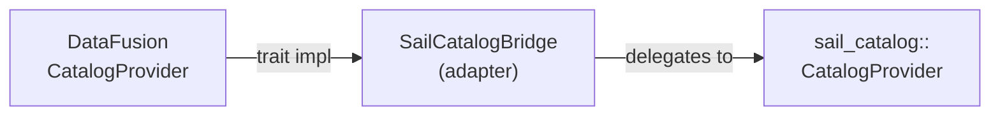

# Chapter 7: Catalog Integrations

## What Is a Catalog?

In Spark, a catalog is the metadata service that maps table names to table definitions — schemas, storage locations, file formats, partition layouts. PySpark code like `spark.table("db.orders")` resolves `db.orders` through the catalog to find out where the data is and how to read it.

Sail supports multiple catalog backends, pluggable at configuration time:

| Crate | Backend |
|---|---|
| `sail-catalog-memory` | In-process hash map (default; no persistence) |
| `sail-catalog-glue` | AWS Glue Data Catalog |
| `sail-catalog-hms` | Apache Hive Metastore (Thrift) |
| `sail-catalog-iceberg` | Apache Iceberg REST Catalog |
| `sail-catalog-unity` | Databricks Unity Catalog (REST) |
| `sail-catalog-onelake` | Microsoft OneLake / Fabric |
| `sail-catalog-system` | Built-in system catalog (`spark_catalog`) |

All of them implement a single Rust trait. Adding a new catalog backend means implementing one trait and registering it in the session configuration.

## The `CatalogProvider` Trait

The trait lives in `crates/sail-catalog/src/provider/mod.rs`:

```rust
/// A trait that defines the interface for a catalog.
/// A catalog contains *databases*, where each database has a multi-level name
/// that represents a *namespace*.
/// A database contains *objects* such as *tables* and *views*.
#[async_trait::async_trait]
pub trait CatalogProvider: Send + Sync {
    fn get_name(&self) -> &str;

    async fn create_database(&self, database: &Namespace, options: CreateDatabaseOptions)
        -> CatalogResult<DatabaseStatus>;
    async fn get_database(&self, database: &Namespace) -> CatalogResult<DatabaseStatus>;
    async fn list_databases(&self, prefix: Option<&Namespace>) -> CatalogResult<Vec<DatabaseStatus>>;
    async fn drop_database(&self, database: &Namespace, options: DropDatabaseOptions) -> CatalogResult<()>;

    async fn create_table(&self, database: &Namespace, table: &str, options: CreateTableOptions)
        -> CatalogResult<TableStatus>;
    async fn get_table(&self, database: &Namespace, table: &str) -> CatalogResult<TableStatus>;
    async fn list_tables(&self, database: &Namespace) -> CatalogResult<Vec<TableStatus>>;
    async fn drop_table(&self, database: &Namespace, table: &str, options: DropTableOptions) -> CatalogResult<()>;
    async fn alter_table(&self, database: &Namespace, table: &str, options: AlterTableOptions)
        -> CatalogResult<()>;

    async fn create_view(&self, database: &Namespace, view: &str, options: CreateViewOptions)
        -> CatalogResult<TableStatus>;
    async fn get_view(&self, database: &Namespace, view: &str) -> CatalogResult<TableStatus>;
    async fn list_views(&self, database: &Namespace) -> CatalogResult<Vec<TableStatus>>;
    async fn drop_view(&self, database: &Namespace, view: &str, options: DropViewOptions) -> CatalogResult<()>;
}
```

The `Namespace` type is a `Vec<String>` — the multi-part database name (e.g. `["default"]` or `["hive", "prod"]`). `TableStatus` and `DatabaseStatus` are structs that carry the full metadata needed to create a DataFusion table provider (schema, location, format, properties).

Note that all methods are `async`. Catalog operations are inherently I/O-bound: they call remote APIs (Glue, HMS, Unity), and Rust's `async_trait` makes this natural. Sail stores catalog providers behind trait objects such as `Arc<dyn CatalogProvider>`, so `#[async_trait::async_trait]` provides an object-safe boxed-future representation for these async methods.

## The In-Memory Catalog

`MemoryCatalogProvider` in `crates/sail-catalog-memory/` is the reference implementation and the default when no external catalog is configured:

```rust
pub struct MemoryCatalogProvider {
    name: String,
    databases: DashMap<Namespace, MemoryDatabase>,
}

struct MemoryDatabase {
    status: DatabaseStatus,
    tables: HashMap<String, TableStatus>,
    views: HashMap<String, TableStatus>,
}
```

`DashMap` is a concurrent hash map (like `RwLock<HashMap>` but with finer-grained sharding). The top-level `databases` map uses `DashMap` because multiple async tasks may access it concurrently; the inner `tables` and `views` maps are protected by the `DashMap` entry lock.

`create_database` illustrates the idempotent creation pattern used throughout:

```rust
async fn create_database(
    &self,
    database: &Namespace,
    options: CreateDatabaseOptions,
) -> CatalogResult<DatabaseStatus> {
    let CreateDatabaseOptions { if_not_exists, comment, location, properties } = options;
    let entry = self.databases.entry(database.clone());
    match entry {
        Entry::Occupied(entry) => {
            if if_not_exists {
                Ok(entry.get().status.clone())
            } else {
                Err(CatalogError::AlreadyExists(
                    CatalogObject::Database,
                    quote_namespace_if_needed(database),
                ))
            }
        }
        Entry::Vacant(entry) => {
            // ... insert new database
        }
    }
}
```

The `if_not_exists` flag maps to Spark's `CREATE DATABASE IF NOT EXISTS`. This pattern is consistent across all catalog implementations.

## The AWS Glue Catalog

`GlueCatalogProvider` in `crates/sail-catalog-glue/` uses the `aws-sdk-glue` Rust crate. Client initialization is lazy — the `OnceCell<Client>` is initialized on the first request, allowing the provider to be constructed cheaply:

```rust
pub struct GlueCatalogProvider {
    name: String,
    config: GlueCatalogConfig,
    client: OnceCell<Client>,
}

pub(super) async fn get_client(&self) -> CatalogResult<&Client> {
    self.client
        .get_or_try_init(|| async {
            let mut config_loader = aws_config::defaults(BehaviorVersion::latest());
            if let Some(region) = &self.config.region {
                config_loader = config_loader.region(Region::new(region.clone()));
            }
            if let Some(endpoint) = &self.config.endpoint_url {
                config_loader = config_loader.endpoint_url(endpoint);
            }
            let sdk_config = config_loader.load().await;
            Ok(Client::new(&sdk_config))
        })
        .await
}
```

`OnceCell::get_or_try_init` is the standard async lazy-initialization pattern in Tokio: the closure runs at most once; concurrent callers wait for it. This means the AWS credentials are loaded and validated at the first catalog operation, not at startup.

The Glue catalog also handles Iceberg tables stored in Glue (detected by inspecting the table properties for Iceberg markers):

```rust
// crates/sail-catalog-glue/src/iceberg.rs
pub fn is_iceberg_table(table: &aws_sdk_glue::types::Table) -> bool {
    table.parameters()
        .and_then(|p| p.get("table_type"))
        .map(|v| v.eq_ignore_ascii_case("ICEBERG"))
        .unwrap_or(false)
}
```

When the provider detects an Iceberg table, it returns a `TableStatus` that routes the table scan to the Iceberg scan implementation rather than the generic Hive/Parquet scan.

## The Hive Metastore Catalog: Thrift Code Generation

HMS uses a Thrift-based RPC protocol (not REST, not gRPC). Sail generates the Thrift client from the `.thrift` IDL file at build time using `volo-build`:

**`crates/sail-catalog-hms/build.rs`:**

```rust
fn main() -> Result<(), Box<dyn std::error::Error>> {
    println!("cargo:rerun-if-changed=build.rs");
    println!("cargo:rerun-if-changed=thrift/hive_metastore.thrift");

    volo_build::Builder::thrift()
        .add_service("thrift/hive_metastore.thrift")
        .split_generated_files(true)
        .write()?;

    Ok(())
}
```

The generated client is included into the crate at compile time:

```rust
// crates/sail-catalog-hms/src/lib.rs
pub mod hms {
    #[expect(clippy::allow_attributes)]
    mod internal {
        include!(concat!(env!("OUT_DIR"), "/volo_gen.rs"));
    }
    pub use internal::volo_gen::hive_metastore::*;
}
```

`volo` is a Rust RPC framework from ByteDance that supports both Thrift and gRPC. The build script generates type-safe Rust structs and an async client from the `.thrift` IDL. The `#[expect(clippy::allow_attributes)]` suppresses Clippy warnings in generated code, matching the pattern used in `sail-spark-connect` for protobuf.

The HMS provider supports SASL/Kerberos authentication (common in enterprise Hadoop deployments):

```rust
pub struct HmsCatalogConfig {
    pub uris: Vec<String>,
    pub thrift_transport: Option<String>,
    pub auth: Option<String>,
    pub kerberos_service_principal: Option<String>,
    pub min_sasl_qop: Option<String>,
    pub connect_timeout_secs: Option<u64>,
}
```

Multiple URIs provide high availability: if one metastore is unreachable, the provider tries the next. The `active_index: usize` in `HmsClientState` tracks which endpoint is currently active.

## Unity Catalog

Databricks Unity Catalog uses a REST API. `UnityCatalogProvider` in `crates/sail-catalog-unity/` uses `reqwest` for HTTP:

```rust
pub struct UnityCatalogProvider {
    name: String,
    catalog_config: UnityCatalogConfig,
    client: OnceCell<Client>,
}
```

Like the Glue provider, the HTTP client is initialized lazily. Unity Catalog requires an access token; Sail supports configuring it via `UnityCatalogConfig`:

```rust
impl UnityCatalogProvider {
    const DEFAULT_URI: &'static str = "http://localhost:8080/api/2.1/unity-catalog";
}
```

The Unity Catalog API uses a REST-based namespace hierarchy: catalog → schema → table. Sail maps Spark's two-level namespace (database + table) to Unity's three levels.

## The CatalogProvider → DataFusion Bridge

`CatalogProvider` is Sail's trait, not DataFusion's. DataFusion has its own `CatalogProvider` and `SchemaProvider` traits. Sail has an adapter layer in `sail-common-datafusion` that bridges the two:



When DataFusion's query planner needs to resolve `db.orders`, it calls into DataFusion's catalog API. The bridge forwards the call to the Sail `CatalogProvider`, which calls the appropriate backend (Glue, HMS, etc.), gets back a `TableStatus`, and constructs a DataFusion `TableProvider` that knows how to scan the table.

Table providers are constructed per table format:
- Parquet, CSV, ORC, Avro, JSON → `sail-data-source` file format providers
- Delta Lake → `sail-delta-lake` scan (reads), `DeltaExtensionPlanner` (writes, merge)
- Iceberg → `sail-iceberg` scan (read-only; write not yet implemented)

**Delta Lake write scope.** Only append and overwrite writes are fully operational through the normal write path. The `crates/sail-delta-lake/src/operations/mod.rs` module has `delete`, `update`, `cdc`, `merge`, `optimize` all commented out — they are not yet implemented as standalone Delta operations. DELETE and MERGE work via a separate code path: `ExpandRowLevelOp` rewrites the logical plan to `RowLevelWriteNode`, which routes to `plan_delete`/`plan_merge` in `DeltaPhysicalPlanner`. OPTIMIZE, VACUUM, and Change Data Feed are not supported.

## Catalog Error Handling

`CatalogError` is a typed enum:

```rust
pub enum CatalogError {
    NotFound(CatalogObject, String),      // object type + name
    AlreadyExists(CatalogObject, String),
    InvalidArgument(String),
    NotSupported(String),
    InternalError(String),
}

pub enum CatalogObject {
    Catalog,
    Database,
    Table,
    View,
    Column,
    Partition,
}
```

`CatalogObject` carries the kind of the missing or conflicting entity, so error messages can say "table 'orders' not found" rather than just "not found". Each implementation converts its own error types (AWS SDK errors, Thrift errors, HTTP errors) into `CatalogError` variants.

## Summary

Sail's catalog layer is a thin trait (`CatalogProvider`) with seven implementations. Each implementation handles the idiosyncrasies of its backend:
- **Memory**: lock-free concurrent hash maps
- **Glue**: AWS SDK, lazy credential initialization, Iceberg table detection
- **HMS**: build-time Thrift codegen, HA failover, SASL/Kerberos support
- **Unity**: REST API, access token authentication
- **Iceberg/OneLake**: format-specific REST APIs

All implementations converge to the same `TableStatus` type, which the DataFusion bridge uses to construct appropriate table providers. A Delta Lake table in Glue, an Iceberg table in HMS, and a Parquet table in the in-memory catalog are all scanned by the same physical plan machinery — only the catalog and table-format layers differ.

**Write support summary by format:** Parquet/CSV/JSON/ORC/Avro support full read/write. Delta Lake supports read, append/overwrite write, MERGE, and basic DELETE. Iceberg is read-only in the current version. OPTIMIZE, VACUUM, and CDC are not yet available for any format.
