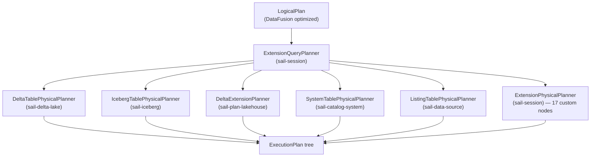

# Book Review: Gaps, Inaccuracies, and Areas Needing Expansion

This document reviews the nine chapters against the actual codebase as of version 0.6.3. It is organized by severity: (A) missing content that should be added, (B) factual inaccuracies that must be corrected, (C) thin coverage that should be expanded.

---

## (B) INACCURACIES — Must Correct

### B1. `sail-sql-parser` is NOT built on `sqlparser-rs`

**Location:** Chapter 1, table "SQL: sail-sql-parser"

**Claim:** "SQL parser, built on `sqlparser-rs` with Spark-specific extensions."

**Reality:** `sail-sql-parser` is a completely custom-built SQL parser using `chumsky` (version 0.12.0 with Pratt-parsing feature). It does NOT use `sqlparser-rs` at any level. The crate has its own lexer (`lexer.rs`), its own token types (`token.rs`), its own AST (`ast/` subtree with `statement.rs`, `query.rs`, `expression.rs`, `identifier.rs`), and combinators built with `chumsky`'s `Recursive::declare()` pattern.

```rust
// crates/sail-sql-parser/src/parser.rs
fn statement<'a, I, E>(options: &'a ParserOptions) -> impl Parser<'a, I, Statement, E> + Clone {
    let mut statement = Recursive::declare();
    let mut query = Recursive::declare();
    let mut expression = Recursive::declare();
    // ...
    statement.define(Statement::parser((...), options));
    query.define(Query::parser((...), options));
    expression.define(Expr::parser((...), options));
    statement
}
```

The AST is substantial: `statement.rs` has 52 types, `query.rs` has 46 types, with full coverage of Spark SQL DDL/DML including MERGE, LATERAL VIEW, PIVOT, UNPIVOT, table sample clauses, and Hive-compatibility syntax. This is a significant engineering achievement that deserves its own chapter section, not a parenthetical.

### B2. Physical Optimizer Ordering Description Is Wrong

**Location:** Chapter 4, "The Optimizer" section, and Chapter 8

**Claim:** The `DecorrelateLateralProjection` is added as a custom rule and DataFusion's defaults are appended.

**Reality:** There are two separate optimizer pipelines in Sail, and the book conflates them:

1. **Logical optimizer** (`sail-logical-optimizer`): adds `DecorrelateLateralProjection` *before* DataFusion's rules — this is correct as described.

2. **Physical optimizer** (`sail-physical-optimizer`): Does NOT just prepend to DataFusion's defaults. It reconstructs the entire physical optimizer pipeline from scratch, embedding all of DataFusion's standard rules at specific positions, interleaved with Sail's custom rules:

```rust
// crates/sail-physical-optimizer/src/lib.rs
pub fn get_physical_optimizers(options: PhysicalOptimizerOptions)
    -> Vec<Arc<dyn PhysicalOptimizerRule + Send + Sync>>
{
    rules.push(Arc::new(OutputRequirements::new_add_mode()));
    rules.push(Arc::new(AggregateStatistics::new()));
    if options.enable_join_reorder { rules.push(Arc::new(JoinReorder::new(...))); }
    rules.push(Arc::new(JoinSelection::new()));
    // ... 12 more DataFusion rules
    rules.push(Arc::new(RewriteExplicitRepartition::new()));   // Sail custom
    rules.push(Arc::new(RewriteCollectLeftHashJoin::new()));   // Sail custom
    rules.push(Arc::new(EnforceBarrierPartitioning::new()));   // Sail custom
    rules.push(Arc::new(SanityCheckPlan::new()));
    rules
}
```

A test verifies that all DataFusion rules appear in the same order as in DataFusion's default pipeline. The custom rules run *after* all of DataFusion's physical optimization — a significant distinction.

### B3. Custom Logical Nodes Are Vastly Underrepresented

**Location:** Chapter 4, "Custom Logical Plan Nodes"

**Claim:** Shows `RangeNode` and `ExplicitRepartitionNode` as examples.

**Reality:** There are at minimum 17 custom `UserDefinedLogicalNodeCore` implementations. The `sail-session` planner (`ExtensionPhysicalPlanner`) handles all of them:

```rust
// crates/sail-session/src/planner.rs (imports)
use sail_logical_plan::barrier::BarrierNode;
use sail_logical_plan::file_delete::FileDeleteNode;
use sail_logical_plan::file_write::FileWriteNode;
use sail_logical_plan::map_partitions::MapPartitionsNode;
use sail_logical_plan::merge::MergeIntoNode;
use sail_logical_plan::monotonic_id::MonotonicIdNode;
use sail_logical_plan::range::RangeNode;
use sail_logical_plan::repartition::ExplicitRepartitionNode;
use sail_logical_plan::schema_pivot::SchemaPivotNode;
use sail_logical_plan::show_string::ShowStringNode;
use sail_logical_plan::sort::SortWithinPartitionsNode;
use sail_logical_plan::spark_partition_id::SparkPartitionIdNode;
use sail_logical_plan::streaming::{
    collector::StreamCollectorNode, filter::StreamFilterNode, limit::StreamLimitNode,
    source_adapter::StreamSourceAdapterNode, source_wrapper::StreamSourceWrapperNode,
};
```

The book discusses only 2 of these 17 nodes. Nodes like `MapPartitionsNode` (the foundation for all Python UDF execution in the plan), `FileWriteNode` (all writes), `MergeIntoNode` (Delta MERGE), and `BarrierNode` (streaming checkpointing) are central to understanding Sail's design but are absent.

### B4. The `sail-session` Crate Is Entirely Missing

**Location:** Chapter 1 crate table, Chapter 4

**Reality:** `sail-session` is a critical crate that is not mentioned at all. It contains:
- `ExtensionQueryPlanner` — the `QueryPlanner` implementation that Sail registers with DataFusion's `SessionStateBuilder`. This is where the logical-to-physical translation of all 17 custom nodes happens.
- `ExtensionPhysicalPlanner` — the `ExtensionPlanner` that handles the node dispatch.
- Session factory and lifecycle management.

Without understanding `sail-session`, a reader cannot understand how custom logical nodes become physical plans, or how the physical optimizer pipeline gets registered.

### B5. Delta Lake "Write Support" Is More Limited Than Described

**Location:** Chapter 7 (catalogs) and Chapter 9 (current state)

**Claim:** Chapter 9 states "Delta Lake (including Variant Shredding, write support)".

**Reality:** Looking at `crates/sail-delta-lake/src/operations/mod.rs`:
```rust
// mod cast;
// mod cdc;
// pub mod constraints;
// pub mod delete;
// pub mod load_cdf;
// pub mod merge;
// pub mod optimize;
// pub mod update;
pub mod write;
```

The `delete`, `update`, `cdc`, `optimize`, and `merge` modules are commented out. Only `write` (append/overwrite) is active. The MERGE operation is implemented through a different path — through `MergeIntoNode` and the `sail-plan-lakehouse` extension planner routing to `plan_merge` / `plan_merge_mor` — but it does not use the same Delta operations module. This distinction is important: basic MERGE works, but table-level operations like `OPTIMIZE`, `VACUUM`, and `UPDATE` do not yet.

---

## (A) MISSING CONTENT — Should Be Added

### A1. The SQL Pipeline: `sail-sql-parser` + `sail-sql-analyzer`

These two crates implement Spark SQL parsing and have no coverage in the book. Together they handle the third entry path (SQL text → spec IR) that is used by:
- `sail-flight`'s `get_flight_info_statement`
- Any Spark SQL command coming through `SparkConnect`'s `SqlCommand` handler
- The gold test infrastructure

Key missing facts:
- The parser is built with `chumsky` 0.12.0 using its Pratt parsing feature for operator precedence.
- `sail-sql-parser` has a `keywords.rs` module that is code-generated at build time (via `sail-build-scripts`), maintaining a keyword enum for hundreds of SQL keywords.
- `sail-sql-analyzer/src/statement.rs`'s `from_ast_statement` converts 50+ statement types to `spec::Plan`, making it the SQL-to-spec bridge parallel to what Spark Connect's proto conversion does.
- `sail-sql-analyzer/src/parser.rs` exposes functions like `parse_one_statement`, `parse_data_type`, `parse_expression`, `parse_interval`, `parse_date`, `parse_timestamp` used throughout the system.
- The SQL layer supports Hive-compatibility syntax (SERDE, INPUTFORMAT, row format delimited, etc.) that Spark's SQL engine historically accepted.

This warrants a dedicated section (perhaps folded into Chapter 2 as "The SQL Entry Path") explaining the three routes a query can take: protobuf Relation, SQL text, and Flight SQL.

### A2. The `sail-function` Crate and Function Registration System

The function layer has 400+ scalar functions, 75+ aggregate functions, and 26 window functions. The book's only mention is in Chapter 9's "Adding a Spark Function" recipe. Missing:

**The `ScalarFunction` type (Chapter 4 extension):**
```rust
// crates/sail-plan/src/function/common.rs
pub(crate) type ScalarFunction =
    Arc<dyn Fn(ScalarFunctionInput) -> PlanResult<expr::Expr> + Send + Sync>;
```

Functions are not structs — they are closures. This allows functions like `IF(cond, t, f)` to be registered as a DataFusion `Case` expression builder rather than a physical UDF. Most Spark functions are expressed directly as DataFusion `Expr` trees, not as `ScalarUDFImpl` implementations. This is a key performance choice: it keeps functions in the logical plan where the optimizer can reason about them.

**The `ScalarFunctionBuilder` DSL:**
```rust
ScalarFunctionBuilder::nullary(|| expr_fn::pi())
ScalarFunctionBuilder::unary(|e| expr_fn::abs(e))
ScalarFunctionBuilder::binary(|a, b| expr_fn::power(a, b))
```

**The `BUILT_IN_SCALAR_FUNCTIONS` static map** (a `lazy_static!` HashMap, initialized once at startup).

**HLL and theta sketch functions** (merged in recent commit #1971):
- `hll_sketch_agg`, `hll_sketch_estimate`, `hll_union_agg`, `hll_union` — backed by the `datasketches` crate
- `approx_count_distinct_theta_sketch`, `theta_sketch_agg`, `theta_sketch_union` — backed by the same
- These are non-trivial implementations: each function is an `AggregateUDFImpl` with a custom `Accumulator` that serializes/deserializes the sketch state as Arrow `BinaryArray`.

**The `datafusion-spark` external crate** — Sail imports `datafusion-spark = "53.1.0"` for some string functions (elt, format_string, various regexp functions). This is a collaborative effort with the DataFusion ecosystem and is not mentioned.

### A3. The `sail-plan-lakehouse` Crate and the Logical → Physical Bridge for Writes

`sail-plan-lakehouse` is entirely absent but critical:

1. **`ExpandRowLevelOp` optimizer rule** — converts `MergeIntoNode` and `FileDeleteNode` for lakehouse formats into `RowLevelWriteNode`, which routes to format-specific physical planners. This is a logical optimizer rule (not physical), registered in the session's optimizer chain.

2. **`DeltaExtensionPlanner`** — the `ExtensionPlanner` that converts `FileWriteNode`, `FileDeleteNode`, `RowLevelWriteNode`, and `MergeCardinalityCheckNode` for Delta Lake into physical plans. It calls `plan_merge`, `plan_merge_mor`, `plan_delete`, `plan_delete_mor` from the Delta physical planner.

3. **Three registered extension planners** (in order):
   ```rust
   pub fn new_lakehouse_extension_planners() -> Vec<Arc<dyn ExtensionPlanner>> {
       vec![
           Arc::new(sail_delta_lake::planner::DeltaTablePhysicalPlanner),
           Arc::new(sail_iceberg::IcebergTablePhysicalPlanner),
           Arc::new(DeltaExtensionPlanner),
       ]
   }
   ```
   Plus `SystemTablePhysicalPlanner` and `ListingTablePhysicalPlanner` for other table types.

### A4. Streaming Architecture

Streaming has its own mini-pipeline that is only superficially mentioned:

- **Streaming logical plan rewriter** (`sail-plan/src/streaming/rewriter.rs`): takes a batch logical plan and rewrites it to use "flow event schema" nodes — each record has additional fields (`_marker`, `_retracted`) for event-flow semantics (insert/retract). The rewriter handles `RangeNode`, `TableScan`, `FileWriteNode`, and `Barrier` nodes specially.
- **Five streaming logical plan nodes**: `StreamSourceWrapperNode`, `StreamSourceAdapterNode`, `StreamFilterNode`, `StreamLimitNode`, `StreamCollectorNode`
- **Five corresponding physical plan nodes** in `sail-physical-plan/src/streaming/`
- **`StreamingQuery` lifecycle** in `sail-spark-connect/src/streaming.rs`: uses a tokio `watch` channel pair (error + stopped) to track query state, `oneshot` for stopping, `JoinHandle` for the background poll loop.
- **`StreamingQueryManager`** inside `SparkSession` manages all active streaming queries.

The streaming rewriter's flow event schema approach — where every record carries `_marker` and `_retracted` fields — is a distinctive design choice that deserves explanation.

### A5. The `spec` IR Is Much Larger Than Implied

Chapter 1 and the rest of the book treat `spec` as a thin translation layer. In reality:
- `spec/plan.rs`: 1,356 lines, 74 named types (enums + structs), covering all Spark Connect `Relation` types plus SQL DDL/DML commands not in the protobuf
- `spec/expression.rs`: 455 lines, 21 types
- `spec/data_type.rs`: 665 lines

The `QueryNode` enum has 50+ variants (`Filter`, `Join`, `Aggregate`, `Pivot`, `Unpivot`, `GroupMap`, `CoGroupMap`, `ApplyInPandasWithState`, `WithWatermark`, `StatSampleBy`, `StatApproxQuantile`, etc.). The `CommandNode` enum covers everything from `CreateTable` to `MergeInto` to `AlterColumnType`. This is a full Spark relational algebra IR, not a thin wrapper.

### A6. The Gold Test Infrastructure

The testing strategy needs proper explanation:

1. `sail-gold-test` is a CLI binary (`spark-gold-data`) that reads Spark's own function documentation (generated from Spark's `SparkSQLFunctionDocSuite`) and converts it into test suites.
2. Gold data is generated by running queries against a real Spark cluster and capturing output as JSON.
3. Tests then replay the same queries against Sail and diff the output — this is how Spark compatibility is verified at the function level.
4. Test suites: `DataTypeParserSuite`, `TableSchemaParserSuite`, `FunctionSuite` (each Spark function with its examples from Spark docs).
5. This is a crucial part of the compatibility story: Sail can claim function-level Spark compatibility because it has a systematic way to verify it.

### A7. Error Type Census

Chapter 8 describes "one error type per crate" but underrepresents the scope. There are 15+ distinct error types with `thiserror`:

| Crate | Error type |
|---|---|
| `sail-spark-connect` | `SparkError` |
| `sail-plan` | `PlanError` |
| `sail-sql-analyzer` | `SqlError` |
| `sail-execution` | `ExecutionError` |
| `sail-catalog` | `CatalogError` |
| `sail-common` | `CommonError` |
| `sail-python-udf` | `PyUdfError` |
| `sail-delta-lake` | `DeltaError` |
| `sail-session` | `SessionError` |
| `sail-cache` | `CacheError` |
| `sail-flight` | (wraps `Status` directly) |
| `sail-common-datafusion` | `CommonDataFusionError` |

The book also understates how `SparkError → Status` conversion works for Python errors: when a `DataFusionError` carries a wrapped `PyErr`, the `From<SparkError> for Status` impl extracts the Python traceback using `PyErrExtractor` and embeds it in the gRPC status `ErrorDetails`, so PySpark users see the Python traceback, not a Rust error.

### A8. `sail-data-source` and `sail-object-store`

These crates are listed in Chapter 1 but never discussed. `sail-data-source` contains:
- Listing format support (Parquet, CSV, JSON, ORC, Avro) with Spark-compatible read/write options
- Schema and compression inference (refactored in commit #2009)
- The `TableFormat` trait and `TableFormatRegistry` that connects catalog table metadata to actual DataFusion `TableProvider` implementations
- The listing table source introduced in commit #1877

`sail-object-store` provides object store wrappers (S3, GCS, Azure Blob) with Spark-compatible URI schemes (`s3://`, `gs://`, `abfss://`).

### A9. The `sail-common-datafusion` Crate

Only mentioned in passing. Key contributions:
- `TableFormat` trait — the extension point for adding new file formats
- `SessionExtension` and `SessionExtensionAccessor` traits — described in Chapter 8 but their home crate is not named
- `LogicalRewriter` trait — an extension point for logical plan rewrites (currently empty but scaffolded)
- `JobRunner` and `JobService` traits — live here, not in `sail-execution`
- `rename::physical_plan::rename_physical_plan` — the utility that applies user-facing column aliases to physical plans (used extensively by `ShowStringExec`)

---

## (C) THIN COVERAGE — Expand

### C1. Chapter 4 Needs a "Complete Logical-to-Physical Pipeline" Section

The current chapter explains `PlanResolver` and some custom nodes, but the reader cannot understand the full pipeline without knowing about:
- `ExtensionQueryPlanner` in `sail-session` as the registered `QueryPlanner`
- `ExtensionPhysicalPlanner` as the dispatch table for 17 custom nodes
- The four `ExtensionPlanner` implementations chained together
- The `lakehouse_optimizer_rules()` logical optimizer additions for Delta/Iceberg write paths

The chapter should include a diagram:



### C2. Chapter 2 Should Show the SQL Command Path

The current chapter shows `SparkConnect`'s binary `ExecutePlan` → `Root/Command` dispatch. It should also show what happens when `CommandType::SqlCommand` arrives:

```rust
CommandType::SqlCommand(sql) => {
    service::handle_execute_sql_command(ctx, sql, metadata).await
}
```

The path is: SQL string → `sail-sql-analyzer::parse_one_statement` → `from_ast_statement` → `spec::Plan` → same `resolve_and_execute_plan` as the protobuf path. This is how `spark.sql("SELECT ...")` works.

### C3. Chapter 6 Should Cover the Streaming Execution Loop

The `StreamingQuery` struct in `sail-spark-connect/src/streaming.rs` spawns a background tokio task that polls the `SendableRecordBatchStream` in a loop, sending results to the streaming sink. The error/stopped state is propagated via `watch::Sender` channels. The query's lifecycle — start, stop, await, error — is managed by `StreamingQueryManager`. This is completely absent from Chapter 6.

### C4. Chapter 7 Should Cover the `TableFormat` Trait

The bridge between catalog metadata and table providers is the `TableFormat` trait in `sail-common-datafusion`. Each table format (Parquet, Delta, Iceberg, etc.) is registered in a `TableFormatRegistry`. When a catalog returns a `TableStatus` with format="delta", the registry looks up `DeltaTableFormat` and calls its `create_source`/`create_sink` methods. This is the key extension point for adding support for new table formats.

### C5. Chapter 8 Should Cover the `ScalarFunctionBuilder` DSL

The function registration DSL (nullary/unary/binary/ternary builders) is one of the more interesting Rust design decisions — using closures instead of trait objects avoids monomorphization explosion and allows functions to be expressed as DataFusion `Expr` transformations rather than runtime UDFs. This is important for optimizer transparency.

### C6. Chapter 3 Should Mention the Variant Type

The `VARIANT` type (added in recent commits) is a JSON-like semi-structured type using the Arrow extension type system and the `parquet-variant-compute` crate. It appears in:
- `sail-plan/src/resolver/data_type.rs` (uses `VariantType` from `parquet_variant_compute`)
- `sail-function/src/scalar/variant/` (scalar functions for variant manipulation)
- `sail-delta-lake/src/spec/` (Variant Shredding — how variant columns are stored as typed sub-columns in Delta)

The Variant type is a significant recent addition and represents Sail tracking Spark 4.x features.

---

## Proposed Revised Chapter Outline

The current structure is mostly sound but needs three changes:

### Option A: Add Chapter 2.5 — The SQL Pipeline (Minimal Change)

Insert a new section between Chapters 2 and 3:

**`02b-sql-pipeline.md` — The SQL Entry Path**
- `sail-sql-parser`: custom `chumsky`-based lexer and parser, keyword codegen, AST types
- `sail-sql-analyzer`: `from_ast_statement`, conversion to `spec::Plan`, date/timestamp/interval parsers
- How `SqlCommand` in Spark Connect routes through this pipeline
- How `sail-flight`'s `get_flight_info_statement` uses this pipeline
- The three convergence points: all paths lead to `spec::Plan` → `resolve_and_execute_plan`

### Option B: Expand Chapter 4 (DataFusion) into Two Chapters (Preferred)

Split Chapter 4 into:

**Chapter 4a — DataFusion Integration: Planning**
- The current Chapter 4 content
- Add `ExtensionQueryPlanner` + `ExtensionPhysicalPlanner` in `sail-session`
- Complete the custom logical node inventory
- The `sail-plan-lakehouse` extension planner for write paths

**Chapter 4b — The Physical Optimizer**
- `sail-physical-optimizer`: the full rule pipeline in order
- `JoinReorder`: a DP-based join ordering algorithm with 8 sub-modules (cardinality estimation, cost model, DP plan, enumerator, graph, join set, reconstructor) — the recent "join reorder safeguards" PR (#1954) context
- `RewriteExplicitRepartition`: how logical `ExplicitRepartitionKind` becomes `RepartitionExec`, `CoalescePartitionsExec`, or `CoalesceExec`
- `RewriteCollectLeftHashJoin`: safety-net for join mode invariants
- `EnforceBarrierPartitioning`: streaming barriers

### Option C: Add Chapter 2.5 and Restructure Chapter 7

Add the SQL pipeline chapter and expand Chapter 7 to cover:
- The `TableFormat` trait and `TableFormatRegistry`
- `sail-data-source` listing format support
- Delta Lake architecture in more depth (Delta Log, Protocol, table features, Deletion Vectors)
- Iceberg architecture in Sail (currently read-only)
- The Variant type and its connection to Variant Shredding

---

## Summary Table

| Area | Status | Severity |
|---|---|---|
| SQL parser (`sail-sql-parser`) uses `chumsky`, not `sqlparser-rs` | Inaccurate | **Must fix** |
| Physical optimizer reconstruction (vs. prepend) | Inaccurate | **Must fix** |
| 17 custom logical nodes (book shows 2) | Incomplete | **Must fix** |
| `sail-session` entirely missing | Missing | **Must fix** |
| Delta write scope (only basic write/MERGE, not DELETE/UPDATE/OPTIMIZE) | Inaccurate | **Must fix** |
| SQL pipeline chapter (`sail-sql-parser` + `sail-sql-analyzer`) | Missing | **High** |
| Function layer depth (400+ scalar functions, closure DSL, `datafusion-spark`) | Missing | **High** |
| `sail-plan-lakehouse` (write routing, ExpandRowLevelOp) | Missing | **High** |
| Streaming architecture (rewriter, flow event schema, 5 streaming nodes) | Missing | **High** |
| `spec` IR size (2476 lines, 74 plan types) | Understated | **Medium** |
| Gold test infrastructure | Thin | **Medium** |
| Error type census (15+ types, Python traceback extraction) | Thin | **Medium** |
| `sail-data-source` and `sail-object-store` | Missing | **Medium** |
| `sail-common-datafusion` (`TableFormat`, `JobRunner` home) | Thin | **Medium** |
| Variant type and Variant Shredding | Missing | **Low-Medium** |
| HLL/theta sketch implementation details | Thin | **Low** |
| Physical optimizer JoinReorder (DP algorithm) | Missing | **Low** |

The most critical fix is **B1** (parser library mis-statement) — it is a verifiable factual error that would immediately undermine reader trust. The next most impactful additions are the SQL pipeline chapter and the `sail-session` + `ExtensionPhysicalPlanner` coverage, since these explain a major "how does anything actually work" gap.
