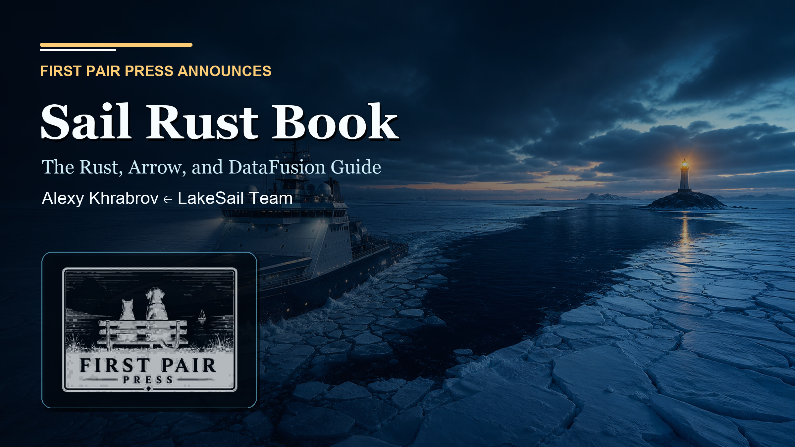
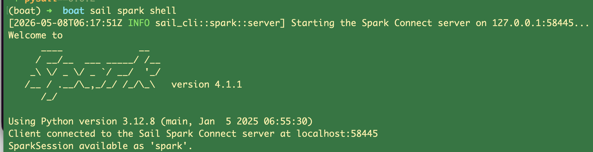

# Announcing Sail Rust Book

First Pair Press is publishing *Sail Rust Book*, a codebase-first guide to Sail,
Rust, Apache Arrow, Apache DataFusion, Spark Connect, distributed execution,
lakehouse storage, testing, and extension design.

I am grateful to Shehab Amin and Heran Lin for creating Sail and for bringing
me in as Head of Ecosystems. I am wildly excited to be back in a Spark
ecosystem that is free of the JVM.

For the first time in 15 years, I ran a Spark shell and the familiar ASCII logo
came up, but there was no JVM anywhere: not on the client, and not on the
server.

That moment says a lot about why Sail matters. It keeps the Spark mental model
and ecosystem surface while moving the implementation into Rust, Arrow, and
DataFusion. The result feels familiar at the shell and radically different
underneath.

Thank you to the whole LakeSail team for making this possible. The LakeSail
platform has just launched, and we will be shipping fast. Watch
[lakesail.com](https://lakesail.com/) for updates daily.

The new edition is built against the current Sail checkout and release window.
It is not just a polished export of a manuscript. It is a reproducible
publishing package: text sources, generated diagrams, version manifests, PDF,
EPUB, HTML readers, and an Obsidian Vault that carries the book and the code
next to each other.

The cover is the editorial metaphor: an atomic icebreaker moves through an ice
field toward open water, with a lighthouse waiting on rock. That is the job of a
good systems book. It should cut a navigable channel through a large codebase
without pretending the ice was never there.

## The First Pair Process

First Pair treats a book as source code with reader-facing builds.

The manuscript lives as plain text. Diagrams are generated from source. The
book build runs through the shared First Pair toolchain, with pinned versions of
Pandoc, Typst, Calibre, and supporting scripts. Each delivery writes a
`VERSION.md` manifest with the title, edition, source commit, version stamp, and
artifact names.

Publication is a second step. The library workflow stages exactly one book
package, uploads the heavy artifacts to object storage, refreshes the public
catalog, writes a visible README, copies reader files to the local book shelf,
builds the site, runs smoke checks, deploys production, and verifies that the
live catalog points to the new URLs.

That separation matters. A local build answers "can this book be produced?"
Publishing answers "can readers actually get the right edition from the
library?"

## The Library

The First Pair library is the public shelf for finished editions and previews.
For *Sail Rust Book*, the library exposes several formats:

- PDF for a stable page layout, cover-first reading, printing, and citation.
- EPUB for e-readers and responsive reading systems.
- Hosted HTML for quick browser reading without downloading a file.
- Hosted chapter HTML for jumping into one chapter at a time.
- Obsidian Vault for source-linked study, note navigation, and code exploration.

The library card is the front door. It links the download formats and reader
routes from one catalog entry, then keeps the underlying storage URLs out of the
reader's way.

## Why This Book Needed A Vault

Sail is not a single file, and it is not a single idea. It is a Rust system
where Spark protocol handling, SQL planning, Arrow data movement, DataFusion
extensions, Python interop, lakehouse catalogs, object storage, workers, tasks,
streams, and tests all meet.

A normal PDF can explain that architecture. An EPUB can carry it well. HTML can
make it easy to browse. But a codebase book also needs a format that can keep
the reader inside the system while the prose is still visible.

That is what the Obsidian Vault does.

The Vault contains:

- every book chapter as Markdown notes;
- generated notes for the current Sail code files;
- crate and subsystem index notes;
- generated code-fragment notes with source paths and line ranges;
- machine-readable ledgers for files, fragments, symbols, links, and units;
- a bundled local Obsidian plugin named `sail-code-fragments`.

The plugin gives the prose a practical gesture. When a chapter shows a
generated code-fragment card, clicking `Open code fragment` opens the matching
code-file note and highlights the selected fragment. The book can point at the
code without asking the reader to search a repository by hand.

## Installing The Obsidian Vault

Download the Vault archive from the *Sail Rust Book* library card, then unzip it
somewhere you keep active notes.

Open Obsidian and choose **Open folder as vault**. Select the unzipped `Sail
Rust Book Vault` folder.

Obsidian may ask whether to trust the vault because it includes a local
community plugin. Trust it only if you downloaded the archive from the First
Pair library. Then enable the bundled `sail-code-fragments` plugin under
**Settings -> Community plugins**.

Start at `Home.md`, then open `Sail Rust Book/Book.md`. From there, use:

- `Sail Rust Book/Chapters/` for the book text;
- `Sail Rust Book/Indices/Code Files.md` for the source-file map;
- `Sail Rust Book/Indices/Fragments.md` for extracted code fragments;
- `Sail Rust Book/Indices/Crates.md` for crate-level navigation;
- `Sail Rust Book/Indices/Subsystems.md` for architecture-level navigation.

The Vault is generated from source. Treat it like a published edition, not like
a private scratch folder. If the book or Sail code changes, rebuild the Vault
from the source repository so the fragments, ledgers, and plugin links stay in
sync.

## A Book As A System

*Sail Rust Book* is a technical guide, but it is also a First Pair publishing
experiment: one source project, multiple reader formats, one catalog, one
visible provenance trail.

The PDF and EPUB are the book as readers expect it. The HTML readers are the
book as a public web object. The Obsidian Vault is the book as a navigable
knowledge system, with the codebase pulled close enough for study.

That is the direction First Pair is pushing: books that are not frozen
snapshots, but reproducible systems readers can inspect, use, and revisit.
