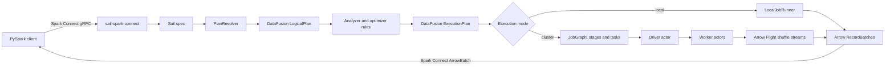
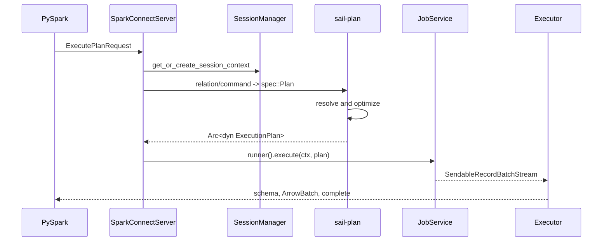
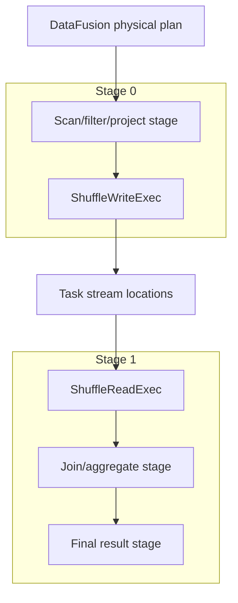
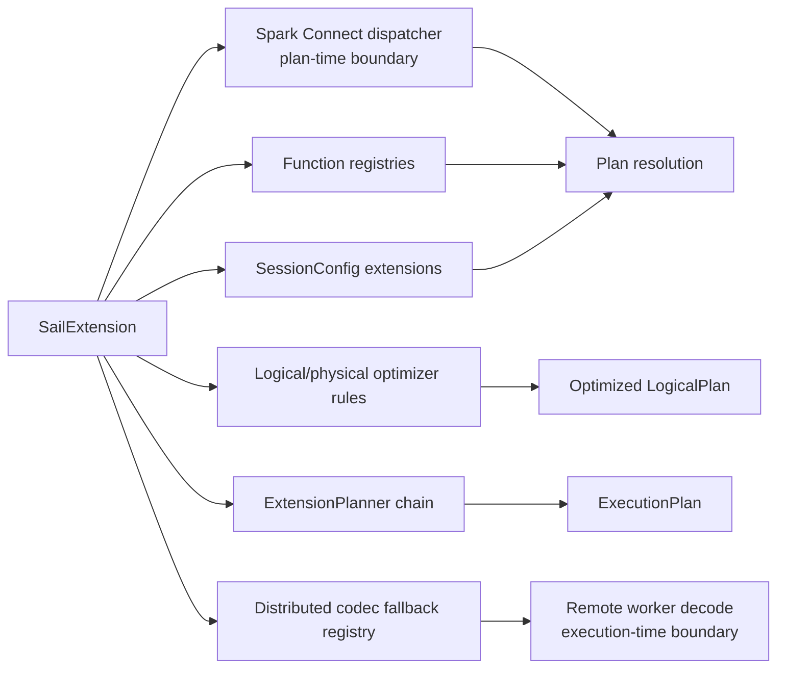

# Chapter 1: Architecture Overview

Sail is easiest to understand as two promises held together by one architecture.

The first promise is compatibility: existing PySpark code should be able to connect to Sail through Spark Connect and keep speaking the language of Spark SQL, DataFrames, functions, UDFs, and sessions. The second promise is performance and portability: the actual engine is Rust, Apache Arrow, and Apache DataFusion, with Sail adding Spark semantics, distributed planning, catalogs, Python interoperability, and cluster execution.

That means Sail is not "Spark implemented in Rust" in the narrow sense. It is a Spark-compatible front door over a DataFusion-centered query engine.



The rest of this book walks that diagram from left to right, then returns to the extension proposal in discussion #2001 and asks: where should a third-party DataFusion integration plug in so it works in both local and distributed execution?

## The Big Pieces

Sail has a few major subsystems. Each one has a clean teaching role.

| Subsystem | Main crates | What to learn there |
| --- | --- | --- |
| Spark Connect front door | `sail-spark-connect`, `sail-python`, `python/pysail` | gRPC services, PySpark compatibility, Python-to-Rust server startup |
| Plan resolution | `sail-plan`, `sail-sql-parser`, `sail-sql-analyzer` | converting SQL and Spark relations into DataFusion logical plans |
| Session construction | `sail-session` | DataFusion `SessionConfig`, `SessionState`, custom planners, optimizer rules, and job runners |
| Query execution | `sail-execution` | local execution, cluster execution, job graphs, stages, tasks, drivers, workers, shuffles |
| Spark semantics | `sail-function`, `sail-logical-plan`, `sail-physical-plan`, `sail-logical-optimizer`, `sail-physical-optimizer` | custom functions, logical nodes, physical nodes, optimizer behavior |
| Data transport | Arrow, Arrow IPC, Arrow Flight | columnar batches across process and network boundaries |
| Catalogs and formats | `sail-catalog-*`, `sail-data-source`, `sail-delta-lake`, `sail-iceberg` | table discovery, scans, writes, system tables, lakehouse integration |

The most important mental model is this:

```text
PySpark API call
  -> Spark Connect protobuf relation or command
  -> Sail spec
  -> DataFusion logical plan
  -> optimized DataFusion logical plan
  -> DataFusion physical execution plan, with Sail extension nodes
  -> local stream or distributed job graph
  -> Arrow record batches
  -> Spark Connect response stream
```

This is also the extension story. If an integration only hooks one of these layers, it will work only until a query crosses into another layer. A scalar function registered at planning time still has to be recognized when a physical plan is decoded on a remote worker. A logical optimizer rule that creates a custom extension node still needs a physical extension planner. A session option used by that rule has to be present in the `SessionConfig` that the planner reads.

That is exactly the problem described in discussion #2001.

## Spark Connect Is the Front Door

The Spark Connect server is implemented by `SparkConnectServer` in `crates/sail-spark-connect/src/server.rs`. Its `execute_plan` method receives an `ExecutePlanRequest`, extracts the session ID and user ID, asks the Sail `SessionManager` for a `SessionContext`, and dispatches either a relation or a command.

The distinction matters:

- A relation is a query-producing tree: select, project, filter, join, aggregate, read, SQL relation, and so on.
- A command is an action or side effect: register a function, write data, create a view, start a stream, run a SQL command, merge into a table, and so on.

The central handoff is in `crates/sail-spark-connect/src/service/plan_executor.rs`. `handle_execute_relation` converts the Spark Connect relation into Sail's internal `spec::Plan`, then calls `handle_execute_plan`. That function asks `sail-plan` to resolve and plan the work, then asks the session's `JobService` to execute the resulting physical plan.

The output is a Spark Connect response stream. Sail reads `RecordBatch` values from DataFusion and serializes them into Spark Connect `ArrowBatch` messages using Arrow IPC in `crates/sail-spark-connect/src/executor.rs`.



This is why Spark Connect deserves its own chapter. It is not just an API shim; it controls the session lifecycle, the response stream shape, the data type boundary, and the compatibility surface seen by PySpark.

## pysail Starts the Rust Server

The Python package `pysail` is thin by design. The public Python class `python/pysail/spark/__init__.py::SparkConnectServer` delegates to a native PyO3 object.

The Rust side lives in `crates/sail-python/src/spark/server.rs`. It loads `AppConfig`, grabs the global Tokio runtime, binds a TCP listener, and starts the Spark Connect server in a background thread. The implementation explicitly releases the Python GIL while waiting for the server so Python UDFs are not blocked by the server thread.

This shape is important for the extension proposal. If third-party extensions are discovered from Python wheels, `pysail` startup is the natural discovery point. But the extension object has to cross from Python packaging into Rust planning and execution. Discussion #2001 proposes Python entry points such as:

```toml
[project.entry-points."pysail.extensions"]
sedona = "pysail_sedona:register"
```

That works as user experience only if the registered extension can contribute to the same Rust-side machinery used by the CLI and by custom embedders.

## Sail Uses DataFusion as the Query Kernel

Sail's query planning entry point is `resolve_and_execute_plan` in `crates/sail-plan/src/lib.rs`.

It performs the key transitions:

1. Build a `PlanResolver`.
2. Resolve a Sail spec into a named DataFusion `LogicalPlan`.
3. Ask DataFusion's `SessionState` to optimize the logical plan.
4. Rewrite streaming plans when needed.
5. Ask the session query planner to create a physical `ExecutionPlan`.
6. Record initial logical, final logical, and final physical plans for explain output.

The important architectural choice is that Sail does not use DataFusion as a black box. It uses DataFusion's abstractions as the spine, then installs its own semantics around them.

In `crates/sail-session/src/session_factory/server.rs`, Sail creates a `SessionConfig` with custom extensions:

- Table format registry.
- Catalog manager.
- Activity tracker.
- Job service.
- Repartition buffer configuration.
- System table service.
- Delta table cache.

Then it creates a `SessionStateBuilder` with Sail's analyzer rules, optimizer rules, physical optimizer rules, and custom query planner.

That custom query planner is in `crates/sail-session/src/planner.rs`. `ExtensionQueryPlanner` builds a DataFusion `DefaultPhysicalPlanner` with Sail's extension planners:

```text
lakehouse extension planners
  -> system table physical planner
  -> Sail ExtensionPhysicalPlanner
```

`ExtensionPhysicalPlanner` recognizes Sail logical extension nodes such as range, show string, map partitions, monotonic IDs, Spark partition IDs, file writes, file deletes, streaming nodes, catalog commands, explicit repartition, and barriers. It turns them into physical `ExecutionPlan` implementations from `sail-physical-plan` and related crates.

This is where discussion #2001 finds one of its sharp edges. Today, if `ExtensionPhysicalPlanner` does not recognize a logical extension node, it returns an internal error. DataFusion's extension planner convention is to return `Ok(None)` when a planner does not own a node, allowing later planners in the chain to try. For third-party planners, that difference controls whether composition works.

## Local Execution Is Direct DataFusion Execution

When Sail is running locally, the `ServerSessionFactory` installs a `LocalJobRunner`. Its `execute` implementation in `crates/sail-execution/src/job_runner.rs` wraps the plan in tracing and then calls DataFusion's `execute_stream`.

That is the simplest possible execution path:

```text
Arc<dyn ExecutionPlan>
  -> execute_stream(plan, task_ctx)
  -> SendableRecordBatchStream
  -> Spark Connect response stream
```

Local mode is ideal for learning DataFusion because all of DataFusion's partitioned execution model is still present, but no distributed staging is needed. The physical plan executes in one process, and DataFusion's operators recursively call their children through the `ExecutionPlan` trait.

## Cluster Execution Adds a Driver, Workers, Stages, and Shuffles

Cluster mode swaps in `ClusterJobRunner`. Instead of executing the physical plan directly, it sends a `DriverEvent::ExecuteJob` to a driver actor. The driver builds a distributed job graph and schedules tasks on workers.

The core data structure is `JobGraph` in `crates/sail-execution/src/job_graph/mod.rs`. The code comments are wonderfully plain: a job has stages, each stage has partitions, and tasks execute individual stage partitions. Each task can produce output split into channels.

The graph is built in `crates/sail-execution/src/job_graph/planner.rs`. `JobGraph::try_new` starts from a DataFusion physical plan and recursively splits it at distributed boundaries:

- `RepartitionExec` becomes a shuffle boundary.
- `ExplicitRepartitionExec` becomes a shuffle boundary.
- `CoalescePartitionsExec` becomes a shuffle boundary.
- `SortPreservingMergeExec` creates a merge input.
- Sail's `CoalesceExec` creates a rescale input.
- System tables and catalog commands become driver stages.

The planner also contains two distributed-correctness rewrites:

- Global limits are forced to have a single input partition when a limit or offset is present.
- Certain collected hash joins are rewritten into partitioned hash joins when unmatched build-side rows would otherwise require shared row-match state across distributed partitions.

This is one of Sail's best teaching examples. DataFusion physical plans already know about partitioning, but a distributed engine must interpret that partitioning as data movement, task placement, materialization, and reuse.



## Shuffle Is Arrow Data Movement

Sail represents shuffle write and shuffle read as physical execution plan nodes.

`ShuffleWriteExec` in `crates/sail-execution/src/plan/shuffle_write.rs` executes its child for one input partition, partitions each `RecordBatch` into output channels using hash or round-robin partitioning, and writes those partitioned batches to task stream locations.

`ShuffleReadExec` in `crates/sail-execution/src/plan/shuffle_read.rs` has no children. For a given output partition, it opens the task stream locations it needs and merges the resulting record batch streams.

That design keeps the distributed runtime columnar all the way through:

```text
RecordBatch stream
  -> partition RecordBatch into channel batches
  -> write channel batches
  -> read channel batches from remote/local stream locations
  -> merge streams
  -> continue as RecordBatch stream
```

The public architecture docs describe Arrow Flight as Sail's data plane for shuffle exchange and result return. The code-level point is that the logical idea of "shuffle" becomes ordinary DataFusion `ExecutionPlan` nodes that read and write Arrow batch streams.

## Functions Are Both Planning-Time and Execution-Time Concerns

Sail has a Spark-compatible function layer in `crates/sail-plan/src/function`. Built-in scalar, generator, table, aggregate, and window functions are stored in static registries. The resolver uses those registries to turn unresolved Spark functions into DataFusion expressions and UDF objects.

But distributed execution adds another requirement: workers must be able to decode the physical plan they receive. That is why `crates/sail-execution/src/codec.rs` has explicit UDF and UDAF encode/decode logic. It can rebuild PySpark UDFs from serialized payloads, and it can re-resolve many built-in UDF names when decoding standard functions.

This is the most important extension lesson in the chapter:

```text
Planning-time registry is necessary.
Distributed execution-time registry is also necessary.
```

If an extension contributes `ST_Intersects`, it is not enough for the planner to know the function. A remote worker decoding a physical plan also has to know how to reconstruct the same `ScalarUDF` or `AggregateUDF`. Discussion #2001 calls this out directly for Sedona-style extensions.

## Where Extensions Want to Plug In

Discussion #2001 proposes a unified `SailExtension` trait. Its motivation is that real DataFusion integrations usually need several hooks at once:

- Scalar UDFs.
- Aggregate UDAFs.
- Window UDFs.
- Generator and table functions.
- Session config extensions.
- Logical optimizer rules.
- Physical optimizer rules.
- Physical extension planners.
- UDF/UDAF re-resolution during distributed physical-plan decoding.

The proposal's motivating example is Apache SedonaDB. A spatial query might need `ST_*` scalar UDFs during plan resolution, session options during optimization, a logical optimizer rule to replace a cross join plus spatial predicate with a spatial join logical extension node, a physical planner to create `SpatialJoinExec`, and worker-side UDF re-resolution in a cluster.

This means the final chapter of the book should not treat extensions as a plugin convenience feature. Extensions are a stress test of the architecture. They ask whether Sail's layers are composable in the same direction data actually flows.

Chapter 13 develops the proposal in two parts. Extensions cross **two boundaries** with different stability requirements:

- A **plan-time boundary** where a client expresses intent. It runs once per query and wants forward and backward wire compatibility, language neutrality, and a format that survives DataFusion and Arrow upgrades. Spark Connect's `Relation.extension`, `Command.extension`, and `Expression.extension` messages are the natural channel.
- An **execution-time boundary** where workers run operators on Arrow batches. It runs once per batch, wants native dispatch and zero-copy access, and accepts version coupling in return. DataFusion FFI is the natural channel.

The same `SailExtension` object registers contributions to both. Some extensions only need one.



## A First Reading Path Through the Code

For this chapter, read these files in order:

1. `docs/concepts/architecture/index.md`
2. `docs/concepts/query-planning/index.md`
3. `crates/sail-spark-connect/src/server.rs`
4. `crates/sail-spark-connect/src/service/plan_executor.rs`
5. `crates/sail-plan/src/lib.rs`
6. `crates/sail-session/src/session_factory/server.rs`
7. `crates/sail-session/src/planner.rs`
8. `crates/sail-execution/src/job_runner.rs`
9. `crates/sail-execution/src/job_graph/mod.rs`
10. `crates/sail-execution/src/job_graph/planner.rs`
11. `crates/sail-execution/src/plan/shuffle_write.rs`
12. `crates/sail-execution/src/plan/shuffle_read.rs`
13. `crates/sail-execution/src/codec.rs`

Do not try to understand every operator yet. Follow the type transitions:

```text
ExecutePlanRequest
  -> SessionContext
  -> spec::Plan
  -> LogicalPlan
  -> ExecutionPlan
  -> SendableRecordBatchStream
```

Then follow the cluster-only transition:

```text
ExecutionPlan
  -> JobGraph
  -> Stage
  -> StageInput
  -> Task
  -> ShuffleWriteExec / ShuffleReadExec
```

Once those two paths feel familiar, the rest of the book can zoom into each layer without losing the whole shape.

## Chapter Takeaways

Sail's architecture is a layered translation pipeline. PySpark speaks Spark Connect. Spark Connect becomes Sail's internal spec. The spec resolves into DataFusion logical plans. DataFusion optimizes and physical-plans the query, with Sail adding Spark semantics through custom functions, logical nodes, physical nodes, optimizer rules, and session extensions. Local mode executes the physical plan directly. Cluster mode decomposes it into stages and tasks, moving Arrow record batches through shuffle streams.

The extension proposal in discussion #2001 matters because it turns this architecture inside out. A third-party integration must be able to contribute to every layer where its semantics appear. If Sail exposes only one hook, extensions will work in toy examples and fail when optimization, physical planning, or distributed execution enters the picture.

The next chapter should slow down and teach the Rust patterns that make this architecture possible: trait objects, `Arc`, async services, actor handles, DataFusion extension traits, and typed session extensions.
