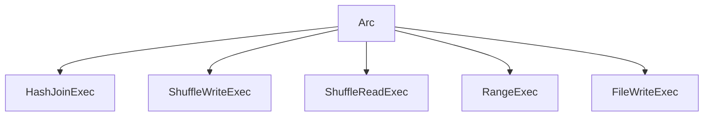
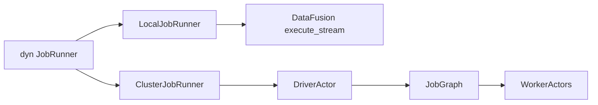
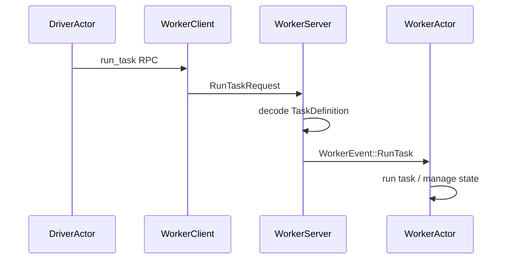

# Chapter 2: Rust Foundations in Sail

This chapter is not a full Rust tutorial. It is a map of the Rust ideas you need in order to read Sail without feeling like every file is speaking a private dialect.

Sail is an unusually good Rust learning project because it uses Rust for the things Rust is good at: explicit ownership, cheap shared references, trait-based interfaces, asynchronous services, structured errors, and safe concurrency. It is also a practical systems project, so these ideas show up under pressure. They are not decorative.

The core lesson is this:

```text
Sail moves query plans and Arrow streams through a graph of typed interfaces.
Rust makes those interfaces explicit.
```

When you see `Arc<dyn ExecutionPlan>`, `Box<dyn JobRunner>`, `SessionExtension`, or `ActorHandle<DriverActor>`, you are seeing the architecture in Rust form.

## The Rust Shape of Sail

Chapter 1 described Sail as a pipeline:

```text
Spark Connect request
  -> Sail spec
  -> DataFusion LogicalPlan
  -> DataFusion ExecutionPlan
  -> local stream or distributed job graph
  -> Arrow RecordBatch stream
```

Rust gives each boundary a type. A few types appear again and again:

| Rust pattern | Sail example | Why it matters |
| --- | --- | --- |
| `Arc<T>` | `Arc<AppConfig>`, `Arc<dyn ExecutionPlan>` | Shared ownership across async tasks, sessions, plans, and workers |
| `Box<dyn Trait>` | `Box<dyn JobRunner>`, `Box<dyn ServerSessionMutator>` | Runtime choice among implementations |
| `Arc<dyn Trait>` | `Arc<dyn ExecutionPlan>`, `Arc<dyn QueryPlanner>` | Shared polymorphic query operators |
| `async_trait` | `JobRunner`, `Actor`, gRPC service traits | Async methods in traits |
| `Result<T, E>` | `PlanResult`, `ExecutionResult`, `SparkResult` | Explicit error paths across planning, execution, and protocol layers |
| Typed extensions | `SessionExtension` | Type-safe access to session services and configuration |
| Actor handles | `ActorHandle<DriverActor>` | Message-passing control plane for distributed execution |

These are the vocabulary words of the Sail codebase. The rest of the chapter explains each one through files you have already touched in the architecture overview.

## Shared Ownership With `Arc`

`Arc<T>` means "atomically reference-counted pointer." In practical terms, it lets multiple owners hold the same value safely across threads. Sail needs that constantly because sessions, runtimes, query plans, actors, and task contexts all outlive a single function call.

Look at `ServerSessionFactory` in `crates/sail-session/src/session_factory/server.rs`:

```rust
pub struct ServerSessionFactory {
    config: Arc<AppConfig>,
    runtime: RuntimeHandle,
    system: Arc<Mutex<ActorSystem>>,
    mutator: Box<dyn ServerSessionMutator>,
    runtime_env: RuntimeEnvFactory,
    catalog_cache_manager: Arc<CatalogCacheManager>,
}
```

The factory does not own the global application config in a lonely way. It shares it. The session factory, runtime environment factory, catalog manager, worker manager, and driver setup can all receive clones of the same `Arc<AppConfig>`.

Cloning an `Arc` does not clone the underlying config. It increments a reference count:

```rust
let runtime_env = RuntimeEnvFactory::new(config.clone(), runtime.clone());
```

That line is small, but it is one of Rust's most important performance habits. Large shared state can be passed cheaply while ownership stays explicit.

DataFusion plans use the same idea. A physical plan in Sail is usually:

```rust
Arc<dyn ExecutionPlan>
```

That reads as:

```text
shared pointer to some concrete type that implements DataFusion's ExecutionPlan trait
```

The concrete type might be a DataFusion operator, `ShuffleWriteExec`, `ShuffleReadExec`, `RangeExec`, `MapPartitionsExec`, `FileWriteExec`, or another Sail extension. The caller often does not need to know. It needs the `ExecutionPlan` interface.



The `Arc` part lets the plan be shared. The `dyn ExecutionPlan` part lets the plan be polymorphic.

## Trait Objects: `dyn Trait`

Traits define behavior. Trait objects let Sail pick an implementation at runtime.

The `JobRunner` trait in `crates/sail-common-datafusion/src/session/job.rs` is the cleanest example:

```rust
#[tonic::async_trait]
pub trait JobRunner: StateObservable<JobRunnerObserver> + Send + Sync + 'static {
    async fn execute(
        &self,
        ctx: &SessionContext,
        plan: Arc<dyn ExecutionPlan>,
    ) -> Result<SendableRecordBatchStream>;

    async fn stop(&self, history: oneshot::Sender<JobRunnerHistory>);
}
```

A `JobRunner` takes a DataFusion physical plan and returns a stream of Arrow record batches. That is the interface. The implementation depends on execution mode.

In `ServerSessionFactory::create_job_runner`, Sail chooses:

```rust
let job_runner: Box<dyn JobRunner> = match self.config.mode {
    ExecutionMode::Local => Box::new(LocalJobRunner::new()),
    ExecutionMode::LocalCluster => { ... Box::new(ClusterJobRunner::new(...)) }
    ExecutionMode::KubernetesCluster => { ... Box::new(ClusterJobRunner::new(...)) }
};
```

This is runtime polymorphism. The rest of the session does not need to branch on local versus cluster every time it executes a query. It just calls:

```rust
service.runner().execute(ctx, plan).await
```

The object behind `runner()` decides what that means.

The same pattern appears in the extension proposal. A future `SailExtension` trait would probably be used behind `Arc<dyn SailExtension>` because Sail must hold a list of unknown third-party extension implementations.

## Local and Cluster Runners Share One Interface

`LocalJobRunner` and `ClusterJobRunner` are a small but powerful comparison.

The local runner executes the DataFusion physical plan directly:

```rust
Ok(execute_stream(plan, ctx.task_ctx())?)
```

The cluster runner sends the same plan to a driver actor:

```rust
self.driver
    .send(DriverEvent::ExecuteJob {
        plan,
        context: ctx.task_ctx(),
        result: tx,
    })
    .await?;
```

Same trait. Same method signature. Very different behavior.



This is one of the most important Rust design moves in Sail: put the architectural decision behind a trait, then pass the trait object through the rest of the system.

## `Send`, `Sync`, and `'static`

You will often see trait bounds like this:

```rust
pub trait JobRunner: StateObservable<JobRunnerObserver> + Send + Sync + 'static
```

These are not noise.

`Send` means a value can be moved to another thread. `Sync` means references to it can be shared across threads. `'static` means the value does not contain borrowed references that could expire while async tasks or background actors still need it.

Sail is full of async tasks, actor messages, gRPC handlers, and worker processes. If a service may be stored in a session, used by a task, or held across an `.await`, Rust needs to know it is safe to move and share.

The proposed extension API in discussion #2001 uses the same idea:

```rust
pub trait SailExtension: Send + Sync {
    fn name(&self) -> &str;
    ...
}
```

That bound is a design statement. Extensions are not just parser plugins. They may participate in planning and execution paths that cross async and distributed boundaries.

## Async Traits

Rust traits do not natively support async methods in the most ergonomic way for this kind of code, so Sail uses `#[tonic::async_trait]` or `#[async_trait]`.

You see it in three central places:

- gRPC services, such as Spark Connect and worker services.
- `JobRunner`, where execution returns an async stream-producing result.
- `Actor`, where startup and shutdown may be async.

The `Actor` trait in `crates/sail-server/src/actor.rs` looks like this:

```rust
#[tonic::async_trait]
pub trait Actor: Sized + Send + 'static {
    type Message: Send + SpanAssociation + 'static;
    type Options;

    fn name() -> &'static str;
    fn new(options: Self::Options) -> Self;
    async fn start(&mut self, ctx: &mut ActorContext<Self>) {}
    fn receive(&mut self, ctx: &mut ActorContext<Self>, message: Self::Message) -> ActorAction;
    async fn stop(self, ctx: &mut ActorContext<Self>) {}
}
```

Notice the split:

- `start` and `stop` are async because they may do setup or teardown work.
- `receive` is synchronous and should not block. If it needs async work, it spawns a task via the actor context.

That is a deliberate concurrency model. Actor message handling stays sequential, while longer async work is pushed into spawned tasks.

## Actors: The Control Plane in Rust

Sail's distributed execution control plane uses actors. An actor owns state. Other code sends it messages through an `ActorHandle<T>`.

The generic actor system is in `crates/sail-server/src/actor.rs`:

```rust
pub struct ActorHandle<T: Actor> {
    sender: mpsc::Sender<MessageEnvelop<T::Message>>,
}
```

An `ActorHandle<DriverActor>` can send only `DriverActor` messages. An `ActorHandle<WorkerActor>` can send only `WorkerActor` messages. This gives the message-passing system compile-time shape.

The worker gRPC service shows the pattern. In `crates/sail-execution/src/worker/server.rs`, a `run_task` request is decoded into a typed `WorkerEvent::RunTask` and sent to the worker actor:

```rust
self.handle
    .send(event)
    .await
    .map_err(ExecutionError::from)?;
```

So the server's job is mostly translation:

```text
gRPC request
  -> typed request struct
  -> domain event
  -> actor message
```

The actor's job is stateful behavior:

```text
receive event
  -> update state
  -> spawn tasks
  -> send follow-up events
  -> report status
```



Rust helps here by making invalid message routes hard to express. You cannot accidentally send a `DriverEvent` to an `ActorHandle<WorkerActor>` without fighting the type system.

## Typed Session Extensions

DataFusion's `SessionConfig` can store extensions. Sail wraps that in a small trait:

```rust
pub trait SessionExtension: Send + Sync + 'static {
    fn name() -> &'static str;
}
```

Then `SessionExtensionAccessor` provides typed lookup from `SessionContext`, `SessionState`, `TaskContext`, and DataFusion's `Session` trait:

```rust
fn extension<T: SessionExtension>(&self) -> Result<Arc<T>>;
```

This turns session services into type-safe dependencies. For example, Spark Connect execution can ask the session for its `SparkSession` extension. Planning and physical execution code can ask for the catalog manager, table format registry, job service, activity tracker, repartition config, or system table service.

The pattern is:

```text
register typed extension during session creation
  -> retrieve typed extension where needed
  -> fail clearly if missing
```

In `ServerSessionFactory::create_session_config`, Sail registers many extensions:

```rust
SessionConfig::new()
    .with_extension(create_table_format_registry()?)
    .with_extension(Arc::new(create_catalog_manager(...)?))
    .with_extension(Arc::new(ActivityTracker::new()))
    .with_extension(Arc::new(JobService::new(job_runner)))
    .with_extension(Arc::new(RepartitionBufferConfig::new(...)))
    .with_extension(Arc::new(self.create_system_table_service(info)?))
    .with_extension(Arc::new(DeltaTableCache::default()))
```

This matters for extensions because many third-party integrations need session state. Sedona-style spatial planning, for example, may need options that optimizer rules can read. The current `ServerSessionMutator` can mutate `SessionConfig`, `SessionStateBuilder`, and `RuntimeEnvBuilder`, but discussion #2001 argues that this is not enough because functions, codec re-resolution, and extension planner registration live elsewhere.

## Builders and Mutators

Sail often uses builder-style APIs because DataFusion itself uses them. Session creation is the main example.

`ServerSessionFactory::create_session_state` builds a DataFusion session state:

```rust
let builder = SessionStateBuilder::new()
    .with_config(config)
    .with_runtime_env(runtime)
    .with_analyzer_rules(default_analyzer_rules())
    .with_optimizer_rules(default_optimizer_rules())
    .with_physical_optimizer_rules(get_physical_optimizers(...))
    .with_query_planner(new_query_planner());
let builder = self.mutator.mutate_state(builder, info)?;
Ok(builder.build())
```

The builder has two jobs:

- Accumulate configuration in a readable order.
- Give Sail one place to inject custom behavior before the immutable session state is built.

The mutator has a narrower purpose:

```rust
pub trait ServerSessionMutator: Send {
    fn mutate_config(...) -> Result<SessionConfig>;
    fn mutate_state(...) -> Result<SessionStateBuilder>;
    fn mutate_runtime_env(...) -> Result<RuntimeEnvBuilder>;
}
```

This is already an extension-like boundary. But it is embedder-oriented, not package/plugin-oriented. It does not solve plan-time function registries or worker-side UDF decoding. That is why discussion #2001 proposes a higher-level `SailExtension`.

## Downcasting Extension Nodes

DataFusion has extension traits for custom logical and physical behavior. Sail uses them heavily.

In `crates/sail-session/src/planner.rs`, `ExtensionPhysicalPlanner` receives a generic `UserDefinedLogicalNode`:

```rust
async fn plan_extension(
    &self,
    planner: &dyn PhysicalPlanner,
    node: &dyn UserDefinedLogicalNode,
    logical_inputs: &[&LogicalPlan],
    physical_inputs: &[Arc<dyn ExecutionPlan>],
    session_state: &SessionState,
) -> Result<Option<Arc<dyn ExecutionPlan>>>
```

The planner then asks, one type at a time, whether the node is a Sail node:

```rust
if let Some(node) = node.as_any().downcast_ref::<RangeNode>() {
    ...
} else if let Some(node) = node.as_any().downcast_ref::<ShowStringNode>() {
    ...
} else if let Some(node) = node.as_any().downcast_ref::<MapPartitionsNode>() {
    ...
}
```

This is Rust's way of combining an open interface with concrete behavior. The planner receives "some extension node." It can only plan nodes it recognizes. Recognition happens through `Any` downcasting.

For readers, this explains a lot of Sail code:

```text
trait object enters boundary
  -> as_any()
  -> downcast_ref::<ConcreteType>()
  -> concrete planning or execution logic
```

For extension authors, it explains why planner ordering matters. If one planner errors on unknown nodes instead of returning `Ok(None)`, later planners never get a chance.

## Error Types

Sail has separate error layers:

- `PlanError` in `sail-plan`.
- `ExecutionError` in `sail-execution`.
- `SparkError` in `sail-spark-connect`.
- DataFusion's own `DataFusionError`.

The aliases are simple:

```rust
pub type PlanResult<T> = Result<T, PlanError>;
pub type ExecutionResult<T> = Result<T, ExecutionError>;
pub type SparkResult<T> = Result<T, SparkError>;
```

The point is not just style. Each layer needs to add context in its own vocabulary.

Planning errors talk about unsupported functions, invalid expressions, unresolved fields, and semantic analysis. Execution errors talk about task definitions, worker communication, job graphs, and DataFusion execution. Spark errors must become protocol-level statuses and Spark-compatible error responses.

When reading Sail, track where errors cross boundaries. A failed worker task should not leak as an arbitrary Rust panic. An unknown Spark function should become a planning error. A malformed protobuf request should become a Spark Connect status error.

## A Mini Example: What Happens to a Query Plan Type

Here is the lifecycle of one important type:

```rust
Arc<dyn ExecutionPlan>
```

In local mode:

```text
Arc<dyn ExecutionPlan>
  -> LocalJobRunner::execute
  -> datafusion::physical_plan::execute_stream
  -> SendableRecordBatchStream
```

In cluster mode:

```text
Arc<dyn ExecutionPlan>
  -> ClusterJobRunner::execute
  -> DriverEvent::ExecuteJob
  -> JobGraph::try_new
  -> Stage plans
  -> serialized task definitions
  -> worker execution
  -> shuffle and result streams
```

Same Rust type, different execution strategy.

This is why `Arc<dyn ExecutionPlan>` is not just a pointer. It is the main currency between DataFusion and Sail's execution system.

## How Rust Shapes the Extension Proposal

Discussion #2001 proposes a `SailExtension` trait that can contribute functions, optimizer rules, config extensions, physical planners, and distributed UDF re-resolution. Rust affects that proposal in several ways.

First, extensions will likely be trait objects:

```rust
Arc<dyn SailExtension>
```

That allows multiple independently implemented extensions to be registered in one session factory.

Second, extension contributions must be thread-safe:

```rust
Send + Sync + 'static
```

They may be shared across sessions, stored in configs, used during async planning, or needed on workers.

Third, extension contributions must cross several existing typed registries:

```text
HashMap<String, Arc<ScalarUDF>>
HashMap<String, Arc<AggregateUDF>>
Vec<Arc<dyn OptimizerRule + Send + Sync>>
Vec<Arc<dyn ExtensionPlanner + Send + Sync>>
```

Fourth, Python-discovered extensions create an ABI and packaging problem. Python entry points can discover a `pysail-sedona` package, but the object handed back into Rust must still match the exact Rust crate versions expected by `pysail`. Rust trait objects do not have a stable cross-version ABI. This is why discussion #2001 calls out version coupling between `pysail`, `datafusion`, `arrow`, `pyo3`, and the plugin wheel.

The Rust design question is therefore not "can we make a plugin trait?" That part is straightforward. The deeper question is "where does the trait object live, who owns it, how is it shared, and how do workers reconstruct the same extension-provided behavior?"

## Reading Exercises

Read these files with one question in mind: what interface is this code defining, and what concrete implementation sits behind it?

1. `crates/sail-common-datafusion/src/session/job.rs`
   - Find the `JobRunner` trait.
   - Compare it with `LocalJobRunner` and `ClusterJobRunner`.

2. `crates/sail-execution/src/job_runner.rs`
   - Follow local execution from `execute_stream`.
   - Follow cluster execution into `DriverEvent::ExecuteJob`.

3. `crates/sail-server/src/actor.rs`
   - Identify the actor message type.
   - Look at how `ActorHandle<T>` preserves message typing.

4. `crates/sail-common-datafusion/src/extension.rs`
   - Follow typed extension lookup from `SessionContext`, `SessionState`, and `TaskContext`.

5. `crates/sail-session/src/session_factory/server.rs`
   - List the session extensions registered in `create_session_config`.
   - Find where the query planner is installed.

6. `crates/sail-session/src/planner.rs`
   - Find the extension planner chain.
   - Trace one downcast from logical extension node to physical execution node.

## Chapter Takeaways

Rust makes Sail's architecture visible. `Arc` shows what is shared. `Box<dyn Trait>` and `Arc<dyn Trait>` show where implementations are chosen dynamically. `Send`, `Sync`, and `'static` show which objects must survive async and threaded execution. `SessionExtension` shows how Sail adds typed services to DataFusion sessions. Actors show how Sail keeps distributed control-plane state behind message boundaries.

These patterns are also the foundation for the extension proposal. A useful Sail extension API will not be a single callback. It will be a set of Rust trait-object contributions that can be registered, shared, ordered, used during planning, and reconstructed during distributed execution.

The next chapter moves back to the front door: Spark Connect. We will follow a PySpark request through Sail's gRPC service, session manager, relation and command handlers, Arrow response stream, and error model.
