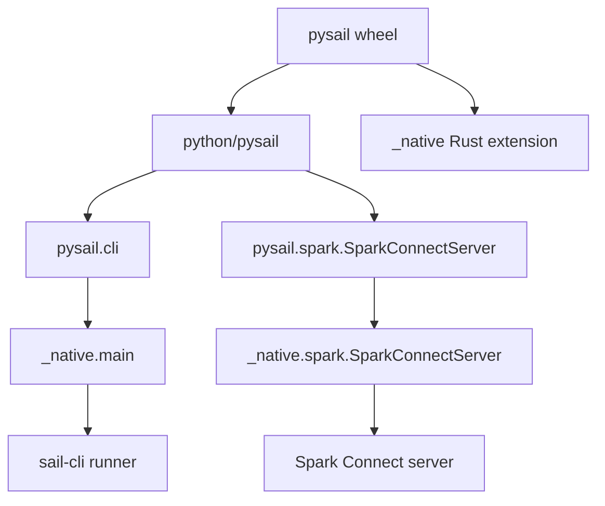
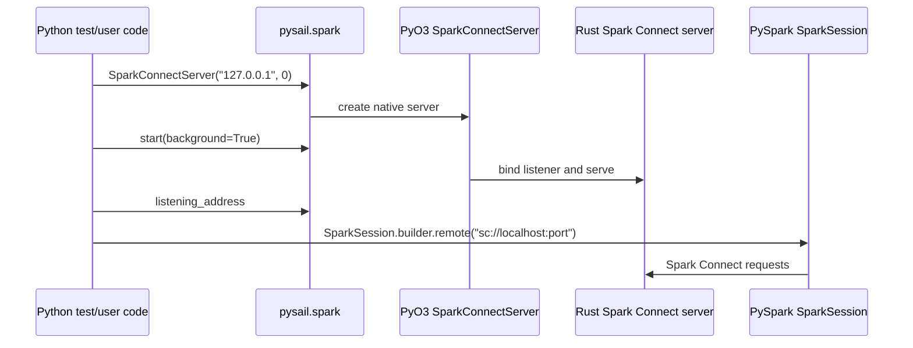
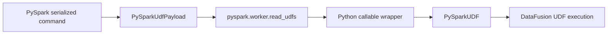
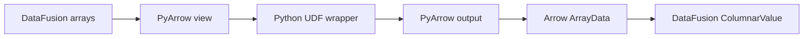
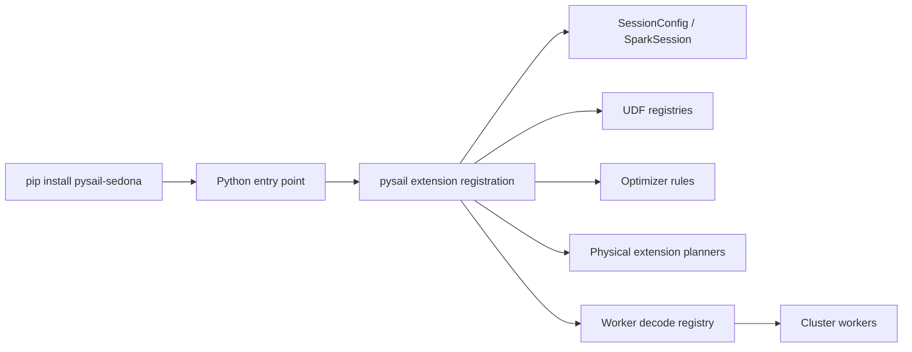

# Chapter 4: PySpark and pysail

PySpark is the user experience Sail tries to preserve. `pysail` is the Python package that makes Sail feel like something a Python developer can install, start, test, and use from ordinary PySpark code.

The design is intentionally asymmetric:

```text
PySpark remains the client API.
pysail starts and packages the Rust engine.
Spark Connect is the wire protocol between them.
```

That is why Sail can claim that no PySpark code rewrites are needed once the user connects to a Sail server. A PySpark program still imports `pyspark.sql.SparkSession`; the difference is the remote URL:

```python
from pyspark.sql import SparkSession

spark = SparkSession.builder.remote("sc://localhost:50051").getOrCreate()
spark.sql("SELECT 1 + 1").show()
```

The official PySpark entry point for this is [`SparkSession.builder.remote`](https://spark.apache.org/docs/latest/api/python/reference/pyspark.sql/api/pyspark.sql.SparkSession.builder.remote.html). Sail's job is to provide a compatible Spark Connect server at that address.

## The Main Files

| File | Role |
| --- | --- |
| `pyproject.toml` | Python package metadata, build backend, optional dependencies, test matrices |
| `python/pysail/spark/__init__.py` | Public Python wrapper for `SparkConnectServer` |
| `python/pysail/cli.py` and `python/pysail/__main__.py` | Python entry points into the Sail CLI |
| `crates/sail-python/src/lib.rs` | PyO3 `_native` module registration |
| `crates/sail-python/src/spark/server.rs` | Native Python class that starts the Spark Connect server |
| `crates/sail-python/src/globals.rs` | Global runtime, config, telemetry, and environment snapshot |
| `crates/sail-python-udf/*` | Python UDF, UDAF, UDTF, Pandas, and Arrow execution support |
| `crates/sail-plan/src/resolver/expression/udf.rs` | Converts Spark Connect inline Python UDFs into DataFusion UDF expressions |
| `python/pysail/tests/spark/conftest.py` | How Sail's own tests create a PySpark client connected to Sail |

The code divides into two worlds:

```text
User-facing Python package:
  pysail, pysail.spark, sail CLI

Engine-facing Rust/PyO3 bindings:
  _native module, SparkConnectServer, Python UDF runtime
```

## Package Shape

The Python package is defined in `pyproject.toml`.

It is named `pysail`, supports Python `>=3.10,<3.15`, and is built with `maturin`. That tells you the package is not pure Python. It ships a compiled Rust extension module:

```toml
[build-system]
requires = ["maturin>=1.0,<2.0"]
build-backend = "maturin"
```

The package entry point is:

```toml
[project.scripts]
sail = "pysail.cli:main"
```

So the installed `sail` command is a Python console script, but the Python script immediately delegates to Rust:

```python
from pysail import _native

def main():
    _native.main(sys.argv)
```

The native module is built by `crates/sail-python/src/lib.rs`:

```rust
#[pymodule]
fn _native(m: &Bound<'_, PyModule>) -> PyResult<()> {
    flight::register_module(m)?;
    spark::register_module(m)?;
    m.add_function(wrap_pyfunction!(cli::main, m)?)?;
    m.add("_SAIL_VERSION", env!("CARGO_PKG_VERSION"))?;
    Ok(())
}
```

That module exposes:

- `pysail._native.main`
- `pysail._native.spark.SparkConnectServer`
- Flight-related bindings
- `_SAIL_VERSION`

The package layout is a useful lesson in Rust/Python hybrid projects:



## Starting Sail From Python

The public Python wrapper is tiny:

```python
class SparkConnectServer:
    def __init__(self, ip: str = "127.0.0.1", port: int = 0) -> None:
        self._inner = _native.spark.SparkConnectServer(ip, port)

    def start(self, *, background=True) -> None:
        self._inner.start(background=background)

    def stop(self) -> None:
        self._inner.stop()

    @property
    def listening_address(self) -> tuple[str, int] | None:
        return self._inner.listening_address
```

The real work happens in Rust, in `crates/sail-python/src/spark/server.rs`.

The PyO3 class:

- loads `AppConfig`
- initializes or retrieves global runtime state
- binds a TCP listener
- starts the Spark Connect server
- records the actual listening address
- can run in the background or block the calling thread
- can shut down through a one-shot channel

The most important method is `start`:

```rust
let listener = self
    .runtime
    .primary()
    .block_on(TcpListener::bind(address))?;
self.state = Some(self.run(listener)?);
```

If the user passes port `0`, the OS chooses an available port. The actual address is exposed through `listening_address`. Sail's tests use exactly that:

```python
server = SparkConnectServer("127.0.0.1", 0)
server.start(background=True)
_, port = server.listening_address
yield f"sc://localhost:{port}"
server.stop()
```

That is the local development loop in one picture:



## The Global Runtime

`crates/sail-python/src/globals.rs` contains `GlobalState`.

This is where `pysail` creates a global Sail runtime and initializes telemetry. It uses `PyOnceLock` so initialization happens once per Python interpreter:

```rust
static GLOBALS: PyOnceLock<GlobalState> = PyOnceLock::new();
```

`GlobalState` contains:

- a `RuntimeManager`
- an `EnvironmentSnapshot`

The environment snapshot matters because Sail configuration is environment-variable driven. Some environment variables are effectively static once the runtime and telemetry have been initialized. If they change afterward, `pysail` warns that the changes are ignored.

This is one of those systems details that looks small but saves debugging time. Python users often set environment variables inside notebooks or test processes. Sail has to explain when that is too late.

```text
import pysail._native
  -> load AppConfig
  -> create runtime
  -> initialize telemetry
  -> snapshot Sail environment variables
```

## Releasing the GIL

When Python calls into Rust and Rust blocks, Python's global interpreter lock can prevent other Python code from running. That is dangerous for Sail because Python UDFs may need to run while the server is active.

The server code explicitly uses `Python::detach`.

In `SparkConnectServerState::wait`, the comment says the method should be called within `Python::detach`; otherwise, the GIL is not released and Python UDFs will be blocked when the server handles client requests.

The blocking CLI path does the same:

```rust
py.detach(move || {
    sail_cli::runner::main(args)
})
```

This is an important Rust/Python boundary rule:

```text
Long-running Rust server work should not hold the Python GIL.
```

Without that, Sail could start fine and then mysteriously deadlock or starve Python UDF execution.

## Connecting With PySpark

Sail's own tests show the intended user pattern in `python/pysail/tests/spark/conftest.py`:

```python
spark = SparkSession.builder.remote(remote).getOrCreate()
```

Then the test fixture configures the session:

```python
session.conf.set("spark.sql.session.timeZone", "UTC")
session.conf.set("spark.sql.ansi.enabled", "true")
session.conf.set("spark.sql.execution.arrow.pyspark.enabled", "true")
```

These are ordinary PySpark calls. They go through Spark Connect and reach Sail's config/session machinery. The fixture then tests Sail through the normal PySpark surface: SQL, DataFrames, functions, catalog calls, writes, UDFs, streaming, and lakehouse features.

The official PySpark reference documents the broader Spark SQL API at [pyspark.sql](https://spark.apache.org/docs/latest/api/python/reference/pyspark.sql/index.html), and the main API index notes that Spark SQL, Structured Streaming, and DataFrame-based MLlib support Spark Connect through the Python API surface.

The user sees:

```python
spark.range(10).where("id % 2 = 0").count()
```

Sail sees:

```text
Spark Connect relation tree
  -> Sail spec
  -> DataFusion logical plan
  -> DataFusion physical plan
  -> Arrow result batches
```

## pysail Is Not a PySpark Fork

This is subtle but central. `pysail` does not replace PySpark classes like `DataFrame`, `Column`, or `SparkSession`. It starts a server that PySpark can talk to.

That means compatibility is mostly tested at the protocol/API behavior level:

- Does PySpark emit a Spark Connect plan Sail can understand?
- Does Sail return the schema PySpark expects?
- Does Sail return Arrow batches PySpark can decode?
- Do errors look like Spark errors?
- Do config, UDF, catalog, write, and streaming operations behave like Spark?

This is why the test dependencies include `pyspark[connect]` in development and multiple Spark versions in test matrices:

```toml
[[tool.hatch.envs.test.matrix]]
spark = ["3.5.7", "4.0.1", "4.1.1"]
```

The engine is Sail. The client is still PySpark.

## Python UDFs Enter Through Spark Connect

PySpark UDFs are user-provided Python functions. In Spark Connect, the function is serialized into the request and sent to the server.

Sail resolves those inline Python UDFs in `crates/sail-plan/src/resolver/expression/udf.rs`.

The resolver receives a `spec::CommonInlineUserDefinedFunction`, extracts:

- function name
- determinism
- distinct flag
- arguments
- serialized function payload

Then it builds a `PySparkUdfPayload` and wraps it in a DataFusion `ScalarUDF` or `AggregateUDF`.

For scalar UDFs:

```rust
let udf = PySparkUDF::new(
    PySparkUdfKind::Batch,
    get_udf_name(name, &payload),
    payload,
    deterministic,
    input_types,
    function.output_type,
    self.config.pyspark_udf_config.clone(),
);
Ok(Expr::ScalarFunction(expr::ScalarFunction {
    func: Arc::new(ScalarUDF::from(udf)),
    args: arguments,
}))
```

For grouped aggregate UDFs, Sail creates a `PySparkGroupAggregateUDF` and returns a DataFusion aggregate expression.

The key idea is:

```text
Python function payload
  -> Sail UDF payload
  -> DataFusion ScalarUDF/AggregateUDF
  -> executable physical plan
```

The official PySpark UDF APIs are:

- [`pyspark.sql.functions.udf`](https://spark.apache.org/docs/latest/api/python/reference/pyspark.sql/api/pyspark.sql.functions.udf.html)
- [`pyspark.sql.functions.pandas_udf`](https://spark.apache.org/docs/latest/api/python/reference/pyspark.sql/api/pyspark.sql.functions.pandas_udf.html)
- [`pyspark.sql.functions.udtf`](https://spark.apache.org/docs/latest/api/python/reference/pyspark.sql/api/pyspark.sql.functions.udtf.html)
- [`pyspark.sql.DataFrame.mapInArrow`](https://spark.apache.org/docs/latest/api/python/reference/pyspark.sql/api/pyspark.sql.DataFrame.mapInArrow.html)

## UDF Kinds

`crates/sail-python-udf/src/udf/pyspark_udf.rs` defines the scalar UDF kinds Sail supports:

```rust
pub enum PySparkUdfKind {
    Batch,
    ArrowBatch,
    ScalarPandas,
    ScalarPandasIter,
    ScalarArrow,
    ScalarArrowIter,
}
```

The resolver maps Spark eval types to these internal UDF kinds:

| Spark/PySpark style | Sail internal kind | Python-side data shape |
| --- | --- | --- |
| regular row-oriented UDF | `Batch` | Python values |
| Arrow-optimized batch UDF | `ArrowBatch` | Arrow-backed batches |
| Pandas scalar UDF | `ScalarPandas` | `pandas.Series` |
| Pandas scalar iterator UDF | `ScalarPandasIter` | iterator of `pandas.Series` |
| Arrow scalar UDF | `ScalarArrow` | `pyarrow.Array` |
| Arrow scalar iterator UDF | `ScalarArrowIter` | iterator of `pyarrow.Array` |

The official PySpark docs describe these APIs from the user's point of view. Sail's code answers the engine question: what kind of object should DataFusion execute when such a function appears in a query plan?

## Loading a PySpark UDF Payload

`crates/sail-python-udf/src/cereal/pyspark_udf.rs` handles the serialized UDF payload format.

The payload builder writes:

- eval type
- selected Spark/PySpark config values
- input type metadata for some PySpark versions
- profiling flag
- argument offsets
- keyword argument names when supported
- the serialized Python command bytes

The payload loader calls into PySpark internals:

```rust
let serializer = PyModule::import(py, intern!(py, "pyspark.serializers"))?
    .getattr(intern!(py, "CPickleSerializer"))?
    .call0()?;
let tuple = PyModule::import(py, intern!(py, "pyspark.worker"))?
    .getattr(intern!(py, "read_udfs"))?
    .call1((serializer, infile, eval_type))?;
```

This is not an accident. To be compatible with PySpark UDF behavior, Sail reuses PySpark's own worker deserialization conventions. It wants the same Python wrapper behavior Spark users expect.



## Executing Python UDFs in Process

`PySparkUDF` implements DataFusion's `ScalarUDFImpl`.

When DataFusion invokes it, Sail:

1. Converts DataFusion `ColumnarValue` arguments into Arrow arrays.
2. Attaches to Python.
3. Lazily loads or reuses the Python UDF wrapper.
4. Converts Arrow arrays to Python objects using PyArrow bridges.
5. Calls the Python function wrapper.
6. Converts the result back to Arrow `ArrayData`.
7. Casts it to the declared output type.

The core execution path is:

```rust
let args: Vec<ArrayRef> = ColumnarValue::values_to_arrays(&args)?;
let udf = Python::attach(|py| self.udf(py))?;
let data = Python::attach(|py| -> PyUdfResult<_> {
    let output = udf.call1(py, (args.try_to_py(py)?, number_rows))?;
    Ok(ArrayData::try_from_py(py, &output)?)
})?;
let array = cast(&make_array(data), &self.output_type)?;
Ok(ColumnarValue::Array(array))
```

That differs from JVM Spark. In JVM Spark, Python UDF execution typically involves a Python worker process and serialization between JVM and Python. Sail's Python UDF runs in the same process as the Rust execution engine, and Arrow memory can be shared through PyArrow bindings.

The Sail UDF performance docs summarize the motivation: use Pandas or Arrow UDFs when possible so wrapper overhead is amortized over batches, and use Arrow-native UDFs for the most direct Arrow sharing.



## Python Conversion Code

The Python helper module embedded in Rust is `crates/sail-python-udf/src/python/spark.py`.

It contains conversion wrappers for:

- scalar Python values
- Pandas UDFs
- Arrow UDFs
- grouped map functions
- co-grouped map functions
- table functions
- Arrow table functions
- UDTF analysis

The Rust side loads that Python code from an embedded string:

```rust
const MODULE_SOURCE_CODE: &str = include_str!("spark.py");
```

Then `PySpark::module` initializes it once through a `PyOnceLock`.

This is a nice pattern: Sail can ship its Python-side UDF helpers inside the Rust extension module, so it does not need to locate a separate Python file at runtime.

## Config for Python UDF Behavior

`PySparkUdfConfig` captures the Spark/PySpark settings that affect Python UDF behavior:

- session time zone
- Pandas grouped map column assignment
- safe Arrow conversion
- Arrow max records per batch
- Pandas conversion toggles
- int-to-decimal coercion
- binary-as-bytes behavior

It can also emit key-value pairs that PySpark's worker code understands:

```rust
"spark.sql.session.timeZone"
"spark.sql.execution.arrow.maxRecordsPerBatch"
"spark.sql.execution.pyspark.binaryAsBytes"
```

This shows another compatibility layer. The same Python function may behave differently depending on Spark configuration. Sail has to carry those settings from Spark Connect session state into the UDF payload and wrapper.

## UDTFs and Python-Side Analysis

PySpark UDTFs can have an `analyze` static method. The official [`udtf`](https://spark.apache.org/docs/latest/api/python/reference/pyspark.sql/api/pyspark.sql.functions.udtf.html) documentation describes this as Python-side analysis that can return a dynamic schema.

Sail has hooks for this in `crates/sail-python-udf/src/python/spark.rs`:

```rust
pub fn analyze_udtf<'py>(
    py: Python<'py>,
    handler: Bound<'py, PyAny>,
    arguments: Bound<'py, PyAny>,
) -> PyResult<Bound<'py, PyAny>> {
    Self::module(py)?
        .getattr(intern!(py, "analyze_udtf"))?
        .call1((handler, arguments))
}
```

This matters because analysis happens before physical execution. A UDTF may determine its output schema from argument types or literal values. That means Python code can participate in planning, not just execution.

For the extension proposal, this is a preview of a broader rule:

```text
Extensions may need hooks before execution starts.
```

## Python Data Sources

Spark Connect can register Python data sources. Sail handles `RegisterDataSource` in `crates/sail-spark-connect/src/service/plan_executor.rs`.

The handler extracts the pickled Python data source class and registers a session-scoped `PythonTableFormat` in the `TableFormatRegistry`:

```rust
let format = Arc::new(PythonTableFormat::with_pickled_class(name.clone(), command));
registry.register(format)
```

This is parallel to Python UDF registration:

```text
Python behavior arrives through Spark Connect
  -> Sail stores it in session-scoped registry
  -> later scans can resolve and execute it
```

The important architectural point is session isolation. A registered Python data source belongs to that session's table format registry, not a global singleton shared by all users.

## Testing PySpark Compatibility

Sail's Python tests are themselves a guide to compatibility.

The fixture in `python/pysail/tests/spark/conftest.py` either uses `SPARK_REMOTE` or starts a local Sail Spark Connect server. Then it creates a normal PySpark session:

```python
SparkSession.builder.remote(remote).getOrCreate()
```

The tests cover:

- DataFrame behavior
- SQL behavior
- catalog behavior
- joins, aggregation, ordering, sampling, repartitioning
- functions
- Python UDFs, Pandas UDFs, Arrow UDFs, UDTFs
- data sources
- writes
- streaming
- Delta and Iceberg behavior
- TPC-H, TPC-DS, ClickBench plans/results

The test matrix explicitly checks different PySpark versions. That is because Spark Connect is a moving protocol and PySpark's UDF behavior evolves. Sail has to track both API surface and wire behavior.

## Why PySpark Versions Matter

The UDF payload builder contains version-specific logic:

```rust
let pyspark_version = get_pyspark_version()?;
...
if matches!(pyspark_version, PySparkVersion::V4_1)
    && matches!(eval_type, spec::PySparkUdfType::ArrowBatched)
{
    let schema_json = build_input_types_json(input_types)?;
    ...
}
```

That is a concrete example of why "Spark compatible" is not a single target. Spark 3.5, Spark 4.0, and Spark 4.1 differ in function support, UDF payload details, UDTF behavior, Arrow APIs, and type handling.

`pyproject.toml` reflects this with test dependencies and test matrices for multiple Spark versions.

## What pysail Means for Extensions

Discussion #2001 proposes Python entry points such as:

```toml
[project.entry-points."pysail.extensions"]
sedona = "pysail_sedona:register"
```

This is a natural Python packaging experience:

```bash
pip install pysail pysail-sedona
```

Then, when `pysail` starts, it could discover installed extension packages and register them.

But this chapter should make the hard parts clear.

First, discovery is Python-level, but most extension hooks are Rust/DataFusion-level:

```text
Python entry point
  -> Rust extension registration
  -> DataFusion UDFs, optimizer rules, extension planners, codecs
```

Second, version coupling is strict. A Python wheel that exposes Rust extension objects must match Sail's `arrow`, `datafusion`, `pyo3`, and `pysail` versions. Rust trait objects are not a stable plugin ABI across arbitrary crate versions.

Third, worker execution must see the same extension behavior. Installing an extension in the client Python environment is not enough if cluster workers cannot decode the physical plan or reconstruct extension UDFs.

Fourth, analysis must work too. If a PySpark client asks for schema or explain output before execution, the extension must be registered before `analyze_plan` resolves the query.



The pleasant user story is Pythonic. The engine story is Rust and distributed.

## A Small End-to-End Example

Suppose the user writes:

```python
from pyspark.sql import SparkSession
from pyspark.sql.functions import udf
from pyspark.sql.types import IntegerType

spark = SparkSession.builder.remote("sc://localhost:50051").getOrCreate()

@udf(returnType=IntegerType())
def plus_one(x):
    return None if x is None else x + 1

spark.range(3).select(plus_one("id")).show()
```

Sail's path is:

```text
PySpark creates Spark Connect relation containing inline Python UDF
  -> sail-spark-connect converts relation to Sail spec
  -> PlanResolver resolves CommonInlineUserDefinedFunction
  -> PySparkUdfPayload is built
  -> PySparkUDF becomes a DataFusion ScalarUDF
  -> DataFusion physical plan executes
  -> PySparkUDF invokes Python wrapper in process
  -> output Arrow array returns to DataFusion
  -> Spark Connect streams ArrowBatch results to PySpark
```

This is the whole Sail philosophy in miniature: keep the PySpark surface, translate through Spark Connect, execute in Rust/DataFusion/Arrow, and invoke Python only where Python semantics are actually needed.

## Reading Exercises

1. Read `python/pysail/spark/__init__.py`.
   - Notice how small the public wrapper is.
   - Find the `listening_address` property.

2. Read `crates/sail-python/src/spark/server.rs`.
   - Follow `new`, `start`, `run`, and `stop`.
   - Find where `Python::detach` is used.

3. Read `crates/sail-python/src/globals.rs`.
   - Follow global runtime initialization.
   - Find environment-variable warning behavior.

4. Read `python/pysail/tests/spark/conftest.py`.
   - Follow the `remote` fixture.
   - Find `SparkSession.builder.remote`.
   - Note which Spark config values tests set by default.

5. Read `crates/sail-plan/src/resolver/expression/udf.rs`.
   - Trace a scalar UDF from Spark Connect spec to DataFusion `ScalarUDF`.
   - Trace a grouped aggregate UDF to `AggregateUDF`.

6. Read `crates/sail-python-udf/src/udf/pyspark_udf.rs`.
   - Find `PySparkUdfKind`.
   - Follow `invoke_with_args`.

7. Read `crates/sail-python-udf/src/cereal/pyspark_udf.rs`.
   - Find payload build and load.
   - Notice the PySpark version-specific logic.

8. Read `crates/sail-python-udf/src/python/spark.py`.
   - Skim the converter classes.
   - Find how Pandas and Arrow wrappers shape Python execution.

## Chapter Takeaways

`pysail` is the Python package that makes Sail usable from Python, but PySpark remains the primary user API. `pysail` starts and packages a Rust Spark Connect server. PySpark connects to that server using `SparkSession.builder.remote`.

Python UDF support is where the layers meet most dramatically. PySpark serializes Python functions into Spark Connect plans. Sail turns those payloads into DataFusion UDFs. Execution invokes Python in process and exchanges Arrow memory through PyArrow bridges. Pandas and Arrow UDFs amortize Python overhead over batches, while Arrow-native functions can share Arrow data most directly.

For extensions, Python packaging gives an attractive discovery story, but the actual extension hooks must reach Rust planning, DataFusion execution, and distributed worker decoding. The final extension architecture has to make that Python-to-Rust bridge explicit.

The next chapter moves into Apache Arrow itself: arrays, schemas, record batches, IPC, PyArrow bridges, Arrow Flight, and why columnar memory is the common currency between Spark Connect, DataFusion, Python UDFs, and Sail's distributed shuffle.
