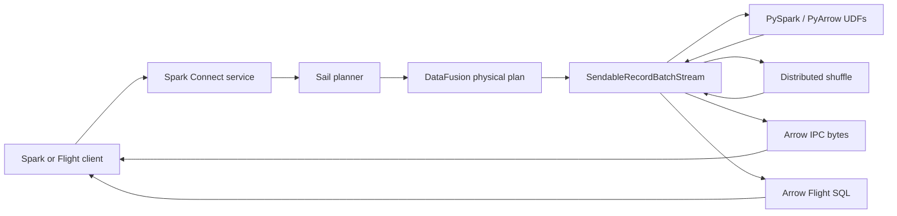
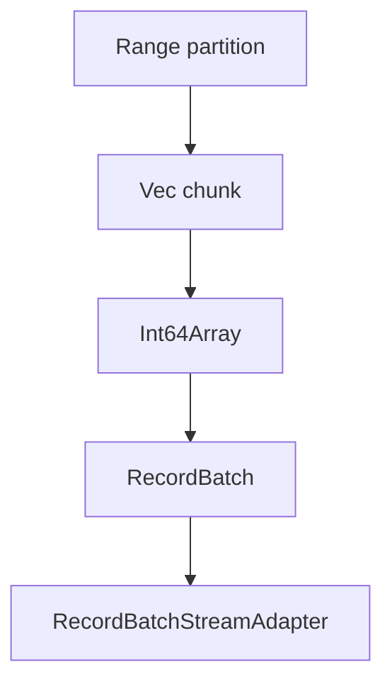
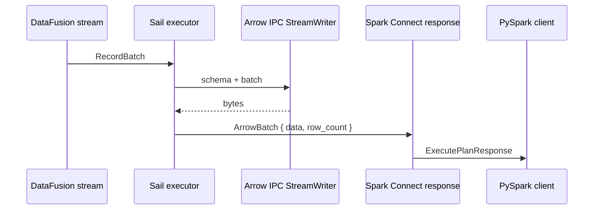
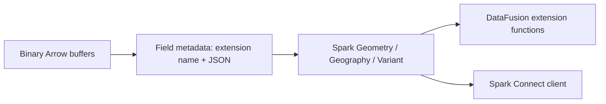
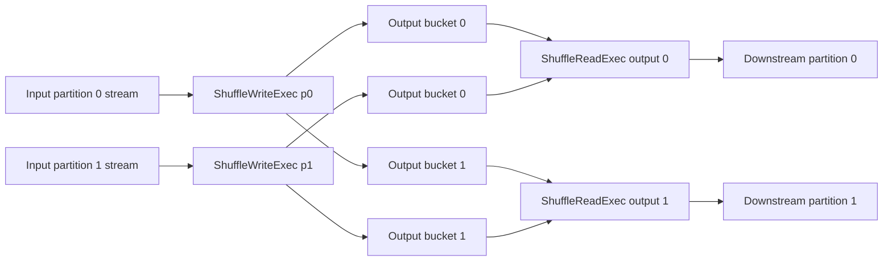
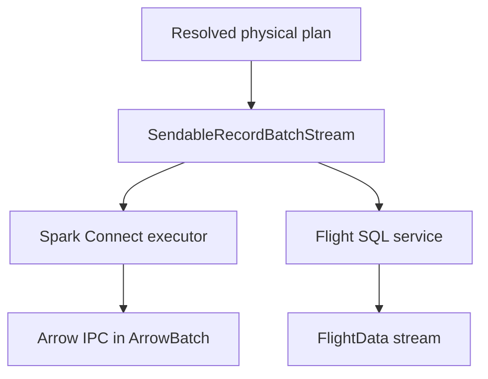
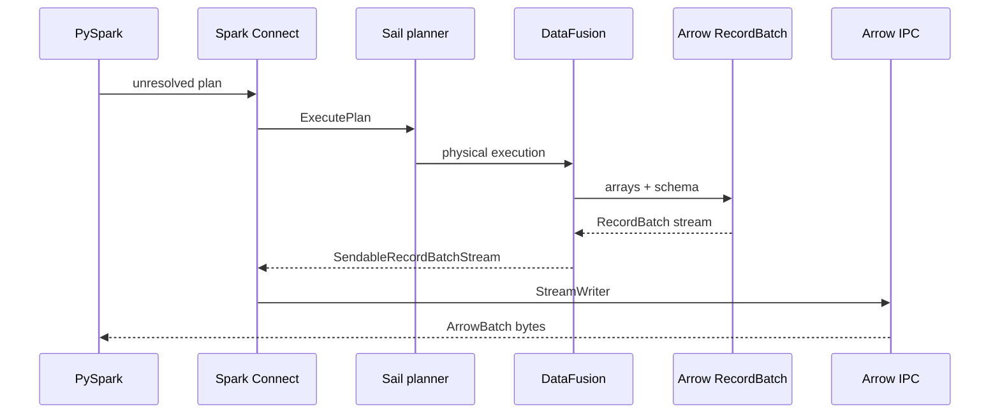

# Chapter 5: Apache Arrow

Apache Arrow is the data plane hiding in plain sight throughout Sail.

Spark Connect gives Sail a protocol for receiving unresolved Spark plans and
returning results to Spark clients. DataFusion gives Sail an optimizer and an
execution engine. PySpark compatibility gives Sail a Python surface area. The
distributed runtime gives Sail a way to split work across workers. Arrow is the
format that lets those pieces hand data to each other without constantly
reinterpreting rows.

In Sail, Arrow is not merely an output serialization format. It is the shape of
execution itself:

- DataFusion physical plans produce `RecordBatch` streams.
- Spark Connect responses carry Arrow IPC payloads.
- Python UDFs convert Rust Arrow arrays to PyArrow arrays and back.
- Shuffle partitions batches into per-task streams.
- Flight SQL encodes `SendableRecordBatchStream` as Arrow Flight data.
- Extension types preserve domain semantics such as geometry, geography, and
  variants.

This chapter is about learning Arrow through Sail's code. We will use the
official Arrow documentation as the reference vocabulary, then map that
vocabulary to the concrete Rust modules that make Sail work.

## Definitive References

Keep these open while reading the chapter:

- [Apache Arrow Columnar Format](https://arrow.apache.org/docs/format/Columnar.html)
- [Arrow Flight RPC protocol](https://arrow.apache.org/docs/format/Flight.html)
- [PyArrow documentation](https://arrow.apache.org/docs/python/)
- [PyArrow RecordBatch API](https://arrow.apache.org/docs/python/generated/pyarrow.RecordBatch.html)
- [DataFusion gentle Arrow introduction](https://datafusion.apache.org/user-guide/arrow-introduction.html)

The Arrow columnar format specification is the most important one. It defines
the memory layout, data types, schemas, record batches, and IPC messages. The
Flight specification explains the network layer built on Arrow IPC and gRPC.
The PyArrow documentation matters because Sail crosses the Rust/Python boundary
for PySpark UDFs.

## Where Arrow Lives In Sail

Here are the main code paths for this chapter:

| Area | Files | Arrow role |
|---|---|---|
| Spark Connect result streaming | `crates/sail-spark-connect/src/executor.rs` | Converts `RecordBatch` values into Spark Connect `ArrowBatch` messages using Arrow IPC |
| Spark schema conversion | `crates/sail-spark-connect/src/proto/data_type_arrow.rs` | Maps Arrow fields and data types back to Spark Connect data types |
| Python UDF conversion | `crates/sail-python-udf/src/conversion.rs` | Converts Rust Arrow objects to/from PyArrow objects |
| PySpark UDF execution | `crates/sail-python-udf/src/udf/pyspark_udf.rs` | Invokes Python functions with Arrow arrays and receives Arrow data |
| Distributed shuffle write | `crates/sail-execution/src/plan/shuffle_write.rs` | Partitions `RecordBatch` streams into shuffle outputs |
| Distributed shuffle read | `crates/sail-execution/src/plan/shuffle_read.rs` | Opens shuffle locations and merges `RecordBatch` streams |
| Arrow Flight SQL | `crates/sail-flight/src/service.rs` | Serves DataFusion output streams over Flight SQL |
| Physical plan examples | `crates/sail-physical-plan/src/range.rs` | Builds batches from Arrow arrays |
| Row round-robin repartition | `crates/sail-physical-plan/src/repartition.rs` | Uses Arrow compute kernels to split batches |
| GeoArrow extension type | `crates/sail-common/src/geoarrow/extension.rs` | Defines Arrow extension metadata for WKB geometry/geography |

The short version is:



Arrow is the contract between almost every box in that diagram.

## The Arrow Mental Model

Arrow is a columnar memory format. A table is not stored as a sequence of row
objects. It is stored as arrays, one array per column, with a schema describing
the column names, logical types, nullability, metadata, and nested structure.

The key types you see in Sail are:

| Rust type | Meaning in Sail |
|---|---|
| `ArrayRef` | Shared reference to an immutable Arrow array |
| `ArrayData` | Low-level array buffers and metadata, useful at FFI boundaries |
| `DataType` | Arrow logical type such as `Int64`, `Utf8`, `Struct`, `Map`, `Timestamp` |
| `Field` | One named column, including data type, nullability, and metadata |
| `Schema` | Ordered collection of fields plus schema metadata |
| `SchemaRef` | Shared `Arc<Schema>` |
| `RecordBatch` | Equal-length arrays plus a schema; the basic execution unit |
| `RecordBatchStream` | Async stream of `RecordBatch` values |
| `SendableRecordBatchStream` | Boxed, pinned, sendable DataFusion batch stream |

The official Arrow format documentation describes a record batch as an ordered
collection of arrays with the same length, described by a schema. DataFusion's
Arrow introduction adds the execution intuition: a `RecordBatch` is columnar
inside, but externally it behaves like a row chunk that can be streamed,
partitioned, and scheduled.

That dual nature explains why Arrow fits distributed query processing so well:

- Vectorized operators can process contiguous column arrays.
- The scheduler can move work in batch-sized units.
- Network protocols can serialize batches without inventing a new row format.
- Python UDFs can receive arrays instead of per-row Python objects.
- Metadata can carry logical semantics beyond the physical storage type.

## Why `Arc` Shows Up Everywhere

In Sail's Rust code, Arrow objects are usually wrapped in `Arc`.

For example, `SchemaRef` is an `Arc<Schema>`, and `ArrayRef` is an `Arc<dyn
Array>`. This reflects the Arrow memory model: arrays are immutable once built,
so it is cheap and safe to share them across operators, streams, and async
tasks.

When a physical operator needs to produce a new batch, it usually creates new
array references and a shared schema:

```rust
let id_array: ArrayRef = Arc::new(Int64Array::from(x));
let batch = RecordBatch::try_new(projected_schema.clone(), vec![id_array])?;
```

That pattern appears in `RangeExec` in
`crates/sail-physical-plan/src/range.rs`. The range source partitions a numeric
range, builds an `Int64Array` for each chunk, then wraps the chunks in
`RecordBatch` values.

The important lesson is that Sail does not need an internal row object for this
operator. The execution unit is already Arrow-native:



## RecordBatch As The Unit Of Execution

Most query engines have a concept like "a batch of rows." In Sail, that concept
is concretely Arrow's `RecordBatch`.

Look at the signature of DataFusion physical execution:

```rust
fn execute(
    &self,
    partition: usize,
    context: Arc<TaskContext>,
) -> Result<SendableRecordBatchStream>
```

This shape appears across Sail physical plan nodes. A plan node is executed for
one output partition, and the result is a stream of Arrow batches. Sail can then
compose operators by chaining streams.

`RangeExec` is a good first example:

1. Validate the requested partition.
2. Compute that partition's range values.
3. Chunk values into `RANGE_BATCH_SIZE`.
4. Build Arrow arrays.
5. Build `RecordBatch` values.
6. Return a `RecordBatchStreamAdapter`.

The same type shows up at much larger boundaries:

- Spark Connect's `ExecutorTaskContext` owns a `SendableRecordBatchStream`.
- Shuffle write consumes a `SendableRecordBatchStream`.
- Shuffle read returns a `SendableRecordBatchStream`.
- Flight SQL stores and later encodes a `SendableRecordBatchStream`.
- Python UDF execution turns `ColumnarValue` values into Arrow arrays.

Once you learn to recognize `SendableRecordBatchStream`, you can follow data
through Sail.

## Spark Connect Output: Arrow IPC In Protobuf Clothing

Spark Connect uses Protobuf messages for the control protocol, but tabular
results are encoded as Arrow batches.

In `crates/sail-spark-connect/src/executor.rs`, the executor has this batch
enum:

```rust
pub enum ExecutorBatch {
    ArrowBatch(ArrowBatch),
    SqlCommandResult(Box<SqlCommandResult>),
    ...
    Schema(Box<DataType>),
    Complete,
}
```

For query output, the important variants are:

- `Schema(Box<DataType>)`
- `ArrowBatch(ArrowBatch)`
- `Complete`

The executor first converts the DataFusion stream schema into a Spark schema:

```rust
let schema = to_spark_schema(context.stream.schema())?;
let out = ExecutorOutput::new(ExecutorBatch::Schema(Box::new(schema)));
```

Then it repeatedly reads Arrow `RecordBatch` values from the stream:

```rust
while let Some(batch) = context.next().await? {
    let batch = to_arrow_batch(&batch)?;
    let out = ExecutorOutput::new(ExecutorBatch::ArrowBatch(batch));
    tx.send(out).await?;
}
```

The conversion to Spark Connect's `ArrowBatch` is compact:

```rust
pub(crate) fn to_arrow_batch(batch: &RecordBatch) -> SparkResult<ArrowBatch> {
    let mut output = ArrowBatch::default();
    {
        let cursor = Cursor::new(&mut output.data);
        let mut writer = StreamWriter::try_new(cursor, batch.schema().as_ref())?;
        writer.write(batch)?;
        output.row_count += batch.num_rows() as i64;
        writer.finish()?;
    }
    Ok(output)
}
```

This is Arrow IPC streaming format. The official Arrow columnar documentation
describes IPC streams as schema followed by record batch messages and optional
dictionary batches. Sail uses `StreamWriter` to produce that payload and stores
the bytes inside Spark Connect's `ArrowBatch.data`.

The relationship looks like this:



The executor also sends empty batches in two cases:

- As a heartbeat when no batch arrives before the configured interval.
- As an output placeholder when a query produces no rows.

That is why `ExecutorTaskContext::next` can return
`RecordBatch::new_empty(self.stream.schema())`. The stream contract remains
Arrow-shaped even when the batch contains zero rows.

## Schema Conversion: Arrow Back To Spark Types

Sail must speak Arrow internally and Spark externally. The conversion from Arrow
types to Spark Connect types lives in
`crates/sail-spark-connect/src/proto/data_type_arrow.rs`.

The central conversion is:

```rust
impl TryFrom<adt::DataType> for DataType
```

It maps Arrow types such as:

- `adt::DataType::Boolean` -> Spark `Boolean`
- `adt::DataType::Int32` -> Spark `Integer`
- `adt::DataType::Int64` -> Spark `Long`
- `adt::DataType::Utf8` -> Spark `String`
- `adt::DataType::Date32` -> Spark `Date`
- `adt::DataType::Struct(fields)` -> Spark `Struct`
- `adt::DataType::List(field)` -> Spark `Array`
- `adt::DataType::Map(field, _)` -> Spark `Map`

The code also documents where the mapping is lossy or constrained. For example,
Spark `Char` or `VarChar` may become Arrow string-like data and then come back
as Spark `String`. Timestamp precision is another important compatibility
choice: the conversion accepts microsecond timestamps and rejects other timestamp
units in several branches.

This is a crucial extension lesson. Arrow is a strong physical and logical
format, but it is not identical to Spark's type system. If an extension needs
Spark-specific semantics, it must preserve them deliberately, often through:

- logical plan metadata,
- Arrow field metadata,
- Arrow extension types,
- or explicit conversion rules.

## Extension Types: GeoArrow And Variant

Arrow supports extension types: a field can have a physical storage type plus
metadata that names a higher-level logical meaning.

Sail already uses this idea in `crates/sail-common/src/geoarrow/extension.rs`:

```rust
pub struct GeoArrowWkbType {
    pub metadata: GeoArrowMetadata,
}

impl GeoArrowWkbType {
    pub const NAME: &'static str = "geoarrow.wkb";
}
```

The extension stores geometry/geography values as binary WKB, while metadata
captures CRS and edge semantics:

```rust
pub struct GeoArrowMetadata {
    pub edges: Option<GeoArrowEdges>,
    pub crs: Option<GeoArrowCrs>,
}
```

The storage type check is strict:

```rust
match data_type {
    DataType::Binary | DataType::LargeBinary | DataType::BinaryView => Ok(()),
    data_type => Err(...),
}
```

Then the Spark Connect type conversion recognizes this extension:

```rust
} else if extension_type_name == Some(GeoArrowWkbType::NAME) {
    let ext = field.try_extension_type::<GeoArrowWkbType>()?;
    let meta: SparkGeoMetadata = ext.metadata.try_into()?;
    ...
}
```

Sail maps GeoArrow metadata to Spark geometry or geography. If `edges` is
present, Sail treats the value as geography. If `edges` is absent, it treats the
value as geometry. CRS metadata becomes Spark SRID values for supported CRS
strings.

The same file recognizes `parquet_variant_compute::VariantType`, mapping that
Arrow extension to Spark `Variant`.

This is the most concrete preview of the final extensions chapter. An extension
does not have to invent a new internal data plane. It can often use Arrow's
existing storage plus extension metadata:



That architecture keeps data compatible with Arrow tooling while preserving
domain meaning.

## PyArrow: The Python Boundary

The Python side of Sail depends heavily on Arrow because PySpark UDFs should not
have to receive rows one Python object at a time.

The conversion layer in `crates/sail-python-udf/src/conversion.rs` uses the
`arrow_pyarrow` crate:

```rust
use arrow_pyarrow::{FromPyArrow, ToPyArrow};
```

Sail implements `TryToPy` for:

- `&DataType`
- slices of `DataType`
- slices of `ArrayRef`
- `Vec<ArrayRef>`
- `&Schema`
- `SchemaRef`
- `RecordBatch`

And it implements `TryFromPy` for:

- `ArrayData`
- `RecordBatch`

For arrays, the conversion uses the underlying Arrow `ArrayData`:

```rust
self.iter()
    .map(|x| x.into_data().to_pyarrow(py))
    .collect::<PyResult<Vec<_>>>()
```

That is a big deal. It means Sail is intentionally crossing the language
boundary with Arrow arrays, not with ad hoc serialized Python values.

The UDF invocation path in `crates/sail-python-udf/src/udf/pyspark_udf.rs`
makes that practical:

```rust
let args: Vec<ArrayRef> = ColumnarValue::values_to_arrays(&args)?;
let output = udf.call1(py, (args.try_to_py(py)?, number_rows))?;
let data = ArrayData::try_from_py(py, &output)?;
let array = cast(&make_array(data), &self.output_type)?;
```

The steps are:

1. Convert DataFusion `ColumnarValue` arguments to Arrow arrays.
2. Convert those Arrow arrays into PyArrow objects.
3. Call the Python function.
4. Convert the returned PyArrow object back into Arrow `ArrayData`.
5. Wrap it as an Arrow array.
6. Cast it to the declared output type.

The official PyArrow `RecordBatch` API is useful for understanding the Python
objects Sail is interoperating with. PyArrow exposes schemas, columns, row
counts, zero-copy slices, filters, `take`, conversion from arrays, and IPC
serialization methods. Sail's Rust side uses the same conceptual model, but
with Rust ownership and type checks.

## UDF Kinds And Arrow-Native Execution

The PySpark UDF kind enum includes several execution modes:

```rust
pub enum PySparkUdfKind {
    Batch,
    ArrowBatch,
    ScalarPandas,
    ScalarPandasIter,
    ScalarArrow,
    ScalarArrowIter,
}
```

The comment in the code calls out Spark 4.0 Arrow-native scalar UDF types. The
important distinction is:

- Pandas UDFs use Arrow as an efficient transport to and from Pandas.
- Arrow-native UDFs can pass Arrow arrays more directly.

From an engine architecture perspective, this is exactly the direction Sail
wants. Every conversion into Python objects costs time and memory. Every
operator that can remain Arrow-native preserves vectorization and avoids
unnecessary row materialization.

The performance guide at `docs/guide/udf/performance.md` makes the same point:
Arrow UDFs avoid copying data into row-oriented Python objects and let the Rust
engine and Python function share Arrow data through the Arrow/PyArrow boundary.

## Distributed Shuffle: Arrow As The Exchange Unit

Distributed query processing needs exchanges. A join, aggregation, sort, or
repartition may require data from one set of workers to move to another set of
workers.

In Sail, the exchange unit is still `RecordBatch`.

The write side is `crates/sail-execution/src/plan/shuffle_write.rs`.
`ShuffleWriteExec` wraps an input physical plan and a desired output
partitioning. When `execute` is called for an input partition, it:

1. Opens one sink per shuffle output location.
2. Executes the child plan for the input partition.
3. Reads `RecordBatch` values from the child stream.
4. Partitions each batch by hash or row round-robin.
5. Writes partitioned batches to the corresponding sinks.
6. Closes the sinks.
7. Returns an empty batch stream as the execution result.

The core loop is:

```rust
while let Some(batch) = stream.next().await {
    let batch = batch?;
    let mut partitions: Vec<Option<RecordBatch>> = vec![None; partition_sinks.len()];
    partitioner.partition(batch, |p, batch| {
        partitions[p] = Some(batch);
        Ok(())
    })?;
    ...
}
```

The read side is `crates/sail-execution/src/plan/shuffle_read.rs`.
`ShuffleReadExec` has a set of read locations for each output partition. When
executed, it opens all relevant task streams and merges them:

```rust
let futures = locations
    .iter()
    .map(|location| reader.open(location, schema.clone()));
let streams = try_join_all(futures).await?;
Ok(Box::pin(MergedRecordBatchStream::new(schema, streams)))
```

That gives downstream operators a normal `SendableRecordBatchStream` again.
The shuffle itself is an implementation detail hidden between write and read
nodes.



Notice the absence of a Sail-specific row format. The shuffle API talks in
task stream locations, but the payload remains Arrow batches.

## Row Round-Robin Repartition

Hash partitioning can delegate to DataFusion's `BatchPartitioner`. Sail also
has a row round-robin partitioner in
`crates/sail-physical-plan/src/repartition.rs`.

The logic is a useful Arrow lesson:

```rust
let schema = batch.schema();
let mut indices = vec![Vec::new(); self.num_partitions];
for row_index in 0..batch.num_rows() {
    let partition = (self.next_idx + row_index) % self.num_partitions;
    indices[partition].push(row_index as u32);
}
...
let indices_array: PrimitiveArray<UInt32Type> = partition_indices.into();
let columns = take_arrays(batch.columns(), &indices_array, None)?;
let partition_batch =
    RecordBatch::try_new_with_options(schema.clone(), columns, &options)?;
```

Sail does not loop over cells and rebuild rows. It builds an Arrow array of row
indices and uses Arrow compute's `take_arrays` to select rows from every column.
The output is one `RecordBatch` per non-empty destination partition.

This is the practical meaning of vectorized execution: even operations that are
row-directed can often be implemented as array operations.

## Flight SQL: Arrow On The Network

Sail also exposes a Flight SQL service in `crates/sail-flight/src/service.rs`.
The official Arrow Flight protocol describes Flight as an RPC framework for
high-performance Arrow data services, built on gRPC and Arrow IPC. It is
organized around streams of Arrow record batches, with metadata methods for
discovering and retrieving streams.

That maps cleanly to Sail's service.

For a SQL statement, `get_flight_info_statement`:

1. Parses the SQL string.
2. Converts it to Sail's plan representation.
3. Resolves and executes the plan.
4. Gets a `SendableRecordBatchStream`.
5. Stores the stream under a query handle.
6. Returns `FlightInfo` with a ticket.

Then `do_get_statement`:

1. Decodes the ticket into a query handle.
2. Removes the stored stream from state.
3. Reads the stream schema.
4. Encodes the stream with `FlightDataEncoderBuilder`.
5. Returns the encoded Flight data stream.

The encoding step is:

```rust
let output = FlightDataEncoderBuilder::new()
    .with_schema(schema)
    .build(output)
    .map(|result| result.map_err(|e| Status::internal(format!("encoding error: {e}"))));
```

The same DataFusion output can therefore leave Sail through two different
protocol doors:



This is a powerful architectural property. Sail's execution engine does not
need separate data representations for Spark Connect and Flight SQL. Protocols
wrap the same Arrow stream abstraction.

## Arrow IPC Versus Flight

It is easy to blur Arrow IPC and Arrow Flight. Sail uses both, so it helps to
separate them:

| Concept | In Arrow | In Sail |
|---|---|---|
| In-memory format | Column buffers, validity bitmaps, offsets, schemas | `ArrayRef`, `SchemaRef`, `RecordBatch` |
| IPC stream/file format | Serialized schema, dictionaries, record batches | Spark Connect `ArrowBatch.data` via `StreamWriter` |
| Flight | gRPC service protocol carrying Arrow data streams | `SailFlightSqlService` with `FlightDataEncoderBuilder` |
| PyArrow bridge | Python implementation of Arrow data structures | `arrow_pyarrow` conversions for UDFs |

Think of it this way:

- Arrow memory format is how data exists while operators work.
- Arrow IPC is how batches are serialized.
- Arrow Flight is a service protocol for discovering and transferring streams.
- PyArrow is Python's Arrow implementation and API surface.

Sail benefits because these layers are designed to compose.

## A Small End-To-End Example

Imagine a PySpark client runs:

```python
spark.range(0, 5).selectExpr("id + 10 as value").collect()
```

The high-level flow is:

1. PySpark builds an unresolved Spark Connect plan.
2. Spark Connect sends that plan to Sail.
3. Sail resolves it into its internal plan representation.
4. DataFusion physical execution creates a `SendableRecordBatchStream`.
5. A source such as `RangeExec` produces an Arrow `Int64Array`.
6. Projection produces another Arrow array for `value`.
7. The executor reads each `RecordBatch`.
8. `StreamWriter` encodes each batch as Arrow IPC bytes.
9. Spark Connect returns `ArrowBatch` messages to the client.
10. The client decodes Arrow batches into Spark result rows.

The data path can be described without a single row class:



That is the central architecture of Sail result execution.

## What Arrow Does Not Solve By Itself

Arrow gives Sail a powerful data representation, but it does not solve every
problem.

Arrow does not decide:

- how Spark logical plans should map to DataFusion plans,
- how distributed tasks should be scheduled,
- how shuffle locations should be assigned,
- how Python worker lifetimes should be managed,
- how Spark-only semantics should survive type conversion,
- how extension packages should be loaded,
- how security and sandboxing should work for user code.

Those are Sail architecture problems. Arrow is the shared data language that
makes the solutions simpler and faster.

This distinction matters for extensions. An extension proposal should not merely
say "use Arrow." It should identify:

- the Arrow storage type,
- the Arrow metadata or extension name,
- the DataFusion logical and physical expressions,
- the Spark Connect type mapping,
- the PyArrow/Python behavior,
- the distributed shuffle compatibility story,
- and the protocol boundary behavior.

## Extension Design Pattern: Arrow-First Semantics

The GeoArrow code suggests a reusable pattern for future extensions:

1. Choose an Arrow physical representation.
2. Define metadata that captures the logical semantics.
3. Implement validation for allowed storage types.
4. Teach Spark Connect schema conversion to recognize the extension.
5. Add DataFusion expressions and functions that operate on the Arrow layout.
6. Preserve metadata through projections, UDFs, shuffle, and output protocols.
7. Add Python wrappers that expose the same semantics through PyArrow.

For example, a geospatial extension can store WKB as `Binary` and use
`geoarrow.wkb` metadata for CRS and edge semantics. A variant extension can
store variant-encoded bytes and preserve logical type identity with an Arrow
extension name. A machine-learning vector extension might store
`FixedSizeList<Float32>` plus metadata for dimension and metric assumptions.

The best extensions feel native to Arrow rather than bolted onto it.

## Common Mistakes When Learning Arrow In Sail

### Mistake 1: Thinking `RecordBatch` Means Row-Oriented

A `RecordBatch` is a batch of rows from the outside, but internally it is
columnar. Operators should usually work column-by-column.

### Mistake 2: Treating Schema Metadata As Decoration

Schema and field metadata can carry compatibility-critical information. Sail's
UDT and GeoArrow conversions depend on metadata to recover Spark semantics.

### Mistake 3: Copying Data At Language Boundaries

Python integration should use PyArrow whenever possible. Converting every row
into Python objects defeats the point of using a columnar engine.

### Mistake 4: Forgetting Empty Batches

Empty batches are still meaningful. They carry schema, heartbeats, and protocol
state. Sail's Spark Connect executor intentionally emits empty batches in some
cases.

### Mistake 5: Ignoring Unsupported Type Mappings

Arrow and Spark type systems overlap but are not identical. Unsupported units,
dictionary encodings, unions, and lossy string-like conversions must be handled
explicitly.

## Reading Exercise: Follow One Batch

To build intuition, trace one `RecordBatch` through the code:

1. Start in `crates/sail-physical-plan/src/range.rs`.
2. Find the `Int64Array::from(x)` call.
3. Follow the `RecordBatch::try_new` call.
4. Find where plan execution returns `SendableRecordBatchStream`.
5. Jump to `crates/sail-spark-connect/src/executor.rs`.
6. Find `while let Some(batch) = context.next().await?`.
7. Follow `to_arrow_batch`.
8. Look at `StreamWriter::try_new`, `writer.write`, and `writer.finish`.

Then repeat the exercise for Flight SQL:

1. Start in `crates/sail-flight/src/service.rs`.
2. Find `service.runner().execute(&ctx, plan)`.
3. Follow the stored stream into `SailFlightSqlState`.
4. Find `do_get_statement`.
5. Follow `FlightDataEncoderBuilder`.

After these two traces, you will understand the two biggest Arrow output paths
in Sail.

## Reading Exercise: Follow One Python UDF

For Python UDFs:

1. Start in `crates/sail-python-udf/src/udf/pyspark_udf.rs`.
2. Find `ColumnarValue::values_to_arrays`.
3. Follow `args.try_to_py(py)`.
4. Jump to `crates/sail-python-udf/src/conversion.rs`.
5. Find the `TryToPy` implementation for `&[ArrayRef]`.
6. Follow `into_data().to_pyarrow(py)`.
7. Return to `invoke_with_args`.
8. Follow `ArrayData::try_from_py`.
9. Observe the final `cast(&make_array(data), &self.output_type)`.

This is the Arrow/PyArrow bridge in miniature.

## How This Prepares Us For DataFusion

The next chapter can now talk about DataFusion with the right foundation.
DataFusion is not just a planner that happens to use Arrow. Its physical
operators, stream interfaces, expression evaluation, partitioning, and UDF APIs
are designed around Arrow batches.

When Sail adds Spark compatibility on top of DataFusion, it repeatedly answers
one question:

> How do we preserve Spark semantics while keeping the data path Arrow-native?

That question appears in:

- schema conversion,
- physical plan construction,
- Spark-specific expressions,
- Python UDF execution,
- shuffle exchanges,
- and future extension APIs.

## Takeaways

Apache Arrow is Sail's data plane. The most important concrete type is
`RecordBatch`, and the most important execution abstraction is
`SendableRecordBatchStream`.

Spark Connect wraps Arrow IPC bytes in Protobuf responses. Flight SQL wraps
Arrow streams in the Flight protocol. PySpark UDFs cross the Rust/Python
boundary through PyArrow. Distributed shuffle partitions and merges Arrow batch
streams. Extension types use Arrow metadata to carry domain-specific logical
meaning without abandoning Arrow compatibility.

Once you see Sail as a system that plans Spark-compatible queries but executes
Arrow-native streams, the architecture becomes much easier to reason about.
