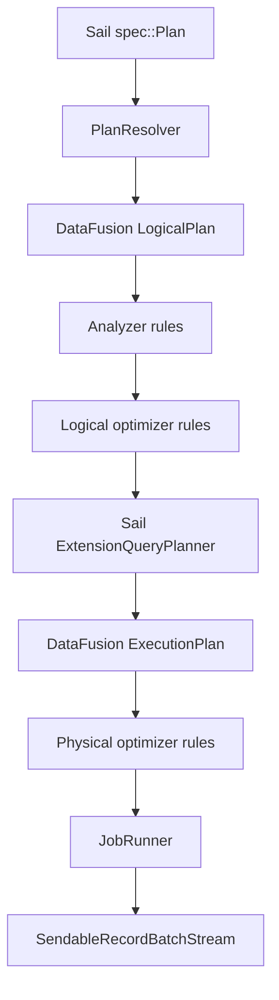
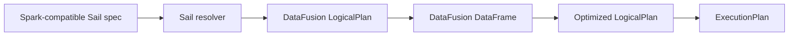
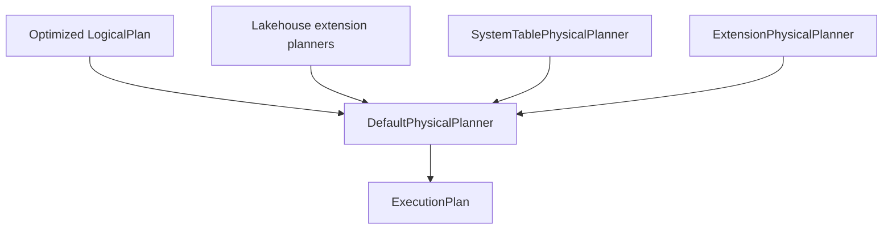
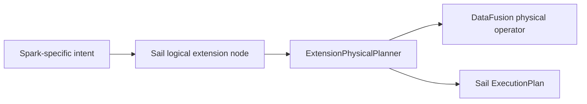
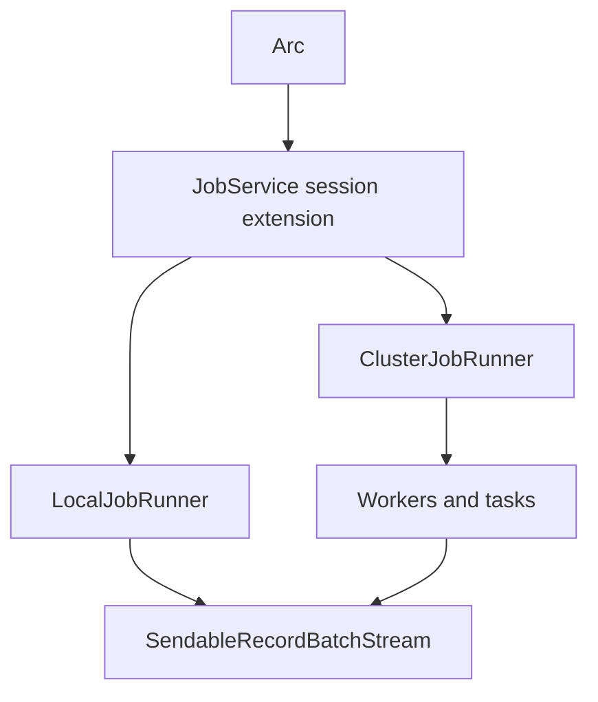

# Chapter 6: Apache DataFusion

DataFusion is Sail's execution kernel.

Spark Connect gives Sail the client protocol. PySpark gives Sail a familiar
Python API. Arrow gives Sail the in-memory format. DataFusion gives Sail the
query engine: logical plans, expressions, optimizers, physical planning,
partitioned execution, vectorized functions, file format integration, and
`RecordBatch` streams.

Sail is not a thin wrapper around DataFusion, though. Sail is a Spark-compatible
system built on DataFusion. That distinction matters. Spark compatibility
requires Spark-shaped plans, Spark function semantics, Spark catalog behavior,
Spark error behavior, Spark UDF behavior, Spark streaming concepts, and a
distributed execution model. DataFusion supplies the engine primitives; Sail
supplies the Spark interpretation and the distributed control plane.

The question for this chapter is:

> How does Sail turn Spark-compatible plans into DataFusion execution without
> losing Spark semantics?

## Definitive References

Keep these references nearby:

- [DataFusion introduction](https://datafusion.apache.org/user-guide/introduction.html)
- [DataFusion library user guide](https://datafusion.apache.org/library-user-guide/index.html)
- [Building logical plans](https://datafusion.apache.org/library-user-guide/building-logical-plans.html)
- [Using the DataFrame API](https://datafusion.apache.org/library-user-guide/using-the-dataframe-api.html)
- [Adding user-defined functions](https://datafusion.apache.org/library-user-guide/functions/adding-udfs.html)
- [Extending operators](https://datafusion.apache.org/library-user-guide/extending-operators.html)
- [Query optimizer](https://datafusion.apache.org/library-user-guide/query-optimizer.html)
- [ExecutionPlan API docs](https://docs.rs/datafusion/latest/datafusion/physical_plan/trait.ExecutionPlan.html)
- [QueryPlanner API docs](https://docs.rs/datafusion/latest/datafusion/execution/context/trait.QueryPlanner.html)

The DataFusion introduction describes DataFusion as an extensible Rust query
engine using Arrow's in-memory format. That one sentence captures why Sail can
exist: DataFusion is fast enough and flexible enough to serve as the execution
core for a Spark-compatible system.

Sail currently depends on DataFusion `53.1.0` in the workspace `Cargo.toml`.
The exact APIs will evolve, but the architectural ideas in this chapter are
stable: session state, logical plans, optimizer rules, physical plans,
extension planners, and Arrow batch streams.

## Where DataFusion Lives In Sail

The main files for this chapter are:

| Area | Files | DataFusion role |
|---|---|---|
| Plan resolution and execution | `crates/sail-plan/src/lib.rs` | Converts Sail specs to DataFusion logical plans, optimizes them, and creates physical plans |
| Session construction | `crates/sail-session/src/session_factory/server.rs` | Builds `SessionConfig`, `SessionState`, runtime env, rules, query planner, and Sail session extensions |
| Custom query planner | `crates/sail-session/src/planner.rs` | Installs extension physical planners and maps Sail logical extension nodes to physical operators |
| Session extension helper | `crates/sail-common-datafusion/src/extension.rs` | Provides typed access to DataFusion session extensions from `SessionContext`, `SessionState`, and `TaskContext` |
| Logical extension nodes | `crates/sail-logical-plan/src/*.rs` | Defines Sail-specific logical nodes such as range, repartition, barrier, map partitions, and streaming nodes |
| Physical extension nodes | `crates/sail-physical-plan/src/*.rs` | Implements custom `ExecutionPlan` nodes |
| Physical optimizer rules | `crates/sail-physical-optimizer/src/*.rs` | Adds or adjusts DataFusion physical optimization behavior |
| Spark function mapping | `crates/sail-plan/src/function/*.rs` | Maps Spark function names and semantics to DataFusion expressions and UDFs |
| Function kernels | `crates/sail-function/src/*.rs` | Implements vectorized DataFusion UDFs for Spark-compatible functions |
| Table functions | `crates/sail-plan/src/function/table/range.rs` | Implements DataFusion `TableFunctionImpl` and `TableProvider` patterns |

The short version:



DataFusion owns the core plan abstractions in the middle. Sail owns the
translation into those abstractions and the custom nodes around the edges.

## The Critical Function: `resolve_and_execute_plan`

The most compact tour of Sail's DataFusion integration is
`crates/sail-plan/src/lib.rs`.

The key function is:

```rust
pub async fn resolve_and_execute_plan(
    ctx: &SessionContext,
    config: Arc<PlanConfig>,
    plan: spec::Plan,
) -> PlanResult<(Arc<dyn ExecutionPlan>, Vec<StringifiedPlan>)>
```

This is the bridge from Sail's Spark-compatible plan spec to a DataFusion
physical plan. It performs these steps:

1. Create a `PlanResolver`.
2. Resolve the Sail `spec::Plan` into a named DataFusion `LogicalPlan`.
3. Store the initial logical plan for explain output.
4. Ask the `SessionContext` to execute the logical plan into a `DataFrame`.
5. Pull the `SessionState` and logical plan back out of the `DataFrame`.
6. Run DataFusion logical optimization.
7. Rewrite streaming plans if necessary.
8. Use the session's query planner to create a physical plan.
9. Rename physical output fields if Spark field names require it.
10. Store the final physical plan for explain output.

In code:

```rust
let resolver = PlanResolver::new(ctx, config);
let NamedPlan { plan, fields } = resolver.resolve_named_plan(plan).await?;
let df = execute_logical_plan(ctx, plan).await?;
let (session_state, plan) = df.into_parts();
let plan = session_state.optimize(&plan)?;
let plan = session_state
    .query_planner()
    .create_physical_plan(&plan, &session_state)
    .await?;
```

This is a beautiful little funnel:



The `DataFrame` step may look surprising. Sail already has a logical plan, so
why ask the context to execute it into a DataFrame and then split it apart?
Because `SessionContext::execute_logical_plan` lets DataFusion apply its normal
session machinery: analyzer behavior, catalog/function binding, and context
state. Sail then takes back the plan and drives the rest of the pipeline.

## `SessionContext`, `SessionState`, And `SessionConfig`

DataFusion's session types are the engine's ambient context:

- `SessionConfig` stores configuration options and extension objects.
- `SessionState` stores the config, runtime env, optimizer rules, function
  registries, catalog state, and query planner.
- `SessionContext` is the user-facing handle around session state.
- `TaskContext` is the execution-time context available to physical operators.

Sail constructs these deliberately in
`crates/sail-session/src/session_factory/server.rs`.

The server session factory creates a `SessionContext` like this:

```rust
fn create(&mut self, info: ServerSessionInfo) -> Result<SessionContext> {
    let state = self.create_session_state(&info)?;
    let context = SessionContext::new_with_state(state);
    context.state_ref().write().register_udaf(first_value_udaf())?;
    Ok(context)
}
```

The registration of `first_value_udaf` is a telling detail. Sail does not simply
enable all DataFusion defaults. It builds a session with selected behavior and
then patches in assumptions required by its chosen optimizer rules.

The session config contains Sail services as DataFusion extensions:

```rust
SessionConfig::new()
    .with_create_default_catalog_and_schema(false)
    .with_information_schema(false)
    .with_extension(create_table_format_registry()?)
    .with_extension(Arc::new(create_catalog_manager(...)?))
    .with_extension(Arc::new(ActivityTracker::new()))
    .with_extension(Arc::new(JobService::new(job_runner)))
    .with_extension(Arc::new(RepartitionBufferConfig::new(...)))
    .with_extension(Arc::new(self.create_system_table_service(info)?))
    .with_extension(Arc::new(DeltaTableCache::default()));
```

That list is a capsule summary of Sail's architecture:

- Sail manages catalogs itself.
- Sail manages table formats itself.
- Sail tracks session activity.
- Sail installs a job service.
- Sail controls repartition buffering.
- Sail exposes system tables.
- Sail caches Delta table state.

DataFusion supplies the typed extension slot. Sail uses it as session-local
dependency injection.

## Typed Session Extensions

The helper in `crates/sail-common-datafusion/src/extension.rs` makes DataFusion
extensions feel typed:

```rust
pub trait SessionExtension: Send + Sync + 'static {
    fn name() -> &'static str;
}

pub trait SessionExtensionAccessor {
    fn extension<T: SessionExtension>(&self) -> Result<Arc<T>>;
    fn runtime_env(&self) -> Arc<RuntimeEnv>;
}
```

Sail implements `SessionExtensionAccessor` for:

- `SessionContext`
- `SessionState`
- `&dyn Session`
- `TaskContext`

That matters because different parts of the engine are at different layers:

- Planning code often has `SessionContext` or `SessionState`.
- Table providers receive `&dyn Session`.
- Physical operators receive `TaskContext`.

The same pattern works everywhere:

```rust
let service = ctx.extension::<JobService>()?;
let registry = session_state.extension::<TableFormatRegistry>()?;
let config = task_context.extension::<RepartitionBufferConfig>()?;
```

This is one of Sail's cleanest Rust patterns. DataFusion gives an untyped
extension store; Sail wraps it with a trait that produces a useful error and a
typed `Arc<T>`.

For the extension proposal later in the book, this pattern is a key precedent.
Third-party integrations will need a way to store per-session services and
configuration. Sail already has the mechanism; the open question is how to make
registration public, ordered, discoverable, and distributed-safe.

## Sail's Query Planner

DataFusion lets a session install a custom query planner. Sail does this in
`ServerSessionFactory::create_session_state`:

```rust
let builder = SessionStateBuilder::new()
    .with_config(config)
    .with_runtime_env(runtime)
    .with_analyzer_rules(default_analyzer_rules())
    .with_optimizer_rules(default_optimizer_rules())
    .with_physical_optimizer_rules(get_physical_optimizers(...))
    .with_query_planner(new_query_planner());
```

`new_query_planner` returns `ExtensionQueryPlanner` from
`crates/sail-session/src/planner.rs`.

That planner is small, but strategically important:

```rust
impl QueryPlanner for ExtensionQueryPlanner {
    async fn create_physical_plan(
        &self,
        logical_plan: &LogicalPlan,
        session_state: &SessionState,
    ) -> Result<Arc<dyn ExecutionPlan>> {
        let mut extension_planners = new_lakehouse_extension_planners();
        extension_planners.push(Arc::new(SystemTablePhysicalPlanner));
        extension_planners.push(Arc::new(ExtensionPhysicalPlanner));
        let planner = DefaultPhysicalPlanner::with_extension_planners(extension_planners);
        planner.create_physical_plan(&logical_plan, session_state).await
    }
}
```

This is Sail's physical planning strategy:

1. Use DataFusion's `DefaultPhysicalPlanner`.
2. Add extension planners for lakehouse tables.
3. Add an extension planner for system tables.
4. Add Sail's own catch-all extension planner.

DataFusion still handles normal logical plan nodes: projections, filters,
aggregates, joins, sorts, limits, scans, and so on. Sail handles custom logical
extension nodes that DataFusion does not know how to plan.



The extension proposal in discussion #2001 wants to generalize this seam. Today the
list is hard-coded. A third-party extension API would let packages add their
own extension planners without editing Sail core.

## Logical Extension Nodes

DataFusion has built-in logical plan nodes, but it also supports user-defined
logical nodes. Sail uses those for Spark concepts that do not map directly to a
single built-in DataFusion logical plan node.

`RangeNode` in `crates/sail-logical-plan/src/range.rs` is the friendliest
example:

```rust
pub struct RangeNode {
    range: Range,
    num_partitions: usize,
    schema: DFSchemaRef,
}
```

It implements `UserDefinedLogicalNodeCore`:

```rust
impl UserDefinedLogicalNodeCore for RangeNode {
    fn name(&self) -> &str {
        "Range"
    }

    fn inputs(&self) -> Vec<&LogicalPlan> {
        vec![]
    }

    fn schema(&self) -> &DFSchemaRef {
        &self.schema
    }
}
```

The node carries:

- Spark range parameters,
- target partition count,
- and a DataFusion schema.

It is logical because it says what should happen, not yet how to produce the
Arrow batches.

Other Sail logical extension nodes include:

- `ExplicitRepartitionNode`
- `BarrierNode`
- `MapPartitionsNode`
- `ShowStringNode`
- `SchemaPivotNode`
- `SortWithinPartitionsNode`
- `SparkPartitionIdNode`
- streaming source/filter/limit/collector nodes
- file write/delete and row-level write nodes

These nodes are Spark compatibility pressure made visible. When Spark semantics
fit DataFusion's built-in logical plan, Sail uses DataFusion's built-in logical
plan. When they do not, Sail introduces a logical extension node and teaches the
physical planner what to do with it.

## Physical Extension Planning

`ExtensionPhysicalPlanner` is the function table from Sail logical extension
nodes to physical execution nodes.

For `RangeNode`, it builds `RangeExec`:

```rust
if let Some(node) = node.as_any().downcast_ref::<RangeNode>() {
    let schema = UserDefinedLogicalNode::schema(node).inner().clone();
    let projection = (0..schema.fields().len()).collect();
    Arc::new(RangeExec::try_new(
        node.range().clone(),
        node.num_partitions(),
        schema,
        projection,
    )?)
}
```

For `MapPartitionsNode`, it uses the physical input and wraps it in
`MapPartitionsExec`:

```rust
let [input] = physical_inputs else {
    return internal_err!("MapPartitionsExec requires exactly one physical input");
};
Arc::new(MapPartitionsExec::new(
    input.clone(),
    node.udf().clone(),
    UserDefinedLogicalNode::schema(node).inner().clone(),
))
```

For `SortWithinPartitionsNode`, it does not need a custom physical operator. It
uses DataFusion's `SortExec` with `preserve_partitioning`:

```rust
let sort = SortExec::new(ordering, input.clone())
    .with_fetch(node.fetch())
    .with_preserve_partitioning(true);
Arc::new(sort)
```

This is the architectural sweet spot:

- Use custom logical nodes to preserve Spark intent.
- Use built-in DataFusion physical operators whenever they already match.
- Use custom Sail physical operators only when necessary.



The result is less code than a from-scratch engine, but more semantic control
than a simple SQL translation layer.

## Physical Plans And `ExecutionPlan`

DataFusion physical operators implement `ExecutionPlan`. The most important
method is:

```rust
fn execute(
    &self,
    partition: usize,
    context: Arc<TaskContext>,
) -> Result<SendableRecordBatchStream>
```

You saw this in Chapter 5, but now we can place it in DataFusion's architecture.
An `ExecutionPlan` describes a partitioned physical computation. It knows its
schema, children, properties, partitioning, boundedness, and how to execute one
partition.

Sail custom physical nodes follow the same contract. `RangeExec`:

1. Checks the partition number.
2. Computes a partition-specific range.
3. Builds Arrow arrays and batches.
4. Returns a `RecordBatchStreamAdapter`.

`ExplicitRepartitionExec`:

1. Wraps an input plan.
2. Creates output channels per target partition.
3. Executes all input partitions cooperatively.
4. Sends partitioned `RecordBatch` values to receivers.
5. Returns a stream for the requested output partition.

`ShuffleWriteExec` and `ShuffleReadExec` in `sail-execution` also implement the
same contract, which is why the distributed runtime can insert them into a
DataFusion physical plan. DataFusion's abstraction is local and partitioned;
Sail's distributed planner can split it into stages and reconnect it with
shuffle nodes.

## Plan Properties: Partitioning, Boundedness, Emission

DataFusion physical plans carry `PlanProperties`. Sail uses those properties
carefully because distributed execution depends on them.

For example, `RangeExec` creates:

```rust
PlanProperties::new(
    EquivalenceProperties::new(projected_schema.clone()),
    Partitioning::RoundRobinBatch(num_partitions),
    EmissionType::Both,
    Boundedness::Bounded,
)
```

That tells the optimizer and scheduler:

- the output schema's equivalence properties,
- the number and kind of output partitions,
- whether the operator emits incrementally or finally,
- and whether it is bounded.

`ShuffleWriteExec` uses different properties. It returns an empty stream from
`execute`, but the side effect is writing shuffle data. Its properties reflect
the input partition count rather than the shuffle output count, because each
input partition execution writes many shuffle output streams.

These details matter. A distributed engine cannot safely insert exchanges,
coalesce partitions, reorder joins, or execute streaming plans unless physical
operators accurately describe themselves.

## Logical Optimizers

Sail installs analyzer and optimizer rules in
`crates/sail-session/src/optimizer.rs`:

```rust
pub fn default_analyzer_rules() -> Vec<Arc<dyn AnalyzerRule + Send + Sync>> {
    sail_logical_optimizer::default_analyzer_rules()
}

pub fn default_optimizer_rules() -> Vec<Arc<dyn OptimizerRule + Send + Sync>> {
    let rules = sail_logical_optimizer::default_optimizer_rules();
    let mut custom = sail_plan_lakehouse::lakehouse_optimizer_rules();
    custom.extend(
        rules
            .into_iter()
            .filter(|r| r.name() != "push_down_leaf_projections"),
    );
    custom
}
```

Two things are happening here:

1. Sail delegates most rule construction to `sail_logical_optimizer`.
2. Sail prepends lakehouse optimizer rules and filters out one built-in-style
   rule by name.

The test asserts that `expand_row_level_op` runs first. That is a Spark and
lakehouse semantic requirement: row-level operations such as MERGE/DELETE/UPDATE
must be expanded before generic optimizers obscure the structure needed for
correct planning.

This is an important DataFusion lesson: optimizer rule order is part of engine
semantics. For extensions, "add my optimizer rule" is not sufficient. The API
must answer where it runs, what it can assume, and which rules it must precede
or follow.

## Physical Optimizers

Sail also customizes physical optimization in
`crates/sail-physical-optimizer/src/lib.rs`.

The rule list includes DataFusion's standard physical optimizer rules in the
same order, then adds Sail-specific rules:

```rust
rules.push(Arc::new(RewriteExplicitRepartition::new()));
rules.push(Arc::new(RewriteCollectLeftHashJoin::new()));
rules.push(Arc::new(EnforceBarrierPartitioning::new()));
rules.push(Arc::new(SanityCheckPlan::new()));
```

The test compares Sail's rule order with DataFusion's default physical optimizer
to ensure Sail does not accidentally reorder DataFusion defaults.

`RewriteExplicitRepartition` is a good example. During physical planning, Sail
creates an `ExplicitRepartitionExec` placeholder. Later, the physical optimizer
rewrites it:

- hash partitioning -> DataFusion `RepartitionExec`
- unknown partitioning to one partition -> `CoalescePartitionsExec`
- unknown partitioning to fewer partitions -> Sail `CoalesceExec`
- unknown partitioning to at least the input partition count -> remove the node
- round-robin -> keep Sail's explicit repartition node

Why not decide all of that immediately in the physical planner? Because the
optimizer sees the larger physical plan and can make a more context-aware
choice. This keeps planning declarative and lets rewrite rules simplify the
physical plan after DataFusion has done its own work.

`EnforceBarrierPartitioning` is another distributed-execution hint. It rewrites
`BarrierExec` preconditions so all precondition partitions complete before the
actual plan begins. That behavior matters for Spark-like commands where one
operation must finish globally before another starts.

## Function Mapping: Spark Names To DataFusion Expressions

Spark has a large function surface. DataFusion has its own function surface.
Sail sits in between.

The function registry in `crates/sail-plan/src/function/mod.rs` collects
built-in scalar, generator, aggregate, table, and window functions:

```rust
lazy_static! {
    pub static ref BUILT_IN_SCALAR_FUNCTIONS: HashMap<&'static str, ScalarFunction> =
        HashMap::from_iter(scalar::list_built_in_scalar_functions());
    pub static ref BUILT_IN_GENERATOR_FUNCTIONS: HashMap<&'static str, ScalarFunction> =
        HashMap::from_iter(generator::list_built_in_generator_functions());
    pub static ref BUILT_IN_TABLE_FUNCTIONS: HashMap<&'static str, Arc<TableFunction>> =
        HashMap::from_iter(table::list_built_in_table_functions());
}
```

The type alias for scalar planning functions is:

```rust
pub(crate) type ScalarFunction =
    Arc<dyn Fn(ScalarFunctionInput) -> PlanResult<expr::Expr> + Send + Sync>;
```

This means Sail's "function registry" is not only a map from name to UDF. It is
a map from Spark function name to a small planning function that can:

- validate argument count,
- inspect Spark planning config,
- use the current schema,
- rewrite arguments,
- call a DataFusion built-in,
- call a Sail UDF,
- or construct a larger expression tree.

For simple cases, `ScalarFunctionBuilder::udf` wraps a `ScalarUDFImpl`:

```rust
pub fn udf<F>(f: F) -> ScalarFunction
where
    F: ScalarUDFImpl + Send + Sync + 'static,
{
    let func = ScalarUDF::from(f);
    Arc::new(move |input| Ok(func.call(input.arguments)))
}
```

For more complex Spark functions, Sail uses custom builders that produce
DataFusion expressions directly. This planning-time layer is one of the main
places Spark semantics are preserved.

## Vectorized UDFs

The DataFusion UDF documentation explains that scalar UDFs are vectorized: they
receive Arrow arrays and return Arrow arrays. Sail's function kernels follow
that model.

`SparkMask` in `crates/sail-function/src/scalar/string/spark_mask.rs` implements
`ScalarUDFImpl`:

```rust
impl ScalarUDFImpl for SparkMask {
    fn name(&self) -> &str {
        "spark_mask"
    }

    fn signature(&self) -> &Signature {
        &self.signature
    }

    fn return_type(&self, arg_types: &[DataType]) -> Result<DataType> {
        ...
    }

    fn invoke_with_args(&self, args: ScalarFunctionArgs) -> Result<ColumnarValue> {
        ...
    }
}
```

The return type function is a planning/type-checking hook. The
`invoke_with_args` function is the execution hook. It receives `ColumnarValue`
arguments, which may be scalar values or Arrow arrays.

The `Explode` function in `crates/sail-function/src/scalar/explode.rs` shows a
different pattern:

```rust
fn invoke_with_args(&self, _: ScalarFunctionArgs) -> Result<ColumnarValue> {
    plan_err!(
        "{} should be rewritten during logical plan analysis",
        self.name()
    )
}
```

`explode` is represented like a function for analysis, but it should not execute
as a normal scalar UDF. It must be rewritten into a plan shape that can expand
rows. This is a good example of Spark semantics not fitting a plain expression
kernel.

## Table Functions And Providers

DataFusion table functions return `TableProvider` objects. Sail's range table
function in `crates/sail-plan/src/function/table/range.rs` is a small complete
example.

`RangeTableFunction` implements `TableFunctionImpl`:

```rust
impl TableFunctionImpl for RangeTableFunction {
    fn call(&self, args: &[Expr]) -> Result<Arc<dyn TableProvider>> {
        ...
        let node = RangeNode::try_new("id".to_string(), start, end, step, num_partitions)?;
        Ok(Arc::new(RangeTableProvider {
            node: Arc::new(node),
        }))
    }
}
```

The provider exposes both a logical and physical path:

```rust
fn get_logical_plan(&self) -> Option<Cow<'_, LogicalPlan>> {
    Some(Cow::Owned(LogicalPlan::Extension(
        logical_plan::Extension {
            node: self.node.clone(),
        },
    )))
}

async fn scan(...) -> Result<Arc<dyn ExecutionPlan>> {
    Ok(Arc::new(RangeExec::try_new(...)?))
}
```

This is a useful pattern for extension authors:

- If the planner wants a logical plan, provide a logical extension node.
- If DataFusion asks for a scan directly, provide an `ExecutionPlan`.
- Keep the shared semantic payload in a small node object.

Range is simple, but the shape generalizes to custom table-valued functions,
specialized data sources, and extension-backed virtual tables.

## DataFusion As Local Engine, Sail As Distributed Engine

DataFusion's `ExecutionPlan` API is partitioned and asynchronous, but DataFusion
itself is not Sail's whole distributed runtime. Sail builds a distributed layer
around DataFusion physical plans.

The boundary is visible in `ServerSessionFactory::create_job_runner`:

```rust
let job_runner: Box<dyn JobRunner> = match self.config.mode {
    ExecutionMode::Local => Box::new(LocalJobRunner::new()),
    ExecutionMode::LocalCluster => Box::new(ClusterJobRunner::new(...)),
    ExecutionMode::KubernetesCluster => Box::new(ClusterJobRunner::new(...)),
};
```

`JobService` is placed in `SessionConfig` as an extension. Later, Spark Connect
and Flight SQL can retrieve it from the session and execute a physical plan.

This separation is one of Sail's strongest design choices:

- DataFusion plans and executes partitioned operators.
- Sail decides whether those operators run locally or as a distributed job.
- The same logical and physical plan pipeline feeds both modes.



The next chapters will zoom into that distributed layer. For now, remember that
DataFusion's physical plan is the unit Sail distributes.

## Spark Semantics On A DataFusion Kernel

Sail's DataFusion integration repeatedly follows this pattern:

1. Resolve Spark/Sail input into a DataFusion-compatible plan.
2. Preserve Spark-only semantics in extension nodes or metadata.
3. Let DataFusion optimize and plan what it understands.
4. Intercept extension nodes with custom planners.
5. Implement missing execution behavior with custom `ExecutionPlan` nodes.
6. Return Arrow batch streams to the protocol layer.

Some examples:

| Spark/Sail concept | DataFusion integration |
|---|---|
| Spark range | `RangeNode` -> `RangeExec` |
| Spark repartition/coalesce | `ExplicitRepartitionNode` -> `ExplicitRepartitionExec` -> physical optimizer rewrite |
| Sort within partitions | logical extension -> DataFusion `SortExec` with preserved partitioning |
| Spark built-in functions | planning registry -> DataFusion expressions or Sail `ScalarUDFImpl` |
| Spark generator functions | analyzed as functions, then rewritten into plan structure |
| Catalog commands | logical command nodes -> `CatalogCommandExec` |
| Lakehouse row-level operations | lakehouse optimizer rules before generic optimizer rules |
| System tables | system table extension planner and `TableProvider` |

That table is the heart of the chapter. Sail is not asking DataFusion to become
Spark. Sail is using DataFusion as a powerful substrate and adding Spark
compatibility at well-defined seams.

## Extension Implications

The extensions proposal in discussion #2001 is largely about opening the seams this
chapter has exposed.

Today, Sail has internal extension points:

- session config extensions via `with_extension`,
- typed access via `SessionExtensionAccessor`,
- built-in function registries,
- analyzer and optimizer rule lists,
- physical optimizer rules,
- `DefaultPhysicalPlanner::with_extension_planners`,
- `UserDefinedLogicalNodeCore`,
- custom `ExecutionPlan` nodes,
- table functions and table providers,
- physical-plan codecs for distributed workers.

But those points are mostly wired inside Sail. A third-party extension API
would need to make them explicit and safe.

For example, a Sedona-style spatial extension might need to register:

- scalar functions such as `ST_Area`, `ST_Intersects`, `ST_GeomFromWKB`,
- aggregate functions such as `ST_Union_Aggr`,
- logical optimizer rules for spatial predicate rewrites,
- custom physical planner nodes for spatial joins,
- Arrow extension type handling for GeoArrow metadata,
- Python package entry points for PySpark compatibility,
- distributed codecs so workers can deserialize custom physical nodes,
- and session config defaults.

DataFusion already has many of the underlying concepts. Sail's challenge is to
wrap them in an API that respects Spark compatibility and distributed execution.

## Reading Exercise: Trace `range`

Follow Spark's `range` from function to execution:

1. Start in `crates/sail-plan/src/function/table/mod.rs`.
2. See `range` registered as a built-in table function.
3. Open `crates/sail-plan/src/function/table/range.rs`.
4. Read `RangeTableFunction::call`.
5. Follow `RangeNode::try_new` in `crates/sail-logical-plan/src/range.rs`.
6. Jump to `ExtensionPhysicalPlanner` in `crates/sail-session/src/planner.rs`.
7. Find the `RangeNode` downcast.
8. Follow `RangeExec::try_new` and `RangeExec::execute`.
9. Observe the final `SendableRecordBatchStream`.

You have now traced a Spark-compatible table function through DataFusion's
logical and physical extension APIs.

## Reading Exercise: Trace `repartition`

Follow explicit repartitioning:

1. Start in `crates/sail-logical-plan/src/repartition.rs`.
2. Find `ExplicitRepartitionNode`.
3. Jump to `ExtensionPhysicalPlanner`.
4. Find the `ExplicitRepartitionNode` case.
5. Read `plan_explicit_partitioning`.
6. Open `crates/sail-physical-plan/src/repartition.rs`.
7. Read `ExplicitRepartitionExec`.
8. Open `crates/sail-physical-optimizer/src/explicit_repartition.rs`.
9. Observe how the placeholder is rewritten to DataFusion or Sail physical
   operators depending on partitioning.

This trace teaches the difference between preserving user intent and choosing
the final execution shape.

## Reading Exercise: Trace A Spark Function

Pick a function such as `mask`:

1. Start in `crates/sail-plan/src/function/scalar/mod.rs`.
2. Find where string functions are added.
3. Open `crates/sail-plan/src/function/scalar/string.rs`.
4. Find the mapping to `SparkMask`.
5. Open `crates/sail-function/src/scalar/string/spark_mask.rs`.
6. Read `return_type` and `invoke_with_args`.
7. Notice how planning-time Spark semantics and execution-time Arrow kernels
   live in different crates.

This is the pattern most third-party scalar functions will want to follow.

## Takeaways

DataFusion gives Sail its query engine, but Sail decides how Spark semantics
enter and leave that engine.

The central pipeline is: Sail spec -> DataFusion logical plan -> logical
optimization -> Sail/DataFusion physical planning -> physical optimization ->
`ExecutionPlan` -> Arrow `RecordBatch` stream.

Sail customizes DataFusion through session extensions, analyzer and optimizer
rules, function planning registries, extension logical nodes, extension physical
planners, custom physical operators, and physical optimizer rules. Those are the
same seams the extension architecture must eventually expose to third-party
packages.

The next chapter moves from "how does Sail get a physical plan?" to "how does
Sail split that physical plan into a distributed job graph?"
