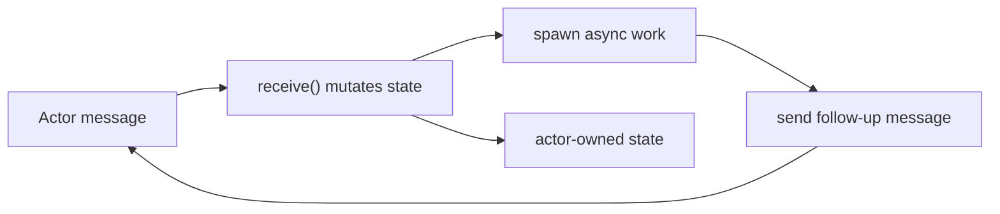
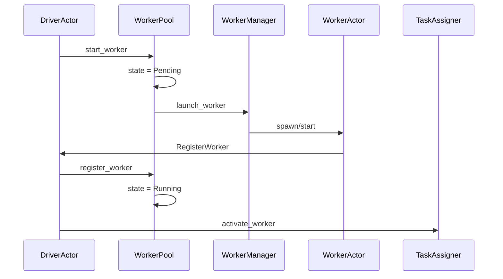
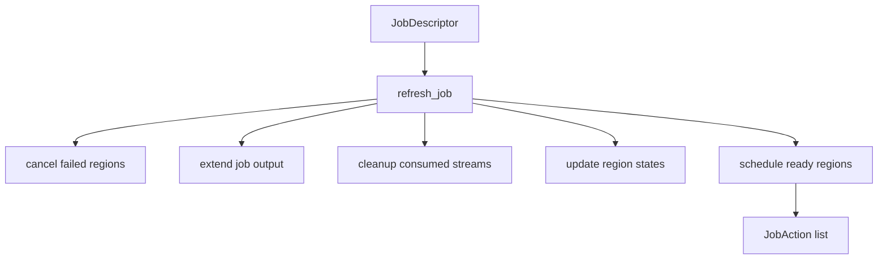
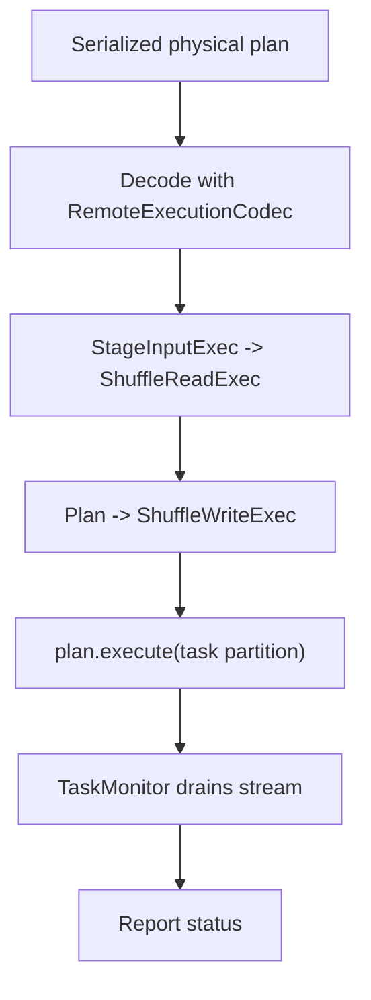
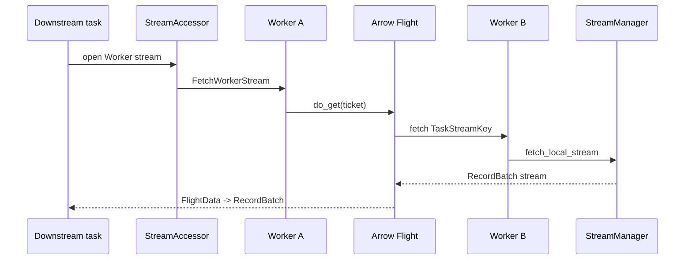
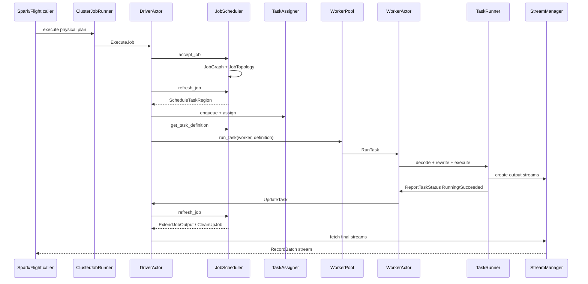

# Chapter 8: Drivers, Workers, Tasks, And Streams

Chapter 7 explained how Sail turns a DataFusion physical plan into a
distributed job graph. This chapter follows that graph into motion.

The job graph says what should run:

- stages,
- partitions,
- input modes,
- output distributions,
- driver or worker placement,
- and task stream dependencies.

The driver, workers, task assigner, task runner, and stream managers decide how
that work actually happens.

If Chapter 7 was the map, Chapter 8 is the traffic system.

## The Core Files

| Area | Files | Role |
|---|---|---|
| Actor runtime | `crates/sail-server/src/actor.rs` | Small async actor system used by the driver and workers |
| Driver actor | `crates/sail-execution/src/driver/actor/*.rs` | Accepts jobs, workers, task updates, stream requests, and shutdown |
| Driver events | `crates/sail-execution/src/driver/event.rs` | Message protocol for the driver actor |
| Worker actor | `crates/sail-execution/src/worker/actor/*.rs` | Registers with driver, receives tasks, reports status, serves/fetches streams |
| Worker events | `crates/sail-execution/src/worker/event.rs` | Message protocol for worker actor |
| Worker pool | `crates/sail-execution/src/driver/worker_pool/*.rs` | Launches, registers, monitors, and talks to workers |
| Task assigner | `crates/sail-execution/src/driver/task_assigner/*.rs` | Maps task regions to driver or worker task slots |
| Job scheduler | `crates/sail-execution/src/driver/job_scheduler/*.rs` | Tracks job state, creates attempts, schedules regions, builds task definitions |
| Task runner | `crates/sail-execution/src/task_runner/*.rs` | Executes serialized DataFusion physical plans on driver or worker |
| Stream manager | `crates/sail-execution/src/stream_manager/*.rs` | Owns local task streams and pending stream fetches |
| Stream accessor | `crates/sail-execution/src/stream_accessor/core.rs` | Implements task stream reader/writer by sending actor messages |
| Stream service | `crates/sail-execution/src/stream_service/*.rs` | Uses Arrow Flight to fetch task streams across processes |
| Worker managers | `crates/sail-execution/src/worker_manager/*.rs` | Launches local or Kubernetes workers |

The chapter will follow a single distributed query from the moment the cluster
runner sends it to the driver until final Arrow batches are returned.

## The Actor Runtime

Sail's driver and workers are actors. The actor runtime lives in
`crates/sail-server/src/actor.rs`.

The trait is small:

```rust
pub trait Actor: Sized + Send + 'static {
    type Message: Send + SpanAssociation + 'static;
    type Options;

    fn name() -> &'static str;
    fn new(options: Self::Options) -> Self;
    async fn start(&mut self, ctx: &mut ActorContext<Self>) {}
    fn receive(&mut self, ctx: &mut ActorContext<Self>, message: Self::Message) -> ActorAction;
    async fn stop(self, ctx: &mut ActorContext<Self>) {}
}
```

Messages are processed sequentially:

```rust
while let Some(MessageEnvelop { message, context }) = self.receiver.recv().await {
    let action = self.actor.receive(&mut self.ctx, message);
    ...
    self.ctx.reap();
}
```

That gives actor state a simple programming model: the actor mutates its own
fields without locks because only one message is handled at a time.

But the actor must not block. The trait comment says blocking work should be
spawned through `ActorContext::spawn`. That pattern appears everywhere in
driver and worker code:

- launch a worker asynchronously,
- send an RPC to a worker,
- fetch a remote stream,
- report task status,
- run a task monitor,
- merge job output streams.

The actor system gives Sail a clean split:

- state transitions happen synchronously in `receive`,
- slow IO happens in spawned futures,
- spawned futures report back by sending another actor message.



This is the control-plane style behind Sail's distributed runtime.

## Driver Actor: The Coordinator

`DriverActor` is defined across `crates/sail-execution/src/driver/actor`.

Its `new` method constructs the major driver subsystems:

```rust
let worker_pool = WorkerPool::new(...);
let job_scheduler = JobScheduler::new(...);
let task_assigner = TaskAssigner::new(...);
let stream_manager = StreamManager::new(...);
```

The driver owns:

- `WorkerPool`: worker lifecycle and worker RPC clients,
- `JobScheduler`: jobs, stages, regions, tasks, attempts,
- `TaskAssigner`: task slots and stream ownership,
- `TaskRunner`: local driver task execution,
- `StreamManager`: local streams owned by the driver,
- `task_sequences`: latest worker task status sequence numbers,
- and the driver server monitor.

The driver starts a gRPC server in `start`:

```rust
self.server = server
    .start(Self::serve(ctx.handle().clone(), addr).in_span(span))
    .await;
```

Once the server is ready, it starts the initial workers:

```rust
for _ in 0..self.options.worker_initial_count {
    self.worker_pool.start_worker(ctx);
}
```

The driver receives events such as:

- `RegisterWorker`
- `WorkerHeartbeat`
- `ExecuteJob`
- `UpdateTask`
- `CreateLocalStream`
- `FetchWorkerStream`
- `CleanUpJob`
- `Shutdown`

That event list is effectively the driver's public control-plane API.

## Worker Actor: The Executor

`WorkerActor` has a similar shape in `crates/sail-execution/src/worker/actor`.

Its `new` method constructs:

- a driver client set,
- a peer tracker,
- a task runner,
- a stream manager,
- and a sequence counter for status updates.

When the worker server becomes ready, the worker registers with the driver:

```rust
client.register_worker(worker_id, host, port).await
```

Then it starts heartbeats:

```rust
loop {
    tokio::time::sleep(interval).await;
    client.report_worker_heartbeat(worker_id).await;
}
```

The worker receives events such as:

- `RunTask`
- `StopTask`
- `ReportTaskStatus`
- `CreateLocalStream`
- `FetchWorkerStream`
- `CleanUpJob`
- `Shutdown`

The most important handler is `handle_run_task`:

```rust
self.peer_tracker.track(ctx, peers);
self.task_runner
    .run_task(ctx, key, definition, self.options.session.task_ctx());
```

The worker learns about peer workers from the driver, remembers their
locations, and runs the task with its own `TaskContext`.

## Worker Launch And Registration

The worker lifecycle starts in the driver `WorkerPool`.

`start_worker`:

1. Allocates a new `WorkerId`.
2. Inserts a `WorkerDescriptor` in `Pending` state.
3. Schedules a pending-worker probe for timeout handling.
4. Calls the configured `WorkerManager` to launch the worker.

The launch options include:

- TLS setting,
- driver external host and port,
- heartbeat interval,
- task stream buffer,
- stream creation timeout,
- RPC retry strategy.

For local cluster mode, `LocalWorkerManager` spawns a `WorkerActor` in a local
actor system:

```rust
let options = WorkerOptions::local(id, options, self.runtime.clone(), self.session.clone());
let handle = state.system.spawn(options);
state.workers.insert(id, handle);
```

For Kubernetes mode, the worker manager uses the Kubernetes worker manager
implementation. The driver side does not care which launch strategy is used;
it just waits for a `RegisterWorker` event.

When registration arrives:

```rust
worker.state = WorkerState::Running {
    host,
    port,
    updated_at: Instant::now(),
    heartbeat_at: Instant::now(),
    client: None,
};
```

Then the driver schedules:

- a lost-worker probe,
- an idle-worker probe,
- and activates the worker in the task assigner.



## Worker Health

Workers send heartbeats to the driver. The driver records the latest heartbeat:

```rust
if let WorkerState::Running { heartbeat_at, .. } = &mut worker.state {
    *heartbeat_at = Instant::now();
    Self::schedule_lost_worker_probe(ctx, worker_id, worker, &self.options);
}
```

If the lost-worker probe fires and the heartbeat is stale, the driver:

1. Stops the worker.
2. Finds tasks assigned to that worker.
3. Marks those task attempts failed.
4. Refreshes affected jobs.
5. Tries to run tasks again.
6. Scales up workers if needed.

The handler in `driver/actor/handler.rs` makes that explicit:

```rust
let keys = self.task_assigner.find_worker_tasks(worker_id);
self.task_assigner.deactivate_worker(worker_id);
for key in keys.iter() {
    self.job_scheduler.update_task(
        key,
        TaskState::Failed,
        Some(message.clone()),
        Some(CommonErrorCause::Execution(message.clone())),
    );
}
```

This is the retry story at the worker level. Worker loss becomes task attempt
failure. Task attempt failure becomes region rescheduling unless the maximum
attempt count is exceeded.

## From Job To Task Regions

The job scheduler accepts a job in
`crates/sail-execution/src/driver/job_scheduler/core.rs`:

```rust
let graph = JobGraph::try_new(plan)?;
let (output, stream) = build_job_output(ctx, job_id, graph.schema().clone());
let descriptor = JobDescriptor::try_new(graph, JobState::Running { output, context })?;
self.jobs.insert(job_id, descriptor);
```

After acceptance, the driver calls `refresh_job`.

`refresh_job` is the scheduler's main decision function. Its comment lists the
steps:

1. Cancel task attempts in a region if any task attempt fails.
2. Add final-stage running/succeeded task streams to job output.
3. Clean up stage output streams when all consumers have succeeded.
4. Fail a job if any task exceeds max attempts.
5. Mark the job succeeded when final regions succeed.
6. Schedule regions whose dependencies have succeeded.

The important point is that the scheduler does not immediately schedule every
task. It schedules task regions when dependencies allow them.



The driver then executes the returned `JobAction` values.

## Task Attempts

Each stage has tasks. Each task can have multiple attempts:

```rust
pub struct TaskDescriptor {
    pub attempts: Vec<TaskAttemptDescriptor>,
}
```

An attempt has:

- state,
- messages,
- error cause,
- `job_output_fetched`,
- creation time,
- stop time.

When a task region becomes schedulable, the scheduler pushes a new attempt for
each task:

```rust
attempts.push(TaskAttemptDescriptor {
    state: TaskState::Created,
    messages: vec![],
    cause: None,
    job_output_fetched: false,
    created_at: Utc::now(),
    stopped_at: None,
});
```

Task states are:

- `Created`
- `Scheduled`
- `Running`
- `Succeeded`
- `Failed`
- `Canceled`

The driver receives status updates from workers as `DriverEvent::UpdateTask`.
Those updates include an optional sequence number. The driver ignores stale
updates:

```rust
if sequence <= *s {
    warn!("{} sequence {sequence} is stale", TaskKeyDisplay(&key));
    return ActorAction::Continue;
}
```

This protects the control plane from delayed or duplicate worker status
messages.

## Task Regions And Cascading Cancellation

Task regions are important because Sail schedules and retries them as units.
If any task in a region fails, the scheduler cancels other active attempts in
that region:

```rust
if failed {
    for t in &region.tasks {
        for (a, attempt) in task.attempts.iter_mut().enumerate() {
            if !attempt.state.is_terminal() {
                attempt.state = TaskState::Canceled;
                actions.push(JobAction::CancelTask { key });
            }
        }
    }
}
```

Why cancel the whole region?

Because a region represents a group of tasks that are pipelined or otherwise
scheduled together. If one attempt fails, its peers may be producing or
consuming streams that are no longer valid for that attempt set. Canceling the
region keeps attempt boundaries consistent.

This is the distributed version of "do not mix outputs from different attempts
unless the system has explicitly decided to do so."

## Task Assignment

The scheduler emits `JobAction::ScheduleTaskRegion`. The driver gives the region
to `TaskAssigner`:

```rust
self.task_assigner.enqueue_tasks(region);
```

Then `run_tasks` asks for assignments:

```rust
let assignments = self.task_assigner.assign_tasks();
self.task_assigner.track_streams(&assignments);
```

`TaskAssigner` tracks:

- active workers,
- worker task slots,
- driver task slots,
- queued task regions,
- task assignments,
- local stream ownership,
- remote stream ownership.

Worker task slots are limited:

```rust
task_slots: vec![TaskSlot::default(); self.options.worker_task_slots]
```

Driver task slots can grow:

```rust
/// The number of task slot can grow indefinitely.
task_slots: Vec<TaskSlot>
```

Assignment is region-aware. `TaskSlotAssigner::try_assign_task_region` only
succeeds if the entire region can be assigned:

```rust
for (placement, set) in &region.tasks {
    match placement {
        TaskPlacement::Driver => ...
        TaskPlacement::Worker => {
            if let Some((worker_id, slot)) = self.next() {
                ...
            } else {
                return Err(region);
            }
        }
    }
}
```

If a region cannot fit, it goes back to the front of the queue. This can cause
head-of-line blocking, but it preserves scheduling order.

## Scaling Workers

The task assigner also tells the driver how many workers to request:

```rust
let required_slots = enqueued_slots.saturating_sub(vacant_slots);
let required_workers = required_slots
    .div_ceil(self.options.worker_task_slots)
    .min(allowed_workers);
```

The driver then starts that many workers:

```rust
for _ in 0..self.task_assigner.request_workers() {
    self.worker_pool.start_worker(ctx);
}
```

This is simple elastic scheduling:

- pending worker tasks imply required slots,
- active idle worker slots satisfy some of that demand,
- remaining demand becomes new workers,
- `worker_max_count` caps the result if configured.

## Building A Task Definition

After assignment, the driver asks the scheduler for each task definition:

```rust
let (definition, context) =
    self.job_scheduler.get_task_definition(&entry.key, &self.task_assigner)?;
```

A `TaskDefinition` contains:

```rust
pub struct TaskDefinition {
    pub plan: Arc<[u8]>,
    pub inputs: Vec<TaskInput>,
    pub output: TaskOutput,
}
```

The plan is serialized with DataFusion's physical plan protobuf support and
Sail's extension codec:

```rust
let plan =
    PhysicalPlanNode::try_from_physical_plan(stage.plan.clone(), self.codec.as_ref())?
        .encode_to_vec();
```

Inputs come from `stage.inputs`, using `InputMode` and current task assignments
to decide locations.

For pipelined worker outputs, input keys become:

```rust
TaskInputLocator::Worker {
    stage: input.stage,
    keys,
}
```

Each key includes:

- upstream partition,
- upstream attempt,
- channel.

The task output includes:

- distribution,
- local or remote locator,
- replica count for local pipelined output.

This object is the portable description of one task attempt.

## Dispatching Tasks

Once the driver has a `TaskDefinition`, it dispatches by placement:

```rust
match assignment.assignment {
    TaskAssignment::Driver => self.task_runner.run_task(ctx, entry.key, definition, context),
    TaskAssignment::Worker { worker_id, slot: _ } => {
        self.worker_pool.run_task(ctx, worker_id, entry.key, definition)
    }
}
```

For worker tasks, `WorkerPool::run_task`:

1. Finds or creates a worker client.
2. Tracks worker activity.
3. Sends the task definition over gRPC.
4. Includes peer worker locations the worker may need for stream fetches.
5. Reports task failure back to the driver if dispatch fails.

The peer list is optimized by remembering known peers:

```rust
let peers = running_workers
    .into_iter()
    .filter(|x| !worker.peers.contains(&x.worker_id))
    .collect();
```

Workers report back which peers they now know, so the driver avoids sending the
same location information repeatedly.

## Running A Task On A Worker

The worker receives `WorkerEvent::RunTask`, tracks peer locations, and calls
`TaskRunner::run_task`.

`TaskRunner::execute_plan` performs the critical preparation:

```rust
let plan = PhysicalPlanNode::decode(definition.plan.as_ref())?;
let plan = plan.try_into_physical_plan(&context, self.codec.as_ref())?;
let plan = self.rewrite_parquet_adapters(plan)?;
let plan = self.rewrite_shuffle(ctx, key, &definition.inputs, &definition.output, plan, &context)?;
let stream = plan.execute(key.partition, context)?;
```

There are two important rewrites:

1. `rewrite_parquet_adapters` adjusts Parquet scans for Delta expression
   adapters.
2. `rewrite_shuffle` turns stage input placeholders into reads, and wraps the
   task output in writes.

Then DataFusion executes the task partition.



## Why The Task Monitor Drains The Stream

`TaskRunner::run_task` does not simply call `execute` and report success. It
spawns a `TaskMonitor`.

The monitor first reports `Running`:

```rust
T::Message::report_task_status(key, TaskStatus::Running, None, None)
```

Then it races execution against cancellation:

```rust
tokio::select! {
    x = Self::execute(key.clone(), stream) => x,
    x = Self::cancel(key.clone(), signal) => x,
}
```

`execute` drains the stream:

```rust
while let Some(batch) = stream.next().await {
    if let Err(e) = batch {
        return Failed;
    }
}
return Succeeded;
```

This matters because in DataFusion, executing a plan returns a stream. Work may
not happen until the stream is polled. If Sail reported success immediately
after obtaining the stream, it would be lying. Draining the stream ensures the
task really ran and all shuffle writes were closed.

## Stream Accessor: Actors As Readers And Writers

`StreamAccessor` bridges physical operators and actor messages.

It implements `TaskStreamReader`:

```rust
async fn open(&self, location: &TaskReadLocation, schema: SchemaRef)
    -> Result<TaskStreamSource>
```

For each read location, it sends an actor event:

```rust
TaskReadLocation::Driver { key } =>
    fetch_driver_stream(key, schema, tx)
TaskReadLocation::Worker { worker_id, key } =>
    fetch_worker_stream(worker_id, key, schema, tx)
TaskReadLocation::Remote { uri, key } =>
    fetch_remote_stream(uri, key, schema, tx)
```

It also implements `TaskStreamWriter`:

```rust
TaskWriteLocation::Local { key, storage } =>
    create_local_stream(key, storage, schema, tx)
TaskWriteLocation::Remote { uri, key } =>
    create_remote_stream(uri, key, schema, tx)
```

This is how `ShuffleReadExec` and `ShuffleWriteExec` remain actor-agnostic.
They only know about `TaskStreamReader` and `TaskStreamWriter`. The actual
driver/worker communication is hidden behind `StreamAccessor`.

## Stream Locations

Read locations are:

```rust
pub enum TaskReadLocation {
    Driver { key },
    Worker { worker_id, key },
    Remote { uri, key },
}
```

Write locations are:

```rust
pub enum TaskWriteLocation {
    Local { storage, key },
    Remote { uri, key },
}
```

A `TaskStreamKey` identifies one stream:

```text
job_id, stage, partition, attempt, channel
```

That key is the identity that ties together:

- task output,
- stream ownership,
- stream fetches,
- job output,
- cleanup,
- retry attempts.

The inclusion of `attempt` is especially important. If a task is retried, the
new attempt writes a different stream key. Consumers can avoid accidentally
mixing data from failed and replacement attempts.

## Stream Manager

Both driver and worker have a `StreamManager`.

The stream manager owns local streams:

```rust
local_streams: HashMap<TaskStreamKey, LocalStreamState>
```

A local stream can be:

- pending,
- created,
- failed.

The pending state matters because a consumer may ask for a stream before the
producer has created it. In that case, `fetch_local_stream` creates a receiver
and stores its sender:

```rust
entry.insert(LocalStreamState::Pending { senders: vec![tx] });
ctx.send_with_delay(
    T::Message::probe_pending_local_stream(key.clone()),
    self.options.task_stream_creation_timeout,
);
```

When the producer later creates the stream, the pending senders are connected to
the new stream.

If stream creation never happens, the delayed probe fails the pending stream:

```rust
let message = "local stream is not created within the expected time".to_string();
let cause = CommonErrorCause::Execution(message);
Self::fail_senders(senders, &cause);
*value = LocalStreamState::Failed { cause };
```

This is how Sail prevents downstream tasks from waiting forever for a missing
upstream stream.

## Memory Streams And Replicas

The current local stream implementation is `MemoryStream`.

Its comment explains the design:

```rust
/// A memory stream that can be read multiple times.
/// It maintains multiple replicas of the stream internally.
/// Since [`Arc`] is used inside the record batch, it is relatively cheap
/// to clone the data in multiple replicas.
```

A memory stream has one publisher and multiple receivers:

```rust
sender: Option<MemoryStreamReplicaSender>,
receivers: Vec<mpsc::Receiver<TaskStreamResult<RecordBatch>>>,
```

When a batch is written, `MemoryStreamReplicaSender` tries to send it to every
active replica. If a receiver is full, it uses an overflow buffer. If a receiver
is closed, it drops that replica:

```rust
Err(mpsc::error::TrySendError::Closed(_)) => {
    dropped = true;
}
```

A closed receiver is not necessarily an error. A downstream `LIMIT` may stop
reading early. The sink returns `Closed` only when all replicas are gone.

This replica design supports `JobGraph::replicas(stage)`: stages consumed by
merge or broadcast may need multiple readers for the same output stream.

## Arrow Flight For Task Streams

When a task needs a stream from another process, Sail uses Arrow Flight.

The server is `TaskStreamFlightServer` in
`crates/sail-execution/src/stream_service/server.rs`. Its important method is
`do_get`:

1. Decode a `TaskStreamTicket`.
2. Convert it to `TaskStreamKey`.
3. Ask a `TaskStreamFetcher` for the stream.
4. Encode the stream with `FlightDataEncoderBuilder`.
5. Return Flight data.

```rust
let stream = rx.await??;
let stream = stream.map_err(|e| FlightError::Tonic(Box::new(e.into())));
let stream = FlightDataEncoderBuilder::new()
    .build(stream)
    .map_err(Status::from);
```

The client is `TaskStreamFlightClient`:

```rust
let response = self.inner.get().await?.do_get(request).await?;
let stream = response.into_inner().map_err(|e| e.into());
let stream = FlightRecordBatchStream::new_from_flight_data(stream)?;
```

Again, the data plane is Arrow batches. The control plane moves task keys and
locations; Flight moves the batch stream.



## Peer Tracking

Workers may need to fetch streams from other workers. The driver sends peer
locations along with task dispatch. The worker tracks them in `PeerTracker`:

```rust
for peer in peers {
    self.peers
        .entry(peer.worker_id)
        .or_insert_with(|| Peer::new(peer.host, peer.port));
}
ctx.send(WorkerEvent::ReportKnownPeers { peer_worker_ids });
```

The worker reports known peers back to the driver. The driver stores that set in
the worker descriptor:

```rust
worker.peers.extend(peer_worker_ids);
```

The next time the driver dispatches a task to that worker, it omits peers the
worker already knows.

This is an optimization, not a correctness requirement. The worker descriptor
comment says the peer list may not cover all running workers, but correctness
does not depend on completeness.

## Cleanup And Stream Tracking

The task assigner tracks local streams because local stream ownership affects
worker lifetime.

Worker resources include:

```rust
local_streams: IndexSet<TaskKey>
```

The comment calls this "shuffle tracking" similar to Spark. A worker may be idle
from a task-slot perspective but still own active local streams needed by
downstream tasks. Sail should not stop that worker until its local streams are
no longer needed.

When consumers finish, the scheduler emits cleanup actions:

```rust
JobAction::CleanUpJob { job_id, stage: Some(s) }
```

The driver handles cleanup by untracking stream ownership and asking the
relevant driver/worker stream managers to remove streams:

```rust
for x in self.task_assigner.untrack_local_streams(job_id, stage) {
    match x {
        TaskStreamAssignment::Driver => {
            self.stream_manager.remove_local_streams(job_id, stage);
        }
        TaskStreamAssignment::Worker { worker_id } => {
            self.worker_pool.clean_up_job(ctx, worker_id, job_id, stage)
        }
    }
}
```

This is the other half of shuffle tracking:

- keep workers alive while streams are needed,
- clean streams up when consumers have succeeded,
- then workers can become idle and eligible for stopping.

## Job Output

The job output path begins when final-stage tasks are running or succeeded.

`extend_job_output` finds final stages and adds their task streams:

```rust
actions.push(JobAction::ExtendJobOutput {
    handle: output.handle(),
    key,
    schema: schema.clone(),
});
```

The driver resolves the stream location from task assignment:

```rust
Some(TaskAssignment::Driver) =>
    self.stream_manager.fetch_local_stream(ctx, &key)
Some(TaskAssignment::Worker { worker_id, .. }) =>
    self.worker_pool.fetch_task_stream(ctx, *worker_id, &key, schema.clone())
```

Then it sends the stream to the `JobOutputHandle`.

`JobOutputStream` merges all added streams using `SelectAll`. It stays active
while new streams may arrive, then drains remaining streams once the output
manager is dropped.

This is how a distributed job becomes one `SendableRecordBatchStream` for the
caller.

## One Query Lifecycle

Here is the complete lifecycle in one diagram:



It is a lot of machinery, but each piece has a bounded job.

## Failure And Retry Story

Sail's retry model is attempt-based:

- A task attempt fails if its monitor sees a stream error.
- A task attempt can be canceled explicitly.
- A lost worker causes all assigned task attempts to fail.
- A failed attempt causes the whole task region to cancel active peers.
- A region can be rescheduled by creating new attempts.
- If attempts exceed the configured max, the region and job fail.

The job output stream standardizes data-plane and control-plane errors through
`CommonErrorCause`, so the client sees coherent failures whether the error comes
from:

- a task stream,
- a task status update,
- job output failure,
- or cleanup/shutdown.

The architecture is intentionally conservative. It avoids mixing task attempts
and treats region failure as a reason to restart the region.

## Why This Design Fits Rust

This part of Sail shows several Rust strengths:

- actor-owned mutable state avoids large shared locks,
- `Arc` shares immutable plans, schemas, and clients,
- trait objects abstract workers, streams, actors, and job runners,
- async tasks isolate slow IO from actor message handling,
- enums make control-plane states explicit,
- typed IDs prevent accidental confusion between jobs, tasks, streams, and
  workers,
- `oneshot` channels turn actor messages into request/response APIs.

The design is not "just async Rust." It is a careful layering:

```text
Actor messages -> scheduler state -> task definitions -> physical plan execution -> stream IO
```

Each layer is explicit enough to inspect and test.

## Extension Implications

For the final extension chapter, this control plane raises several requirements.

A distributed-safe extension must consider:

- Can its physical plan be serialized into a `TaskDefinition`?
- Does `RemoteExecutionCodec` know how to decode it on workers?
- Does it require worker-local state?
- Does it require driver-only coordination?
- Does it produce task streams that can be retried safely?
- Does it rely on external resources that must be available in worker pods?
- Does it need peer-to-peer stream access?
- Does it need cleanup hooks when a job or stage finishes?
- Does it need custom task placement?

This is where a simple plugin API becomes a distributed systems API. A scalar
UDF that uses Arrow arrays is easy. A custom physical operator with new stream
semantics is much more serious.

Sail's existing control plane gives us the vocabulary to design those
capabilities precisely.

## Reading Exercise: Follow A Task To A Worker

Trace a task from scheduling to worker execution:

1. Open `crates/sail-execution/src/driver/actor/handler.rs`.
2. Find `run_tasks`.
3. Follow `task_assigner.assign_tasks`.
4. Follow `job_scheduler.get_task_definition`.
5. Follow `worker_pool.run_task`.
6. Open `crates/sail-execution/src/worker/actor/handler.rs`.
7. Find `handle_run_task`.
8. Follow `task_runner.run_task`.
9. Open `crates/sail-execution/src/task_runner/core.rs`.
10. Read `execute_plan`.

At the end, you should be able to say how a stage partition becomes
`plan.execute(key.partition, context)`.

## Reading Exercise: Follow A Stream Fetch

Trace a downstream task reading an upstream worker stream:

1. Start in `TaskRunner::rewrite_shuffle`.
2. Find where `StageInputExec<usize>` becomes `ShuffleReadExec`.
3. Follow `StreamAccessor::new(handle.clone())`.
4. Open `crates/sail-execution/src/stream_accessor/core.rs`.
5. Read `TaskStreamReader::open`.
6. Follow `fetch_worker_stream`.
7. On the worker, open `worker/actor/handler.rs`.
8. Find `handle_fetch_worker_stream`.
9. If the stream is remote, follow `TaskStreamFlightClient`.
10. If the stream is local, follow `StreamManager::fetch_local_stream`.

This trace connects the control-plane location lookup to the Arrow Flight data
plane.

## Reading Exercise: Follow Worker Loss

Trace worker failure handling:

1. Open `crates/sail-execution/src/driver/actor/handler.rs`.
2. Find `handle_probe_lost_worker`.
3. Follow `worker_pool.stop_worker`.
4. Follow `task_assigner.find_worker_tasks`.
5. Follow `job_scheduler.update_task(... Failed ...)`.
6. Follow `refresh_job`.
7. Find `cascade_cancel_task_attempts`.
8. Find `schedule_task_regions`.

This shows how infrastructure failure becomes task attempt retry.

## Takeaways

Sail's distributed runtime is actor-driven. The driver actor coordinates jobs,
workers, task assignment, stream ownership, and cleanup. Worker actors register
with the driver, heartbeat, run serialized task definitions, serve local streams,
and report task status.

The task runner turns a serialized DataFusion physical plan back into an
executable plan, rewrites stage inputs into `ShuffleReadExec`, wraps outputs in
`ShuffleWriteExec`, and drains the resulting stream through a task monitor.

Streams are identified by `(job, stage, partition, attempt, channel)`. Stream
managers handle pending, created, failed, replicated, and cleaned-up local
streams. Arrow Flight carries streams between processes.

The next chapter zooms in on shuffle and data movement, using the stream and
task machinery from this chapter as the foundation.
