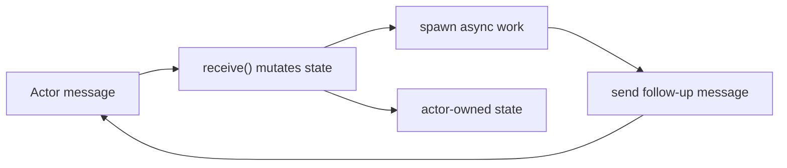
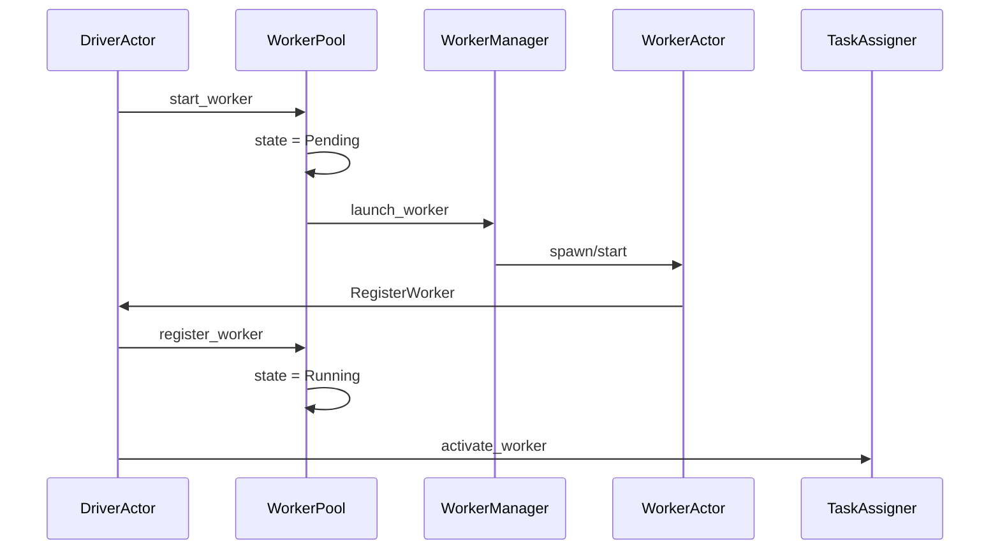
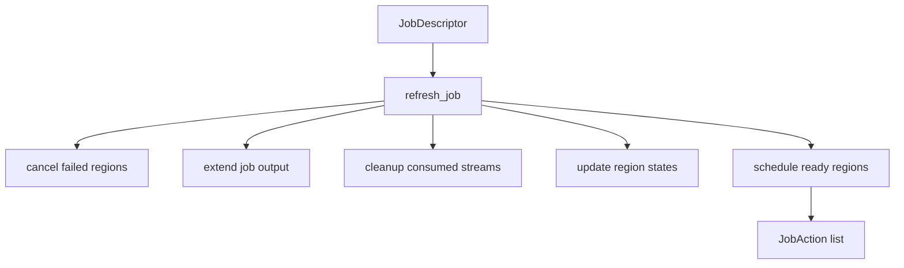
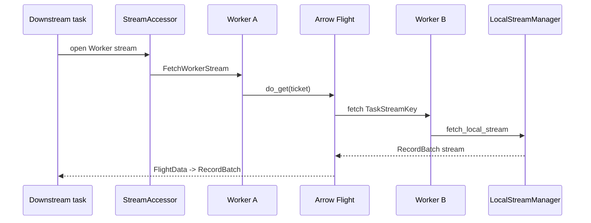
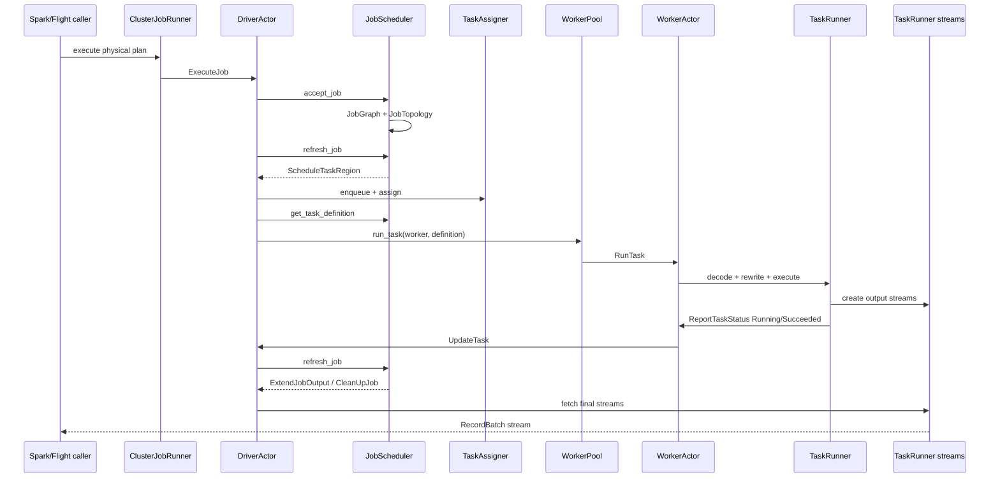

# Chapter 8: Drivers, Workers, Tasks, And Streams

Chapter 7 explained how Sail turns a DataFusion physical plan into a
distributed job graph. This chapter follows that graph into motion.

The job graph says what should run:

- stages,
- partitions,
- input modes,
- output distributions,
- driver or worker placement,
- and task stream dependencies.

The driver, workers, task assigner, task runner, and stream managers decide how
that work actually happens.

If Chapter 7 was the map, Chapter 8 is the traffic system.

## The Core Files

| Area | Files | Role |
|---|---|---|
| Actor runtime | `crates/sail-common/src/actor.rs` | Small async actor system used by the driver and workers |
| Driver actor | `crates/sail-execution/src/driver/actor/*.rs` | Accepts jobs, workers, task updates, stream requests, and shutdown |
| Driver events | `crates/sail-execution/src/driver/actor/message.rs` | Message protocol for the driver actor |
| Worker actor | `crates/sail-execution/src/worker/actor/*.rs` | Registers with driver, receives tasks, reports status, serves/fetches streams |
| Worker events | `crates/sail-execution/src/worker/actor/message.rs` | Message protocol for worker actor |
| Worker pool | `crates/sail-execution/src/driver/worker_pool/*.rs` | Launches, registers, monitors, and talks to workers |
| Task assigner | `crates/sail-execution/src/driver/task_assigner/*.rs` | Maps task regions to driver or worker task slots |
| Job scheduler | `crates/sail-execution/src/driver/job_scheduler/*.rs` | Tracks job state, creates attempts, schedules regions, builds task definitions |
| Task runner | `crates/sail-execution/src/task_runner/*.rs` | Executes serialized DataFusion physical plans on driver or worker |
| Stream manager | `crates/sail-execution/src/stream/local/` | Owns local task streams and pending stream fetches |
| Stream accessor | `crates/sail-execution/src/stream/accessor.rs` | Implements task stream reader/writer by sending actor messages |
| Stream service | `crates/sail-execution/src/stream/service/` | Uses Arrow Flight to fetch task streams across processes |
| Worker managers | `crates/sail-execution/src/worker_manager/*.rs` | Launches local or Kubernetes workers |

The chapter will follow a single distributed query from the moment the cluster
runner sends it to the driver until final Arrow batches are returned.

## The Actor Runtime

Sail's driver and workers are actors. The actor runtime lives in
`crates/sail-common/src/actor.rs`.

The trait is small:

```rust
pub trait Actor: Sized + Send + 'static {
    type Message: Send + SpanAssociation + 'static;
    type Options;

    fn name() -> &'static str;
    fn new(options: Self::Options) -> Self;
    async fn start(&mut self, ctx: &mut ActorContext<Self>) {}
    fn receive(&mut self, ctx: &mut ActorContext<Self>, message: Self::Message) -> ActorAction;
    async fn stop(self, ctx: &mut ActorContext<Self>) {}
}
```

Messages are processed sequentially:

```rust
while let Some(MessageEnvelop { message, context }) = self.receiver.recv().await {
    let action = self.actor.receive(&mut self.ctx, message);
    ...
    self.ctx.reap();
}
```

That gives actor state a simple programming model: the actor mutates its own
fields without locks because only one message is handled at a time.

But the actor must not block. The trait comment says blocking work should be
spawned through `ActorContext::spawn`. That pattern appears everywhere in
driver and worker code:

- launch a worker asynchronously,
- send an RPC to a worker,
- fetch a remote stream,
- report task status,
- run a task monitor,
- merge job output streams.

The actor system gives Sail a clean split:

- state transitions happen synchronously in `receive`,
- slow IO happens in spawned futures,
- spawned futures report back by sending another actor message.


```mermaid
flowchart LR
    Msg["Actor message"]
    Receive["receive() mutates state"]
    Spawn["spawn async work"]
    Event["send follow-up message"]
    State["actor-owned state"]

    Msg --> Receive
    Receive --> State
    Receive --> Spawn
    Spawn --> Event
    Event --> Msg
```

This is the control-plane style behind Sail's distributed runtime.

## Driver Actor: The Coordinator

`DriverActor` is defined across `crates/sail-execution/src/driver/actor`.

Its constructor builds `WorkerPool`, `JobScheduler`, `TaskAssigner` and
`WorkerScaler`. The task runner starts separately, with local streams and the
configured storage or Celeborn support assembled during actor startup. The
current actor does not contain the older monolithic `StreamManager` shown in
previous editions.

These components divide responsibility: the worker pool tracks workers and their
clients; the job scheduler tracks jobs and attempts; the task assigner manages
assignment; the scaler manages worker demand. The driver also tracks task-status
sequence numbers so stale reports do not overwrite newer observations.

The driver creates its task-runner child and stream extensions during startup.
Follow `driver/actor/core.rs` for construction and `driver/actor/handler.rs` for
message handling. Server/gateway integration is separate from the worker's
`ServerMonitor`; an old `self.server` field sketch is not the current driver
constructor.

## Worker Actor: Lifecycle and Services

`WorkerActor::new` creates its driver clients, metrics sender and server monitor.
At startup it creates `LocalStreamManager`, optional storage or Celeborn support,
and a `TaskRunnerActor` child. `TaskRunnerPlacement` distinguishes driver execution
from worker execution while reusing the task-runner implementation.

The worker server combines the worker RPC service and an Arrow Flight service.
Its Flight fetcher sends `TaskRunnerMessage::FetchLocalStream` to the task runner.
`WorkerMessage::ServerReady` reports the actual listening port and supplies the
shutdown signal. Heartbeat startup and shutdown are worker lifecycle messages;
task batches are handled by the task-runner path described below.

## Worker Launch And Registration

The worker lifecycle starts in the driver `WorkerPool`.

`start_worker`:

1. Allocates a new `WorkerId`.
2. Inserts a `WorkerDescriptor` in `Pending` state.
3. Schedules a pending-worker probe for timeout handling.
4. Calls the configured `WorkerManager` to launch the worker.

The launch options include:

- TLS setting,
- driver external host and port,
- heartbeat interval,
- task stream buffer,
- stream creation timeout,
- RPC retry strategy.

For local cluster mode, `LocalWorkerManager` spawns a `WorkerActor` in a local
actor system:

```rust
let options = WorkerOptions::local(id, options, self.runtime.clone(), self.session.clone());
system.spawn::<WorkerActor>(options);
```

For Kubernetes mode, the worker manager uses the Kubernetes worker manager
implementation. The driver side does not care which launch strategy is used;
it just waits for a `RegisterWorker` event.

When registration arrives:

```rust
worker.state = WorkerState::Running {
    host,
    port,
    updated_at: Instant::now(),
    heartbeat_at: Instant::now(),
    client: None,
};
```

Then the driver schedules:

- a lost-worker probe,
- an idle-worker probe,
- and activates the worker in the task assigner.


```mermaid
sequenceDiagram
    participant Driver as DriverActor
    participant Pool as WorkerPool
    participant Manager as WorkerManager
    participant Worker as WorkerActor
    participant Assigner as TaskAssigner

    Driver->>Pool: start_worker
    Pool->>Pool: state = Pending
    Pool->>Manager: launch_worker
    Manager->>Worker: spawn/start
    Worker->>Driver: RegisterWorker
    Driver->>Pool: register_worker
    Pool->>Pool: state = Running
    Driver->>Assigner: activate_worker
```

## Worker Health

Workers send heartbeats to the driver. The driver records the latest heartbeat:

```rust
if let WorkerState::Running { heartbeat_at, .. } = &mut worker.state {
    *heartbeat_at = Instant::now();
    Self::schedule_lost_worker_probe(ctx, worker_id, worker, &self.options);
}
```

If the lost-worker probe fires and the heartbeat is stale, the driver:

1. Stops the worker.
2. Finds tasks assigned to that worker.
3. Marks those task attempts failed.
4. Refreshes affected jobs.
5. Tries to run tasks again.
6. Scales up workers if needed.

The handler in `driver/actor/handler.rs` makes that explicit:

```rust
let keys = self.task_assigner.find_worker_tasks(worker_id);
self.task_assigner.deactivate_worker(worker_id);
for key in keys.iter() {
    self.job_scheduler.update_task(
        key,
        TaskState::Failed,
        Some(message.clone()),
        Some(CommonErrorCause::Execution(message.clone())),
    );
}
```

This is the retry story at the worker level. Worker loss becomes task attempt
failure. Ordinary retryable jobs may reschedule the region up to their attempt
limit. Jobs retaining worker-native graph state instead fail as a whole, as
described below.

## From Job To Task Regions

The job scheduler accepts a job in
`crates/sail-execution/src/driver/job_scheduler/core.rs`:

```rust
let graph = JobGraph::try_new(plan)?;
let (output, stream) = build_job_output(ctx, job_id, graph.schema().clone());
let descriptor = JobDescriptor::try_new(graph, JobState::Running { output, context })?;
self.jobs.insert(job_id, descriptor);
```

After acceptance, the driver calls `refresh_job`.

`refresh_job` is the scheduler's main decision function. Its comment lists the
steps:

1. Cancel task attempts in a region if any task attempt fails.
2. Add final-stage running/succeeded task streams to job output.
3. Clean up stage output streams when all consumers have succeeded.
4. Fail a job if any task exceeds max attempts.
5. Mark the job succeeded when final regions succeed.
6. Schedule regions whose dependencies have succeeded.

The important point is that the scheduler does not immediately schedule every
task. It schedules task regions when dependencies allow them.


```mermaid
flowchart TB
    Job["JobDescriptor"]
    Refresh["refresh_job"]
    Cancel["cancel failed regions"]
    Output["extend job output"]
    Cleanup["cleanup consumed streams"]
    Regions["update region states"]
    Schedule["schedule ready regions"]
    Actions["JobAction list"]

    Job --> Refresh
    Refresh --> Cancel
    Refresh --> Output
    Refresh --> Cleanup
    Refresh --> Regions
    Refresh --> Schedule
    Schedule --> Actions
```

The driver then executes the returned `JobAction` values.

## Task Attempts

Each stage has tasks. Each task can have multiple attempts:

```rust
pub struct TaskDescriptor {
    pub attempts: Vec<TaskAttemptDescriptor>,
}
```

An attempt has:

- state,
- messages,
- error cause,
- `job_output_fetched`,
- creation time,
- stop time.

When a task region becomes schedulable, the scheduler pushes a new attempt for
each task:

```rust
attempts.push(TaskAttemptDescriptor {
    state: TaskState::Created,
    messages: vec![],
    cause: None,
    job_output_fetched: false,
    created_at: Utc::now(),
    stopped_at: None,
});
```

Task states are:

- `Created`
- `Scheduled`
- `Running`
- `Succeeded`
- `Failed`
- `Canceled`

The driver receives status updates from workers as `DriverMessage::UpdateTask`.
Those updates include an optional sequence number. The driver ignores stale
updates:

```rust
if sequence <= *s {
    warn!("{} sequence {sequence} is stale", TaskKeyDisplay(&key));
    return ActorAction::Continue;
}
```

This protects the control plane from delayed or duplicate worker status
messages.

## Task Regions And Cascading Cancellation

Task regions are important because Sail schedules and retries them as units.
If any task in a region fails, the scheduler cancels other active attempts in
that region:

```rust
if failed {
    for t in &region.tasks {
        for (a, attempt) in task.attempts.iter_mut().enumerate() {
            if !attempt.state.is_terminal() {
                attempt.state = TaskState::Canceled;
                actions.push(JobAction::CancelTask { key });
            }
        }
    }
}
```

Why cancel the whole region?

Because a region represents a group of tasks that are pipelined or otherwise
scheduled together. If one attempt fails, its peers may be producing or
consuming streams that are no longer valid for that attempt set. Canceling the
region keeps attempt boundaries consistent.

This is the distributed version of "do not mix outputs from different attempts
unless the system has explicitly decided to do so."

## Task Assignment

The scheduler emits `JobAction::ScheduleTaskRegion`. The driver gives the region
to `TaskAssigner`:

```rust
self.task_assigner.enqueue_tasks(region);
```

Then `run_tasks` asks for assignments:

```rust
let assignments = self.task_assigner.assign_tasks();
self.task_assigner.track_streams(&assignments);
```

`TaskAssigner` tracks:

- active workers,
- worker task slots,
- driver task slots,
- queued task regions,
- task assignments,
- local stream ownership,
- remote stream ownership.

Worker task slots are limited:

```rust
task_slots: vec![TaskSlot::default(); self.options.worker_task_slots]
```

Driver task slots can grow:

```rust
/// The number of task slot can grow indefinitely.
task_slots: Vec<TaskSlot>
```

Assignment is region-aware. `TaskSlotAssigner::try_assign_task_region` only
succeeds if the entire region can be assigned:

```rust
for (placement, set) in &region.tasks {
    match placement {
        TaskPlacement::Driver => ...
        TaskPlacement::Worker => {
            if let Some((worker_id, slot)) = self.next() {
                ...
            } else {
                return Err(region);
            }
        }
    }
}
```

If a region cannot fit, it goes back to the front of the queue. This can cause
head-of-line blocking, but it preserves scheduling order.

## Scaling Workers

The task assigner also tells the driver how many workers to request:

```rust
let required_slots = enqueued_slots.saturating_sub(vacant_slots);
let required_workers = required_slots
    .div_ceil(self.options.worker_task_slots)
    .min(allowed_workers);
```

The driver passes that demand to a separate `WorkerScaler`:

```rust
self.worker_scaler
    .reconcile(self.task_assigner.count_worker_demands())
```

The scaler returns launch requests. The driver starts workers through
`WorkerPool::start_worker` and binds each worker ID to its demand. Registration
fulfills the demand; a failed launch can schedule a retry under the configured
launch retry strategy. The demand identity survives that retry, so reconciliation
does not repeatedly create fresh demand for the same failed request.

Initial worker requests count toward the task target. The task assigner accounts
for vacant slots and the configured worker limit; the scaler manages the
lifecycle of the resulting launch demands. This separates capacity calculation
from retry policy. See `crates/sail-execution/src/driver/worker_scaler/core.rs`.

## Building A Task Definition

After assignment, the driver asks the scheduler for each task definition:

```rust
let (definition, context) =
    self.job_scheduler.get_task_definition(&entry.key, &self.task_assigner)?;
```

A `TaskDefinition` contains:

```rust
pub struct TaskDefinition {
    pub plan: Arc<[u8]>,
    pub inputs: Vec<TaskInput>,
    pub output: TaskOutput,
}
```

The plan is serialized with DataFusion's physical plan protobuf support and
Sail's extension codec:

```rust
let plan = encode_remote_physical_plan(self.codec.as_ref(), stage.plan.clone())?;
```

Inputs come from `stage.inputs`, using `InputMode` and current task assignments
to decide locations.

For pipelined worker outputs, input keys become:

```rust
TaskInput {
    stage: input.stage,
    locator: Arc::new(TaskInputLocator::Worker { keys }),
}
```

Each key includes:

- upstream partition,
- upstream attempt,
- channel.

The task output includes:

- distribution,
- pipelined or blocking locator,
- replica count for pipelined output.

This object is the portable description of one task attempt.

## Dispatching Tasks

`DriverActor::run_tasks` first reserves task assignments and tracks their
streams. It groups work by job, region, stage and worker. Within that scheduling
snapshot, it constructs one shared definition per job/stage, marks the tasks
scheduled, and sends their partition/attempt identities as a batch.

Worker batches go through `WorkerPool::run_task_batch`; driver batches go to the
local task runner. The worker-pool path supplies peer locations, sends the batch
over gRPC and reports dispatch failures for the affected tasks. Reusing a stage
definition avoids repeating its physical-plan serialization for every partition.
The batch still preserves task-region and worker boundaries.

The peer list is optimized by remembering known peers:

```rust
let peers = running_workers
    .into_iter()
    .filter(|x| !worker.peers.contains(&x.worker_id))
    .collect();
```

Workers report back which peers they now know, so the driver avoids sending the
same location information repeatedly.

## Running a Task on a Worker

Current upstream separates the worker lifecycle actor from task execution.
`WorkerMessage` covers server readiness, heartbeat startup and shutdown; there is
no `WorkerEvent::RunTask` in this source. Worker RPC services route task work to
the `TaskRunnerActor`, whose `TaskRunnerMessage::RunTaskBatch` carries the job,
stage, tasks, definition, task context and peer information.

`TaskPreparation` in `crates/sail-execution/src/task_runner/preparation.rs`
reconstructs and prepares the physical plan. The central sequence is:

```text
proto_to_physical_plan(context, RemoteExecutionCodec, proto)
  -> rewrite_file_scans
  -> rewrite_shuffle
  -> trace_execution_plan
  -> cancellation check
  -> execute(task partition, context)
```

This is a flow summary, not a compilable replacement for the implementation.
The returned preparation stream has the completion schema of `ShuffleWriteExec`,
not the schema of the stage's data batches.

The file-scan rewrite has an important distributed correctness purpose. A
DataFusion scan may share a queue among sibling partitions in one process. Sail
reconstructs a separate plan for each distributed task; recreating that shared
queue in every task could make every task scan every file. The rewrite sets
preserve-order on the file configuration to keep each task on its assigned file
group. For Parquet without an expression adapter, it installs Sail's schema
evolution adapter.

Shuffle preparation replaces `StageInputExec` placeholders with concrete readers
from `TaskStreamFactory`. It validates input indexes against the task definition.
The writer side connects the task's output to the selected stream backend.
The task runner owns execution and reporting; the worker lifecycle actor owns
readiness and shutdown coordination.

On the experimental extension branch, decoding must additionally reconstruct
worker-native regions using the installed package and host-issued task scope.
That scope supplies job/owner identity; extension payloads do not authorize their
own worker identity. Native state cleanup follows the job lifecycle, while
retained buffers keep their resource owners until final release.

## Why The Task Monitor Drains The Stream

The task runner does not simply obtain a stream and report success. It
supervises a `TaskMonitor` that polls the stream to completion.

The monitor first reports `Running`:

```rust
let _ = handle.send(Self::running(key.clone())).await;
```

Then it races execution against cancellation:

```rust
tokio::select! {
    x = Self::execute(key.clone(), stream) => x,
    x = Self::cancel(key.clone(), signal) => x,
}
```

`execute` drains the stream:

```rust
while let Some(batch) = stream.next().await {
    if let Err(e) = batch {
        return Failed;
    }
}
return Succeeded;
```

This matters because in DataFusion, executing a plan returns a stream. Work may
not happen until the stream is polled. If Sail reported success immediately
after obtaining the stream, it would be lying. Draining the stream ensures the
task really ran and all shuffle writes were closed.

## Stream Accessor: Actors As Readers And Writers

`TaskStreamFactory` in `crates/sail-execution/src/stream/accessor.rs`
constructs readers and writers from the task definition, schema and task-runner
handle. Its private `TaskStreamAccessor` sends requests to that actor and awaits
their replies.

The reader implements `open(partition)` and selects the appropriate fetch method:

| Input locator | Accessor operation |
|---|---|
| `Driver` | `fetch_driver_stream` |
| `Worker` | `fetch_worker_stream` |
| `Storage` | `fetch_storage_stream` |
| `ShuffleService` | `fetch_celeborn_stream` |

Writers likewise create local, storage or Celeborn streams. The physical
operators use `TaskStreamReader` and `TaskStreamWriter`; they do not contain
actor-message dispatch or construct network clients. Chapter 9 follows the
multi-channel sink's write, commit and abort lifecycle.

## Stream Identity

A `TaskStreamKey` identifies one stream:

```text
job_id, stage, partition, attempt, channel
```

That key is the identity that ties together:

- task output,
- stream ownership,
- stream fetches,
- job output,
- cleanup,
- retry attempts.

The inclusion of `attempt` is especially important. If a task is retried, the
new attempt writes a different stream key. Consumers can avoid accidentally
mixing data from failed and replacement attempts.

## Local Stream Ownership

`LocalStreamManager` is provided to the task runner through its extensions. It
tracks streams by `TaskStreamKey`, including consumers waiting for a producer.
Its states distinguish pending, created and failed streams. Creating an already
created stream is an error; a producer failure is propagated to waiting senders.

`create_stream` publishes a sink over the appropriate replicas. `fetch_stream`
resolves a consumer against this tracked state. Pending-stream probes are
`TaskRunnerMessage` values, so timeout handling returns through the actor that
owns the stream manager. This is not a separate global stream-manager actor.

Storage and Celeborn streams have their own managers. Local stream removal,
object-store cleanup and remote shuffle cleanup must be followed through their
respective paths rather than assuming a dropped local channel deletes all data.

## Memory Streams And Replicas

The current local stream implementation is `MemoryStream`.

Its comment explains the design:

```rust
/// A memory stream that can be read multiple times.
/// It maintains multiple replicas of the stream internally.
/// Since [`Arc`] is used inside the record batch, it is relatively cheap
/// to clone the data in multiple replicas.
```

A memory stream has one publisher and multiple receivers:

```rust
sender: Option<MemoryStreamReplicaSender>,
receivers: Vec<mpsc::Receiver<TaskStreamResult<RecordBatch>>>,
```

When a batch is written, `MemoryStreamReplicaSender` tries to send it to every
active replica. If a receiver is full, it uses an overflow buffer. If a receiver
is closed, it drops that replica:

```rust
Err(mpsc::error::TrySendError::Closed(_)) => {
    dropped = true;
}
```

A closed receiver is not necessarily an error. A downstream `LIMIT` may stop
reading early. The sink returns `Closed` only when all replicas are gone.

This replica design supports `JobGraph::replicas(stage)`: stages consumed by
merge or broadcast may need multiple readers for the same output stream.

## Arrow Flight For Task Streams

When a task needs a stream from another process, Sail uses Arrow Flight.

The server is `TaskStreamFlightServer` in
`crates/sail-execution/src/stream/service/server.rs`. Its important method is
`do_get`:

1. Decode a `TaskStreamTicket`.
2. Convert it to `TaskStreamKey`.
3. Ask a `TaskStreamFetcher` for the stream.
4. Encode the stream with `FlightDataEncoderBuilder`.
5. Return Flight data.

```rust
let stream = rx.await??;
let stream = stream.map_err(|e| FlightError::Tonic(Box::new(e.into())));
let stream = FlightDataEncoderBuilder::new()
    .build(stream)
    .map_err(Status::from);
```

The client is `TaskStreamFlightClient`:

```rust
let response = self.inner.get().await?.do_get(request).await?;
let stream = response.into_inner().map_err(|e| e.into());
let stream = FlightRecordBatchStream::new_from_flight_data(stream)?;
```

Again, the data plane is Arrow batches. The control plane moves task keys and
locations; Flight moves the batch stream.


```mermaid
sequenceDiagram
    participant Reader as Downstream task
    participant Accessor as StreamAccessor
    participant WorkerA as Worker A
    participant Flight as Arrow Flight
    participant WorkerB as Worker B
    participant Stream as LocalStreamManager

    Reader->>Accessor: open Worker stream
    Accessor->>WorkerA: FetchWorkerStream
    WorkerA->>Flight: do_get(ticket)
    Flight->>WorkerB: fetch TaskStreamKey
    WorkerB->>Stream: fetch_local_stream
    Stream-->>Flight: RecordBatch stream
    Flight-->>Reader: FlightData -> RecordBatch
```

## Peer Tracking

`PeerTracker` stores worker locations received with task dispatch. It ignores an
empty update and inserts newly observed peers. `get_client_set` lazily constructs
a `WorkerClientSet` from the stored location and TLS setting, then returns a clone.
Requesting a client for the worker itself is rejected; local streams should use
the local path. An unknown worker is also an explicit error.

This cache supplies connectivity, not graph ownership. In Argentea, the execution
scope and job placement establish which worker owns a native partition. Knowing
a peer's address is insufficient evidence that it holds the correct snapshot or
phase of graph state.

## Cleanup and Stream Tracking

In upstream `TaskRunnerActor::handle_close_job`, the runner closes the job's task
registry, removes its local streams and drops its signals. Stage-specific local
cleanup calls the same manager with an optional stage selector. Storage cleanup
uses the storage manager and task context asynchronously; cleanup failures are
reported rather than silently treated as deletion success.

The experimental branch extends this lifecycle to job-owned native state. Closing
tasks is not enough if an extension registry still retains graph partitions.
The host closes the registered native owners; active readers and output buffers
retain their admitted resources until their final references disappear.

The branch also repairs scheduler task bookkeeping on failed/canceled jobs:
nonterminal task records become canceled before unassignment. Success ordering
and existing terminal states are preserved. Validate the original failed job,
all task attempts, native close receipts and final staging independently. No
single observation substitutes for the others.

## Job Output

The job output path begins when final-stage tasks are running or succeeded.

`extend_job_output` finds final stages and adds their task streams:

```rust
actions.push(JobAction::ExtendJobOutput {
    handle: output.handle(),
    key,
    schema: schema.clone(),
});
```

The driver resolves the stream location from task assignment:

```rust
Some(TaskAssignment::Driver) =>
    self.stream_manager.fetch_local_stream(ctx, &key)
Some(TaskAssignment::Worker { worker_id, .. }) =>
    self.worker_pool.fetch_task_stream(ctx, *worker_id, &key, schema.clone())
```

Then it sends the stream to the `JobOutputHandle`.

`JobOutputStream` merges all added streams using `SelectAll`. It stays active
while new streams may arrive, then drains remaining streams once the output
manager is dropped.

This is how a distributed job becomes one `SendableRecordBatchStream` for the
caller.

## One Query Lifecycle

Here is the complete lifecycle in one diagram:


```mermaid
sequenceDiagram
    participant Client as Spark/Flight caller
    participant Runner as ClusterJobRunner
    participant Driver as DriverActor
    participant Scheduler as JobScheduler
    participant Assigner as TaskAssigner
    participant Pool as WorkerPool
    participant Worker as WorkerActor
    participant Task as TaskRunner
    participant Streams as TaskRunner streams

    Client->>Runner: execute physical plan
    Runner->>Driver: ExecuteJob
    Driver->>Scheduler: accept_job
    Scheduler->>Scheduler: JobGraph + JobTopology
    Driver->>Scheduler: refresh_job
    Scheduler-->>Driver: ScheduleTaskRegion
    Driver->>Assigner: enqueue + assign
    Driver->>Scheduler: get_task_definition
    Driver->>Pool: run_task(worker, definition)
    Pool->>Worker: RunTask
    Worker->>Task: decode + rewrite + execute
    Task->>Streams: create output streams
    Task->>Worker: ReportTaskStatus Running/Succeeded
    Worker->>Driver: UpdateTask
    Driver->>Scheduler: refresh_job
    Scheduler-->>Driver: ExtendJobOutput / CleanUpJob
    Driver->>Streams: fetch final streams
    Streams-->>Client: RecordBatch stream
```

It is a lot of machinery, but each piece has a bounded job.

## Failure And Retry Story

Sail's retry model is attempt-based:

- A task attempt fails if its monitor sees a stream error.
- A task attempt can be canceled explicitly.
- A lost worker causes all assigned task attempts to fail.
- A failed attempt causes the whole task region to cancel active peers.
- A region can be rescheduled by creating new attempts.
- If attempts exceed the configured max, the region and job fail.

The job output stream standardizes data-plane and control-plane errors through
`CommonErrorCause`, so the client sees coherent failures whether the error comes
from:

- a task stream,
- a task status update,
- job output failure,
- or cleanup/shutdown.

For ordinary retryable jobs, region failure can therefore lead to a new attempt.
The extension branch adds a stricter rule for jobs containing worker-native
state: failure terminates the whole job, including its ordinary relational
regions. Retrying a task cannot recover a graph partition lost with its worker.
This fail-fast boundary is part of Argentea's current contract, not transparent
recovery of native state.

## Why This Design Fits Rust

This part of Sail shows several Rust strengths:

- actor-owned mutable state avoids large shared locks,
- `Arc` shares immutable plans, schemas, and clients,
- trait objects abstract workers, streams, actors, and job runners,
- async tasks isolate slow IO from actor message handling,
- enums make control-plane states explicit,
- typed IDs prevent accidental confusion between jobs, tasks, streams, and
  workers,
- `oneshot` channels turn actor messages into request/response APIs.

The design is not "just async Rust." It is a careful layering:

```text
Actor messages -> scheduler state -> task definitions -> physical plan execution -> stream IO
```

Each layer is explicit enough to inspect and test.

## Extension Implications

For the final extension chapter, this control plane raises several requirements.

A distributed-safe extension must consider:

- Can its physical plan be serialized into a `TaskDefinition`?
- Does `RemoteExecutionCodec` know how to decode it on workers?
- Does it require worker-local state?
- Does it require driver-only coordination?
- Does it produce task streams that can be retried safely?
- Does it rely on external resources that must be available in worker pods?
- Does it need peer-to-peer stream access?
- Does it need cleanup hooks when a job or stage finishes?
- Does it need custom task placement?

This is where a simple plugin API becomes a distributed systems API. A scalar
UDF that uses Arrow arrays is easy. A custom physical operator with new stream
semantics is much more serious.

Sail's existing control plane gives us the vocabulary to design those
capabilities precisely.

## Reading Exercise: Follow A Task To A Worker

Trace a task from scheduling to worker execution:

1. Open `crates/sail-execution/src/driver/actor/handler.rs`.
2. Find `run_tasks`.
3. Follow `task_assigner.assign_tasks`.
4. Follow `job_scheduler.get_task_definition`.
5. Follow `worker_pool.run_task`.
6. Open `crates/sail-execution/src/worker/actor/handler.rs`.
7. Find `handle_run_task`.
8. Follow `task_runner.run_task`.
9. Open `crates/sail-execution/src/task_runner/actor/core.rs`.
10. Read `execute_plan`.

At the end, you should be able to say how a stage partition becomes
`plan.execute(key.partition, context)`.

## Reading Exercise: Follow A Stream Fetch

Trace a downstream task reading an upstream worker stream:

1. Start in `TaskPreparation::rewrite_shuffle`.
2. Find where `StageInputExec<usize>` becomes `ShuffleReadExec`.
3. Follow `StreamAccessor::new(handle.clone())`.
4. Open `crates/sail-execution/src/stream/accessor.rs`.
5. Read `TaskStreamReader::open`.
6. Follow `fetch_worker_stream`.
7. On the worker, open `worker/actor/handler.rs`.
8. Find `handle_fetch_worker_stream`.
9. If the stream is remote, follow `TaskStreamFlightClient`.
10. If the stream is local, follow `LocalStreamManager::fetch_stream`.

This trace connects the control-plane location lookup to the Arrow Flight data
plane.

## Reading Exercise: Follow Worker Loss

Trace worker failure handling:

1. Open `crates/sail-execution/src/driver/actor/handler.rs`.
2. Find `handle_probe_lost_worker`.
3. Follow `worker_pool.stop_worker`.
4. Follow `task_assigner.find_worker_tasks`.
5. Follow `job_scheduler.update_task(... Failed ...)`.
6. Follow `refresh_job`.
7. Find `cascade_cancel_task_attempts`.
8. Find `schedule_task_regions`.

This shows how infrastructure failure becomes task attempt retry.

## Takeaways

Sail's distributed runtime is actor-driven. The driver actor coordinates jobs,
workers, task assignment, stream ownership, and cleanup. Worker actors register
with the driver, heartbeat, run serialized task definitions, serve local streams,
and report task status.

The task runner turns a serialized DataFusion physical plan back into an
executable plan, rewrites stage inputs into `ShuffleReadExec`, wraps outputs in
`ShuffleWriteExec`, and drains the resulting stream through a task monitor.

Streams are identified by `(job, stage, partition, attempt, channel)`. Stream
managers handle pending, created, failed, replicated, and cleaned-up local
streams. Arrow Flight carries streams between processes.

The next chapter zooms in on shuffle and data movement, using the stream and
task machinery from this chapter as the foundation.
