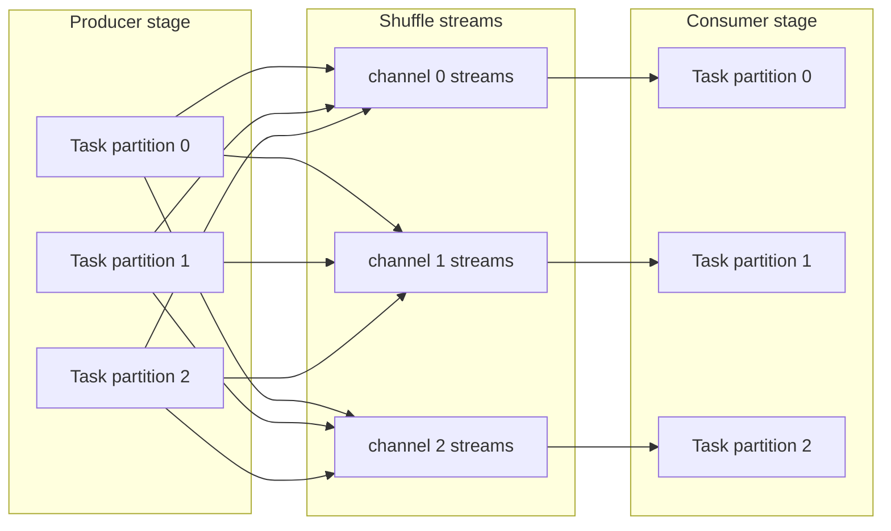
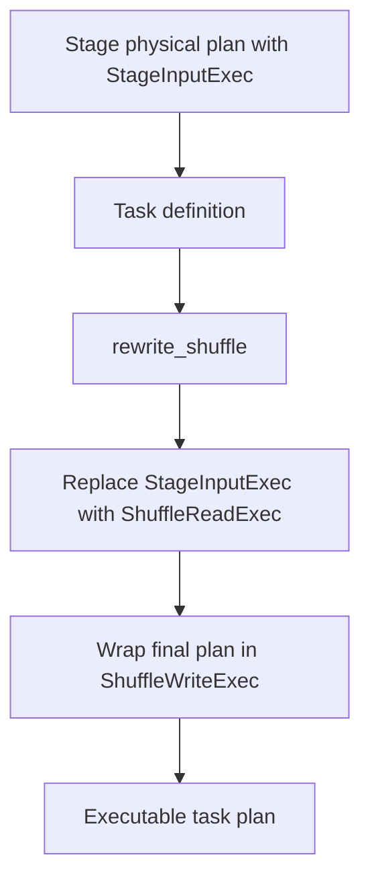
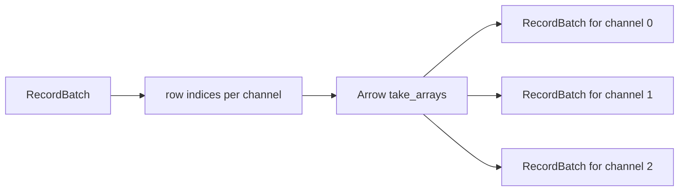
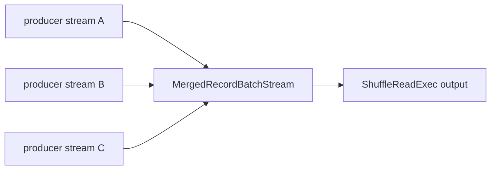
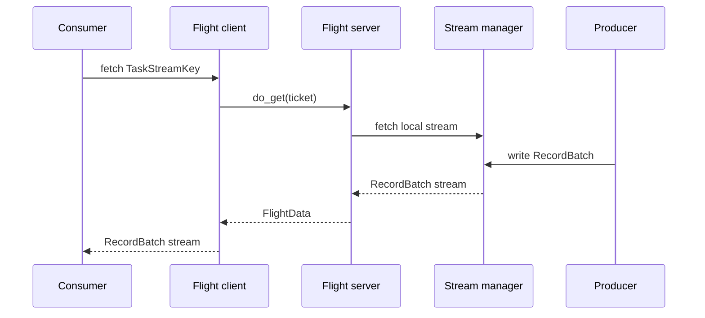
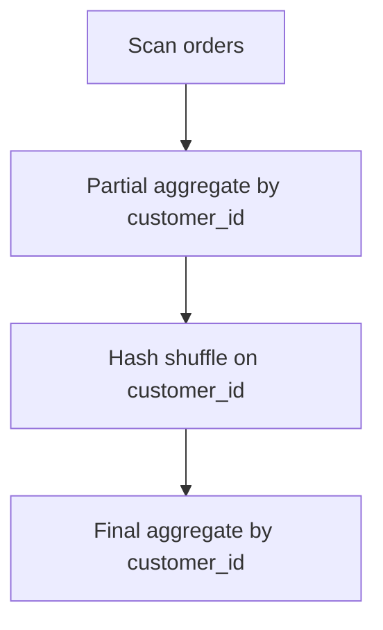
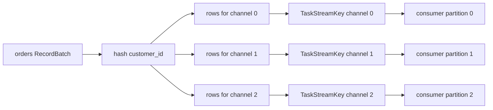

# Chapter 9: Shuffle And Data Movement

Shuffle is where a distributed query engine proves that it is actually distributed.

Up to this point, the book has followed Sail from the front door through logical plans,
DataFusion physical plans, stage graphs, drivers, workers, and task execution. This
chapter zooms in on the data plane: how a `RecordBatch` produced by one task becomes
input to another task, possibly on another worker, under a distribution chosen by the
query plan.

In Sail, this movement is expressed in a compact set of ideas:

- Data moves as Arrow `RecordBatch` streams.
- A stage boundary is represented in the physical plan by `StageInputExec`.
- At task runtime, `StageInputExec` is rewritten into `ShuffleReadExec`.
- The task's final physical plan is wrapped in `ShuffleWriteExec`.
- The driver assigns stream keys, channel numbers, and read/write locations.
- The stream subsystem moves batches through local memory today, with Arrow Flight
  as the remote transport shape.

That last phrase is important: Sail already has the architecture of a networked
shuffle service, but some remote and blocking pieces are intentionally not finished.
This makes the codebase unusually good for learning. You can see the shape of a
distributed engine without getting lost in years of accumulated production machinery.

## Code Map

The core shuffle code lives in these files:

| Concern | File |
|---|---|
| Physical shuffle writer | `crates/sail-execution/src/plan/shuffle_write.rs` |
| Physical shuffle reader | `crates/sail-execution/src/plan/shuffle_read.rs` |
| Merging task streams | `crates/sail-execution/src/stream/merge.rs` |
| Round-robin partitioning | `crates/sail-physical-plan/src/repartition.rs` |
| Task input/output definitions | `crates/sail-execution/src/task/definition.rs` |
| Scheduler input/output placement | `crates/sail-execution/src/driver/job_scheduler/core.rs` |
| Runtime shuffle rewrite | `crates/sail-execution/src/task_runner/core.rs` |
| Stream reader and writer traits | `crates/sail-execution/src/stream/reader.rs`, `crates/sail-execution/src/stream/writer.rs` |
| Actor bridge to stream manager | `crates/sail-execution/src/stream_accessor/core.rs` |
| Local stream manager | `crates/sail-execution/src/stream_manager/core.rs` |
| In-memory stream replicas | `crates/sail-execution/src/stream_manager/local.rs` |
| Arrow Flight stream service | `crates/sail-execution/src/stream_service/server.rs`, `crates/sail-execution/src/stream_service/client.rs` |

If Chapter 8 was about who runs the work, this chapter is about how the work's bytes
find the next consumer.

## The Vocabulary Of Movement

Sail's shuffle layer uses a small vocabulary. Once these terms are clear, the rest of
the code becomes much easier to read.

| Term | Meaning |
|---|---|
| Stage | A group of physical operators that can run without needing data from a later exchange. |
| Task | One partition of a stage, executed as one attempt. |
| Partition | A task-level unit of parallelism within a stage. |
| Channel | A logical output lane from a producer stage to a consumer stage. |
| Attempt | A retry number for a task. Attempts are part of stream keys. |
| Task input | A set of stream locations that a task should read. |
| Task output | A distribution and locator that describe where a task should write. |
| Stream key | The stable identity of a task stream: job, stage, partition, attempt, channel. |
| Location | Where the stream lives: driver, worker, or remote URI for reads; local or remote for writes. |

The central identity is `TaskStreamKey`. Conceptually, it looks like this:

```text
TaskStreamKey {
  job_id,
  stage,
  partition,
  attempt,
  channel,
}
```

The `channel` field is the part that turns one task output into many possible inputs.
If a producer stage has four upstream partitions and eight shuffle channels, each
producer task may write eight streams. A downstream task then reads the channel or
channels assigned to it from all relevant producer partitions.

That gives Sail the basic distributed exchange shape:



For a hash shuffle, "channel 1" means "rows whose hash maps to bucket 1." For a
round-robin shuffle, it means "the next row assigned to lane 1." For a broadcast-like
movement, the scheduler may arrange the input keys so multiple consumers can read the
same producer output.

## From Job Graph To Task Definition

The job graph knows that one stage depends on another. It does not directly contain
open streams. Before a worker can execute a task, the driver must turn graph edges
into concrete task inputs and outputs.

That happens in `JobScheduler::get_task_input()` and `JobScheduler::get_task_output()`
in `crates/sail-execution/src/driver/job_scheduler/core.rs`.

For task inputs, the scheduler:

1. Finds the producer stage for the input.
2. Determines the producer partition count and channel count.
3. Computes the `TaskInputKey` values that this consumer task should read.
4. Finds the latest successful or assigned attempt for each producer partition.
5. Turns those keys into a `TaskInputLocator`.

The input locator records where the consumer should fetch streams from:

```text
TaskInputLocator::Driver { keys }
TaskInputLocator::Worker { worker_id, keys }
TaskInputLocator::Remote { uri, keys }
```

For task outputs, the scheduler:

1. Reads the output distribution from the job graph.
2. Serializes hash expressions if the output is hash-partitioned.
3. Chooses the output locator.
4. Returns a `TaskOutput`.

Today, pipelined output is local:

```text
TaskOutputLocator::Local { replicas }
```

The remote and blocking-output branches are present as design points, but blocking
output placement still has `todo!()` markers. That is one of the places where the
extensions proposal can hook into the architecture later.

The result is not an open socket or a live stream. It is a serializable task
definition: inputs, outputs, partition numbers, attempts, and encoded expressions.
That definition can be sent to a worker.

## The Runtime Rewrite

The most important shuffle transition happens inside `TaskRunner::rewrite_shuffle()`
in `crates/sail-execution/src/task_runner/core.rs`.

The stage-level physical plan contains placeholders:

```text
StageInputExec<usize>
```

Those placeholders are not executable by themselves. They say, "this is where this
stage reads from an upstream stage." When the task runner receives the concrete
`TaskInput` values from the driver, it rewrites each placeholder into a real reader:

```rust
StageInputExec<usize> -> ShuffleReadExec
```

Then the task runner wraps the whole plan with a writer:

```rust
plan -> ShuffleWriteExec(plan)
```

The shape is:



That rewrite is the bridge between planning and execution:

- Planning says which stages depend on which other stages.
- Scheduling says where the task's input and output streams live.
- Runtime rewriting turns those locations into physical execution nodes.

This is a powerful Rust pattern in miniature. The stage plan is generic and reusable.
The task plan is concrete and contextual. Sail uses a tree transform to keep those
concerns separated until the last responsible moment.

## Writing Shuffle Output

`ShuffleWriteExec` is a DataFusion `ExecutionPlan` implementation, but it behaves a
little differently from ordinary relational operators. It does not produce meaningful
rows downstream. Its job is to consume its child plan, partition the child batches, and
write the resulting batches into task streams.

Its main fields are:

```rust
pub struct ShuffleWriteExec {
    plan: Arc<dyn ExecutionPlan>,
    shuffle_partitioning: Partitioning,
    locations: Vec<Vec<TaskWriteLocation>>,
    properties: Arc<PlanProperties>,
    writer: Arc<dyn TaskStreamWriter>,
}
```

Read those fields as a sentence:

"Run this child `plan`, partition its output according to `shuffle_partitioning`, and
write this task partition's output to the given `locations` using a `TaskStreamWriter`."

The `locations` field is a two-dimensional vector:

```text
locations[input_partition][channel]
```

During `rewrite_shuffle()`, Sail creates a vector with one outer entry per output
partition and fills only the current task partition:

```text
locations[key.partition].extend(output.locations(key))
```

That means `ShuffleWriteExec::execute(partition, context)` can look up the exact
write locations for the partition DataFusion is asking it to execute.

### Partitioning

Sail supports two writer-side partitioning modes here:

```text
Partitioning::Hash(keys, channels)
Partitioning::RoundRobinBatch(channels)
```

There is also `UnknownPartitioning`, which Sail treats like round-robin for write
purposes.

Hash partitioning uses DataFusion's `BatchPartitioner`. This is the natural choice
because DataFusion already knows how to evaluate physical expressions against Arrow
batches and assign rows to hash buckets.

Round-robin partitioning uses Sail's own `RowRoundRobinPartitioner` in
`crates/sail-physical-plan/src/repartition.rs`. It is intentionally Arrow-native:

1. Build row-index arrays for each destination partition.
2. Use Arrow's `take_arrays()` compute kernel to select the rows for each partition.
3. Construct new `RecordBatch` values with the same schema.

That avoids converting rows into Rust structs or ad hoc values. The shuffle layer
stays columnar.



The start index for round-robin is derived from the input partition:

```text
start = (input_partition * num_partitions) / num_input_partitions
```

That small detail helps distribute initial rows across output channels when multiple
input partitions are writing at once.

### Sinks And Side Effects

The heart of shuffle writing is the `shuffle_write()` helper:

1. Open one sink per write location.
2. Pull batches from the child plan stream.
3. Partition each batch into per-channel batches.
4. Write each per-channel batch to its sink.
5. Close remaining sinks when input is exhausted.

A simplified sketch:

```rust
let mut sinks = locations
    .into_iter()
    .map(|location| writer.open(location, schema.clone()))
    .collect::<FuturesOrdered<_>>();

while let Some(batch) = stream.next().await.transpose()? {
    let partitions = partitioner.partition(&batch)?;
    for (sink, maybe_batch) in sinks.iter_mut().zip(partitions) {
        if let Some(batch) = maybe_batch {
            sink.write(batch).await?;
        }
    }
}

for sink in sinks {
    sink.close().await?;
}
```

The actual code tracks sink state:

```text
TaskStreamSinkState::Ok
TaskStreamSinkState::Error
TaskStreamSinkState::Closed
```

This matters because a downstream consumer may stop early. A `LIMIT` query is the
classic example: once the driver has enough rows, some readers may close. Sail treats
closed sinks differently from failed sinks so that early termination does not
necessarily become a query failure.

`ShuffleWriteExec::execute()` returns a stream, because DataFusion expects every
physical operator to return a `SendableRecordBatchStream`. But the useful work happens
as a side effect: writing to task streams. After writing, the operator emits an empty
`RecordBatch`.

That makes `ShuffleWriteExec` a boundary operator. It turns a normal DataFusion stream
into Sail task output.

## Reading Shuffle Input

`ShuffleReadExec` is the mirror image. Its fields are:

```rust
pub struct ShuffleReadExec {
    locations: Vec<Vec<TaskReadLocation>>,
    properties: Arc<PlanProperties>,
    reader: Arc<dyn TaskStreamReader>,
}
```

Again, read the fields as a sentence:

"For this output partition, open these task stream locations using this reader, then
merge the resulting Arrow streams."

`execute(partition, context)`:

1. Looks up `locations[partition]`.
2. Opens each location with `reader.open(location, schema.clone())`.
3. Merges all opened streams into one `RecordBatchStream`.

The merge is handled by `MergedRecordBatchStream` in
`crates/sail-execution/src/stream/merge.rs`. Internally, it uses a `SelectAll` over
the task streams. That means batches are yielded as upstream streams become ready,
not by fully draining one producer before reading the next.



This is why a consumer task can start processing a pipelined shuffle before every
producer has finished, as long as its input streams are available.

## Locations Become Streams

`ShuffleReadExec` and `ShuffleWriteExec` do not know whether a stream is in process,
on another worker, or behind an Arrow Flight endpoint. They depend on two traits:

```rust
pub trait TaskStreamReader {
    async fn open(
        &self,
        location: TaskReadLocation,
        schema: SchemaRef,
    ) -> Result<TaskStreamSource>;
}

pub trait TaskStreamWriter {
    async fn open(
        &self,
        location: TaskWriteLocation,
        schema: SchemaRef,
    ) -> Result<Box<dyn TaskStreamSink>>;
}
```

The concrete implementation used by tasks is `StreamAccessor`. It sends actor
messages to the stream manager:

```text
ShuffleReadExec
  -> TaskStreamReader::open
  -> StreamAccessor
  -> actor message
  -> StreamManager

ShuffleWriteExec
  -> TaskStreamWriter::open
  -> StreamAccessor
  -> actor message
  -> StreamManager
```

This is a nice example of Rust interface design in Sail:

- The execution plans depend on small async traits.
- The actor system stays outside the DataFusion operator implementation.
- Local and remote stream mechanisms can evolve behind the accessor boundary.

## Local Memory Streams

The local stream manager has three visible states for local streams:

```text
Pending
Created
Failed
```

This solves a real scheduling race. A consumer may ask for a stream before the producer
has created it. Rather than fail immediately, the manager can register that the stream
is pending and wake the reader when the producer creates it. If creation never happens,
the pending stream eventually times out.

For in-memory streams, Sail uses replicas. A local output location includes:

```text
LocalStreamStorage::Memory { replicas }
```

The producer writes each batch to the active replica senders. This supports multiple
readers for the same produced stream, which is useful for broadcast-like movement and
for cases where more than one consumer needs the same task output.

The memory stream implementation also handles closed receivers. If a receiver is
closed, the producer can keep writing to remaining active replicas. Once no active
replicas remain, the sink can report `Closed`.

That behavior is one of the quiet but important pieces of distributed query execution:
the data plane must distinguish "nobody needs this anymore" from "the query is broken."

## Arrow Flight As The Remote Shape

Local streams are the implemented fast path, but Sail's stream service shows the
remote transport shape: Arrow Flight.

On the server side, `do_get`:

1. Decodes a `TaskStreamTicket`.
2. Fetches the requested task stream.
3. Encodes `RecordBatch` values as Flight data.
4. Returns a Flight stream.

On the client side, `TaskStreamFlightClient::fetch_task_stream()`:

1. Builds a ticket for the requested task stream.
2. Calls Flight `do_get`.
3. Wraps the returned Flight data as a `RecordBatch` stream.

The important architecture point is that Flight does not replace Arrow batches. It
transports them. Sail's task operators still speak in `RecordBatch` streams on both
sides of the network boundary.



This is the main reason Arrow Flight fits a system like Sail so well. It lets the
engine preserve its columnar execution model while crossing process and machine
boundaries.

## A Hash Shuffle Walkthrough

Imagine a query like:

```sql
SELECT customer_id, COUNT(*)
FROM orders
GROUP BY customer_id
```

At scale, each worker can scan a subset of `orders`, but final groups must be brought
together by `customer_id`. Rows with the same `customer_id` need to land in the same
downstream partition.

The high-level plan is:



In Sail terms:

1. The planner inserts a stage boundary at the exchange.
2. The producer stage output distribution is `Hash`.
3. The scheduler serializes the hash expression into `TaskOutputDistribution::Hash`.
4. The task runner decodes that expression back into DataFusion physical expressions.
5. `ShuffleWriteExec` uses DataFusion's `BatchPartitioner`.
6. Each producer task writes one stream per hash channel.
7. Each consumer task opens the producer streams for its assigned channel.
8. `ShuffleReadExec` merges those streams.
9. The final aggregate sees a normal input stream of Arrow batches.

The row movement looks like this:



Notice what does not happen:

- Sail does not serialize rows into a custom row format at the shuffle boundary.
- Sail does not make `ShuffleReadExec` understand hash expressions.
- Sail does not make the scheduler evaluate data.

Each layer keeps a narrow job.

## Other Movement Patterns

Hash shuffle is the easiest to visualize, but Sail's input-key construction can
represent several movement patterns.

### One-To-One

A downstream partition reads the corresponding upstream partition. This is the
cheapest movement pattern and is useful when partitioning is already compatible.

```text
producer partition 0 -> consumer partition 0
producer partition 1 -> consumer partition 1
```

### Hash

Every producer may write every channel. Each consumer reads the channel or channels
assigned to it.

```text
producer partition N, channel C -> consumer partition C
```

### Round Robin

Rows are spread across output channels without using data values as keys. Sail's
round-robin partitioner uses Arrow `take` kernels to construct the destination
batches.

### Broadcast

The same upstream output is made readable by multiple downstream consumers. Local
memory stream replicas are the stream-level mechanism that makes this possible.

### Merge

Many upstream streams are merged into one downstream stream. `MergedRecordBatchStream`
is the simple core abstraction here.

### Rescale

Producer and consumer partition counts may differ. The scheduler's input-key builder
can assign groups of producer streams to consumer partitions.

The exact key-building logic belongs to the scheduler, not the stream operators. This
is another example of Sail's separation between control plane and data plane.

## Failure, Attempts, And Early Termination

Distributed data movement needs identity. Without identity, retries are dangerous:
a consumer might accidentally read data from an old failed attempt.

Sail includes `attempt` in every task stream key:

```text
job_id / stage / partition / attempt / channel
```

The scheduler chooses the latest attempt when building task input keys. That lets the
system distinguish replacement work from old work.

There are also several important runtime behaviors:

- Pending streams allow consumers and producers to start in either order.
- Pending stream timeouts prevent consumers from waiting forever.
- Closed sinks can be normal if downstream no longer needs the data.
- Failed streams are distinct from closed streams.
- Stream errors are mapped back into DataFusion errors at the merge boundary.

These are small details, but they are the difference between a toy exchange and an
engine that can tolerate real distributed timing.

## What Is Still Open

Sail's shuffle architecture is intentionally extensible, but several pieces are still
not complete:

- Blocking shuffle output placement is not implemented.
- Remote stream creation and fetch paths are design points rather than complete
  production paths.
- Disk-backed local shuffle storage exists in the type model, but memory is the main
  implemented path.
- More sophisticated backpressure, spill, and shuffle cleanup policies would be needed
  for a large production deployment.

For the purposes of this book, that is a feature. The code shows the essential shape:
plans, task definitions, stream keys, local memory streams, and Arrow Flight transport.
The missing pieces are exactly where extension proposals can become concrete.

## Extension Hooks

Shuffle is one of the most important places for extensions because it sits between
query semantics and physical deployment.

A Sail extension that wants to influence data movement could attach at several levels:

| Extension goal | Likely hook |
|---|---|
| New partitioning strategy | Job graph output distribution and `TaskOutput::partitioning()` |
| Custom hash expression support | Physical expression serialization and parsing |
| Alternative shuffle transport | `TaskStreamReader`, `TaskStreamWriter`, and `StreamAccessor` |
| External shuffle service | `TaskReadLocation::Remote`, `TaskWriteLocation::Remote`, Arrow Flight service |
| Disk or object-store shuffle | `LocalStreamStorage`, remote locators, blocking output placement |
| Adaptive repartitioning | Scheduler key construction and stage output metadata |
| Broadcast optimization | Replica planning and input-key construction |

This gives us a preview of the final chapter. The extensions proposal should not be
treated as a plugin system floating above the engine. For distributed query processing,
extensions need to meet Sail at the same boundaries Sail already uses internally:

- plan nodes,
- physical expressions,
- task definitions,
- stream locations,
- shuffle distributions,
- catalog and function registries,
- and execution services.

The cleanest extension architecture will preserve those boundaries rather than bypass
them.

## Reading Exercise

Trace one hash-shuffled row through the code:

1. Start in `TaskRunner::rewrite_shuffle()`.
2. Find where `TaskOutput::partitioning()` converts task output metadata into
   `Partitioning::Hash`.
3. Open `ShuffleWriteExec::execute()` and follow the creation of the partitioner.
4. Follow `shuffle_write()` until it calls `sink.write(batch)`.
5. Open `StreamAccessor` and see how the write location becomes a stream-manager
   message.
6. Then reverse direction through `ShuffleReadExec::execute()`.
7. End in `MergedRecordBatchStream::poll_next()`.

The important question to ask at every step is: "Is this layer deciding where data
should go, or only carrying out a decision made earlier?"

That question is the key to reading distributed query engines.

## Takeaways

Sail's shuffle layer is small enough to study and rich enough to teach the real ideas:

- Shuffle is expressed as Arrow `RecordBatch` streams, not row objects.
- The scheduler chooses keys, attempts, channels, and locations.
- The task runner rewrites stage placeholders into concrete shuffle operators.
- `ShuffleWriteExec` partitions and writes batches as a side effect.
- `ShuffleReadExec` opens task streams and merges them.
- Local memory streams support pending readers and replicas.
- Arrow Flight provides the natural shape for remote batch transport.
- The open areas around remote, blocking, disk, and adaptive shuffle are prime
  extension points.

The next chapter moves from movement to memory and execution behavior: how Arrow batch
size, streaming, boundedness, and operator properties influence distributed execution.
