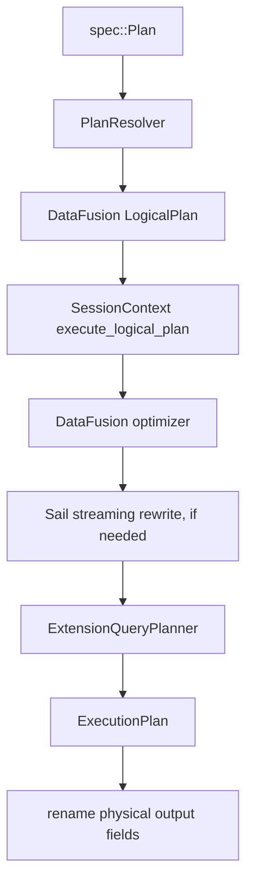
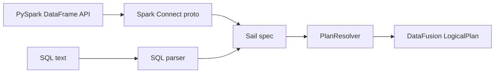
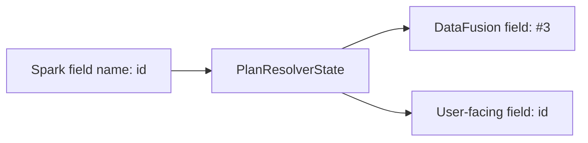
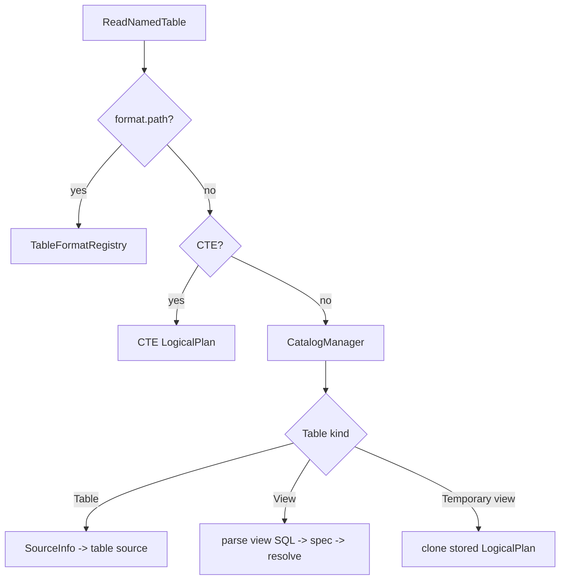
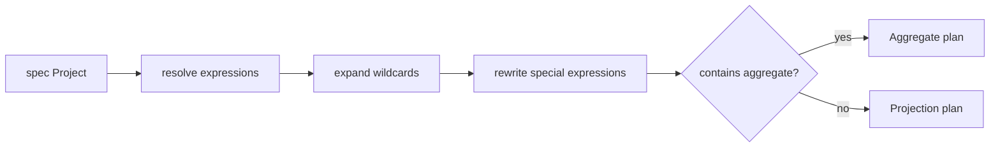
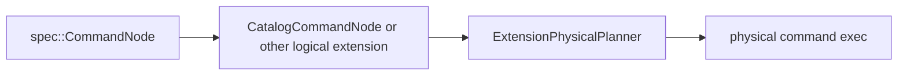
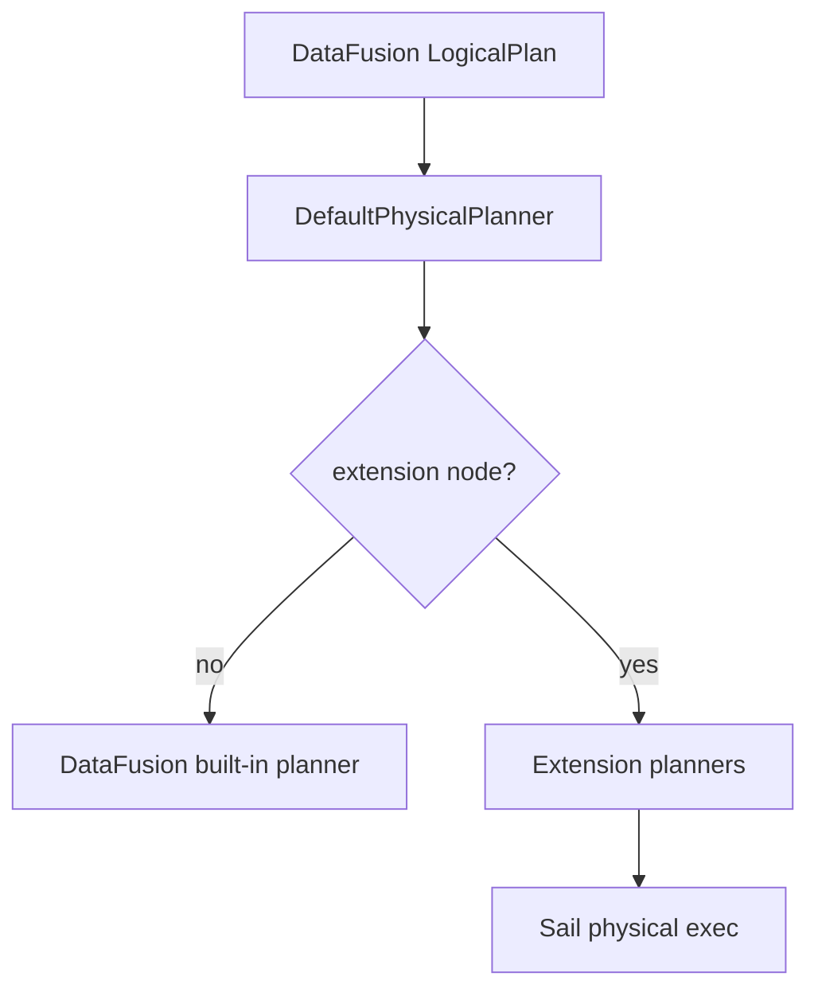
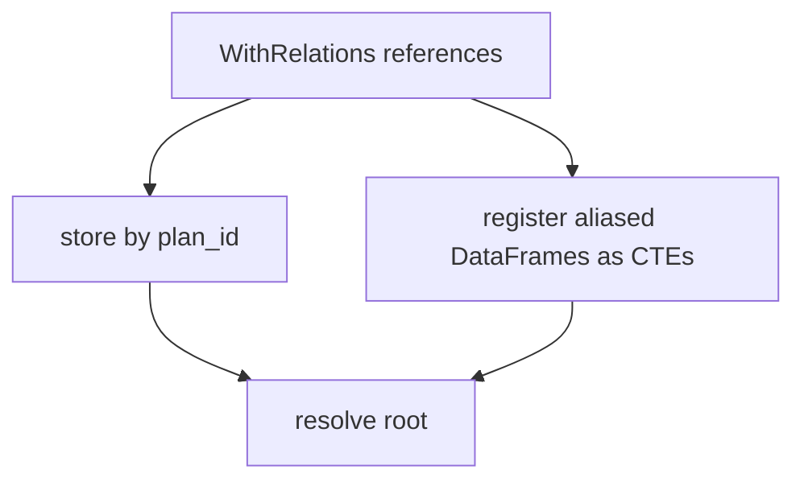
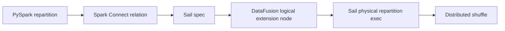

# Chapter 10: The Sail Spec And Plan Resolver

Spark Connect sends unresolved intent. DataFusion executes resolved logical and
physical plans. Sail's plan layer is the translation space between those two worlds.

This chapter is about that translation space.

In previous chapters, we followed query execution once DataFusion had a physical plan.
Now we step earlier in the life of a query, into the code that decides what a Spark
Connect relation, SQL statement, unresolved column, function call, catalog command, or
UDF registration actually means inside Sail.

The central idea is simple but powerful:

```text
Spark Connect proto or SQL
  -> Sail spec
  -> DataFusion LogicalPlan
  -> DataFusion optimizer
  -> Sail/DataFusion physical planning
  -> distributed execution
```

The Sail spec is not DataFusion's logical plan. It is also not exactly Spark Connect's
protobuf model. It is Sail's own unresolved intermediate representation, designed to be
easy to parse, serialize, inspect, and resolve.

That makes it one of the most important extension points in the whole architecture.

## Code Map

The main files for this chapter are:

| Concern | File |
|---|---|
| Plan execution entry point | `crates/sail-plan/src/lib.rs` |
| Resolver entry point | `crates/sail-plan/src/resolver/plan.rs` |
| Resolver state | `crates/sail-plan/src/resolver/state.rs` |
| Query resolver dispatch | `crates/sail-plan/src/resolver/query/mod.rs` |
| Expression resolver dispatch | `crates/sail-plan/src/resolver/expression/mod.rs` |
| Command resolver dispatch | `crates/sail-plan/src/resolver/command/mod.rs` |
| Attribute resolution | `crates/sail-plan/src/resolver/expression/attribute.rs` |
| Function resolution | `crates/sail-plan/src/resolver/expression/function.rs` |
| Table and data source reads | `crates/sail-plan/src/resolver/query/read.rs` |
| Repartition nodes | `crates/sail-plan/src/resolver/query/repartition.rs` |
| WithRelations support | `crates/sail-plan/src/resolver/query/with_relations.rs` |
| Sail spec plan model | `crates/sail-common/src/spec/plan.rs` |
| Sail spec expression model | `crates/sail-common/src/spec/expression.rs` |
| Sail spec data types | `crates/sail-common/src/spec/data_type.rs` |
| Spark Connect relation conversion | `crates/sail-spark-connect/src/proto/plan.rs` |
| Spark Connect expression conversion | `crates/sail-spark-connect/src/proto/expression.rs` |
| Spark Connect execution handler | `crates/sail-spark-connect/src/service/plan_executor.rs` |
| DataFusion extension physical planner | `crates/sail-session/src/planner.rs` |

Useful external references:

- [Spark Connect Overview](https://spark.apache.org/docs/latest/spark-connect-overview.html)
- [Apache Spark Connect architecture page](https://spark.apache.org/spark-connect/)
- [Application Development with Spark Connect](https://spark.apache.org/docs/4.1.1/app-dev-spark-connect.html)
- [Spark Connect `base.proto`](https://github.com/apache/spark/blob/master/sql/connect/common/src/main/protobuf/spark/connect/base.proto)
- [Spark Connect `relations.proto`](https://github.com/apache/spark/blob/master/sql/connect/common/src/main/protobuf/spark/connect/relations.proto)
- [Spark Connect `expressions.proto`](https://github.com/apache/spark/blob/master/sql/connect/common/src/main/protobuf/spark/connect/expressions.proto)

Spark's own documentation describes Spark Connect as a client-server architecture where
clients send unresolved logical plans over gRPC and receive Arrow-encoded batches back.
Sail follows that same shape, but swaps Spark's analyzer and engine for Sail's resolver,
DataFusion's optimizer, and Sail's distributed runtime.

## Why Sail Has A Spec Layer

The spec layer lives in `sail_common::spec`.

At first glance, it may look like a reimplementation of Spark Connect relations and
expressions. That is only partly true. The comment above `spec::Plan` explains the
design: the starting point is Spark Connect's `Relation` model, but Sail makes
intentional changes.

The spec layer:

- separates query plans from command plans,
- avoids raw SQL strings as unresolved plan nodes,
- uses parsed schemas rather than schema strings,
- prefers Rust naming and serde-friendly enum shapes,
- adds nodes needed by SQL and Sail that are not direct Spark Connect relation nodes,
- stores data types, literals, expressions, and plans in one common model.

That gives Sail a stable internal contract:

```rust
pub enum Plan {
    Query(QueryPlan),
    Command(CommandPlan),
}
```

Both query and command plans carry optional `plan_id` values:

```rust
pub struct QueryPlan {
    pub node: QueryNode,
    pub plan_id: Option<i64>,
}

pub struct CommandPlan {
    pub node: CommandNode,
    pub plan_id: Option<i64>,
}
```

Those plan IDs matter because Spark Connect clients often reference subplans and
attributes by ID. Sail preserves that identity through conversion and uses it during
resolution.

## The Full Planning Pipeline

The public planning entry point is `resolve_and_execute_plan()` in
`crates/sail-plan/src/lib.rs`.

Despite the name, it does more than execute. It performs the whole plan path up to an
executable physical plan:

```rust
pub async fn resolve_and_execute_plan(
    ctx: &SessionContext,
    config: Arc<PlanConfig>,
    plan: spec::Plan,
) -> PlanResult<(Arc<dyn ExecutionPlan>, Vec<StringifiedPlan>)>
```

The steps are:

1. Build a `PlanResolver`.
2. Resolve a `spec::Plan` into a DataFusion `LogicalPlan`.
3. Record the initial logical plan for explain output.
4. Ask DataFusion to create a `DataFrame` from the logical plan.
5. Optimize the logical plan with DataFusion's session state.
6. Rewrite streaming plans if needed.
7. Ask the session query planner to create a physical plan.
8. Rename physical output fields back to user-facing names when needed.
9. Return the physical plan and plan strings.

In diagram form:



This is the same boundary we saw from the other side in earlier chapters:

- Chapter 6 focused on DataFusion plans.
- Chapter 7 split physical plans into a job graph.
- This chapter explains how Sail gets to the logical plan in the first place.

## Spark Connect To Sail Spec

Spark Connect requests arrive as generated protobuf Rust types in
`crates/sail-spark-connect`. The conversion layer turns those types into Sail spec
values.

The important conversion file is:

```text
crates/sail-spark-connect/src/proto/plan.rs
```

For relations:

```rust
impl TryFrom<Relation> for spec::Plan
impl TryFrom<Relation> for spec::QueryPlan
impl TryFrom<Relation> for spec::CommandPlan
impl TryFrom<RelType> for RelationNode
```

This conversion has to make a decision: is a Spark Connect relation a query node or a
command node?

Sail uses an internal helper enum:

```rust
enum RelationNode {
    Query(spec::QueryNode),
    Command(spec::CommandNode),
}
```

That matters because Spark Connect has several operation shapes. Some produce
relations; others execute side effects or return command results. Sail normalizes them
into `spec::Plan::Query` or `spec::Plan::Command`.

For expressions, the conversion file is:

```text
crates/sail-spark-connect/src/proto/expression.rs
```

There, Spark Connect expressions become `spec::Expr`:

```rust
impl TryFrom<Expression> for spec::Expr
```

Examples:

| Spark Connect expression | Sail spec expression |
|---|---|
| `Literal` | `spec::Expr::Literal` |
| `UnresolvedAttribute` | `spec::Expr::UnresolvedAttribute` |
| `UnresolvedFunction` | `spec::Expr::UnresolvedFunction` |
| `ExpressionString` | parsed SQL expression, then Sail spec |
| `UnresolvedStar` | `spec::Expr::UnresolvedStar` |
| `Alias` | `spec::Expr::Alias` |
| `Cast` | `spec::Expr::Cast` |
| `Window` | `spec::Expr::Window` |
| `CommonInlineUserDefinedFunction` | `spec::Expr::CommonInlineUserDefinedFunction` |
| `SubqueryExpression` | `spec::Expr::Subquery` |

This is the first important lesson: Sail does not resolve columns or functions while
converting protobuf messages. It only parses the client's intent into Sail's own
unresolved representation.

That keeps Spark Connect compatibility code separate from analysis.

## SQL To Sail Spec

Spark Connect is not the only source of spec plans. SQL also enters the same model.

The conversion layer uses `sail_sql_analyzer` helpers such as:

```rust
parse_one_statement
from_ast_statement
parse_expression
from_ast_expression
parse_object_name
from_ast_object_name
```

For example, Spark Connect may send an `ExpressionString`. Sail parses that expression
string into an AST, then converts the AST into `spec::Expr`.

The same pattern appears for SQL commands in `handle_execute_sql_command()`:

```text
SQL string
  -> Spark Connect relation shape
  -> Sail spec plan
  -> resolver
  -> DataFusion logical plan
```

This unification is important. It means that SQL and DataFrame APIs meet before
DataFusion planning, not after.



For extension authors, this is a clue: if an extension is only available through SQL,
it is not really integrated with the Spark Connect-style architecture. A good extension
should be expressible in the spec layer or reachable through a spec-producing parser.

## The Resolver Entry Point

The resolver itself is tiny at the top:

```rust
pub struct PlanResolver<'a> {
    ctx: &'a SessionContext,
    config: Arc<PlanConfig>,
}
```

It holds:

- a DataFusion `SessionContext`,
- a `PlanConfig`.

The main entry point is `resolve_named_plan()` in
`crates/sail-plan/src/resolver/plan.rs`.

```rust
pub async fn resolve_named_plan(&self, plan: spec::Plan) -> PlanResult<NamedPlan>
```

It returns a `NamedPlan`:

```rust
pub struct NamedPlan {
    pub plan: LogicalPlan,
    pub fields: Option<Vec<String>>,
}
```

The `fields` value is subtle. Sail often gives internal columns opaque field IDs during
analysis to avoid name collisions. But the user still expects Spark-like output names.
For query plans, `resolve_named_plan()` captures the user-facing field names so the
physical plan can later be renamed back.

Commands do not get output field renaming in the same way:

```text
spec::Plan::Query   -> LogicalPlan plus user-facing fields
spec::Plan::Command -> LogicalPlan with fields = None
```

## Resolver State

Most of the interesting resolver behavior is not in `PlanResolver` itself. It is in
`PlanResolverState`.

The state tracks:

- generated internal field IDs,
- user-facing field names,
- hidden fields,
- plan IDs attached to fields,
- the outer query schema for correlated subqueries,
- aggregate resolution mode,
- CTEs,
- `WithRelations` subquery references,
- temporary config flags,
- positional and named parameter values.

The most important field-resolution trick is this:

```text
user name: "customer_id"
internal field ID: "#7"
```

The DataFusion logical plan may carry `#7`, but Sail remembers that the user-facing
name is `customer_id`.

Why do this? Because DataFrame plans can easily contain duplicate column names:

```sql
SELECT left.id, right.id
FROM left
JOIN right ON left.id = right.id
```

If both columns were simply named `id`, subsequent resolution would become ambiguous
too early or in the wrong way. Sail uses opaque internal names to keep the logical plan
well-formed while preserving Spark-facing names for display and final output.



The state also records hidden fields. Hidden fields are temporary columns needed for
analysis or execution but not intended to appear in the final output. For example, a
join or sort rewrite may need to carry a helper field through a subplan.

After resolving a query, `resolve_query_plan()` calls `remove_hidden_fields()` so the
public logical plan does not expose those helper fields.

## Query Resolution

The query resolver dispatch lives in:

```text
crates/sail-plan/src/resolver/query/mod.rs
```

It is an async recursive dispatcher over `spec::QueryNode`.

The main structure is:

```rust
match plan.node {
    QueryNode::Read { .. } => ...
    QueryNode::Project { .. } => ...
    QueryNode::Filter { .. } => ...
    QueryNode::Join(join) => ...
    QueryNode::Aggregate(aggregate) => ...
    QueryNode::Repartition { .. } => ...
    QueryNode::WithRelations { .. } => ...
    ...
}
```

Each variant delegates to a focused resolver file:

| Query shape | Resolver file |
|---|---|
| `Read` | `query/read.rs` |
| `Project` | `query/project.rs` |
| `Filter` | `query/filter.rs` |
| `Join` | `query/join.rs` |
| `Aggregate` | `query/aggregate.rs` |
| `Sort` | `query/sort.rs` |
| `Limit` | `query/limit.rs` |
| `Repartition` | `query/repartition.rs` |
| `WithRelations` | `query/with_relations.rs` |
| `UDF` and `UDTF` plan forms | `query/udf.rs`, `query/udtf.rs` |

After each query node is resolved, the dispatcher does two things:

```text
verify_query_plan(plan, state)
register_schema_with_plan_id(plan, plan_id, state)
```

That means every resolved plan must use fields known to the resolver state. If a new
resolver creates a field and forgets to register it, Sail fails with an internal
resolver error.

That is a useful invariant. It catches bugs at the boundary where Spark-compatible
names become DataFusion columns.

## Reading Tables And Data Sources

`query/read.rs` is a rich file because reading is where catalogs, file formats,
temporary views, CTEs, and dynamic table names meet.

For a named table, Sail handles several cases:

1. If the name looks like `<format>.<path>` and the format is registered, treat it as a
   direct data source read.
2. If the name matches a CTE, use the CTE plan.
3. Otherwise, ask the `CatalogManager` for a table or view.
4. For a table, build `SourceInfo` and ask `TableFormatRegistry` to create a source.
5. For a persistent view, parse the stored SQL definition and resolve it.
6. For a temporary view, clone and rename the stored logical plan.

The rough flow:



This is where Sail's session extensions begin to matter:

- `CatalogManager` supplies table and view metadata.
- `TableFormatRegistry` turns format-specific metadata into table sources.
- `PlanService` provides display and formatting helpers elsewhere in resolution.

Those are not global singletons. They are DataFusion session extensions. That design
lets Sail attach Spark-compatible services to a normal DataFusion `SessionContext`.

## Project Resolution And Rewriters

Projection is deceptively complex. The `Project` node has to handle ordinary
expressions, wildcard expansion, aliases, generators, windows, aggregate shortcuts,
and Spark-specific functions like `spark_partition_id()`.

`resolve_query_project()` follows this pattern:

1. Resolve the input plan, or create a one-row empty input when the project has no
   input.
2. Resolve each spec expression into a `NamedExpr`.
3. Expand wildcards.
4. Run projection rewriters.
5. Rewrite multi-expression functions.
6. If aggregate functions are present, rewrite the projection as an aggregate.
7. Otherwise build a DataFusion `Projection`.

The projection rewriters are especially instructive:

```rust
MonotonicIdRewriter
SparkPartitionIdRewriter
ExplodeRewriter
WindowRewriter
```

They transform expressions that cannot remain as plain scalar expressions into plan
shapes that DataFusion can execute.



This pattern appears across Sail: the spec layer preserves Spark intent, then the
resolver reshapes that intent into DataFusion-compatible logical plans.

## Attribute Resolution

Attributes are where users feel analysis quality most sharply.

The resolver handles:

- case-insensitive matching,
- qualified names,
- nested struct fields,
- plan ID filtering,
- aggregate aliases,
- hidden fields,
- outer references for correlated subqueries.

The central method is:

```rust
resolve_expression_attribute(...)
```

It tries candidates in a careful order:

1. Aggregate fields visible in `HAVING`.
2. Normal fields and nested fields.
3. Aggregate grouping fields.
4. Hidden fields.
5. Outer query fields.

Nested-field resolution is Arrow-aware. For a struct field, Sail builds a DataFusion
`get_field` scalar function expression rather than inventing a custom row accessor.

For example:

```sql
SELECT address.city FROM customers
```

becomes conceptually:

```text
column(address)
  -> get_field("city")
```

Qualified matching supports forms like:

```text
column
table.column
schema.table.column
catalog.schema.table.column
```

The helper `qualifier_matches()` performs case-insensitive comparison against
DataFusion `TableReference` values.

This is one of the places where the resolver has to act more like Spark than vanilla
DataFusion. The user's unresolved expression is not just a name; it carries Spark
resolution expectations.

## Function Resolution

Function resolution lives mainly in:

```text
crates/sail-plan/src/resolver/expression/function.rs
crates/sail-plan/src/function/mod.rs
```

The function resolver follows a layered lookup:

1. Normalize the function name.
2. Extract named arguments.
3. Check the catalog for registered functions, including PySpark UDFs.
4. Check Sail built-in scalar and generator functions.
5. Check Sail built-in aggregate functions.
6. Build a DataFusion expression.
7. Format a Spark-like display name.

The catalog lookup comes before built-ins because Spark Connect does not reliably mark
all UDF calls in a way Sail can trust. The code even notes this:

```text
is_user_defined_function is always false, so we need to check UDFs before built-in functions.
```

For built-ins, Sail has registries:

```rust
BUILT_IN_SCALAR_FUNCTIONS
BUILT_IN_GENERATOR_FUNCTIONS
BUILT_IN_TABLE_FUNCTIONS
```

For aggregate functions, the resolver also handles clauses like:

- `DISTINCT`,
- `FILTER`,
- `ORDER BY`,
- `IGNORE NULLS`.

For PySpark UDFs, Sail carries enough information to later execute Python code:

```rust
pub(super) struct PythonUdf {
    pub python_version: String,
    pub eval_type: spec::PySparkUdfType,
    pub command: Vec<u8>,
    pub output_type: DataType,
}
```

This is the same pattern we saw in the PySpark chapter: the Python function is not run
in the resolver. It is represented as a plan expression that later physical execution
can evaluate.

## Commands Become Logical Plans Too

Commands enter through `spec::CommandPlan` and are resolved in:

```text
crates/sail-plan/src/resolver/command/mod.rs
```

The command resolver handles catalog operations, writes, streaming writes, explains,
inserts, merge, deletes, variables, and view/table/database DDL.

Many catalog commands become DataFusion extension logical plans:

```rust
LogicalPlan::Extension(Extension {
    node: Arc::new(CatalogCommandNode::try_new(self.ctx, command)?),
})
```

Later, the physical planner recognizes `CatalogCommandNode` and turns it into:

```rust
CatalogCommandExec
```

This is the key pattern for command execution:



This lets Sail preserve DataFusion's plan pipeline even for operations that are not
ordinary relational queries.

## Logical Extension Nodes

Sail uses DataFusion logical extension nodes for Spark-specific plan concepts that
DataFusion does not natively model.

Examples include:

- `RangeNode`,
- `ShowStringNode`,
- `MapPartitionsNode`,
- `MonotonicIdNode`,
- `SparkPartitionIdNode`,
- `SortWithinPartitionsNode`,
- `SchemaPivotNode`,
- `FileWriteNode`,
- `FileDeleteNode`,
- `MergeIntoNode`,
- `ExplicitRepartitionNode`,
- streaming source/filter/limit/collector nodes,
- `CatalogCommandNode`,
- `BarrierNode`.

These nodes are planned in `crates/sail-session/src/planner.rs` by
`ExtensionPhysicalPlanner`.

That planner is installed through `ExtensionQueryPlanner`, which builds a DataFusion
`DefaultPhysicalPlanner` with extension planners:

```text
lakehouse extension planners
system table physical planner
Sail extension physical planner
```

This is a crucial architectural point: Sail does not fork DataFusion's planner. It
uses DataFusion's extension hooks.



For discussion #2001, this pattern is already half of the answer. Third-party integrations
need a disciplined way to register logical and physical extension behavior without
hard-coding every integration into `sail-session/src/planner.rs`.

## Repartition As A Bridge To Distributed Execution

`query/repartition.rs` is a compact example that connects this chapter to the shuffle
chapters.

Spark-facing repartition intent becomes a Sail logical extension node:

```rust
ExplicitRepartitionNode::new(
    Arc::new(input),
    Some(num_partitions),
    ExplicitRepartitionKind::RoundRobin,
    vec![],
)
```

For `repartitionByExpression`, Sail resolves the partition expressions and creates:

```text
ExplicitRepartitionKind::Hash
```

Later, `ExtensionPhysicalPlanner` turns `ExplicitRepartitionNode` into
`ExplicitRepartitionExec`, using DataFusion physical expressions and partitioning:

```text
RoundRobin -> Partitioning::RoundRobinBatch
Hash       -> Partitioning::Hash
Coalesce   -> UnknownPartitioning with fewer partitions
```

Then Chapter 7's job graph planner and Chapter 9's shuffle operators take over.

This path is worth memorizing:

```text
Spark repartition call
  -> spec::QueryNode::Repartition
  -> ExplicitRepartitionNode
  -> ExplicitRepartitionExec
  -> distributed stage boundary
  -> ShuffleWriteExec / ShuffleReadExec
```

That is how a user-level API becomes data movement.

## WithRelations And Plan IDs

Spark Connect can send a root relation plus referenced relations. Sail models this as:

```rust
QueryNode::WithRelations { root, references }
```

The resolver stores the references in `PlanResolverState` by `plan_id`.

It also handles a useful PySpark pattern: SQL strings can refer to DataFrames passed as
arguments. The conversion may wrap those DataFrames in `SubqueryAlias` nodes inside
`WithRelations`. Sail resolves those references and registers them as CTE-like table
names for the root query.

The flow is:



The scoping helpers in `PlanResolverState` make this safe:

- `enter_with_relations_scope()`,
- `enter_cte_scope()`.

Each helper restores the previous state on drop. This is a very Rust-flavored design:
scope cleanup is tied to ownership and `Drop`, so temporary resolver state does not
leak into the outer query.

## Commands In Spark Connect Execution

The Spark Connect plan executor in:

```text
crates/sail-spark-connect/src/service/plan_executor.rs
```

uses different modes for different operations.

Normal relations are lazy:

```text
handle_execute_relation
  -> relation.try_into()
  -> handle_execute_plan(..., Lazy)
```

Commands such as UDF registration and writes are eager and silent:

```text
handle_execute_register_function
handle_execute_write_operation
handle_execute_create_dataframe_view
handle_execute_write_operation_v2
```

They build a `spec::Plan::Command`, resolve it, execute it, drain the stream, and return
completion metadata rather than a normal relation stream.

SQL command handling has one extra twist. If a SQL string resolves to a command, Sail
executes the command and returns a local relation containing the command result. That
matches Spark Connect's expectation that a SQL command can return an opaque relation
for the client to use.

## A Worked Example: DataFrame Filter And Project

Consider a PySpark call:

```python
df = spark.table("orders").where("amount > 100").select("customer_id", "amount")
```

Spark Connect sends an unresolved relation tree roughly like:

```text
Project(customer_id, amount)
  Filter(amount > 100)
    Read(NamedTable orders)
```

Sail first converts that into spec:

```text
spec::QueryNode::Project
  spec::QueryNode::Filter
    spec::QueryNode::Read
```

Then the resolver walks bottom-up:

1. `ReadNamedTable` asks the catalog for `orders`.
2. The table source is created and fields are registered with internal IDs.
3. `Filter` resolves `amount` against the input schema.
4. `Project` resolves `customer_id` and `amount`.
5. The final schema is verified.
6. User-facing field names are captured for later physical renaming.

The interesting part is the field mapping:

```text
customer_id -> #0
amount      -> #1
```

DataFusion sees stable internal columns. The Spark client eventually sees the expected
names.

## A Worked Example: Repartition By Customer

Now consider:

```python
df.repartition(16, "customer_id")
```

At the spec level:

```text
QueryNode::RepartitionByExpression {
  partition_expressions: [UnresolvedAttribute(customer_id)],
  num_partitions: Some(16),
}
```

The resolver:

1. Resolves the input plan.
2. Resolves `customer_id` into a DataFusion column expression.
3. Builds an `ExplicitRepartitionNode` with `ExplicitRepartitionKind::Hash`.

The physical planner:

1. Converts the logical expression into a physical expression.
2. Builds `Partitioning::Hash(expressions, 16)`.
3. Creates `ExplicitRepartitionExec`.

The distributed planner:

1. Sees the repartition boundary.
2. Creates producer and consumer stages.
3. Schedules shuffle channels.
4. Uses the runtime shuffle read/write path from Chapter 9.

One user-level method call has passed through four layers:



## A Worked Example: Registered Python UDF

A registered Python UDF follows a different path.

First, Spark Connect sends a register-function command. Sail builds:

```text
spec::Plan::Command(
  spec::CommandNode::RegisterFunction(...)
)
```

The command resolver stores the function in the catalog.

Later, a query calls the function:

```python
spark.sql("SELECT my_udf(x) FROM t")
```

The expression resolver sees:

```text
spec::Expr::UnresolvedFunction("my_udf", [x])
```

It checks the catalog before built-ins, finds the PySpark unresolved UDF, resolves the
argument expressions, and builds a Python UDF expression that can be planned and
executed later.

The UDF command bytes stay as bytes. The resolver does not deserialize Python logic or
execute Python code. It only creates a typed plan representation.

That distinction is vital for distributed execution. Workers need a serializable plan
and enough metadata to run the UDF in the right execution context.

## Extension Implications

Discussion #2001 asks for an extension API for third-party DataFusion integrations:

- UDFs,
- optimizer rules,
- planner extensions,
- probably catalog/session configuration hooks,
- and Python-discoverable packages such as a hypothetical `pysail-sedona`.

This chapter reveals why the extension story cannot be only a function registry.

Extensions may need to participate in several phases:

| Phase | Why extensions need it |
|---|---|
| Spark Connect conversion | To accept custom relation, expression, or command messages. |
| Sail spec | To represent extension intent in a language-neutral, serializable form. |
| SQL analysis | To parse extension SQL syntax or functions. |
| Logical resolution | To bind names, tables, functions, and types. |
| Logical optimization | To rewrite extension plans before physical planning. |
| Physical planning | To turn extension logical nodes into execution plans. |
| Plan encoding | To send physical expressions or nodes to workers. |
| Worker registration | To ensure workers can execute extension functions and operators. |

The current architecture has useful internal patterns, but most of them are wired into
Sail itself:

- built-in function registries are static maps,
- logical extension nodes are known to Sail crates,
- `ExtensionPhysicalPlanner` has hard-coded downcasts,
- lakehouse planners are installed through a dedicated helper,
- PySpark UDFs are special-cased in resolver paths,
- Spark Connect custom extension handling is not a general plugin registry.

A mature extension design would turn those internal patterns into explicit contracts.

## A Proposed Resolver-Side Extension Shape

One possible architecture is a staged extension trait family rather than one giant
trait.

For example:

```rust
pub trait SailPlanExtension: Send + Sync {
    fn name(&self) -> &'static str;
    fn register_functions(&self, registry: &mut FunctionRegistry) -> PlanResult<()>;
    fn register_table_functions(&self, registry: &mut TableFunctionRegistry) -> PlanResult<()>;
    fn logical_resolvers(&self) -> Vec<Arc<dyn ExtensionLogicalResolver>>;
    fn logical_optimizer_rules(&self) -> Vec<Arc<dyn LogicalRewriter>>;
    fn physical_planners(&self) -> Vec<Arc<dyn ExtensionPlanner + Send + Sync>>;
    fn codecs(&self) -> Vec<Arc<dyn ExtensionCodec>>;
}
```

The goal would be to let an extension say:

```text
I know how to parse or receive this intent.
I know how to resolve it into a logical node.
I know how to optimize it.
I know how to plan it physically.
I know how to encode it for workers.
```

For Spark Connect specifically, extensions also need a protocol story. Spark Connect's
own extension guidance defines `Relation.extension`, `Command.extension`, and
`Expression.extension`, each typed as `google.protobuf.Any`. Sail's spec layer can
mirror that by introducing a `type_url`-indexed dispatcher in the resolver:

```text
Connect Relation/Expression/Command .extension
  -> SparkConnectExtensionDispatcher::dispatch(type_url, payload)
  -> extension handler resolves payload
  -> either:
       spec::QueryNode built from existing operators (pattern A, plan-time only),
     or:
       spec::QueryNode::Extension { ... } for a logical extension node (pattern B)
  -> normal Sail planning and DataFusion execution
```

Pattern A extensions never need an execution-time integration. Pattern B extensions
hand off to a logical extension node and the rest of the chapter 13 extension stack.
This makes the resolver the dispatch point for what chapter 13 calls the *plan-time
extension boundary*: a stable, protobuf-versioned, language-neutral channel that is
independent of the Rust/DataFusion-FFI work needed for custom physical operators.
Chapter 13 develops the full dispatcher design.

## Design Rules For Future Extensions

The resolver code suggests several design rules.

First, preserve unresolved intent until enough context exists. The protobuf conversion
layer should parse and normalize, but not bind names too early.

Second, keep Spark-facing names separate from engine-facing names. Any extension that
creates fields should register them through resolver state or an equivalent API.

Third, distinguish query nodes from command nodes. Side-effecting extensions should not
pretend to be ordinary projections.

Fourth, make worker compatibility explicit. If an extension creates physical operators,
workers must have the same extension and codec registrations.

Fifth, use DataFusion extension hooks where possible. Sail's strength is that it
extends DataFusion rather than replacing it.

Sixth, expose ordering and collision rules. Function names, optimizer rules, and
physical planners all need deterministic registration behavior.

## Reading Exercise

Trace a simple query:

```sql
SELECT customer_id, count(*)
FROM orders
GROUP BY customer_id
```

Suggested path:

1. Start in `crates/sail-spark-connect/src/proto/plan.rs` if the query arrives through
   Spark Connect, or in the SQL analyzer path if it starts as SQL.
2. Find the resulting `spec::QueryNode` and `spec::Expr` values.
3. Open `crates/sail-plan/src/resolver/plan.rs`.
4. Follow `resolve_named_plan()` into `resolve_query_plan()`.
5. In `query/read.rs`, follow table resolution for `orders`.
6. In `expression/attribute.rs`, follow `customer_id`.
7. In `expression/function.rs`, follow `count`.
8. In `query/aggregate.rs`, follow group-by planning.
9. Return to `resolve_and_execute_plan()` and see how DataFusion optimization begins.

The core question is:

```text
At this line, are we still describing user intent, or have we bound that intent to a
DataFusion plan object?
```

Once you can answer that, the resolver stops feeling like a forest and starts feeling
like a set of well-marked trails.

## Takeaways

The Sail spec and resolver form the semantic center of the engine:

- Spark Connect protobufs and SQL both become Sail spec plans.
- The Sail spec is an unresolved, serializable representation of Spark-compatible
  query and command intent.
- `PlanResolver` turns spec plans into DataFusion logical plans.
- `PlanResolverState` tracks internal field IDs, user-facing names, hidden fields,
  plan IDs, CTEs, subqueries, and temporary scopes.
- Query, expression, and command resolution are split into focused modules.
- Sail uses DataFusion logical extension nodes for Spark-specific behavior.
- The session physical planner turns those extension nodes into Sail physical
  execution plans.
- Extension proposal #2001 should build on these existing boundaries rather than
  bypassing them.

The next chapter turns from plans to callable behavior: functions, UDFs, UDAFs, UDTFs,
codecs, and why distributed execution makes serialization and worker-side registration
non-negotiable.
