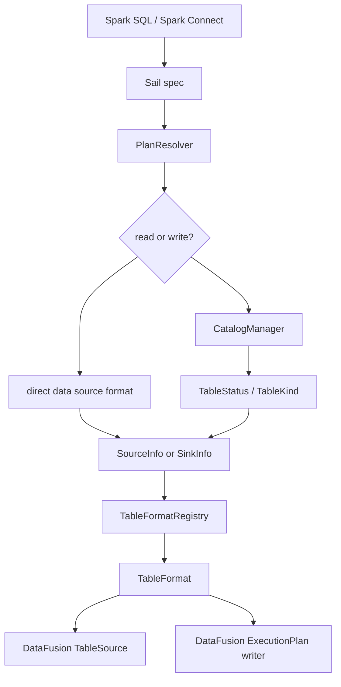
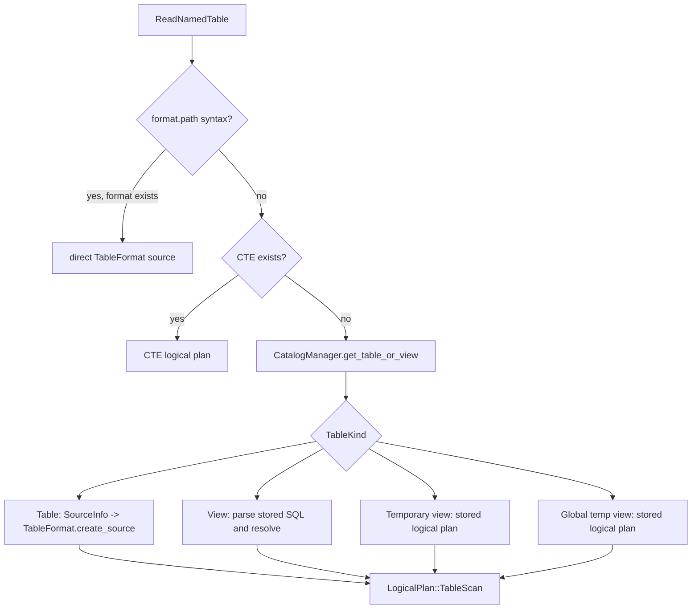
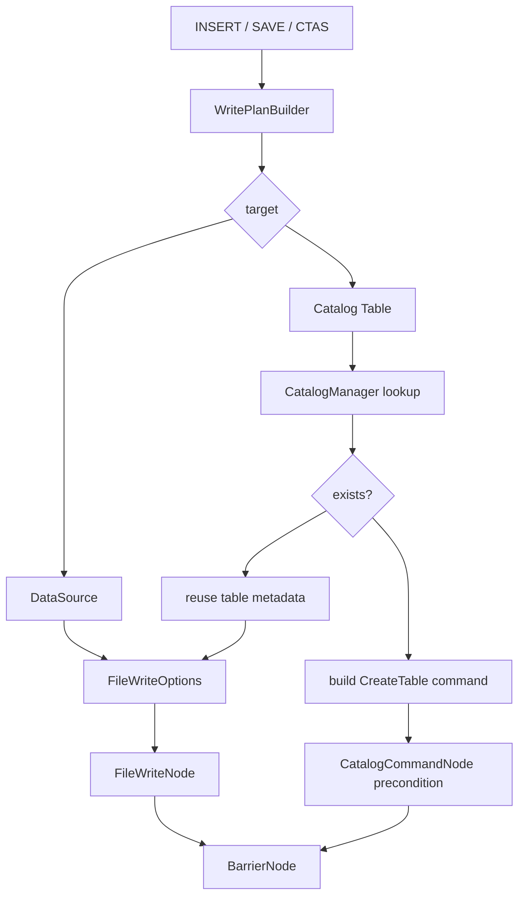
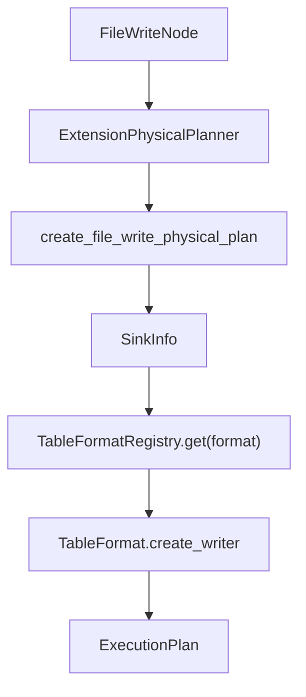
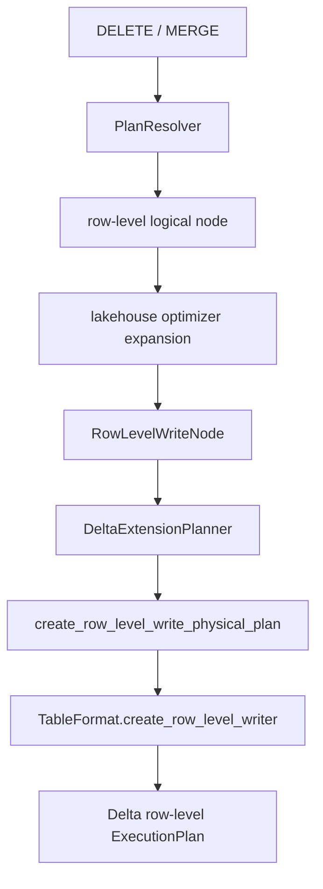

# Chapter 12: Catalogs, Lakehouse Tables, And File Formats

So far, the book has followed queries from Spark Connect through Sail specs,
DataFusion logical plans, distributed physical plans, tasks, streams, shuffles, and
functions. This chapter turns toward storage.

Storage in Sail is not a single subsystem. It is a set of contracts:

- catalogs answer "what is this name?"
- table metadata answers "what schema, location, format, partitioning, and properties does it have?"
- table formats answer "how do I read or write this storage layout?"
- physical planners answer "what executable DataFusion plan should do the work?"

That separation is one of the most important architectural lessons in Sail. It lets
Spark-compatible commands talk to Hive Metastore, Glue, Unity, Iceberg REST,
OneLake, memory catalogs, ordinary files, Delta Lake, Iceberg tables, and Python data
sources without forcing all of those concepts into one giant table abstraction.

The short version is:

```text
Spark table name or data source
  -> CatalogManager or direct format lookup
  -> TableStatus / SourceInfo / SinkInfo
  -> TableFormatRegistry
  -> DataFusion TableSource or ExecutionPlan
```

The long version is this chapter.

## Code Map

The main files for this chapter are:

| Concern | File |
|---|---|
| Catalog manager | `crates/sail-catalog/src/manager/mod.rs` |
| Catalog table/view status | `crates/sail-common-datafusion/src/catalog/status.rs` |
| Catalog command enum | `crates/sail-catalog/src/command.rs` |
| Catalog command physical exec | `crates/sail-physical-plan/src/catalog_command.rs` |
| Session catalog construction | `crates/sail-session/src/catalog.rs` |
| Table format trait and registry | `crates/sail-common-datafusion/src/datasource.rs` |
| Session table format registration | `crates/sail-session/src/formats.rs` |
| Named table and data source reads | `crates/sail-plan/src/resolver/query/read.rs` |
| Write command resolution | `crates/sail-plan/src/resolver/command/write.rs` |
| Logical file write node | `crates/sail-logical-plan/src/file_write.rs` |
| Physical file write planning | `crates/sail-physical-plan/src/file_write.rs` |
| Logical/physical delete planning | `crates/sail-logical-plan/src/file_delete.rs`, `crates/sail-physical-plan/src/file_delete.rs` |
| Generic listing table formats | `crates/sail-data-source/src/listing/source.rs` |
| Parquet format example | `crates/sail-data-source/src/formats/parquet/mod.rs` |
| Delta table format | `crates/sail-delta-lake/src/table_format.rs` |
| Iceberg table format | `crates/sail-iceberg/src/table_format.rs` |
| Lakehouse extension planners | `crates/sail-plan-lakehouse/src/lib.rs` |
| Python data source table format | `crates/sail-data-source/src/formats/python/table_format.rs` |

## The Storage Boundary

Sail has to preserve Spark behavior while using DataFusion as the execution kernel.
That means it cannot simply expose DataFusion's catalog model directly to clients.
Spark has its own rules for:

- one-part, two-part, and three-part names,
- current catalog and current database,
- temporary and global temporary views,
- `USING parquet`, `USING delta`, and `spark.read.format(...)`,
- save modes such as append, overwrite, ignore, and error-if-exists,
- table properties and data source options,
- time travel syntax,
- row-level commands such as DELETE and MERGE.

Sail translates that world into a smaller set of internal contracts.



The table format layer is where Arrow and DataFusion become visible again. Reads
produce a `TableSource`, which DataFusion can scan. Writes produce an
`ExecutionPlan`, which DataFusion can run.

## Catalogs: Names Before Data

The `CatalogManager` in `crates/sail-catalog/src/manager/mod.rs` is a session
extension. It owns:

- the configured catalog providers,
- the default catalog,
- the default database,
- the global temporary database,
- temporary views,
- registered functions,
- tracked logical plans and function objects.

Its most important job is name resolution. A query like this:

```sql
SELECT * FROM sales.orders
```

does not say whether `sales` is a catalog or a database. Sail follows Spark-style
resolution:

```text
[name]
  -> default catalog + default database + table

[prefix..., table]
  -> if prefix starts with a known catalog, use that catalog
  -> otherwise use default catalog and treat prefix as database
```

The result of resolution is not data. It is metadata: a `TableStatus`. The table can
be a physical table, a view, a temporary view, or a global temporary view.

```rust
pub enum TableKind {
    Table { ... },
    View { ... },
    TemporaryView { ... },
    GlobalTemporaryView { ... },
}
```

That enum is small, but it carries a lot of Spark compatibility:

| Kind | What Sail does with it |
|---|---|
| `Table` | Builds a table scan using the table's format, location, schema, properties, and partitioning. |
| `View` | Parses the stored SQL definition and resolves it again into a logical plan. |
| `TemporaryView` | Reuses a stored logical plan from the session. |
| `GlobalTemporaryView` | Reuses a stored logical plan from the configured global temporary database. |

This is why catalogs come before file formats. Sail cannot decide whether to invoke
Parquet, Delta, Iceberg, or Python data source code until it knows what the name
refers to.

## Catalog Providers

Session startup builds the catalog manager in `crates/sail-session/src/catalog.rs`.
The configured catalog list can include:

- memory catalog,
- Iceberg REST catalog,
- Unity catalog,
- OneLake catalog,
- Glue catalog,
- Hive Metastore catalog,
- the built-in system catalog.

Some catalog providers are wrapped in `RuntimeAwareCatalogProvider`, which lets them
perform blocking or IO-heavy setup on the runtime intended for IO. Some are wrapped
in `CachingCatalogProvider`, depending on whether the configuration asks for global
or session cache behavior.

The key Rust idea here is trait objects:

```rust
HashMap<Arc<str>, Arc<dyn CatalogProvider>>
```

Sail does not need every catalog backend to have the same concrete Rust type. It
needs each backend to implement the `CatalogProvider` contract.

That same shape reappears for table formats:

```rust
HashMap<String, Arc<dyn TableFormat>>
```

This is a pattern worth remembering for extension design: Sail favors small traits
plus session registries over large enums that must know every implementation.

## Table Formats

The central storage interface is `TableFormat` in
`crates/sail-common-datafusion/src/datasource.rs`.

Its core methods are:

```rust
#[async_trait]
pub trait TableFormat: Debug + Send + Sync {
    fn name(&self) -> &str;

    async fn create_source(
        &self,
        ctx: &dyn Session,
        info: SourceInfo,
    ) -> Result<Arc<dyn TableSource>>;

    async fn infer_schema(
        &self,
        ctx: &dyn Session,
        info: SourceInfo,
    ) -> Result<SchemaRef>;

    async fn create_writer(
        &self,
        ctx: &dyn Session,
        info: SinkInfo,
    ) -> Result<Arc<dyn ExecutionPlan>>;
}
```

There are extra hooks for row-level writes and table alteration:

```rust
async fn create_row_level_writer(...)
async fn alter_table_properties(...)
async fn alter_table_column_type(...)
fn merge_strategy(&self) -> MergeStrategy
```

This interface tells us exactly where DataFusion sits in the storage architecture:

- reads become `Arc<dyn TableSource>`;
- writes become `Arc<dyn ExecutionPlan>`;
- schema inference returns Arrow `SchemaRef`;
- format-specific behavior stays behind the trait.

The registry is intentionally simple:

```rust
pub struct TableFormatRegistry {
    formats: RwLock<HashMap<String, Arc<dyn TableFormat>>>,
}
```

Names are lowercased at registration and lookup time. That makes
`format("parquet")`, `USING PARQUET`, and mixed-case user input converge on the same
format implementation.

## Session Format Registration

`crates/sail-session/src/formats.rs` builds the table format registry for each
server session.

Built-in formats include:

```text
arrow
avro
binary
csv
json
parquet
text
socket
rate
console
noop
```

External formats are registered after the built-ins:

```text
delta
iceberg
discovered Python data sources
```

This matters for discussion #2001. Sail already has a working registry pattern for one
important category of extension. The last chapter will generalize that lesson: a
third-party extension should be able to contribute functions, optimizer rules,
physical planners, codecs, table formats, and perhaps catalog providers through a
unified registration story.

## SourceInfo: A Read Request In One Struct

Reads pass through `SourceInfo`:

```rust
pub struct SourceInfo {
    pub paths: Vec<String>,
    pub schema: Option<Schema>,
    pub constraints: Constraints,
    pub partition_by: Vec<String>,
    pub bucket_by: Option<BucketBy>,
    pub sort_order: Vec<Vec<Sort>>,
    pub options: Vec<OptionLayer>,
}
```

This struct is the bridge from Spark concepts to a format-specific reader. It can
represent:

- a direct `spark.read.format("parquet").load(path)`,
- a SQL table with catalog metadata,
- a path-based table reference such as `delta./tmp/events`,
- time-travel options,
- partition information,
- table properties and user options.

The interesting field is `options: Vec<OptionLayer>`.

```rust
pub enum OptionLayer {
    TablePropertyList { items: Vec<(String, String)> },
    OptionList { items: Vec<(String, String)> },
    TableLocation { value: String },
    AsOfTimestamp { value: String },
    AsOfIntegerVersion { value: i64 },
    AsOfStringVersion { value: String },
}
```

An option is not just a string map because not all options have the same meaning.
Sail needs to preserve the difference between:

- catalog table properties,
- user-provided data source options,
- a table location,
- timestamp or version time travel.

Older or simpler data sources can collapse layers into opaque options with
`into_opaque_options()`. Lakehouse sources can interpret the layers more precisely.

## Reading A Named Table

The main read path is `resolve_query_read_named_table()` in
`crates/sail-plan/src/resolver/query/read.rs`.

It has several branches:



The direct format branch supports Spark-style path tables:

```sql
SELECT * FROM parquet.`/tmp/orders`
SELECT * FROM delta.`/lake/events` VERSION AS OF 12
```

If the prefix is a registered format, Sail does not ask the catalog. It builds
`SourceInfo` directly from the path and options, then calls:

```rust
registry.get(format)?.create_source(&ctx.state(), info).await
```

For catalog tables, Sail reads `TableKind::Table` metadata:

- columns become an Arrow schema,
- constraints become DataFusion constraints,
- location becomes a path,
- format selects the table format,
- partitioning, bucketing, and sorting are preserved,
- table properties and user options become layered options.

The output is a DataFusion `LogicalPlan::TableScan`.

There is a subtle Spark-compatibility detail after source creation:
`resolve_table_source_with_rename()` handles duplicate column names and stored column
names. DataFusion's normal schema assumptions do not always match Spark's tolerance
for duplicate or case-insensitive field names, so Sail wraps or renames where needed.

## Reading A Data Source

The data source read path is simpler. `resolve_query_read_data_source()` handles
queries that already name a format explicitly:

```python
df = spark.read.format("json").schema(schema).option("multiLine", "true").load(path)
```

The resolver:

1. requires a format name,
2. resolves the optional schema,
3. builds `SourceInfo` from paths, schema, and options,
4. looks up the table format,
5. asks it for a `TableSource`,
6. turns that into an unnamed table scan.

No catalog lookup is necessary.

## Listing Formats: Parquet As The Normal Case

Most ordinary file formats use `ListingTableFormat<T>` in
`crates/sail-data-source/src/listing/source.rs`.

Parquet is a good example:

```rust
pub type ParquetTableFormat = ListingTableFormat<ParquetFormatFactory>;
```

The factory creates a read format and write format:

```rust
impl FormatFactory for ParquetFormatFactory {
    type Read = ParquetReadFormat;
    type Write = ParquetWriteFormat;

    fn name() -> &'static str { "parquet" }
    fn read(...) -> Result<Self::Read> { ... }
    fn write(...) -> Result<Self::Write> { ... }
}
```

For reads, `ListingTableFormat`:

- resolves paths into `ListingTableUrl`s,
- creates a DataFusion `FileFormat`,
- infers schema if the caller did not provide one,
- discovers partition columns from `key=value` path segments,
- builds `ListingOptions`,
- creates a DataFusion `ListingTable`,
- wraps it as a `TableSource`.

For writes, it:

- finds the output `path` in options,
- rejects unsupported bucketing and partition transforms,
- creates the format-specific writer,
- builds a DataFusion `FileSinkConfig`,
- calls `create_writer_physical_plan()`.

So ordinary file formats are thin adapters around DataFusion's listing table and file
writer machinery. Sail adds Spark option handling, path behavior, partition
discovery, and compatibility checks.

## SinkInfo: A Write Request In One Struct

Writes pass through `SinkInfo`:

```rust
pub struct SinkInfo {
    pub input: Arc<dyn ExecutionPlan>,
    pub mode: PhysicalSinkMode,
    pub partition_by: Vec<CatalogPartitionField>,
    pub bucket_by: Option<BucketBy>,
    pub sort_order: Option<LexRequirement>,
    pub options: Vec<OptionLayer>,
    pub logical_schema: Option<DFSchemaRef>,
}
```

The split between `SinkMode` and `PhysicalSinkMode` is important.

At logical planning time, overwrite-by-condition can still carry a logical
DataFusion expression:

```rust
SinkMode::OverwriteIf { condition }
```

At physical planning time, Sail preserves both the expression and the original SQL
source string:

```rust
PhysicalSinkMode::OverwriteIf {
    condition: Some(condition),
    source,
}
```

The `logical_schema` field is also important. Physical planning can lose Arrow field
metadata. Delta generated columns need that metadata, so Sail carries the logical
schema down to the writer.

## Write Resolution

`crates/sail-plan/src/resolver/command/write.rs` is the central write resolver.
It uses `WritePlanBuilder` to collect:

- target: data source or catalog table,
- mode: error, ignore, append, replace, truncate, conditional truncate, partition truncate,
- format,
- partitioning,
- bucketing,
- sorting,
- options,
- table properties,
- external-table flag.

The output is usually:

```text
BarrierNode(
  preconditions = catalog commands, if needed
  plan = FileWriteNode(input, FileWriteOptions)
)
```

The barrier is how Sail sequences catalog-side effects before the data write. For
example, a `CREATE TABLE AS SELECT` may need to create or replace catalog metadata
before the file writer runs.



For existing catalog tables, Sail inherits stored metadata:

- location,
- format,
- partition fields,
- sort order,
- bucket spec,
- table properties.

For new tables, Sail constructs a `CatalogCommand::CreateTable` with the input
schema and desired metadata.

## Column Matching And Generated Columns

Spark has multiple write column matching modes:

- by position,
- by name,
- by an explicit column list.

Sail rewrites the input projection accordingly before building the file write node.
That means the storage writer receives batches in table order, with casts and aliases
already inserted.

Generated columns make this more interesting. Delta can store generation expression
metadata on Arrow fields. Sail's write resolver:

1. detects generated columns from field metadata,
2. allows missing generated columns in user input,
3. computes generated expressions from the provided columns,
4. checks user-provided generated values when present,
5. attaches generation metadata to output aliases.

That logic lives before physical writing because it is relational expression work.
The Delta writer should receive a plan whose output already satisfies generated
column semantics.

## FileWriteNode And Physical Planning

`FileWriteNode` in `crates/sail-logical-plan/src/file_write.rs` is a custom
DataFusion logical extension node. It carries:

```rust
pub struct FileWriteOptions {
    pub format: String,
    pub mode: SinkMode,
    pub partition_by: Vec<CatalogPartitionField>,
    pub sort_by: Vec<Sort>,
    pub bucket_by: Option<BucketBy>,
    pub options: Vec<OptionLayer>,
}
```

It has one logical input: the query whose rows should be written.

The physical planner handles it in two places:

- the lakehouse planner intercepts Delta/Iceberg writes;
- the general session extension planner handles ordinary writes.

Both paths eventually call `create_file_write_physical_plan()` in
`crates/sail-physical-plan/src/file_write.rs`.

That function:

1. maps `SinkMode` to `PhysicalSinkMode`,
2. creates physical sort requirements,
3. builds `SinkInfo`,
4. looks up the `TableFormat`,
5. calls `create_writer()`.



The storage writer is just another DataFusion physical plan node. In distributed
execution, it can become part of the job graph like other physical operators.

## Catalog Commands As Physical Plans

Catalog commands also become DataFusion plans.

The resolver wraps commands in `CatalogCommandNode`. The session planner converts
that node into `CatalogCommandExec` in
`crates/sail-physical-plan/src/catalog_command.rs`.

At execution time, `CatalogCommandExec`:

1. retrieves `CatalogManager` from the task context extension,
2. executes the command,
3. returns a single Arrow `RecordBatch`.

That design keeps commands inside the same query execution interface as scans and
writes. A command can produce Spark-compatible tabular output, such as `SHOW TABLES`
or `DESCRIBE TABLE`, without inventing a separate result transport.

## Delta Lake

Delta implements `TableFormat` in `crates/sail-delta-lake/src/table_format.rs`.

For reads, `DeltaTableFormat`:

- parses the table path into a URL,
- resolves Delta read options,
- opens the Delta table through the object store registry,
- creates a Delta table source.

For writes, it:

- requires a path,
- rejects unsupported streaming writes,
- rejects unsupported bucketing,
- handles partition column validation,
- opens an existing table snapshot when present,
- resolves Delta write options and table properties,
- preserves generated column expressions from the logical schema,
- builds a `DeltaPhysicalPlanner`,
- returns the writer execution plan.

Delta also implements row-level writing:

```rust
async fn create_row_level_writer(
    &self,
    ctx: &dyn Session,
    info: RowLevelWriteInfo,
) -> Result<Arc<dyn ExecutionPlan>>
```

The row-level implementation chooses between eager copy-on-write and merge-on-read
based on the requested command and detected table properties.

For example:

| Command | Strategy | Delta planner path |
|---|---|---|
| DELETE | eager | `plan_delete` |
| DELETE | merge-on-read | `plan_delete_mor` |
| MERGE | eager | `plan_merge` |
| MERGE | merge-on-read | `plan_merge_mor` |
| UPDATE | not implemented yet | returns not implemented |

This is a good example of why `TableFormat` cannot stop at "read files" and "write
files." Lakehouse formats own transaction logs, table protocols, deletion vectors,
metadata actions, and row-level rewrite strategies.

## Iceberg

Iceberg implements `TableFormat` in `crates/sail-iceberg/src/table_format.rs`.

For reads, it:

- parses the table URL,
- resolves Iceberg read options,
- loads table metadata,
- creates an `IcebergTableProvider`,
- wraps it in `IcebergTableSource`.

For writes, it:

- requires a path,
- rejects unsupported bucketing,
- resolves write options,
- checks whether metadata files already exist,
- validates partition spec compatibility,
- builds an `IcebergTableConfig`,
- uses `IcebergPlanBuilder` to create the execution plan.

Iceberg also has format-specific table alteration support. For example,
`alter_table_properties()` updates Iceberg metadata files with conflict retry logic.

The file contains an explicit TODO for row-level DELETE/UPDATE/MERGE. That makes
Iceberg a useful contrast with Delta: both are table formats, but their current
row-level capabilities differ.

## Lakehouse Extension Planners

Lakehouse tables need special physical planning. `crates/sail-plan-lakehouse/src/lib.rs`
adds extension planners:

```rust
pub fn new_lakehouse_extension_planners() -> Vec<Arc<dyn ExtensionPlanner + Send + Sync>> {
    vec![
        Arc::new(sail_delta_lake::planner::DeltaTablePhysicalPlanner),
        Arc::new(sail_iceberg::IcebergTablePhysicalPlanner),
        Arc::new(DeltaExtensionPlanner),
    ]
}
```

The session query planner installs these before the general Sail extension planner.
That gives lakehouse planners first chance to handle lakehouse-specific nodes.

`DeltaExtensionPlanner` handles:

- `FileWriteNode` for lakehouse formats,
- `FileDeleteNode` for lakehouse deletes that were not expanded,
- `RowLevelWriteNode`,
- `MergeCardinalityCheckNode`.

The row-level path looks like this:



This is one of the places where distributed query processing and storage semantics
meet. A MERGE is not just a local table operation. Sail must identify target files,
join target rows with source rows, check cardinality, decide row operations, and then
commit the result in the table format's transaction protocol.

## Row-Level Metadata Columns

Sail reserves internal column names for row-level operations:

```rust
pub const MERGE_FILE_COLUMN: &str = "__sail_file_path";
pub const MERGE_ROW_INDEX_COLUMN: &str = "__sail_file_row_index";
pub const OPERATION_COLUMN: &str = "__sail_operation_type";
pub const MERGE_SOURCE_METRIC_COLUMN: &str = "__sail_merge_source_metric";
```

These columns are not user data. They are execution metadata used to track:

- which file a target row came from,
- which row inside that file was touched,
- what operation should happen to the row,
- source-side merge metrics.

`MergeCapableSource` exposes hooks for sources that can add file and row-index
columns:

```rust
pub trait MergeCapableSource {
    fn file_column_name(&self) -> Option<&str>;
    fn with_file_column(self, name: Option<String>) -> Self;
    fn row_index_column_name(&self) -> Option<&str>;
    fn with_row_index_column(self, name: Option<String>) -> Self;
}
```

This is a tiny interface with large implications. A row-level command can only be
planned safely if the scan can identify the physical rows or files that must be
rewritten or deleted.

## Python Data Sources

Python data sources are registered into the same `TableFormatRegistry` as Parquet,
Delta, and Iceberg.

`PythonTableFormat` in
`crates/sail-data-source/src/formats/python/table_format.rs` can represent:

- an entry-point discovered data source,
- a session-registered data source with embedded pickled class bytes.

For reads, it:

1. merges option layers into opaque Python options,
2. unpickles and instantiates the Python data source class,
3. obtains or discovers an Arrow schema,
4. builds a `PythonTableProvider`,
5. returns it as a DataFusion `TableSource`.

For writes, it:

1. maps Spark save modes to a Python `overwrite` boolean and a `mode` option,
2. asks the Python executor for a writer,
3. builds `PythonDataSourceWriteExec`,
4. wraps it in `PythonDataSourceWriteCommitExec`.

This is one of Sail's most concrete extension prototypes. A Python package can
provide a data source, and Sail can expose it through ordinary Spark syntax:

```python
df = spark.read.format("my_source").option("k", "v").load()
df.write.format("my_source").mode("overwrite").save()
```

The extension challenge is that Python data sources currently plug into one registry.
Discussion #2001 asks for a broader version of that idea across DataFusion integrations.

## Example: Parquet Read

A PySpark user writes:

```python
df = spark.read.format("parquet").load("/tmp/orders")
df.select("order_id", "total").show()
```

Conceptually, Sail does this:

```text
ReadDataSource(format = "parquet", paths = ["/tmp/orders"])
  -> SourceInfo
  -> TableFormatRegistry["parquet"]
  -> ListingTableFormat<ParquetFormatFactory>::create_source
  -> DataFusion ListingTable
  -> LogicalPlan::TableScan
```

The Arrow schema comes either from the user's explicit schema or from DataFusion's
Parquet schema inference.

## Example: Delta CTAS

A user writes:

```sql
CREATE TABLE lake.events
USING delta
LOCATION '/lake/events'
AS
SELECT * FROM raw_events
```

Sail needs two effects:

1. create catalog metadata for `lake.events`;
2. write the selected rows to a Delta table.

The logical shape is:

```text
BarrierNode
  precondition: CatalogCommandNode(CreateTable)
  plan: FileWriteNode(format = "delta", mode = ErrorIfExists, path = "/lake/events")
```

At physical planning time:

```text
CatalogCommandNode -> CatalogCommandExec
FileWriteNode      -> DeltaTableFormat.create_writer(...)
BarrierNode        -> BarrierExec(preconditions, write_plan)
```

The barrier keeps the command sequencing explicit.

## Example: Delta MERGE

A MERGE starts as a Spark command:

```sql
MERGE INTO target t
USING source s
ON t.id = s.id
WHEN MATCHED THEN UPDATE SET value = s.value
WHEN NOT MATCHED THEN INSERT *
```

For a lakehouse table, Sail's planner must do more than create a writer:

- resolve the target table,
- scan target rows with file path and row index metadata,
- join source and target rows,
- classify each row into an operation,
- check merge cardinality,
- hand row-level write info to the table format,
- let Delta commit the final file and log changes.

That path is why `RowLevelWriteInfo` carries so much context:

```rust
pub struct RowLevelWriteInfo {
    pub command: RowLevelCommand,
    pub target: RowLevelTargetInfo,
    pub condition: Option<ExprWithSource>,
    pub expanded_input: Option<Arc<dyn ExecutionPlan>>,
    pub touched_file_plan: Option<Arc<dyn ExecutionPlan>>,
    pub deletion_vector_plan: Option<Arc<dyn ExecutionPlan>>,
    pub with_schema_evolution: bool,
    pub operation_override: Option<RowLevelOperationType>,
    pub merge_strategy: MergeStrategy,
}
```

This is storage-aware distributed query processing. The query engine supplies the
relational work; the table format supplies the commit protocol.

## Extension Lessons

The catalog and table format code already demonstrates several extension principles
that matter for the final chapter:

| Principle | Storage example |
|---|---|
| Use session registries | `TableFormatRegistry` is installed as a session extension. |
| Keep traits small | `TableFormat` has focused read/write/row-level hooks. |
| Preserve layered semantics | `OptionLayer` avoids flattening every option too early. |
| Separate metadata from execution | `CatalogManager` resolves names; table formats build execution plans. |
| Let specialized planners intercept early | Lakehouse planners run before the general extension planner. |
| Carry distributed requirements explicitly | row-level columns and `RowLevelWriteInfo` encode what workers need. |
| Return DataFusion objects | sources and writers integrate with DataFusion rather than bypassing it. |

For discussion #2001, this suggests a useful design direction:

```rust
pub trait SailExtension {
    fn register_table_formats(&self, registry: &TableFormatRegistry) -> Result<()> { ... }
    fn register_catalogs(&self, builder: &mut CatalogRegistryBuilder) -> Result<()> { ... }
    fn register_functions(&self, registry: &mut FunctionRegistry) -> Result<()> { ... }
    fn optimizer_rules(&self) -> Vec<Arc<dyn OptimizerRule>> { ... }
    fn physical_planners(&self) -> Vec<Arc<dyn ExtensionPlanner + Send + Sync>> { ... }
    fn codecs(&self) -> Vec<Arc<dyn PhysicalPlanCodecExtension>> { ... }
}
```

The exact API may differ, but the storage layer gives us the template: register
capabilities into session-owned registries, keep DataFusion as the execution kernel,
and make distributed serialization a first-class part of the contract.

## Reading Exercises

1. Trace `spark.read.format("parquet").load(path)` through
   `resolve_query_read_data_source()` and `ListingTableFormat::create_source()`.
2. Trace a catalog table read through `CatalogManager.get_table_or_view()` and
   `resolve_query_read_named_table()`.
3. Compare `DeltaTableFormat::create_writer()` and
   `IcebergTableFormat::create_writer()`. Note which checks are generic and which
   are table-format-specific.
4. Find where `FileWriteNode` becomes an `ExecutionPlan`.
5. Read `PythonTableFormat` as a miniature extension system.

## Key Takeaways

Catalogs and table formats are the storage-facing half of Sail's architecture. The
catalog answers what a name means. The table format answers how to read or write the
underlying data. The planner glues both to DataFusion.

Ordinary files mostly adapt DataFusion listing tables. Lakehouse formats add
transaction logs, table protocols, schema evolution, generated columns, row-level
metadata, and commit strategies. Python data sources prove that Sail can already
discover third-party data providers and expose them through Spark syntax.

The final chapter will connect all of this back to the extension proposal: how to
turn these local patterns into a coherent extension architecture for Sail.
