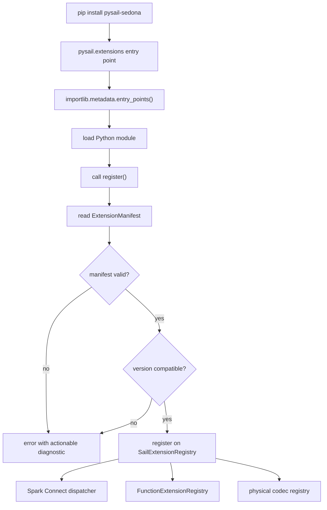
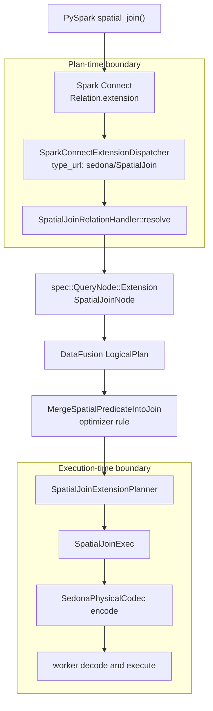
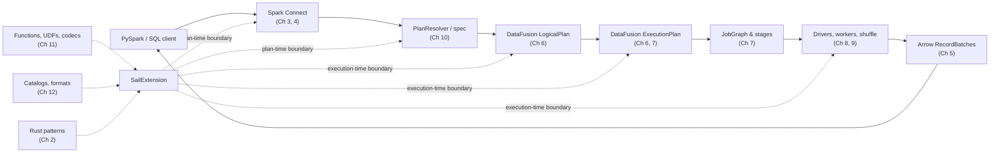

# Chapter 13: Extension Architecture: From Proposal To Design

The first twelve chapters treated Sail as a system to read. This final chapter treats
it as a system to extend.

The extension proposal in discussion #2001 is titled "Extension API for third-party
DataFusion integrations (UDFs, optimizer rules, planner extensions)." It starts from
a practical problem: integrating a real DataFusion extension, such as Apache
SedonaDB, currently requires editing Sail internals across multiple crates. A useful
extension does not only add one function. It may add scalar functions, aggregate
functions, table functions, session configuration, logical optimizer rules, physical
planner extensions, physical operators, and distributed codec behavior.

That is the key lesson of the whole book. In Sail, an extension is not a plugin point.
It is a path through the query engine.

```text
client API
  -> Spark Connect request
  -> Sail spec
  -> plan resolver
  -> DataFusion logical plan
  -> analyzer and optimizer rules
  -> physical planner extension
  -> physical optimizer rules
  -> distributed codec
  -> worker session
  -> Arrow batch execution
```

If an extension works only on the driver, it is not a distributed extension. If it
works only during planning, it is not an executable extension. If it works only in a
custom Rust binary, it does not solve the `pip install pysail pysail-sedona` user
experience that the proposal calls out.

This chapter proposes an architecture for Sail extensions by assembling the patterns
we have already seen.

## Code Map

The main files for this chapter are:

| Concern | File |
|---|---|
| Proposal touch point: session mutator | `crates/sail-session/src/session_factory/server.rs` |
| Proposal touch point: query planner chain | `crates/sail-session/src/planner.rs` |
| Proposal touch point: logical optimizer list | `crates/sail-session/src/optimizer.rs` |
| Proposal touch point: scalar and table function maps | `crates/sail-plan/src/function/mod.rs` |
| Proposal touch point: aggregate function map | `crates/sail-plan/src/function/aggregate.rs` |
| Proposal touch point: window function map | `crates/sail-plan/src/function/window.rs` |
| Proposal touch point: distributed physical codec | `crates/sail-execution/src/codec.rs` |
| Existing extension pattern: session extensions | `crates/sail-common-datafusion/src/extension.rs` |
| Existing extension pattern: table format registry | `crates/sail-common-datafusion/src/datasource.rs` |
| Existing extension pattern: format registration | `crates/sail-session/src/formats.rs` |
| Existing extension pattern: Python data source discovery | `crates/sail-data-source/src/formats/python/discovery.rs` |
| Existing extension pattern: Python table format | `crates/sail-data-source/src/formats/python/table_format.rs` |
| Existing extension pattern: lakehouse planners | `crates/sail-plan-lakehouse/src/lib.rs` |
| Existing extension pattern: physical plan nodes | `crates/sail-physical-plan/src/` |

## What The Proposal Is Really Asking For

Discussion #2001 describes a third-party extension that needs all of these dimensions:

- scalar UDFs at plan time,
- aggregate UDAFs at plan time,
- window UDFs at plan time,
- generator and table functions,
- session configuration extensions,
- logical optimizer rules,
- physical optimizer rules,
- physical extension planners,
- distributed worker re-resolution of UDFs and UDAFs,
- Python entry-point discovery for `pysail` users.

SedonaDB is the motivating example. A spatial query may start as normal SQL:

```sql
SELECT *
FROM points p, polygons g
WHERE ST_Intersects(p.geom, g.geom)
```

Without an extension-aware planner, this can look like a cross join plus a filter.
With the right functions and optimizer rules, it can become a spatial join:

```text
CrossJoin + ST_Intersects filter
  -> logical optimizer rule
  -> SpatialJoinPlanNode
  -> extension physical planner
  -> SpatialJoinExec
```

That single improvement needs more than one hook. The function resolver must know
`ST_Intersects`. The optimizer must know the function is spatial and join-like. The
physical planner must know how to create `SpatialJoinExec`. The distributed codec
must know how to serialize and deserialize any extension physical plan that reaches a
worker.

The proposal's important insight is that these hooks should be registered together.
The extension author should not need to chase every hardcoded map and planner list in
the Sail workspace.

## Two Boundaries, Not One

The list above looks like one extension surface. It is actually two.

```text
plan-time boundary             execution-time boundary
client expresses intent        operators run on Arrow batches
Sail resolves it               workers re-resolve UDFs and plans
-> once per query              -> once per batch
-> stability matters           -> performance matters
-> performance does not        -> version coupling tolerable
```

These two boundaries pull a stable plugin ABI in opposite directions.

The plan-time boundary wants forward and backward wire compatibility, language
neutrality, and a format that survives across years of Sail releases. A user writing
`SELECT ST_Intersects(p.geom, g.geom)` should not care which DataFusion version the
server was built against, or whether their extension was compiled with a different
Rust toolchain than Sail itself.

The execution-time boundary wants zero-copy access to Arrow buffers, direct
DataFusion `ExecutionPlan` integration, and native function dispatch. It cannot
afford a protobuf round trip per record batch, and it has no realistic way to remain
ABI-stable across major DataFusion upgrades without recompilation.

Discussion #2001 implicitly conflates these. A unified `SailExtension` trait is one way
to register both, but the mechanism for *crossing* each boundary can be different.
The recommended architecture in this chapter uses:

- a plan-time extension surface built on Spark Connect's existing extension
  messages,
- an execution-time extension surface built on Sail traits that resolve to
  DataFusion FFI when packaged for distribution,
- one in-memory `SailExtension` object that registers contributions to both.

Some extensions only use one boundary. A library of `ST_*` scalar functions that
decomposes into existing DataFusion expressions never needs execution-time
integration. A custom physical operator like `SpatialJoinExec` needs both, because
workers must reconstruct it from a wire format the codec understands.

The rest of the chapter develops each side. Sections from "The Core Trait" through
"Physical Codec Extensions" cover the execution-time half. The section on "Spark
Connect As The Plan-Time Extension Surface" covers the plan-time half. The
"Versioning And ABI" section then explains why the two halves should carry
different version stories.

## Existing Patterns Worth Keeping

Sail already has several good extension shapes.

### Session Extensions

Sail stores session-scoped services in DataFusion `SessionConfig` extensions. We saw
this repeatedly:

```rust
.with_extension(create_table_format_registry()?)
.with_extension(Arc::new(create_catalog_manager(...)?))
.with_extension(Arc::new(ActivityTracker::new()))
.with_extension(Arc::new(JobService::new(job_runner)))
.with_extension(Arc::new(RepartitionBufferConfig::new(...)))
.with_extension(Arc::new(SystemTableService::new(...)))
.with_extension(Arc::new(DeltaTableCache::default()))
```

This is a strong pattern because downstream code can ask for typed services:

```rust
let registry = ctx.extension::<TableFormatRegistry>()?;
```

Extension APIs should lean into this rather than inventing a separate global plugin
container.

### Table Format Registry

`TableFormatRegistry` is a compact example of a capability registry:

```rust
registry.register(Arc::new(ParquetTableFormat::default()))?;
DeltaTableFormat::register(registry)?;
IcebergTableFormat::register(registry)?;
PythonTableFormat::register_all(registry)?;
```

The registry owns a map from name to `Arc<dyn TableFormat>`. That is the right shape
for plugin-contributed capabilities:

- names are explicit,
- implementations are trait objects,
- registration happens during session construction,
- use happens through a typed lookup.

### Python Entry-Point Discovery

Python data sources already demonstrate runtime discovery:

```text
entry point group: pysail.datasources
  -> importlib.metadata.entry_points(...)
  -> load Python class
  -> validate class
  -> pickle class
  -> register PythonTableFormat
```

This is not the same as native Rust extension discovery, but it proves an important
user experience: a package can be installed into the Python environment and become
available to Sail without editing Sail's source.

The proposed `pysail.extensions` group is a broader version of the same idea.

### Lakehouse Planner Chain

Lakehouse planning already contributes physical planners:

```rust
vec![
    Arc::new(sail_delta_lake::planner::DeltaTablePhysicalPlanner),
    Arc::new(sail_iceberg::IcebergTablePhysicalPlanner),
    Arc::new(DeltaExtensionPlanner),
]
```

The session query planner combines these with the system table planner and the
general Sail extension planner.

This tells us that extension planner ordering is not theoretical. It already matters.
Lakehouse planners need a chance to handle lakehouse nodes before the fallback Sail
planner handles ordinary extension nodes.

### Spark Connect Extension Messages

Spark Connect's protobuf already has the hooks we need on the plan-time side. Three
messages carry opaque `google.protobuf.Any` payloads:

```text
Relation.extension       custom logical relation
Command.extension        custom session or catalog command
Expression.extension     custom expression or function call
```

These exist for the same reason Sail's logical extension nodes exist: to let new
operations enter the planner without changing the planner's core types. Chapter 10
notes this in passing - "Spark Connect's own extension guidance talks about
extending the protocol through relation, expression, and command operation types"
- and proposes that Sail's spec layer could mirror that shape. This chapter takes
that proposal as a first-class architecture decision.

Sail's resolver is the natural dispatch point. Today the resolver converts every
well-known Spark Connect relation into a `spec::QueryNode`. An `Any` payload could
be dispatched to a registered handler keyed by the message's `type_url`. The
handler returns either a Sail spec node, a DataFusion logical plan, or a logical
extension node that the rest of the pipeline already knows how to carry.

This pattern has properties the in-process trait does not have:

- the wire format is protobuf, so forward and backward compatibility follow
  standard proto rules,
- extension authors do not need to link any Sail crate, so a Python-only
  extension can emit Spark Connect messages and dispatch entirely on Sail's side,
- the same extension proto can target any Spark-Connect-compatible engine, not
  only Sail,
- worker compatibility is reduced to "the worker can decode whatever the driver
  shipped", which is the codec problem chapter 11 already covers.

What it does not solve is execution. Once the resolver has dispatched an `Any`
payload into a logical extension node, the rest of the pipeline still needs the
node, its physical equivalent, and its codec. Spark Connect is a plan-time
channel, not an execution-time one.

The "Spark Connect As The Plan-Time Extension Surface" section later in this
chapter develops the dispatcher design.

## Current Gaps

The proposal identifies several hardcoded areas. Reading the current code confirms
the shape of the gap.

Function registration is static:

```rust
pub static ref BUILT_IN_SCALAR_FUNCTIONS: HashMap<&'static str, ScalarFunction> =
    HashMap::from_iter(scalar::list_built_in_scalar_functions());
```

Aggregate and window functions have similar built-in maps. That is fine for Sail's
own compatibility functions, but awkward for third-party functions.

Session mutation exists:

```rust
pub trait ServerSessionMutator: Send {
    fn mutate_config(...)
    fn mutate_state(...)
    fn mutate_runtime_env(...)
}
```

That is useful for embedders that build Sail as a library, but it does not provide
a complete plugin system:

- it does not expose plan-time function registries,
- it does not expose codec fallback registries,
- it does not help `sail` CLI or `pysail` users discover installed extensions,
- it does not bundle all extension dimensions under one name.

The physical codec is also hardcoded. `RemoteExecutionCodec` knows how to encode and
decode Sail's physical plan nodes and UDFs. That is necessary, but a third-party
operator needs some way to participate in the same serialization path.

The planner chain has one more issue from the proposal: an extension planner that
does not recognize a node should return `Ok(None)` so DataFusion can try the next
planner. If Sail's fallback planner returns an internal error for every unknown node,
then third-party planners must always be ordered before it or planning short-circuits
with a confusing error.

That is a small mechanical fix, but it is also a design principle: extension chains
must compose by declining work, not by failing on unfamiliar work.

Finally, Spark Connect's `Relation.extension`, `Command.extension`, and
`Expression.extension` fields exist in the protocol but have no general dispatcher
on Sail's side. Today an extension that wants to express a custom relation has to
contribute Rust code in a Sail crate, because there is no other way for an
opaque `Any` payload to reach a handler. That gap is what makes the plan-time
boundary feel like the same problem as the execution-time boundary - it is not,
but Sail does not yet have the dispatcher that would let them be solved
separately.

## Design Goal

The goal is not "allow plugins." That phrase is too vague.

The goal is:

> Let a third-party crate or Python package contribute a named, version-compatible set
> of query capabilities to Sail, and make those capabilities available consistently
> during planning, optimization, physical planning, distributed serialization, worker
> execution, and user-facing discovery.

That implies five requirements:

1. One extension object should describe all of its contributions.
2. Contributions should register into existing Sail and DataFusion registries.
3. Driver and worker sessions should load compatible extension sets.
4. Distributed plans should encode enough information for workers to rebuild extension
   functions and physical nodes.
5. Conflicts and ordering should be explicit.

## The Core Trait

`SailExtension` is the in-process object that registers an extension's
contributions. It is not the stable plugin ABI by itself - the plan-time boundary
uses Spark Connect protobuf and the execution-time boundary uses DataFusion FFI
when packaged across processes - but inside a single Sail server it is the one
place an extension declares what it provides.

A reasonable first draft is:

```rust
pub trait SailExtension: Send + Sync {
    fn name(&self) -> &'static str;
    fn version(&self) -> Option<&'static str> { None }

    fn configure_session(&self, config: SessionConfig) -> Result<SessionConfig> {
        Ok(config)
    }

    // Plan-time boundary: Spark Connect protobuf dispatch.
    fn spark_connect_relations(&self)
        -> Vec<Arc<dyn SparkConnectRelationExtension>> { vec![] }
    fn spark_connect_commands(&self)
        -> Vec<Arc<dyn SparkConnectCommandExtension>> { vec![] }
    fn spark_connect_expressions(&self)
        -> Vec<Arc<dyn SparkConnectExpressionExtension>> { vec![] }

    // Execution-time boundary: DataFusion-shaped contributions.
    fn register_functions(&self, registry: &mut FunctionExtensionRegistry) -> Result<()> {
        Ok(())
    }

    fn register_table_formats(&self, registry: &TableFormatRegistry) -> Result<()> {
        Ok(())
    }

    fn register_catalogs(&self, registry: &mut CatalogExtensionRegistry) -> Result<()> {
        Ok(())
    }

    fn analyzer_rules(&self) -> Vec<Arc<dyn AnalyzerRule + Send + Sync>> {
        vec![]
    }

    fn logical_optimizer_rules(&self) -> Vec<Arc<dyn OptimizerRule + Send + Sync>> {
        vec![]
    }

    fn physical_optimizer_rules(&self) -> Vec<Arc<dyn PhysicalOptimizerRule + Send + Sync>> {
        vec![]
    }

    fn extension_planners(&self) -> Vec<Arc<dyn ExtensionPlanner + Send + Sync>> {
        vec![]
    }

    fn physical_codecs(&self) -> Vec<Arc<dyn PhysicalPlanCodecExtension>> {
        vec![]
    }
}
```

This trait deliberately does not make every extension implement every concern.
Most methods return empty contributions. A pure plan-time extension might only
implement `spark_connect_relations` and resolve into existing DataFusion
operators. A data source extension might only register table formats. A spatial
extension might use both halves: Spark Connect dispatch for the user-visible
DataFrame syntax, plus functions, optimizer rules, a planner, and a codec for
execution. A catalog extension might register a catalog provider factory and
nothing else.

## Extension Registry

The session factory should not pass around loose vectors of everything. It should own
one extension registry:

```rust
pub struct SailExtensionRegistry {
    extensions: Vec<Arc<dyn SailExtension>>,
}
```

It can expose typed collection methods:

```rust
impl SailExtensionRegistry {
    pub fn configure_session(&self, config: SessionConfig) -> Result<SessionConfig>;
    pub fn spark_connect_dispatcher(&self) -> Arc<SparkConnectExtensionDispatcher>;
    pub fn register_functions(&self, registry: &mut FunctionExtensionRegistry) -> Result<()>;
    pub fn register_table_formats(&self, registry: &TableFormatRegistry) -> Result<()>;
    pub fn analyzer_rules(&self) -> Vec<Arc<dyn AnalyzerRule + Send + Sync>>;
    pub fn logical_optimizer_rules(&self) -> Vec<Arc<dyn OptimizerRule + Send + Sync>>;
    pub fn physical_optimizer_rules(&self) -> Vec<Arc<dyn PhysicalOptimizerRule + Send + Sync>>;
    pub fn extension_planners(&self) -> Vec<Arc<dyn ExtensionPlanner + Send + Sync>>;
    pub fn physical_codecs(&self) -> Vec<Arc<dyn PhysicalPlanCodecExtension>>;
}
```

The `SparkConnectExtensionDispatcher` is a `type_url`-indexed map of the
plan-time handlers contributed by every loaded extension. The resolver calls it
when it encounters a `Relation.extension`, `Command.extension`, or
`Expression.extension` payload; the section below details its shape.

The registry should itself be stored as a session extension so planning and codec code
can reach it:

```rust
.with_extension(Arc::new(extension_registry.clone()))
```

The important thing is that the registry is not just a startup helper. It is a
runtime service.

## Function Registration

The current function maps are built-in and static. A future design can preserve fast
built-in lookup while adding extension lookup.

One option is a layered function registry:

```rust
pub struct FunctionExtensionRegistry {
    scalar: HashMap<String, Arc<ScalarUDF>>,
    aggregate: HashMap<String, Arc<AggregateUDF>>,
    window: HashMap<String, Arc<WindowUDF>>,
    generators: HashMap<String, ScalarFunction>,
    table: HashMap<String, Arc<TableFunction>>,
}
```

Resolution order should be documented. I would choose:

```text
temporary/session registered functions
  -> extension functions
  -> Sail built-ins
```

That makes explicit extension loading meaningful while preserving user-level session
overrides. It also keeps Sail built-ins as the baseline.

Collision policy should be chosen at registration time, not hidden at lookup time.
A useful default:

```text
same extension registers same name twice: error
two extensions register same name: error unless an override policy is configured
extension overrides Sail built-in: allowed only with explicit override flag
session function overrides extension function: allowed, matching Spark-style session behavior
```

The reason to avoid silent last-writer-wins is simple: distributed engines are hard
enough to debug without guessing which implementation of `ST_Distance` ran on the
worker.

## Optimizer Rules

Extension optimizer rules need ordering.

The simplest design appends rules in extension registration order:

```text
Sail required early rules
  -> extension logical rules
  -> Sail default logical rules
```

But the lakehouse optimizer already shows that some rules must run early. The
`expand_row_level_op` rule is expected to run before built-in optimizers. A spatial
extension may have the same need: merge a spatial predicate into a join before a
general rule rewrites or pushes down expressions.

So the API should allow rule phases:

```rust
pub enum OptimizerPhase {
    BeforeSailDefaults,
    AfterSailDefaults,
    Final,
}

pub struct OrderedOptimizerRule {
    pub phase: OptimizerPhase,
    pub rule: Arc<dyn OptimizerRule + Send + Sync>,
}
```

For a first implementation, phase plus extension registration order is probably
enough. More complex dependency constraints can wait until a real extension needs
them.

## Extension Physical Planners

DataFusion's extension planner chain is already the right mechanism:

```rust
DefaultPhysicalPlanner::with_extension_planners(extension_planners)
```

The design rule is:

```text
extension planners
  -> lakehouse planners
  -> system table planner
  -> Sail built-in extension planner
```

The exact placement of lakehouse planners is a policy decision. If lakehouse remains
a built-in Sail capability, it can stay before third-party planners. If a third-party
extension needs to override lakehouse behavior, that should require an explicit
planner ordering option.

Every planner in the chain should follow the DataFusion convention:

```rust
if I recognize this node {
    Ok(Some(plan))
} else {
    Ok(None)
}
```

Only recognized but invalid nodes should produce errors.

## Physical Codec Extensions

Distributed execution is where extension APIs often become too optimistic.

Sail serializes physical plans so workers can execute them. A physical extension
node that exists only as an `Arc<dyn ExecutionPlan>` on the driver cannot magically
cross the network.

The codec needs an extension registry:

```rust
pub trait PhysicalPlanCodecExtension: Send + Sync {
    fn name(&self) -> &'static str;

    fn try_encode(
        &self,
        node: Arc<dyn ExecutionPlan>,
        codec: &RemoteExecutionCodec,
    ) -> Result<Option<ExtensionPlanPayload>>;

    fn try_decode(
        &self,
        payload: &ExtensionPlanPayload,
        inputs: Vec<Arc<dyn ExecutionPlan>>,
        ctx: &SessionContext,
        codec: &RemoteExecutionCodec,
    ) -> Result<Option<Arc<dyn ExecutionPlan>>>;
}
```

The payload should include:

- extension name,
- extension version or ABI marker,
- node type name,
- serialized node bytes,
- child plan references or encoded child plans,
- optional schema and statistics metadata.

The worker must have a compatible extension loaded. If not, the error should be
clear:

```text
Cannot decode extension physical plan 'sedona::SpatialJoinExec'.
The worker session does not have extension 'sedona' version 'x.y.z' loaded.
```

The same problem applies to UDF re-resolution. Built-in functions can be rebuilt by
name, but extension functions need their registry available on the worker.

## Driver And Worker Symmetry

The extension registry must be available in both server sessions and worker sessions.

In local mode, that is easy. In cluster mode, it becomes a deployment contract:

```text
driver process
  has extension registry A
  encodes plan requiring extension sedona

worker process
  must start with compatible extension registry A
  decodes sedona functions and physical nodes
```

This has operational consequences:

- Kubernetes worker images must include the same extension packages.
- Local-cluster workers must inherit the same extension loading configuration.
- Python extension discovery must happen for workers as well as the driver if Python
  extension code participates in execution.
- The plan codec should record required extension names so missing extensions fail
  before deep execution.

An extension manifest can help. A minimum useful form carries the extension
identity, the plan-time `type_url` claims, and an optional native execution
surface:

```rust
pub struct ExtensionManifest {
    pub name: String,
    pub version: String,
    pub spark_connect_relations: Vec<String>,    // type_urls
    pub spark_connect_commands: Vec<String>,
    pub spark_connect_expressions: Vec<String>,
    pub execution_surface: Option<ExecutionSurface>,
}
```

The "Versioning And ABI" section below details `ExecutionSurface` and explains
why the two halves carry different version rules. The manifest is not only
documentation. It is runtime compatibility data, and the driver should refuse
to dispatch a plan that requires an extension manifest the workers do not also
hold.

## Python Entry-Point Discovery

The proposal's Python story is:

```toml
[project.entry-points."pysail.extensions"]
sedona = "pysail_sedona:register"
```

At startup, `pysail` discovers installed entry points:

```python
from importlib.metadata import entry_points

for ep in entry_points(group="pysail.extensions"):
    extension = ep.load()()
    register(extension)
```

The hard part is not Python discovery. Sail already does that for data sources. The
hard part is what crosses the Python/Rust boundary.

If `register()` returns a Rust-backed extension object through PyO3, then the native
types crossing the boundary are version-coupled:

- `Arc<dyn SailExtension>`,
- DataFusion UDF types,
- optimizer rule traits,
- physical planner traits,
- Arrow and DataFusion schema and expression types.

Rust has no stable ABI for arbitrary trait objects. That means `pysail-sedona` must
be built against compatible versions of `pysail`, Sail, DataFusion, Arrow, and PyO3.
This is acceptable if it is documented and enforced. It is dangerous if users only
discover it through crashes.

A practical Python extension loading flow:



The extension loader should validate manifests before registering capabilities.

## Spark Connect As The Plan-Time Extension Surface

This section develops the plan-time half of the two boundaries.

The plan-time channel needs to be stable across DataFusion and Arrow upgrades,
hospitable to cross-language authors, and free of recompilation pressure when
Sail releases a new version. Spark Connect already meets those needs.

Three facts make it the right channel. Every query already crosses it: PySpark,
SQL, and DataFrame calls all serialize through Spark Connect protobuf or its
companion messages. Protobuf is forward and backward compatible by construction,
including for unknown fields, so an extension protocol bumped from `v1` to `v2`
does not break older Sail servers in unrelated ways. And Spark Connect already
defines extension hooks - `Relation.extension`, `Command.extension`, and
`Expression.extension`, each typed as `google.protobuf.Any` - so Sail does not
need new wire surface area, only a dispatcher.

### Dispatcher Traits

A plan-time extension dispatcher has a small interface:

```rust
pub trait SparkConnectRelationExtension: Send + Sync {
    fn type_url(&self) -> &'static str;
    fn resolve(
        &self,
        payload: &[u8],
        ctx: &ResolverContext,
        inputs: Vec<spec::QueryNode>,
    ) -> PlanResult<spec::QueryNode>;
}

pub trait SparkConnectExpressionExtension: Send + Sync {
    fn type_url(&self) -> &'static str;
    fn resolve(
        &self,
        payload: &[u8],
        ctx: &ResolverContext,
        arguments: Vec<spec::Expression>,
    ) -> PlanResult<spec::Expression>;
}

pub trait SparkConnectCommandExtension: Send + Sync {
    fn type_url(&self) -> &'static str;
    fn resolve(
        &self,
        payload: &[u8],
        ctx: &ResolverContext,
    ) -> PlanResult<spec::CommandNode>;
}
```

Each handler claims a `type_url`. The resolver routes by `type_url` and falls
through with a clear error when no handler matches. The error should name the
missing extension so users diagnose installation problems before they diagnose
plan errors:

```text
No extension handler is registered for Spark Connect Relation.extension
with type_url 'apache.sedona/SpatialJoin'. Install pysail-sedona, or check
that 'sedona' appears in sail.extensions.enabled.
```

### Two Resolution Patterns

There are two useful patterns for what a handler returns.

Pattern A decomposes the extension call into existing relations, expressions,
and commands:

```text
Relation.extension("example.com/JsonScan")
  -> JsonScanExtension::resolve(...)
  -> spec::QueryNode::Read { format: "json", path: ... }
  -> normal Sail and DataFusion execution
```

The rest of Sail does not know an extension was involved. Pattern A extensions
need no execution-time integration at all. They are pure plan-time additions.
A surprising amount of useful behavior fits here: configurable readers, custom
SQL-shaped commands, expression sugar that expands into well-known DataFusion
expressions.

Pattern B emits a logical extension node and hands off to the execution-time
half of the extension:

```text
Relation.extension("apache.sedona/SpatialJoin")
  -> SpatialJoinExtension::resolve(...)
  -> spec::QueryNode::Extension { node: SpatialJoinNode { ... } }
  -> Sedona optimizer rules
  -> SpatialJoinExec
  -> Sedona codec
```

Pattern B is what discussion #2001 implicitly assumed for everything. Pattern A is
what makes Spark Connect dispatch worth its own ABI.

### A Sketch In Python

A plan-time extension does not require a recompiled Sail server. From the
PySpark side it looks like an ordinary client library that emits Spark Connect
messages:

```python
from pyspark.sql.connect.proto import Relation
from google.protobuf.any_pb2 import Any as AnyMessage
from pysail_geo_proto import JsonScan  # extension's own proto

def json_scan(spark, path, schema=None):
    request = JsonScan(path=path, schema=schema or "")
    relation = Relation(extension=AnyMessage(
        type_url="example.com/pysail_geo/JsonScan",
        value=request.SerializeToString(),
    ))
    return spark._client._dataframe(relation)
```

The Sail server registers a corresponding handler when its extension loads. The
two never share a Rust ABI. The protobuf is the only thing they agree on.

### Federation Through Spark Connect

Spark Connect is also a complete query protocol, not only an extension channel.
That makes a second pattern available.

A Sail driver can become a Spark Connect client of a separate extension server
and delegate a subtree of a query. The extension server returns Arrow batches
over the existing protocol. The two processes do not share memory, do not load
each other's code, and do not need to agree on DataFusion versions:

```text
driver Sail
  resolver dispatches Relation.extension
  -> spec::QueryNode::Extension { delegate_to: "spark://server:port" }
  -> physical plan with FederatedExec
  FederatedExec
    -> Spark Connect client to extension server
    -> stream Arrow batches back
```

This pattern is the strongest answer for execution-time isolation. It is also
the most expensive: an extra network hop, an extra deployment, and a place to
lose batches if the extension server crashes. It is appropriate for extensions
that are themselves complex services - catalog metastores, vector search
engines, production geospatial systems. It is overkill for a stateless scalar
UDF.

### Discovery And Registration

Plan-time extensions still need to register. The discovery mechanisms from
earlier in this chapter apply directly:

```text
configured or pip-discovered extensions
  -> SailExtension::spark_connect_relations()
  -> SailExtensionRegistry::spark_connect_dispatcher()
  -> resolver looks up type_url
```

A Python wheel-based extension can register a Python callback through PySpark
and a server-side handler through `pysail.extensions` discovery. The Rust side
of the handler can live in an extension's own crate, in a sidecar service, or
in a federated Spark Connect server. The dispatch point is the same.

`type_url` is the new collision namespace and should follow the same strict
policy as function names: two extensions claiming the same `type_url` is an
error at registration, not a silent override at dispatch.

### What This Buys And Costs

Compared to a pure Rust-trait surface, Spark Connect dispatch trades some
ergonomics for substantial decoupling.

Costs:

- each extension call serializes through protobuf,
- handlers must hand-write decoding for their `Any` payloads,
- logical extension nodes that need to participate in optimization still
  require execution-time integration,
- `type_url` becomes a new namespace where extensions can collide.

In return:

- no Rust ABI for plan-time-only extensions,
- no PyO3 version coupling for Python extensions,
- a natural cross-language story, including non-Rust authors,
- an explicit federation pattern that the Rust trait cannot express,
- a wire format that already passes through every Sail query.

The right framing is not "Spark Connect *or* the trait." It is "Spark Connect
for the plan-time boundary, the trait for the execution-time boundary, and one
manifest for both."

## A Sedona-Style Worked Design

Imagine a `sail-sedona` crate. It uses both boundaries: Spark Connect dispatch
for the user-visible spatial DataFrame syntax, plus the full execution-time
suite for the spatial join itself.

```rust
pub struct SedonaExtension {
    options: SedonaOptions,
}

impl SailExtension for SedonaExtension {
    fn name(&self) -> &'static str {
        "sedona"
    }

    fn configure_session(&self, config: SessionConfig) -> Result<SessionConfig> {
        Ok(config.with_extension(Arc::new(self.options.clone())))
    }

    // Plan-time boundary.
    fn spark_connect_relations(&self) -> Vec<Arc<dyn SparkConnectRelationExtension>> {
        vec![Arc::new(SpatialJoinRelationHandler::new())]
    }

    fn spark_connect_expressions(&self) -> Vec<Arc<dyn SparkConnectExpressionExtension>> {
        vec![
            Arc::new(StIntersectsExpressionHandler::new()),
            Arc::new(StDistanceExpressionHandler::new()),
        ]
    }

    // Execution-time boundary.
    fn register_functions(&self, registry: &mut FunctionExtensionRegistry) -> Result<()> {
        registry.register_scalar("st_intersects", st_intersects_udf())?;
        registry.register_scalar("st_distance", st_distance_udf())?;
        registry.register_aggregate("st_union_aggr", st_union_aggr_udf())?;
        Ok(())
    }

    fn logical_optimizer_rules(&self) -> Vec<Arc<dyn OptimizerRule + Send + Sync>> {
        vec![Arc::new(MergeSpatialPredicateIntoJoin::new())]
    }

    fn extension_planners(&self) -> Vec<Arc<dyn ExtensionPlanner + Send + Sync>> {
        vec![Arc::new(SpatialJoinExtensionPlanner::new())]
    }

    fn physical_codecs(&self) -> Vec<Arc<dyn PhysicalPlanCodecExtension>> {
        vec![Arc::new(SedonaPhysicalCodec::new())]
    }
}
```

A query then flows like this:



The two halves are visible. The plan-time half lets PySpark users call a
`spatial_join(...)` DataFrame method that emits a `Relation.extension` payload;
that payload becomes a `SpatialJoinNode` in the Sail spec. The execution-time
half plans that node into `SpatialJoinExec` and encodes it for workers. Notice
how much of Sail still does not need to know Sedona exists. It needs to know
how to ask the Spark Connect dispatcher, function registries, and planner
chains for contributions.

## Table Formats As Extensions

Chapter 12 showed that table formats are already close to this model. A third-party
format extension could do:

```rust
impl SailExtension for MyLakeExtension {
    fn register_table_formats(&self, registry: &TableFormatRegistry) -> Result<()> {
        registry.register(Arc::new(MyLakeTableFormat::new()))?;
        Ok(())
    }

    fn extension_planners(&self) -> Vec<Arc<dyn ExtensionPlanner + Send + Sync>> {
        vec![Arc::new(MyLakeRowLevelPlanner::new())]
    }

    fn physical_codecs(&self) -> Vec<Arc<dyn PhysicalPlanCodecExtension>> {
        vec![Arc::new(MyLakeCodec::new())]
    }
}
```

That would let a user write:

```sql
CREATE TABLE t USING mylake LOCATION '/warehouse/t' AS SELECT * FROM source;
```

The same extension might also register row-level commands, custom optimizer rules,
or catalog provider factories.

## Catalog Providers As Extensions

Catalogs should also be extension candidates.

The current session catalog construction selects providers from `AppConfig`. A
future extension-aware design could let extensions register catalog provider
factories:

```rust
pub trait CatalogProviderFactory: Send + Sync {
    fn catalog_type(&self) -> &'static str;
    fn create(
        &self,
        name: &str,
        properties: HashMap<String, String>,
        runtime: RuntimeHandle,
    ) -> Result<Arc<dyn CatalogProvider>>;
}
```

Configuration could then say:

```toml
[[catalog.list]]
type = "custom-rest"
name = "prod"
uri = "https://catalog.example"
```

The catalog manager does not need to know the concrete type. It only needs a factory
that can produce an `Arc<dyn CatalogProvider>`.

## Conflict Policy

The proposal lists open questions around collisions. A good default policy is
strict:

| Collision | Default behavior |
|---|---|
| Two extensions with same name | error |
| Two extensions register same function name | error |
| Extension function shadows built-in | error unless explicit override |
| Session function shadows extension function | allowed |
| Two planners claim same logical node | first successful planner wins, but log planner name |
| Two Spark Connect handlers claim same `type_url` | error |
| Two entry points share same name | error |
| Same `SessionConfig` extension type inserted twice | error unless explicit replace |
| Same table format name registered twice | error unless explicit override |

Strict defaults make early development noisier and production behavior clearer. An
administrator can always choose a permissive override mode later.

## Enablement Policy

Extensions need two levels of enablement:

```text
installed
  -> available to Sail process

enabled
  -> active in a session
```

For a server binary, enabled extensions may come from configuration:

```toml
[extensions]
enabled = ["sedona", "my-lake"]
```

For `pysail`, entry-point discovery can make installed extensions available, but the
session should still know which ones are active. A useful SQL-level control might be:

```sql
SET sail.extensions.enabled = 'sedona,my-lake'
```

Per-session enablement matters because extensions can change planning behavior. A
spatial optimizer rule, for example, may rewrite joins. Users should be able to run a
session with it disabled for debugging.

## Versioning And ABI

The two boundaries deserve two version stories.

Plan-time extensions inherit protobuf's compatibility properties. An extension
that only registers Spark Connect handlers needs no native ABI coupling at all,
and Sail can load it against any compatible server build. The relevant version
data is:

```text
extension name
extension version
declared Spark Connect type_urls
Sail Spark Connect API version
```

Execution-time extensions must couple more tightly. A custom `ExecutionPlan` is
linked against specific DataFusion, Arrow, and (for Python plugins) PyO3
versions, and Rust has no stable ABI for arbitrary trait objects:

```text
Sail extension API version
DataFusion version
Arrow version
PyO3 version, for Python-native plugins
declared codec type names
```

The `ExtensionManifest` introduced earlier in "Driver And Worker Symmetry"
combines both. Its `execution_surface` field carries the native-ABI version
data:

```rust
pub struct ExecutionSurface {
    pub sail_api_version: String,
    pub datafusion_version: String,
    pub arrow_version: String,
    pub pyo3_version: Option<String>,
    pub capabilities: Vec<ExtensionCapability>,
}
```

When `execution_surface` is `None`, the extension is plan-time only. The strict
native ABI checks do not apply, the extension can be installed against any
compatible Sail server, and it cannot contribute custom physical operators.
When `execution_surface` is set, the loader performs exact-version or
narrow-range checks before registering anything.

The loader should fail fast on incompatible versions and report which surface
failed. A friendly error here is worth more than a mysterious decode failure
later:

```text
Cannot load extension 'sedona' 1.2.0.
Plan-time Spark Connect type_urls: OK.
Execution-time DataFusion version mismatch: extension built against
44.0.0, this Sail server uses 45.1.0. Install a sedona build matching
the server, or use sail-sedona's federated mode.
```

For pure Python data sources, the compatibility story can be looser because
Sail stores pickled Python classes and calls a defined data source interface.
For native Rust DataFusion integrations, strict coupling is the honest answer.
The two-boundary design makes that honesty selective rather than universal.

## Security And Trust

Extensions are code. They can:

- execute Rust native code,
- execute Python code,
- access object stores through the runtime,
- inspect query plans,
- influence optimizer choices,
- run on distributed workers.

So extension loading should be treated like loading a database plugin or Spark jar,
not like reading a harmless config file.

Practical policies:

- load extensions only from configured sources,
- log every loaded extension and version,
- expose loaded extensions through a system table,
- support disabling extension discovery in production,
- require explicit enablement for native extensions,
- make worker extension mismatches visible in job errors.

## System Tables For Observability

Sail already has a system catalog. Extensions should be visible there.

Useful system tables:

```text
system.extensions
system.extension_functions
system.extension_table_formats
system.extension_planners
system.extension_codecs
```

Example rows:

| extension | capability | name | version | enabled |
|---|---|---|---|---|
| sedona | scalar_udf | st_intersects | 1.0.0 | true |
| sedona | planner | spatial_join | 1.0.0 | true |
| my-lake | table_format | mylake | 0.3.0 | true |

This makes extension behavior inspectable from Spark SQL.

## Implementation Roadmap

A safe implementation can land in stages.

### Stage 1: Planner Composition Fix

Change the fallback extension planner so unknown nodes return `Ok(None)` instead of
an internal error. Recognized but invalid Sail nodes should still error.

This is small, low-risk, and unblocks third-party planners in the chain.

### Stage 2: Native `SailExtension` Registry

Introduce:

- `SailExtension`,
- `SailExtensionRegistry`,
- `ServerSessionFactory::with_extension(...)`,
- session extension storage for the registry.

Wire extension contributions into:

- session config,
- analyzer rules,
- logical optimizer rules,
- physical optimizer rules,
- extension physical planner chain,
- table format registry.

### Stage 3: Spark Connect Extension Dispatch

Introduce the plan-time half of the boundary:

- `SparkConnectRelationExtension`,
- `SparkConnectCommandExtension`,
- `SparkConnectExpressionExtension`,
- `SparkConnectExtensionDispatcher` indexed by `type_url`,
- resolver routing for `Relation.extension`, `Command.extension`, and
  `Expression.extension` payloads,
- collision policy for `type_url` claims,
- diagnostic errors that name missing extensions, not missing message types.

This stage unblocks pattern-A extensions (plan-time decomposition) without
requiring any of the execution-time work that follows. A toy "JsonScan"
extension is enough to prove the dispatch path.

### Stage 4: Function Extension Registry

Replace static-only function lookup with layered lookup:

```text
catalog/session functions
  -> extension functions
  -> built-in functions
```

Add collision policy and tests for scalar, aggregate, window, generator, and table
function registration.

### Stage 5: Distributed Codec Registry

Add codec hooks for:

- extension physical plans,
- extension UDF and UDAF re-resolution,
- required extension manifest data in encoded plans.

Test with local-cluster execution, not only local execution. This is the
execution-time half of the boundary; Stage 3 is the plan-time half.

### Stage 6: Python Entry-Point Discovery

Add `pysail.extensions` discovery:

```text
discover entry point
  -> load module
  -> call register()
  -> validate manifest
  -> add SailExtension
```

Prototype the risky part early: passing a native `Arc<dyn SailExtension>` across
independently built PyO3 modules. Plan-time-only extensions can skip this risk
because they cross the boundary as protobuf, not as Rust trait objects.

### Stage 7: Observability And Operations

Add:

- system tables,
- startup logs,
- worker compatibility checks,
- per-session enable/disable,
- config controls for discovery.

## Tests An Extension API Needs

The test suite should include an intentionally tiny extension crate. It does not need
to be useful. It needs to exercise every hook.

Minimum test extension:

- Spark Connect `Relation.extension` handler that resolves to an existing
  DataFusion `MemoryExec` (pattern A),
- Spark Connect `Expression.extension` handler that rewrites to an existing
  scalar expression,
- Spark Connect `Relation.extension` handler that produces a logical
  extension node (pattern B),
- scalar UDF: `ext_add_one(x)`,
- aggregate UDAF: `ext_count_non_null(x)`,
- optimizer rule: rewrite a marker expression,
- logical extension node,
- physical planner producing a custom exec,
- codec for that custom exec,
- table format that reads a tiny in-memory or local file source,
- Python entry-point wrapper, if possible.

Test matrix:

| Mode | What to verify |
|---|---|
| local, pattern A | Spark Connect dispatch resolves to existing DataFusion operators, no execution-side extension involved |
| local, pattern B | Spark Connect dispatch produces a logical extension node, physical planner and codec take over |
| local | function resolution, optimizer rewrite, physical planning |
| local cluster | codec encode/decode, worker function re-resolution |
| disabled extension | functions, planners, and Spark Connect handlers unavailable |
| collision | configured collision policy is enforced for both function names and `type_url` claims |
| missing worker extension | clear distributed error naming the extension |
| missing dispatcher | clear plan-time error naming the missing `type_url` |
| Python discovery | installed package registers extension on both boundaries |

An extension API without distributed tests will look done before it is done.

## A Mental Model For Future Contributors

When adding a new extension dimension, ask six questions:

1. Which boundary does it cross - plan-time, execution-time, or both?
2. Where is the capability registered?
3. Where is it used during planning?
4. Does it affect optimizer ordering?
5. Does it create physical objects that must cross the network?
6. How will a worker rebuild or execute it?

If the answer to question 1 is "plan-time only," the extension can ride on
Spark Connect dispatch and inherits protobuf compatibility. If the answer to
question 5 is yes, the extension is part of the distributed execution
contract. It needs codec support, version-matched workers, or a deliberate
reason it can only run in local mode.

## How The Previous Chapters Fit Together

Here is the whole book reduced to one extension-oriented map:



An extension architecture succeeds when both extension surfaces - plan-time
through Spark Connect dispatch and execution-time through `SailExtension`
contributions - are explicit, typed, ordered, versioned, and available
consistently across driver and workers. The two surfaces share one
`SailExtension` registration object, one manifest, and one observability story,
but they cross the wire by different mechanisms because their stability
requirements are different.

## Final Takeaways

Rust gives Sail the tools for the execution-time half of this design: traits,
`Arc`, typed session extensions, and explicit error handling. Arrow gives
extensions a shared memory and schema model. DataFusion gives them logical
plans, optimizer rules, physical planners, execution plans, and UDF traits.
Spark Connect gives them something the other layers cannot give: a wire-format
ABI that is forward and backward compatible by construction, language-neutral,
and already crossing every query.

The architecture of Sail is already close to an extension-friendly shape. The
table format registry, Python data source discovery, session extensions,
lakehouse planner chain, and physical codec all show pieces of the
execution-time answer. `Relation.extension`, `Command.extension`, and
`Expression.extension` provide the plan-time answer once Sail adds a
dispatcher. Discussion #2001 asks Sail to make those pieces first-class and
composable.

The final design principle is simple:

> A Sail extension should be loaded once, registered clearly through one
> object, expressed at the plan-time boundary as a stable protobuf, executed
> at the execution-time boundary as native code, serialized explicitly between
> them, available on driver and workers, and observable from the session.

That is the difference between a convenient local hook and a real distributed
query engine extension API.

Navigation: [Previous: Chapter 12, Catalogs, Lakehouse Tables, And File Formats](12-catalogs-lakehouse-tables-and-file-formats.md) | [Reader Guide](00-reader-guide.md)
