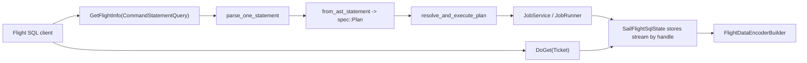

# Chapter 14: Arrow Flight SQL

Spark Connect is Sail's primary front door, but it is not the only one. Sail also
exposes Apache Arrow Flight SQL for clients that want SQL over Arrow-native
transport rather than PySpark over Spark Connect.

This chapter is deliberately short and concrete. Its job is to place `sail-flight`
in the definitive architecture: it is a second protocol surface that converges on
the same SQL parser, Sail spec layer, DataFusion physical planning, `JobService`,
and Arrow `RecordBatch` streams.

## Code Map

| Concern | File |
|---|---|
| Flight SQL service | `crates/sail-flight/src/service.rs` |
| Query handle state | `crates/sail-flight/src/state.rs` |
| Metrics wrapper | `crates/sail-flight/src/metrics.rs` |
| SQL parser entry point | `crates/sail-sql-analyzer/src/parser.rs` |
| SQL AST to spec | `crates/sail-sql-analyzer/src/statement.rs` |
| Planning entry point | `crates/sail-plan/src/lib.rs` |
| Job runner extension | `crates/sail-common-datafusion/src/session/job.rs` |
| Session manager | `crates/sail-session/src/session_manager/` |

## Why Flight SQL Exists Beside Spark Connect

Spark Connect is Spark-shaped. It carries unresolved Spark relations, commands,
expressions, config operations, reattachable execution, artifacts, and session
semantics. That is exactly what PySpark needs.

Flight SQL is SQL-shaped. It is useful for ADBC, JDBC-style tools, BI clients, and
systems that already understand Arrow Flight. The protocol does not try to model
the Spark DataFrame API. It asks a simpler question:

```text
Given this SQL statement, what schema will it produce, and where can I fetch the
Arrow stream?
```

That makes `sail-flight` an excellent example of Sail's internal layering. The
protocol is different, but the planning core is the same.



## The Service Shape

`SailFlightSqlService` is small compared with `SparkConnectServer`:

```rust
pub struct SailFlightSqlService {
    session_manager: SessionManager,
    config: Arc<PlanConfig>,
    metrics: Option<Arc<MetricRegistry>>,
    state: Arc<Mutex<SailFlightSqlState>>,
}
```

The service implements `FlightSqlService` from the `arrow-flight` crate. The key
methods for query execution are:

- `get_flight_info_statement`
- `do_get_statement`
- `do_handshake`

Other Flight SQL methods can remain unimplemented until Sail needs them. This is a
different compatibility posture than Spark Connect, where PySpark expects a wider
service surface.

## Phase One: `GetFlightInfo`

Flight SQL separates planning from fetching. The first request is
`GetFlightInfo(CommandStatementQuery)`. Sail parses the SQL text, converts it to
`spec::Plan`, creates a physical plan, starts execution through the session's
`JobService`, and stores the resulting stream under an opaque handle.

The key sequence is:

```rust
let statement = parse_one_statement(&query.query)?;
let plan = from_ast_statement(statement)?;
let ctx = self.get_session_context().await?;
let (plan, _) = resolve_and_execute_plan(&ctx, self.config.clone(), plan).await?;
let schema = plan.schema();
let service = ctx.extension::<JobService>()?;
let stream = service.runner().execute(&ctx, plan).await?;
```

That is the same core path used elsewhere:

```text
SQL text
  -> SQL AST
  -> Sail spec
  -> DataFusion physical plan
  -> JobRunner stream
```

The service then stores the stream in `SailFlightSqlState`:

```rust
let handle = QueryHandle::new();
self.state.lock().await.add_stream(handle.clone(), stream);
```

The returned `FlightInfo` contains the schema and a `TicketStatementQuery` carrying
that handle.

## Phase Two: `DoGet`

The second request presents the ticket:

```rust
let handle = QueryHandle::try_from(ticket.statement_handle.as_ref())?;
let stream = self
    .state
    .lock()
    .await
    .remove_stream(&handle)
    .ok_or_else(|| Status::not_found(...))?;
```

The handle is consumed once. This keeps server state simple: Flight SQL clients can
re-run a query if a fetch fails, while Spark Connect clients use reattachable
execution and response buffering.

After retrieving the stream, Sail encodes batches as Flight data:

```rust
let output = FlightDataEncoderBuilder::new()
    .with_schema(schema)
    .build(output)
    .map(|result| result.map_err(|e| Status::internal(format!("encoding error: {e}"))));
```

This is where Flight SQL differs from Spark Connect at the wire level. Spark Connect
wraps Arrow IPC bytes in Spark protobuf messages. Flight SQL sends Arrow Flight
frames directly.

## The Shared Session Model

The current Flight SQL service uses a shared default session:

```rust
const DEFAULT_SESSION_ID: &'static str = "flight-default";
const DEFAULT_USER_ID: &'static str = "flight-user";
```

That means Flight SQL queries share session configuration and catalog state. It is
a reasonable initial model, but a definitive guide should call it out because it is
not the same as Spark Connect's client-provided session IDs.

A future version could carry session identity in Flight headers. The important
architectural point is that the same `SessionManager` and `SessionContext` machinery
still applies.

## Commands

SQL commands are different from queries because the effect matters more than the
result stream. Sail classifies the parsed plan:

```rust
let statement_type = match &plan {
    spec::Plan::Query(_) => StatementType::Query,
    spec::Plan::Command(_) => StatementType::Command,
};
```

For commands, the service drains the stream eagerly in `get_flight_info_statement`.
That ensures the command has completed before the client receives `FlightInfo`.

This detail matters for DDL. A BI client that sends `CREATE TABLE` should not have
to call `DoGet` just to make the side effect happen.

## Metrics

When OpenTelemetry metrics are available, `sail-flight` wraps the result stream in
`MetricsRecordingStream`. The wrapper records row counts, batch counts, elapsed
time, and statement type.

This mirrors a general Sail design habit: protocol crates should add protocol-level
metrics around streams without changing the core execution layer.

## Spark Connect Versus Flight SQL

| Concern | Spark Connect | Flight SQL |
|---|---|---|
| Main client | PySpark | ADBC/JDBC/BI tools |
| Request payload | Spark protobuf plan | SQL statement |
| Result transport | Spark `ExecutePlanResponse` with `ArrowBatch` | Arrow Flight `FlightData` |
| Session identity | Client-provided session ID | Shared default session today |
| Retry model | Reattachable operation stream | Re-execute query |
| Planning convergence | `spec::Plan` | `spec::Plan` |
| Execution convergence | `JobService` / `JobRunner` | `JobService` / `JobRunner` |

## Extension Implications

Flight SQL is a useful test for extension design. If a future extension only works
when a user enters through Spark Connect protobufs, then SQL clients cannot use it.
If it registers through the common spec/resolver/function/table-format layers, both
front doors can use it.

For extension authors, this gives a simple rule:

```text
Protocol-specific dispatch is allowed, but semantic registration should happen below
the protocol boundary whenever possible.
```

## Takeaways

Flight SQL is not a separate query engine inside Sail. It is another way to reach
the same SQL parser, Sail spec IR, DataFusion planning path, and job runner. The
protocol differences are real, especially around session identity and fetch handles,
but the internal convergence is the point.

Navigation: [Previous: Chapter 13, Extension Architecture](13-extension-architecture-from-proposal-to-design.md) | [Next: Chapter 15, Custom Nodes And Optimizers](15-custom-nodes-and-optimizers.md) | [Reader Guide](00-reader-guide.md)
