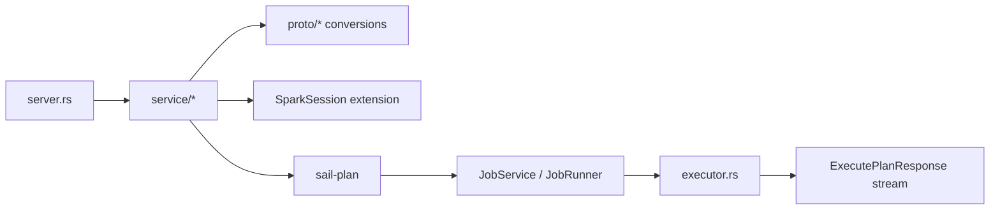
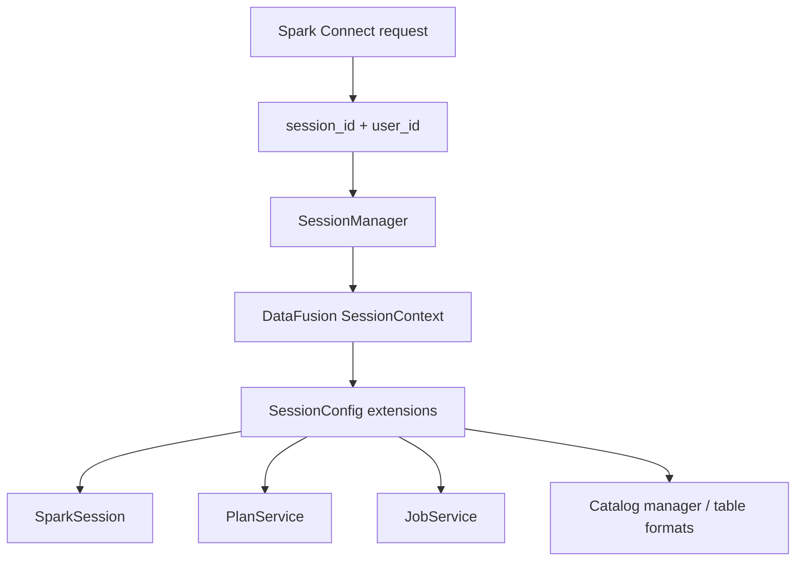
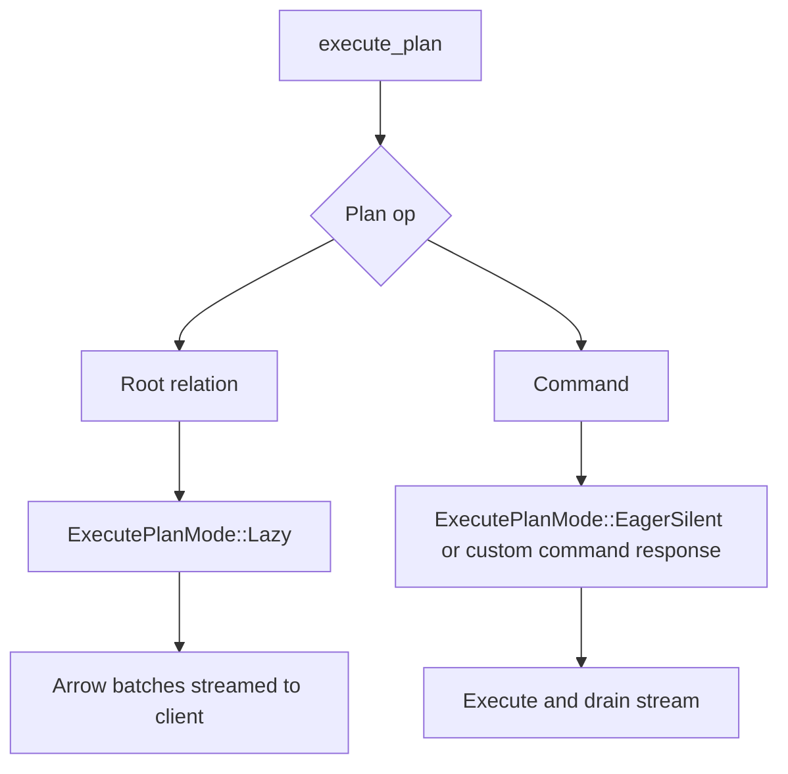
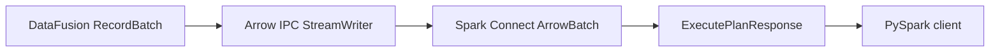
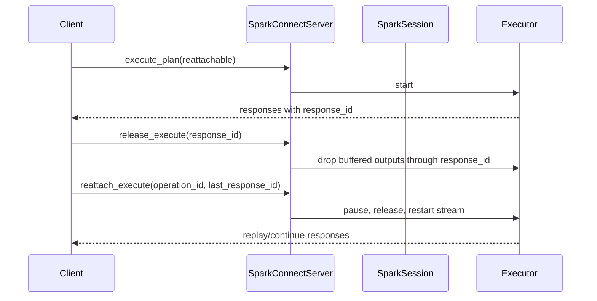
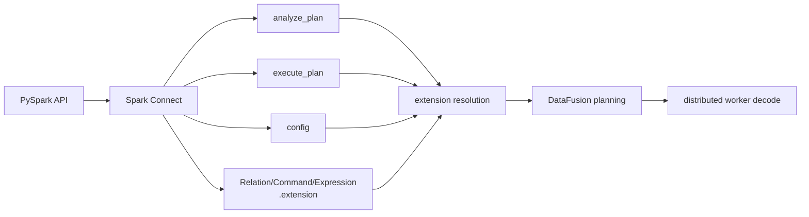

# Chapter 3: Spark Connect

Spark Connect is Sail's public front door for PySpark. When a PySpark user writes `spark.read.parquet(...).groupBy(...).count()`, Sail does not receive Python bytecode or a Spark JVM object. It receives Spark Connect protobuf messages over gRPC. The definitive starting point is Apache Spark's own [Spark Connect Overview](https://spark.apache.org/docs/latest/spark-connect-overview.html), which describes Spark Connect as a decoupled client-server architecture using unresolved logical plans as the protocol.

That design gives Sail its "drop-in replacement" shape. The client can stay PySpark. The server can be Rust. The wire protocol between them is Spark Connect.

```text
PySpark client
  -> Spark Connect protobuf messages
  -> Sail SparkConnectServer
  -> Sail spec
  -> DataFusion logical and physical plans
  -> Arrow batches in Spark Connect responses
```

This chapter follows that front door in code. The goal is to understand what Spark Connect means architecturally, not just where the `.proto` files are generated.

## Definitive Spark Connect References

Use these official references alongside this chapter:

- [Spark Connect Overview](https://spark.apache.org/docs/latest/spark-connect-overview.html): the Apache Spark documentation page for the client/server architecture, protobuf transport, gRPC, and Arrow result batches.
- [Spark Connect architecture page](https://spark.apache.org/spark-connect/): Apache Spark's higher-level architecture explanation, including the connection flow, unresolved logical plans, Protocol Buffers, server-side optimization, and Arrow record batch result streaming.
- [PySpark `SparkSession.builder.remote`](https://spark.apache.org/docs/latest/api/python/reference/pyspark.sql/api/pyspark.sql.SparkSession.builder.remote.html): the official PySpark API for connecting to a Spark Connect server with an `sc://host:port` URL.
- [PySpark Spark Session API reference](https://spark.apache.org/docs/latest/api/python/reference/pyspark.sql/spark_session.html): the Spark-session surface, including Spark Connect-only methods, artifacts, tags, interrupt methods, and the `client` attribute.
- [PySpark API Reference](https://spark.apache.org/docs/latest/api/python/reference/index.html): the official API index; it marks the Spark SQL, Pandas API on Spark, Structured Streaming, and DataFrame-based MLlib surfaces that support Spark Connect.
- [Spark Connect protobuf definitions](https://github.com/apache/spark/tree/master/sql/connect/common/src/main/protobuf/spark/connect): the authoritative Spark repository location for `base.proto`, `relations.proto`, `expressions.proto`, `commands.proto`, `types.proto`, and related protocol files.

## The Main Files

The Spark Connect layer lives mainly in `crates/sail-spark-connect`.

| File | Role |
| --- | --- |
| `src/server.rs` | Implements the Spark Connect gRPC service |
| `src/service/plan_executor.rs` | Executes relations, commands, streaming operations, interrupts, and reattach/release |
| `src/service/plan_analyzer.rs` | Handles schema, explain, tree string, version, DDL parsing, streaming checks |
| `src/service/config_manager.rs` | Handles runtime Spark config operations |
| `src/service/artifact_manager.rs` | Placeholder for artifact upload/status support |
| `src/proto/plan.rs` | Converts Spark Connect relations and commands into Sail specs |
| `src/proto/expression.rs` | Converts Spark Connect expressions |
| `src/proto/data_type*.rs` | Converts Spark, Arrow, JSON, and DDL data types |
| `src/executor.rs` | Converts DataFusion `RecordBatch` streams into Spark Connect response batches |
| `src/session.rs` | Stores Spark-session state inside DataFusion's `SessionContext` |
| `src/session_manager.rs` | Creates sessions with Spark-specific extensions |
| `src/error.rs` | Converts planning/execution errors into Spark-compatible gRPC statuses |

The server implementation is generated-facing. The rest of the crate is translation-facing.



## The gRPC Service Surface

`SparkConnectServer` in `crates/sail-spark-connect/src/server.rs` implements Spark's generated `SparkConnectService` trait. The corresponding public protocol schema lives in Spark's official [Connect protobuf definitions](https://github.com/apache/spark/tree/master/sql/connect/common/src/main/protobuf/spark/connect), especially `base.proto` for the service and request/response envelope and `relations.proto`/`commands.proto` for plan payloads.

The service methods are the server's public protocol surface:

- `execute_plan`
- `analyze_plan`
- `config`
- `add_artifacts`
- `artifact_status`
- `interrupt`
- `reattach_execute`
- `release_execute`
- `release_session`
- `fetch_error_details`
- `clone_session`

Some are fully implemented, some are partial, and some are explicit TODOs. That is normal for a compatibility server: Spark Connect is broad, and Sail implements the pieces needed by its Spark SQL/DataFrame compatibility goals first.

The official PySpark API exposes many of these protocol features through normal `SparkSession` methods. For example, the [Spark Session API reference](https://spark.apache.org/docs/latest/api/python/reference/pyspark.sql/spark_session.html) lists Spark Connect-only methods and client operations such as artifacts, progress handlers, tags, and operation interrupts.

The most important method is `execute_plan`.

```rust
async fn execute_plan(
    &self,
    request: Request<ExecutePlanRequest>,
) -> Result<Response<Self::ExecutePlanStream>, Status>
```

Its flow is simple and crucial:

1. Extract request metadata.
2. Get or create a session context.
3. Require that the request contains a plan.
4. Dispatch `Root(relation)` to relation execution.
5. Dispatch `Command(command)` to command execution.
6. Return an `ExecutePlanResponseStream`.

In code, the split is:

```rust
match op {
    plan::OpType::Root(relation) => {
        service::handle_execute_relation(&ctx, relation, metadata).await?
    }
    plan::OpType::Command(Command { command_type: command }) => {
        let command = command.required("command")?;
        handle_command(&ctx, command, metadata).await?
    }
    plan::OpType::CompressedOperation(_) => {
        return Err(Status::unimplemented("compressed operation plan"));
    }
}
```

Spark Connect calls the top-level operation a `Plan`, but Sail immediately separates it into the two categories that matter to a query engine:

```text
Relation: produces a table-like result
Command: changes state, writes data, registers things, starts streams, or returns command metadata
```

## Sessions: Spark State Inside DataFusion State

Every Spark Connect request carries a session ID and optional user context. On the client side, PySpark users create this remote session with `SparkSession.builder.remote("sc://host:port")`, documented in the official [`builder.remote`](https://spark.apache.org/docs/latest/api/python/reference/pyspark.sql/api/pyspark.sql.SparkSession.builder.remote.html) API reference. Sail uses the request's session values to get a DataFusion `SessionContext`:

```rust
self.session_manager
    .get_or_create_session_context(session_id, user_id)
    .await
```

The Spark-specific session setup happens in `crates/sail-spark-connect/src/session_manager.rs`.

`SparkSessionMutator` implements `ServerSessionMutator`. During session creation, it adds two extensions to DataFusion's `SessionConfig`:

- `PlanService`, with Spark-style plan and catalog formatting.
- `SparkSession`, Sail's Spark-session state object.

```rust
Ok(config
    .with_extension(Arc::new(plan_service))
    .with_extension(Arc::new(spark)))
```

The `SparkSession` extension stores:

- `session_id`
- `user_id`
- Spark runtime config
- active executors for reattachable operations
- streaming query state

This is one of Sail's clever bridges. Spark Connect expects Spark session behavior. DataFusion expects a `SessionContext`. Sail installs Spark session semantics into DataFusion session state through typed extensions.



## Relations Become Sail Specs

The key conversion file is `crates/sail-spark-connect/src/proto/plan.rs`.

Spark Connect relations are protobuf trees. Sail does not plan directly from those protobuf structs. It converts them into `sail_common::spec`. For the upstream protocol shape, read Spark's `relations.proto` in the official [Spark Connect protobuf definitions](https://github.com/apache/spark/tree/master/sql/connect/common/src/main/protobuf/spark/connect).

The important implementation is:

```rust
impl TryFrom<Relation> for spec::Plan
```

It extracts:

- `RelationCommon`, including `plan_id`.
- `RelType`, the actual relation variant.
- A `RelationNode`, which is either a query node or a command node.

Then it returns:

```rust
spec::Plan::Query(spec::QueryPlan { ... })
```

or:

```rust
spec::Plan::Command(spec::CommandPlan { ... })
```

Examples of relation variants that become query nodes:

- `Read`
- `Project`
- `Filter`
- `Join`
- `SetOp`
- `Sort`
- `Limit`
- `Aggregate`
- `Sql`
- `Range`
- `LocalRelation`
- `Repartition`
- `MapPartitions`
- `CommonInlineUserDefinedTableFunction`

Some relation variants can become commands. This is why `TryFrom<Relation> for spec::Plan` returns a full `spec::Plan`, not only a `QueryPlan`.

The teaching point is that Spark Connect is not Sail's internal language. It is an external compatibility protocol. Sail's internal unresolved language is the Sail spec, because Sail also accepts SQL and needs one common representation for both.

```text
Spark Connect Relation
  -> RelationNode
  -> spec::QueryNode or spec::CommandNode
  -> PlanResolver
  -> DataFusion LogicalPlan
```

## SQL Is Also Routed Through the Front Door

Spark Connect can send a SQL relation. In `proto/plan.rs`, SQL text is parsed while converting the protobuf relation. This matches the official architecture description: the client sends unresolved intent, and the server analyzes and optimizes it, as described in Apache Spark's [Spark Connect architecture page](https://spark.apache.org/spark-connect/).

```rust
parse_one_statement(...)
from_ast_statement(...)
```

This is an important compatibility detail. From the client's point of view:

```python
spark.sql("select * from t")
```

is still a Spark Connect request. From Sail's point of view, it becomes a Sail spec through the same general conversion pipeline as DataFrame relations.

That gives Sail one downstream planning path:

```text
Spark DataFrame relation
  -> Sail spec
SQL string
  -> Sail SQL parser/analyzer
  -> Sail spec
Sail spec
  -> DataFusion logical plan
```

The cost of this approach is compatibility work. Spark SQL has many grammar and semantic quirks. Sail has its own SQL parser and analyzer so the server can accept Spark-shaped SQL without embedding Spark itself.

## Commands

The command dispatcher lives in `handle_command` in `server.rs`.

It routes Spark Connect command variants to service handlers. Examples:

- `RegisterFunction`
- `WriteOperation`
- `CreateDataframeView`
- `WriteOperationV2`
- `SqlCommand`
- `WriteStreamOperationStart`
- `StreamingQueryCommand`
- `GetResourcesCommand`
- `StreamingQueryManagerCommand`
- `RegisterTableFunction`
- `RegisterDataSource`
- `CheckpointCommand`
- `MergeIntoTableCommand`

The split matters because commands often execute eagerly. In `plan_executor.rs`, `ExecutePlanMode` has two variants:

```rust
enum ExecutePlanMode {
    Lazy,
    EagerSilent,
}
```

Relations use `Lazy`: return a response stream and let the client consume result batches.

Commands often use `EagerSilent`: execute the plan immediately, drain the stream, and return no data unless Spark Connect expects a command result.



This is why a Spark statement like `CREATE TABLE` and a query like `SELECT * FROM t` use the same gRPC method but have different execution behavior inside Sail.

## The Core Execution Path

The heart of execution is `handle_execute_plan` in `plan_executor.rs`. This is Sail's version of the official Spark Connect flow where a client sends an encoded unresolved logical plan and receives streamed Apache Arrow batches back over gRPC, described in the [Spark Connect Overview](https://spark.apache.org/docs/latest/spark-connect-overview.html).

It does four things:

1. Retrieve the `SparkSession` extension.
2. Retrieve the `JobService` extension.
3. Resolve and physical-plan the Sail spec.
4. Execute the physical plan through the session's job runner.

In code:

```rust
let spark = ctx.extension::<SparkSession>()?;
let service = ctx.extension::<JobService>()?;
let (plan, _) = resolve_and_execute_plan(ctx, spark.plan_config()?, plan).await?;
let stream = service.runner().execute(ctx, plan).await?;
```

That line `service.runner().execute(ctx, plan)` hides the local/cluster choice described in Chapter 2. Spark Connect does not care whether Sail is local, local-cluster, or Kubernetes-cluster. It receives a `SendableRecordBatchStream` either way.

```text
spec::Plan
  -> resolve_and_execute_plan
  -> Arc<dyn ExecutionPlan>
  -> JobRunner::execute
  -> SendableRecordBatchStream
```

From there, Spark Connect's job is to translate a DataFusion/Arrow stream into Spark Connect response messages.

## Response Streams and Arrow Batches

`crates/sail-spark-connect/src/executor.rs` owns the response-stream behavior. Apache Spark's Spark Connect docs call out this same result shape: query results are streamed to the client as Apache Arrow record batches rather than returned as one monolithic response.

The important output enum is:

```rust
pub enum ExecutorBatch {
    ArrowBatch(ArrowBatch),
    SqlCommandResult(Box<SqlCommandResult>),
    WriteStreamOperationStartResult(Box<WriteStreamOperationStartResult>),
    StreamingQueryCommandResult(Box<StreamingQueryCommandResult>),
    StreamingQueryManagerCommandResult(Box<StreamingQueryManagerCommandResult>),
    CheckpointCommandResult(Box<CheckpointCommandResult>),
    Schema(Box<DataType>),
    Complete,
}
```

A running executor first sends the schema, then Arrow batches, then a completion marker:

```text
Schema
  -> ArrowBatch
  -> ArrowBatch
  -> ...
  -> Complete
```

The Arrow conversion uses Arrow IPC:

```rust
let cursor = Cursor::new(&mut output.data);
let mut writer = StreamWriter::try_new(cursor, batch.schema().as_ref())?;
writer.write(batch)?;
writer.finish()?;
```

That means Spark Connect sees result data as serialized Arrow streams, not row-by-row JSON or Python objects.



The row-count field is populated from `batch.num_rows()`, and empty result streams still emit an empty Arrow batch so the client receives schema-consistent output.

## Reattachable Operations

Spark Connect supports reattachable execution. A client can disconnect and later resume reading from an operation. On the Python surface, related operation controls such as tags and interrupts are listed in the official [Spark Session API reference](https://spark.apache.org/docs/latest/api/python/reference/pyspark.sql/spark_session.html).

Sail tracks this with:

- `operation_id`
- response IDs
- an executor buffer
- `SparkSession`'s executor map

When `execute_plan` receives request options, it checks whether the operation is reattachable:

```rust
reattachable: is_reattachable(&request.request_options)
```

If the operation is lazy, `handle_execute_plan` creates an `Executor`, starts it, and registers it in `SparkSession`:

```rust
let executor = Executor::new(metadata, stream, heartbeat_interval);
let rx = executor.start()?;
spark.add_executor(executor)?;
```

The executor saves outputs in a bounded buffer. `reattach_execute` pauses the running executor if necessary, releases already acknowledged responses, and starts the executor again:

```rust
executor.pause_if_running().await?;
executor.release(response_id)?;
let rx = executor.start()?;
```

`release_execute` lets the client tell the server which buffered responses can be dropped.



This is a protocol-level feature, but it shapes execution internals. Sail cannot simply return an anonymous stream and forget it. It must store enough operation state in the Spark session to pause, replay, release, or interrupt it.

## Interrupts

The `interrupt` endpoint supports three modes, corresponding to Spark-session operation controls exposed in PySpark:

- Interrupt all operations in the session.
- Interrupt operations with a tag.
- Interrupt one operation ID.

The service functions remove matching executors from `SparkSession`, pause them if running, and return interrupted operation IDs.

This is another reason `SparkSession` is not just a bag of configuration. It is operational state for Spark Connect behavior.

```text
InterruptRequest
  -> find executor(s)
  -> remove from session state
  -> pause if running
  -> return operation IDs
```

## Analyze Plan

`analyze_plan` serves Spark client introspection calls. It does not usually execute data. It answers questions about a plan. These calls back the ordinary PySpark APIs whose Spark Connect support is documented throughout the [PySpark API reference](https://spark.apache.org/docs/latest/api/python/reference/index.html).

Implemented or partially implemented analysis handlers include:

- `Schema`
- `Explain`
- `TreeString`
- `IsLocal`
- `IsStreaming`
- `SparkVersion`
- `DdlParse`
- `Persist`
- `Unpersist`
- `GetStorageLevel`
- `JsonToDdl`

The schema path is worth reading:

```rust
let resolver = PlanResolver::new(ctx, spark.plan_config()?);
let NamedPlan { plan, fields } = resolver
    .resolve_named_plan(spec::Plan::Query(plan.try_into()?))
    .await?;
let schema = ...
to_spark_schema(schema)
```

This uses Sail's normal plan resolver, but stops at schema. That means analysis is semantically meaningful: schema answers come from the same resolution machinery that execution uses.

Explain also routes through Sail planning:

```rust
explain_string(
    ctx,
    spark.plan_config()?,
    spec::Plan::Query(plan.try_into()?),
    options,
).await
```

The Spark Connect layer therefore has two major plan paths:

```text
execute_plan: convert -> resolve -> optimize -> physical plan -> execute
analyze_plan: convert -> resolve/explain/schema -> response
```

Extensions must work in both. If an extension function works during execution but schema analysis cannot resolve it, PySpark users will still see failures because clients often ask for schema before collecting data.

## Config

The `config` endpoint manipulates Spark runtime configuration stored in `SparkSession`. The user-facing API is `SparkSession.conf`, documented as part of the official [Spark Session reference](https://spark.apache.org/docs/latest/api/python/reference/pyspark.sql/spark_session.html).

Handlers in `config_manager.rs` implement:

- `Get`
- `Set`
- `GetWithDefault`
- `GetOption`
- `GetAll`
- `Unset`
- `IsModifiable`

All of these retrieve the typed `SparkSession` extension:

```rust
let spark = ctx.extension::<SparkSession>()?;
```

Then they delegate to `SparkSession` methods such as `get_config`, `set_config`, and `unset_config`.

This is separate from DataFusion's `SessionConfig` options. That distinction matters:

```text
Spark runtime config:
  stored in SparkSession state
  visible through Spark Connect config API
  used to create PlanConfig during planning

DataFusion SessionConfig:
  created during session construction
  stores DataFusion options and typed extensions
  read by DataFusion planning/execution
```

Extensions often need both. A Spark-facing option might arrive through `spark.conf.set(...)`, but a DataFusion optimizer rule may need to read a typed extension or session option during planning.

## Data Types and Spark Compatibility

Spark Connect forces Sail to translate types carefully. The official protocol definitions for types live in Spark's `types.proto` under the [Connect protobuf definitions](https://github.com/apache/spark/tree/master/sql/connect/common/src/main/protobuf/spark/connect).

`proto/data_type_arrow.rs` maps Arrow fields and data types back into Spark Connect `DataType` messages. It handles ordinary Arrow types and extension cases such as:

- Spark UDT metadata.
- GeoArrow WKB extension types mapped to Spark geometry/geography.
- Variant extension types.

This conversion sits on the output side of planning and execution. DataFusion and Arrow may represent a type one way, but PySpark expects Spark Connect's data type model.

One subtle example is timestamps:

```text
Arrow Timestamp(Microsecond, None)
  -> Spark TimestampNtz

Arrow Timestamp(Microsecond, Some(_))
  -> Spark Timestamp
```

The front door therefore constrains internal semantics. Sail can use Arrow/DataFusion internally, but it must preserve enough Spark meaning for the client.

## Errors Become Spark Exceptions

Spark Connect clients expect Spark-shaped errors, not arbitrary Rust error strings.

`crates/sail-spark-connect/src/error.rs` converts many internal errors into `SparkError`, then into `tonic::Status`.

The mapping eventually produces a `SparkThrowable` with Spark/Java class names such as:

- `org.apache.spark.sql.AnalysisException`
- `org.apache.spark.sql.execution.QueryExecutionException`
- `java.lang.IllegalArgumentException`
- `java.lang.ArithmeticException`
- `org.apache.spark.api.python.PythonException`
- `java.time.DateTimeException`
- `java.lang.UnsupportedOperationException`

The status conversion intentionally uses Spark-compatible error details:

```rust
details.set_error_info(class, "org.apache.spark", metadata);
Status::with_error_details(Code::Internal, message, details)
```

It also truncates long gRPC messages to stay below metadata limits. That sounds mundane until you remember Python tracebacks can be long. Protocol compatibility includes boring survival details like this.

## Artifacts and Python Distribution

Spark Connect includes artifact upload and status endpoints. In Sail, `artifact_manager.rs` currently returns TODO errors for add/status handling. The user-facing artifact APIs are listed in the official [Spark Session API reference](https://spark.apache.org/docs/latest/api/python/reference/pyspark.sql/spark_session.html) as `addArtifact` and `addArtifacts`.

This matters for the extension story. Spark's artifact mechanism is one way clients distribute files, Python dependencies, or resources. Issue #1810, however, focuses more directly on Python entry-point based extension discovery:

```toml
[project.entry-points."pysail.extensions"]
sedona = "pysail_sedona:register"
```

Those are different mechanisms:

```text
Spark Connect artifacts:
  client sends files/resources to a session

Python entry-point extensions:
  installed Python package contributes Sail extension behavior
```

A complete extension system may eventually touch both, but they solve different problems.

## Registering Functions and Data Sources

Spark Connect commands include function and data source registration.

`RegisterFunction` becomes a Sail command plan. The broader PySpark function registration APIs, including UDF and UDTF registration, are indexed in the official [PySpark SQL API reference](https://spark.apache.org/docs/latest/api/python/reference/pyspark.sql/index.html):

```rust
spec::CommandNode::RegisterFunction(udf.try_into()?)
```

Then it runs through normal planning and command execution.

`RegisterDataSource` has a more direct session-scoped path. The handler extracts the pickled Python data source class and registers a `PythonTableFormat` in the session's `TableFormatRegistry`:

```rust
let format = Arc::new(PythonTableFormat::with_pickled_class(name.clone(), command));
registry.register(format)
```

This is a small preview of extension behavior. A client can contribute behavior to a session, but the contribution is still routed through Sail's typed session services and DataFusion planning interfaces.

## What Spark Connect Means for Extensions

Issue #1810 is not only about Rust-side plugin ergonomics. Spark Connect adds several extra requirements.

First, extensions must be visible during analysis as well as execution.

PySpark frequently asks for schema, explain output, local/streaming status, or type conversion before actual execution. An extension function has to resolve in `analyze_plan`, not just in `execute_plan`.

Second, extension configuration may arrive through Spark config.

If a user writes:

```python
spark.conf.set("sail.sedona.join.index", "rtree")
```

then the extension must decide how that value becomes available to the optimizer or physical planner. Storing it only in `SparkSession` may not be enough if DataFusion rules expect `SessionConfig` extensions.

Third, extensions must preserve Spark Connect type compatibility.

A spatial extension may expose geometry/geography types. Sail already maps GeoArrow metadata in the Arrow-to-Spark conversion path. A third-party extension must either reuse those conventions or provide a compatible type conversion story.

Fourth, distributed execution still matters.

Spark Connect receives one logical operation from PySpark, but Sail may execute it on remote workers. A function registered through Spark Connect must be available when the worker decodes and executes the physical plan.

Fifth, Spark Connect itself provides extension hooks.

The protocol defines `Relation.extension`, `Command.extension`, and `Expression.extension`, each typed as `google.protobuf.Any`. These let a client send an opaque payload that Sail can dispatch by `type_url`. Today Sail does not have a general dispatcher for these messages, but chapter 13 proposes them as the natural plan-time extension boundary: protobuf-versioned, language-neutral, and already crossing every query. In that framing the Rust trait surface becomes the execution-time boundary, and Spark Connect dispatch becomes the plan-time one.



A good extension API must therefore cross the Spark Connect boundary, not sit behind it.

## Reading Exercises

1. Read `crates/sail-spark-connect/src/server.rs`.
   - Find each gRPC method.
   - For `execute_plan`, identify where session lookup happens and where relation/command dispatch happens.

2. Read `crates/sail-spark-connect/src/service/plan_executor.rs`.
   - Follow `handle_execute_relation`.
   - Follow `handle_execute_plan`.
   - Compare `Lazy` and `EagerSilent`.
   - Find reattach and release handling.

3. Read `crates/sail-spark-connect/src/executor.rs`.
   - Find where schema is emitted.
   - Find where `RecordBatch` becomes `ArrowBatch`.
   - Find the executor buffer used for reattachable operations.

4. Read `crates/sail-spark-connect/src/proto/plan.rs`.
   - Follow `TryFrom<Relation> for spec::Plan`.
   - Pick one relation variant, such as `Project` or `Filter`, and trace the conversion into `spec::QueryNode`.

5. Read `crates/sail-spark-connect/src/service/plan_analyzer.rs`.
   - Follow schema analysis.
   - Follow explain analysis.
   - Notice which analysis requests are TODOs or no-ops.

6. Read `crates/sail-spark-connect/src/error.rs`.
   - Find how `PlanError` and `ExecutionError` become `SparkError`.
   - Find how `SparkError` becomes a gRPC `Status`.

## Chapter Takeaways

Spark Connect is the compatibility contract between PySpark and Sail. It gives Sail a Spark-shaped protocol while letting the engine be Rust, Arrow, and DataFusion.

Inside Sail, Spark Connect requests are translated into Sail specs, resolved into DataFusion plans, executed through a `JobRunner`, and streamed back as Arrow batches. Sessions carry Spark-specific state through typed DataFusion extensions. Analysis, configuration, reattach/release, interrupts, and errors are all part of the compatibility surface.

For extensions, Spark Connect raises the bar. An extension must work during analysis, execution, configuration, output type conversion, error handling, and distributed worker execution. That is why the extension proposal cannot be just "let users register a UDF." Spark Connect makes extension behavior user-visible before, during, and after query execution.

The next chapter moves from the protocol front door to the Python experience: `pysail`, PySpark, Python UDFs, Python data sources, and how Python packaging could become the extension discovery mechanism.
