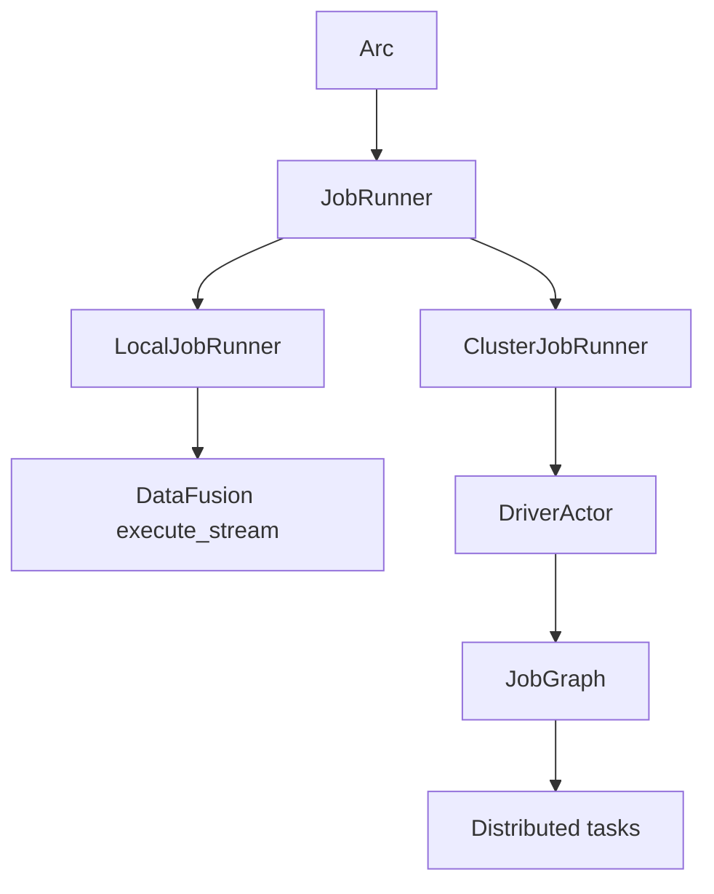
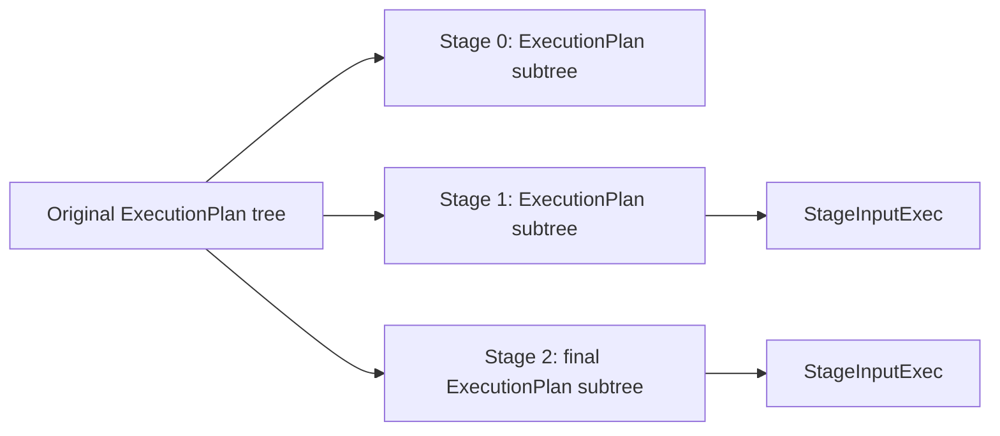
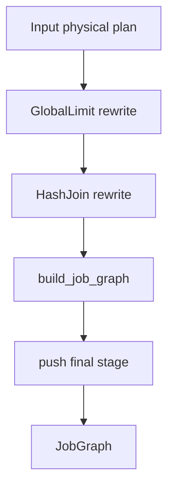
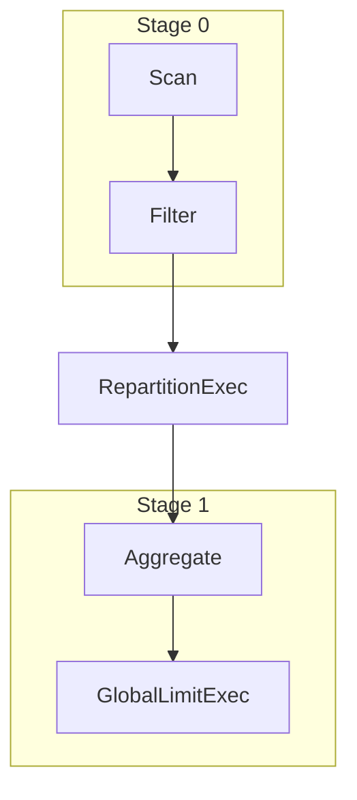
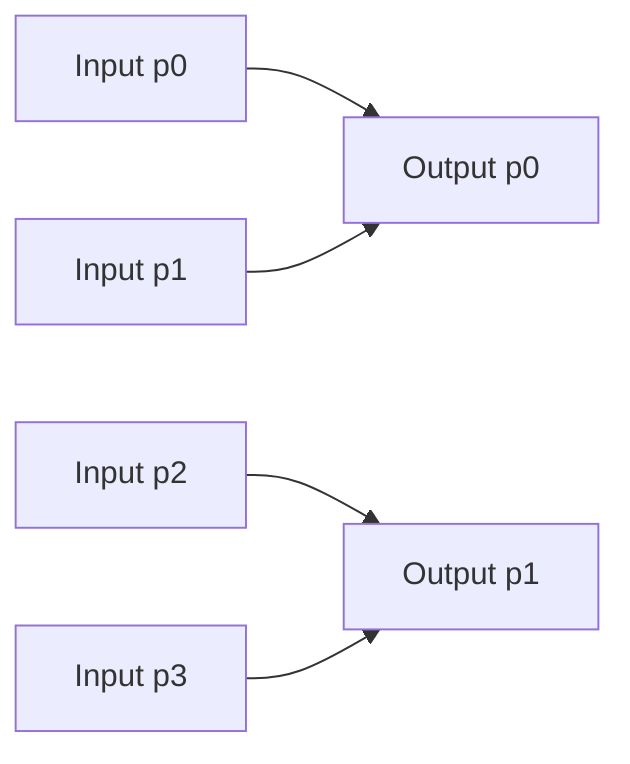
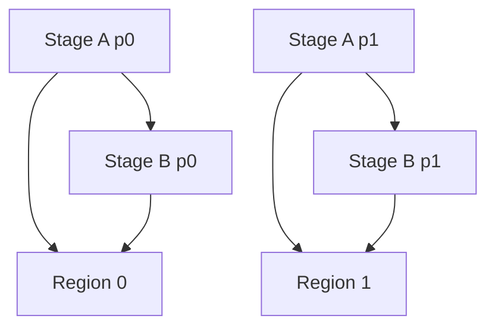
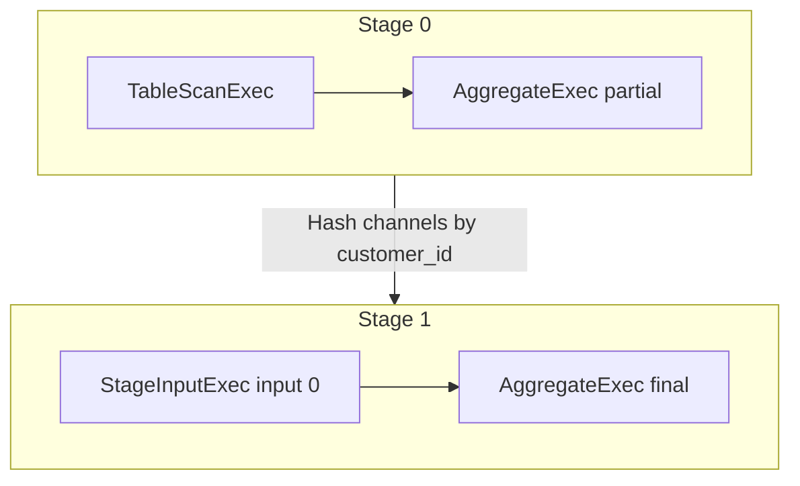
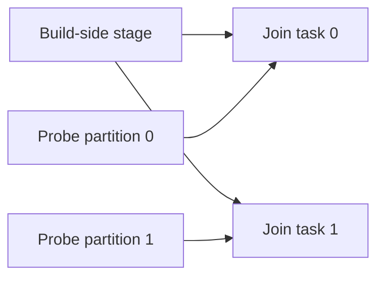

# Chapter 7: From Physical Plan To Job Graph

The previous chapter ended with a DataFusion physical plan:

```rust
Arc<dyn ExecutionPlan>
```

That is enough for local execution. DataFusion can call `execute(partition,
task_context)` on the plan and return a stream of Arrow `RecordBatch` values.

But a distributed engine needs one more transformation. It has to decide:

- which parts of the physical plan can run together,
- where data has to be materialized,
- where shuffle boundaries exist,
- how partitions map to tasks,
- which stage outputs are consumed by which later stages,
- and which tasks run on workers versus the driver.

In Sail, that transformation is the job graph.

This chapter follows the path:

```text
DataFusion ExecutionPlan -> Sail JobGraph -> JobTopology -> task regions -> task definitions
```

The job graph is where DataFusion's local, partitioned execution model becomes
Sail's distributed execution model.

## The Core Files

The main files for this chapter are:

| Area | Files | Role |
|---|---|---|
| Job graph data model | `crates/sail-execution/src/job_graph/mod.rs` | Defines jobs, stages, inputs, distributions, placement, and input modes |
| Job graph planner | `crates/sail-execution/src/job_graph/planner.rs` | Splits a DataFusion physical plan into stages |
| Job runner boundary | `crates/sail-execution/src/job_runner.rs` | Chooses local execution or cluster execution |
| Driver job acceptance | `crates/sail-execution/src/driver/job_scheduler/core.rs` | Builds the job graph and creates job output streams |
| Job topology | `crates/sail-execution/src/driver/job_scheduler/topology.rs` | Groups stages into task regions and dependencies |
| Job state | `crates/sail-execution/src/driver/job_scheduler/state.rs` | Tracks jobs, stages, tasks, attempts, and task states |
| Task definition | `crates/sail-execution/src/task/definition.rs` | Defines serialized worker task inputs and outputs |
| Stage input placeholder | `crates/sail-execution/src/plan/stage_input.rs` | Placeholder `ExecutionPlan` node for cross-stage inputs |
| Shuffle plans | `crates/sail-execution/src/plan/shuffle_write.rs`, `shuffle_read.rs` | Physical data movement at stage boundaries |
| Job output | `crates/sail-execution/src/driver/output.rs` | Merges final task output streams into the client-facing stream |

The first file to read is `job_graph/mod.rs`. It defines the vocabulary.

## Local Runner Versus Cluster Runner

Sail can execute the same DataFusion physical plan locally or through the
cluster runtime.

`crates/sail-execution/src/job_runner.rs` has two implementations of
`JobRunner`:

- `LocalJobRunner`
- `ClusterJobRunner`

The local runner is intentionally simple:

```rust
let plan = trace_execution_plan(plan, options)?;
Ok(execute_stream(plan, ctx.task_ctx())?)
```

It hands the plan directly to DataFusion's `execute_stream`.

The cluster runner sends the plan to the driver actor:

```rust
self.driver
    .send(DriverEvent::ExecuteJob {
        plan,
        context: ctx.task_ctx(),
        result: tx,
    })
    .await?;
```

That event is handled by the driver:

```rust
let out = self.job_scheduler.accept_job(ctx, plan, context);
if let Ok((job_id, _)) = &out {
    self.refresh_job(ctx, *job_id);
    self.run_tasks(ctx);
    self.scale_up_workers(ctx);
}
```

So the split is:



This chapter is about the cluster branch.

## What A Job Graph Represents

`JobGraph` is defined in `crates/sail-execution/src/job_graph/mod.rs`:

```rust
pub struct JobGraph {
    stages: Vec<Stage>,
    schema: SchemaRef,
}
```

The code comment gives the mental model:

- a job has stages,
- a stage has partitions,
- a task executes one partition of one stage,
- a task can have multiple attempts,
- each task produces output split into channels.

That last point is essential. A task does not merely produce one stream. It can
produce multiple channels so downstream tasks can read:

- the same partition,
- all partitions,
- a shuffle channel from all partitions,
- all channels for broadcast,
- or a contiguous subset for rescale.

The `Stage` struct carries:

```rust
pub struct Stage {
    pub inputs: Vec<StageInput>,
    pub plan: Arc<dyn ExecutionPlan>,
    pub group: String,
    pub mode: OutputMode,
    pub distribution: OutputDistribution,
    pub placement: TaskPlacement,
}
```

Each stage is still an `ExecutionPlan`. Sail does not compile to a separate
mini-language for stages. Instead, it cuts a DataFusion physical plan into
smaller DataFusion physical plans and links them with placeholders.



`StageInputExec` is the placeholder that marks "read another stage's output
here."

## `StageInputExec`: A Placeholder, Not An Operator

`crates/sail-execution/src/plan/stage_input.rs` defines `StageInputExec<I>`.

It implements DataFusion's `ExecutionPlan`, but its `execute` method errors:

```rust
fn execute(
    &self,
    _partition: usize,
    _context: Arc<TaskContext>,
) -> Result<SendableRecordBatchStream> {
    internal_err!("{} should be resolved before execution", self.name())
}
```

That is deliberate. `StageInputExec` is not meant to run as-is. It is a marker
inserted during job graph construction. Later, when a worker task is prepared,
the task runner resolves the placeholder into a real `ShuffleReadExec` or
stream input.

The generic parameter `I` changes meaning during planning:

- `StageInputExec<StageInput>` records a logical dependency on another stage.
- `StageInputExec<usize>` records an index into the current stage's input list.

The `rewrite_inputs` function performs that conversion:

```rust
if let Some(placeholder) = node.as_any().downcast_ref::<StageInputExec<StageInput>>() {
    let index = inputs.len();
    inputs.push(placeholder.input().clone());
    let placeholder = StageInputExec::new(index, placeholder.properties().clone());
    Ok(Transformed::yes(Arc::new(placeholder)))
}
```

That gives every stage:

- a plan containing numbered input placeholders,
- and a separate `inputs: Vec<StageInput>` that describes where those inputs
  come from.

This separation is neat. The plan stays serializable as a DataFusion physical
plan, while stage dependencies stay explicit in the job graph.

## Stage Inputs And Input Modes

`StageInput` has two fields:

```rust
pub struct StageInput {
    pub stage: usize,
    pub mode: InputMode,
}
```

`InputMode` is the distributed execution contract:

```rust
pub enum InputMode {
    Forward,
    Merge,
    Shuffle,
    Broadcast,
    Rescale,
}
```

The code comments are worth translating into a table:

| Mode | Current partition reads | Used for |
|---|---|---|
| `Forward` | Same partition from the input stage, all channels | Pipelined one-to-one dependencies |
| `Merge` | All partitions from input stage, all channels | Sort-preserving merge and global merge-style inputs |
| `Shuffle` | Same output channel from all input partitions | Hash or round-robin repartition |
| `Broadcast` | All partitions and all channels | Shared build-side or repeated consumption |
| `Rescale` | A contiguous subset of input partitions, all channels | Coalescing from many partitions to fewer partitions |

The scheduler later converts each mode into concrete `TaskInputKey` groups in
`build_task_input_keys`.

For shuffle, the comment says it plainly:

```rust
// Enumerate channels in the outer loop and partitions in the inner loop.
// This is the whole point of shuffle!
```

If an upstream stage has `P` partitions and `C` channels, then shuffle input
groups are:

```text
output partition 0 reads: (input p0, channel 0), (input p1, channel 0), ...
output partition 1 reads: (input p0, channel 1), (input p1, channel 1), ...
...
```

That is the exchange pattern for repartitioning.

## Output Distribution

A stage's output distribution describes how each task splits its output into
channels:

```rust
pub enum OutputDistribution {
    Hash {
        keys: Vec<Arc<dyn PhysicalExpr>>,
        channels: usize,
    },
    RoundRobin {
        channels: usize,
    },
}
```

`Hash` means evaluate physical expressions on each row and send the row to the
corresponding channel. `RoundRobin` means distribute rows across channels
without hash keys.

This becomes a `TaskOutputDistribution` when the scheduler creates a task
definition:

```rust
TaskOutputDistribution::Hash {
    keys,
    channels,
}
```

The hash keys are serialized physical expressions, which is one reason the
extensions chapter will need to care about physical-plan codecs. If an
extension introduces a custom physical expression, distributed workers must be
able to deserialize it.

## How `JobGraph::try_new` Starts

The entry point is:

```rust
pub fn try_new(plan: Arc<dyn ExecutionPlan>) -> ExecutionResult<Self>
```

The first two lines are important rewrites:

```rust
let plan = ensure_single_input_partition_for_global_limit(plan)?;
let plan = ensure_partitioned_hash_join_if_build_side_emits_unmatched_rows(plan)?;
```

Then Sail builds an empty graph and recursively splits the plan:

```rust
let mut graph = Self {
    stages: vec![],
    schema: plan.schema(),
};
let last = build_job_graph(plan, PartitionUsage::Once, &mut graph)?;
let (last, inputs) = rewrite_inputs(last)?;
graph.stages.push(Stage {
    inputs,
    plan: last,
    mode: OutputMode::Pipelined,
    distribution: OutputDistribution::RoundRobin { channels: 1 },
    placement: TaskPlacement::Worker,
});
```

The final stage is always added after recursive splitting. Its output schema is
the job schema. If no later stage consumes it, the driver will expose its task
streams as job output.



## Rewrite 1: Global Limit Needs One Input Partition

`ensure_single_input_partition_for_global_limit` rewrites every
`GlobalLimitExec`.

If a global limit has a real `LIMIT` or `OFFSET` and its input has more than one
partition, Sail wraps the input in `CoalescePartitionsExec`:

```rust
let input = Arc::new(CoalescePartitionsExec::new(input.clone()));
Arc::new(GlobalLimitExec::new(input, skip, fetch))
```

Why?

A global limit is not the same as a per-partition limit. If each worker applies
`LIMIT 10` locally, the whole job may return far more than 10 rows. Sail keeps
any local limit optimization that DataFusion created, but ensures the final
global limit sees a single partition.

This is an example of distributed correctness requiring a physical rewrite
after DataFusion planning.

## Rewrite 2: Collect-Left Hash Joins And Unmatched Rows

`ensure_partitioned_hash_join_if_build_side_emits_unmatched_rows` handles a more
subtle distributed problem.

DataFusion can use `PartitionMode::CollectLeft` for hash joins. In that mode,
one side is collected and reused. This is fine in local execution. In a
distributed engine, it becomes tricky for join types that need to emit unmatched
rows from the build side, because row-match state is not shared across all
distributed partitions.

For join types such as `Left`, `LeftAnti`, `LeftSemi`, `LeftMark`, and `Full`,
Sail rewrites the join to `PartitionMode::Partitioned` with explicit
repartitioning on both sides:

```rust
HashJoinExec::try_new(
    repartition(join.left, left_exprs, partition_count)?,
    repartition(join.right, right_exprs, partition_count)?,
    join.on.clone(),
    ...
    PartitionMode::Partitioned,
    ...
)
```

This makes each output partition independently executable. It may be less clever
than a local collect-left plan, but it is correct for Sail's distributed
execution model.

The lesson is that physical plans produced by a single-node optimizer sometimes
need a distribution-aware fixup before being split into stages.

## Recursive Stage Splitting

The heart of the planner is `build_job_graph`.

It walks the physical plan tree from the leaves upward. First it recursively
processes children. Then it decides whether the current node introduces a stage
boundary.

These nodes introduce boundaries:

- `RepartitionExec`
- `ExplicitRepartitionExec`
- `CoalescePartitionsExec`
- `SortPreservingMergeExec`
- Sail `CoalesceExec`
- driver-only plans such as `SystemTableExec` and `CatalogCommandExec`

The broad shape is:

```rust
let children = ... build_job_graph(child, usage, graph) ...;
let plan = with_new_children_if_necessary(plan, children)?;

let plan = if let Some(repartition) = plan.as_any().downcast_ref::<RepartitionExec>() {
    create_shuffle(child, graph, properties, consumption)?
} else if let Some(coalesce) = plan.as_any().downcast_ref::<CoalescePartitionsExec>() {
    create_shuffle(child, graph, properties, consumption)?
} else if plan.as_any().is::<SortPreservingMergeExec>() {
    plan.with_new_children(vec![create_merge_input(child, graph)?])?
} else if let Some(coalesce) = plan.as_any().downcast_ref::<CoalesceExec>() {
    create_rescale_input(child, coalesce.output_partitions(), graph)?
} else {
    plan
};
```

The planner preserves ordinary operators inside a stage. It cuts only when the
execution pattern changes across partitions.



In the job graph, `RepartitionExec` itself is replaced by a stage boundary:
stage 0 writes channels; stage 1 reads those channels.

## Partition Usage: Single Versus Shared

The `PartitionUsage` enum has two variants:

```rust
enum PartitionUsage {
    Once,
    Shared,
}
```

Most plan inputs are used once. But some joins reuse one side across many
partitions. For example, a collect-left style join may gather the build-side
data through `execute(0)` for each probe-side partition.

In local DataFusion, helper machinery can make that efficient inside one
process. In distributed execution, reused data must be materialized so multiple
downstream tasks can consume it safely.

Sail maps usage to shuffle consumption:

```rust
let consumption = match usage {
    PartitionUsage::Once => ShuffleConsumption::Single,
    PartitionUsage::Shared => ShuffleConsumption::Multiple,
};
```

Then `create_shuffle` chooses the input mode:

```rust
let mode = match consumption {
    ShuffleConsumption::Single => InputMode::Shuffle,
    ShuffleConsumption::Multiple => InputMode::Broadcast,
};
```

So a shared input becomes broadcast-like downstream consumption.

This is a nice example of a local execution property becoming a distributed
data movement decision.

## `create_shuffle`

`create_shuffle` is used for repartition and coalesce-style boundaries.

It converts DataFusion partitioning into Sail output distribution:

```rust
let distribution = match properties.partitioning.clone() {
    Partitioning::RoundRobinBatch(channels)
    | Partitioning::UnknownPartitioning(channels) => {
        OutputDistribution::RoundRobin { channels }
    }
    Partitioning::Hash(keys, channels) => OutputDistribution::Hash { keys, channels },
};
```

Then it turns the child into a stage:

```rust
let (plan, inputs) = rewrite_inputs(plan.clone())?;
let stage = Stage {
    inputs,
    plan,
    mode: OutputMode::Pipelined,
    distribution,
    placement: TaskPlacement::Worker,
};
graph.stages.push(stage);
```

Finally it returns a `StageInputExec` placeholder for the parent plan:

```rust
StageInputExec::new(
    StageInput { stage: s, mode },
    properties,
)
```

The parent sees an execution plan input with the right schema and partitioning.
The job graph sees a dependency on a previous stage.


## Merge And Rescale Boundaries

`SortPreservingMergeExec` uses `create_merge_input`.

That creates a worker stage for the child and returns a `StageInputExec` with
`InputMode::Merge`. A merge input reads all partitions from the input stage. It
is how a later operator can see globally merged streams.

Sail's custom `CoalesceExec` uses `create_rescale_input`.

Rescale is different from broadcast and shuffle. It divides input partitions
into contiguous ranges:

```rust
let start = output_partition * input_partitions / output_partitions;
let end = (output_partition + 1) * input_partitions / output_partitions;
```

Each output partition consumes only its assigned range. This is the distributed
form of reducing partition count without fully merging everything into one
partition.



## Driver Stages

Most stages run on workers:

```rust
placement: TaskPlacement::Worker
```

But some plans must run on the driver. The job graph planner recognizes:

- `SystemTableExec`
- `CatalogCommandExec`

and creates a driver stage:

```rust
Stage {
    inputs: vec![],
    plan: plan.clone(),
    distribution: OutputDistribution::RoundRobin { channels: 1 },
    placement: TaskPlacement::Driver,
}
```

The TODO says driver stages with inputs are not supported yet. That is an
important limitation for extension design. If a future extension introduces a
driver-only physical operator that consumes distributed inputs, Sail would need
to extend this part of the planner.

## Topological Order

`JobGraph` stores stages in topological order:

```rust
/// For any stage, all its input stages are guaranteed to
/// appear before it in the list.
stages: Vec<Stage>
```

The recursive construction naturally creates earlier stages before later stages.
When the final stage is pushed, all its dependencies have already been added.

This matters because stage indices become part of task stream keys:

```rust
TaskStreamKey {
    job_id,
    stage,
    partition,
    attempt,
    channel,
}
```

Once a stage is inserted into the graph, its index is the stable identity used
by the scheduler, task runner, stream manager, and job output system.

## Replicas And Repeated Consumption

`JobGraph::replicas(stage)` computes how many replicas of a stage's output are
needed:

```rust
match input.mode {
    InputMode::Forward | InputMode::Shuffle | InputMode::Rescale => 1,
    InputMode::Merge | InputMode::Broadcast => {
        x.plan.output_partitioning().partition_count()
    }
}
```

The result is at least one, because final stages need output for the client even
if no later stage consumes them.

Why do merge and broadcast need more replicas? Because multiple downstream
partitions may read the same upstream streams. If output is pipelined and stored
locally, Sail must keep enough stream replicas available for all consumers.

This is the data-plane cost of repeated consumption.

## From Job Graph To Job Topology

After `JobGraph::try_new`, the scheduler creates a `JobDescriptor`:

```rust
let graph = JobGraph::try_new(plan)?;
let (output, stream) = build_job_output(ctx, job_id, graph.schema().clone());
let descriptor = JobDescriptor::try_new(graph, JobState::Running { output, context })?;
```

`JobDescriptor::try_new` creates:

- one `StageDescriptor` per stage,
- one `TaskDescriptor` per stage partition,
- a `JobTopology`,
- one `TaskRegionDescriptor` per topology region.

The topology builder groups pipelined stages into task regions. This is the
transition from "stages" to "what should be scheduled together."

`JobTopology::try_new` first records stage consumers and pipelined adjacency.
Then it finds connected components of pipelined stages.

If every in-component input is `Forward`, the component can be sliced by
partition:

```text
region 0: stage A partition 0, stage B partition 0
region 1: stage A partition 1, stage B partition 1
...
```

If the component has non-forward inputs, Sail creates one region containing all
partitions of the component.

This captures a practical scheduling idea:

- one-to-one pipelined dependencies can run partition by partition,
- shuffle/merge/broadcast-style dependencies need broader coordination.



## Region Dependencies

After regions are created, the topology builder adds dependencies.

For `Forward` input, a task depends on the corresponding partition of the input
stage:

```rust
TaskTopology {
    stage: input.stage,
    partition: task.partition,
}
```

For all other input modes, the task depends on all partitions of the input
stage:

```rust
for p in 0..partitions {
    TaskTopology {
        stage: input.stage,
        partition: p,
    }
}
```

This is conservative and correct. Shuffle, broadcast, merge, and rescale may
need data from multiple upstream partitions, so downstream regions wait until
the relevant upstream regions are complete.

## Task Definitions

A worker does not receive a Rust `Stage` object. It receives a serialized
`TaskDefinition`:

```rust
pub struct TaskDefinition {
    pub plan: Arc<[u8]>,
    pub inputs: Vec<TaskInput>,
    pub output: TaskOutput,
}
```

The plan is serialized bytes. Inputs describe where to read upstream streams.
Output describes how to publish this task's result streams.

Inputs can be:

```rust
pub enum TaskInputLocator {
    Driver { stage, keys },
    Worker { stage, keys },
    Remote { uri, stage, keys },
}
```

Outputs can be:

```rust
pub enum TaskOutputLocator {
    Local { replicas },
    Remote { uri },
}
```

The current pipelined path uses local stream storage and worker/driver stream
locations. Blocking remote output is present in the type system but not fully
implemented in the code paths shown here.

This is another extension lesson: physical plans and expressions must be
serializable if they are going to run on workers. A local-only extension is much
easier than a distributed-safe extension.

## Job Output

The final stage's output becomes the stream returned to Spark Connect or Flight
SQL.

`build_job_output` creates:

- a `JobOutputManager`, used by the scheduler to add task streams,
- and a `SendableRecordBatchStream`, returned to the query caller.

The stream is a `RecordBatchStreamAdapter` around a receiver. Internally,
`JobOutputStream` keeps a `SelectAll` of task streams.

When final stage tasks start running or succeed, `extend_job_output` adds their
channels:

```rust
for c in 0..channels {
    let key = TaskStreamKey { job_id, stage: s, partition: p, attempt, channel: c };
    actions.push(JobAction::ExtendJobOutput {
        handle: output.handle(),
        key,
        schema: schema.clone(),
    });
}
```

The job output stream can therefore begin returning batches while final tasks
are still running. That is why the output mode is currently `Pipelined`.

The stream also handles task attempts carefully. If a later attempt supersedes
an earlier attempt for the same task stream, the wrapper can mute the older
stream so the client does not see duplicate output.

## A Worked Example: Hash Aggregate

Imagine a query that scans a table and groups by `customer_id`:

```sql
SELECT customer_id, count(*)
FROM orders
GROUP BY customer_id
```

A simplified physical plan might look like:

```text
AggregateExec final
  RepartitionExec Hash(customer_id, 4)
    AggregateExec partial
      TableScanExec
```

The job graph planner sees `RepartitionExec` and cuts the plan:



Stage 0 output distribution is `Hash { keys: [customer_id], channels: 4 }`.
Stage 1 input mode is `Shuffle`. Therefore:

- Stage 0 partition 0 writes channels 0..3.
- Stage 0 partition 1 writes channels 0..3.
- Stage 1 partition 0 reads channel 0 from every Stage 0 partition.
- Stage 1 partition 1 reads channel 1 from every Stage 0 partition.
- and so on.

That is a distributed hash exchange.

## A Worked Example: Global Limit

Consider:

```sql
SELECT *
FROM events
LIMIT 10
```

If the scan has many partitions, a global limit must not independently return
10 rows from every partition. Sail rewrites:

```text
GlobalLimitExec
  multi-partition input
```

into:

```text
GlobalLimitExec
  CoalescePartitionsExec
    multi-partition input
```

Then `CoalescePartitionsExec` becomes a stage boundary. The upstream stage
produces partitioned output, and the final stage reads it as a coalesced input
before applying the global limit.

Correctness beats parallelism here. The global decision has to be made in one
place.

## A Worked Example: Broadcast-Like Shared Input

Some joins reuse one side. In Sail's planner, that shows up as
`PartitionUsage::Shared`. Shared usage turns into `ShuffleConsumption::Multiple`,
which turns into `InputMode::Broadcast`.

The upstream stage is materialized once. Downstream partitions can all read it.



The key point is not that Sail necessarily implements every broadcast join
optimization you might imagine. The key point is that the job graph has an
explicit mode for repeated consumption of upstream data.

## Why This Design Works

Sail does not throw away the DataFusion plan and invent a separate distributed
IR. Instead, it:

1. Uses DataFusion physical plans as stage bodies.
2. Rewrites a few single-node assumptions for distributed correctness.
3. Cuts stage boundaries at exchange-like operators.
4. Replaces cross-stage edges with `StageInputExec`.
5. Tracks how each stage output is distributed into channels.
6. Lets the scheduler turn stages into task regions and attempts.

This has several benefits:

- Sail inherits DataFusion physical operators and optimizer behavior.
- Custom Sail physical nodes can participate as normal `ExecutionPlan` nodes.
- The job graph can be displayed in terms of familiar physical plans.
- Distributed correctness is concentrated in stage splitting and scheduling.
- The final output is still a normal Arrow `RecordBatch` stream.

## Extension Implications

For issue #1810, this chapter is the warning label on the box.

It is not enough for an extension to register a DataFusion function or physical
planner. If the extension participates in distributed execution, it must also
fit this job graph transformation.

An extension author needs to ask:

- Does my physical operator preserve partitioning?
- Does it require all input partitions at once?
- Can it run independently per partition?
- Does it need driver placement?
- Does it produce a custom physical expression used for hash distribution?
- Can its physical plan be serialized to workers?
- If it creates a new exchange-like node, how should the job graph planner cut
  it into stages?
- If it creates a shared input, should downstream consumption be broadcast?
- If it introduces a driver-only command, can it have inputs?

The current planner hard-codes the known Sail and DataFusion nodes. A general
extension API will need a way for extensions to declare distributed planning
behavior, or at least a fallback policy that rejects unsupported distributed
plans clearly.

## Reading Exercise: Trace A Repartition Boundary

Follow a repartition from DataFusion physical plan to job graph:

1. Open `crates/sail-execution/src/job_graph/planner.rs`.
2. Find `build_job_graph`.
3. Find the `RepartitionExec` branch.
4. Follow the call to `create_shuffle`.
5. Observe how `Partitioning::Hash` becomes `OutputDistribution::Hash`.
6. Observe how `ShuffleConsumption::Single` becomes `InputMode::Shuffle`.
7. Open `crates/sail-execution/src/driver/job_scheduler/core.rs`.
8. Find `build_task_input_keys`.
9. Read the `InputMode::Shuffle` branch.

At the end, you should be able to explain which upstream task streams a
downstream shuffle partition reads.

## Reading Exercise: Trace Job Acceptance

Follow a cluster query:

1. Start in `crates/sail-execution/src/job_runner.rs`.
2. Find `ClusterJobRunner::execute`.
3. Follow `DriverEvent::ExecuteJob`.
4. Open `crates/sail-execution/src/driver/actor/handler.rs`.
5. Find `handle_execute_job`.
6. Follow `job_scheduler.accept_job`.
7. Open `crates/sail-execution/src/driver/job_scheduler/core.rs`.
8. Find `JobGraph::try_new(plan)`.
9. Follow `build_job_output`.

That is the control path from a physical plan to a client-visible output stream.

## Takeaways

The job graph is Sail's distributed version of a DataFusion physical plan. It
keeps each stage as an `ExecutionPlan`, but replaces cross-stage edges with
`StageInputExec` placeholders and records explicit input modes.

The most important enum in this chapter is `InputMode`: `Forward`, `Merge`,
`Shuffle`, `Broadcast`, and `Rescale`. Those five modes describe how downstream
partitions consume upstream task streams.

Before splitting the plan, Sail rewrites global limits and certain collect-left
hash joins for distributed correctness. During splitting, it cuts at
repartition, coalesce, merge, rescale, and driver-only nodes. After splitting,
the scheduler groups stages into task regions, builds task definitions, and
connects final task streams into a single Arrow output stream.

The next chapter will follow those task regions into the driver, workers, task
assigner, and stream manager.
