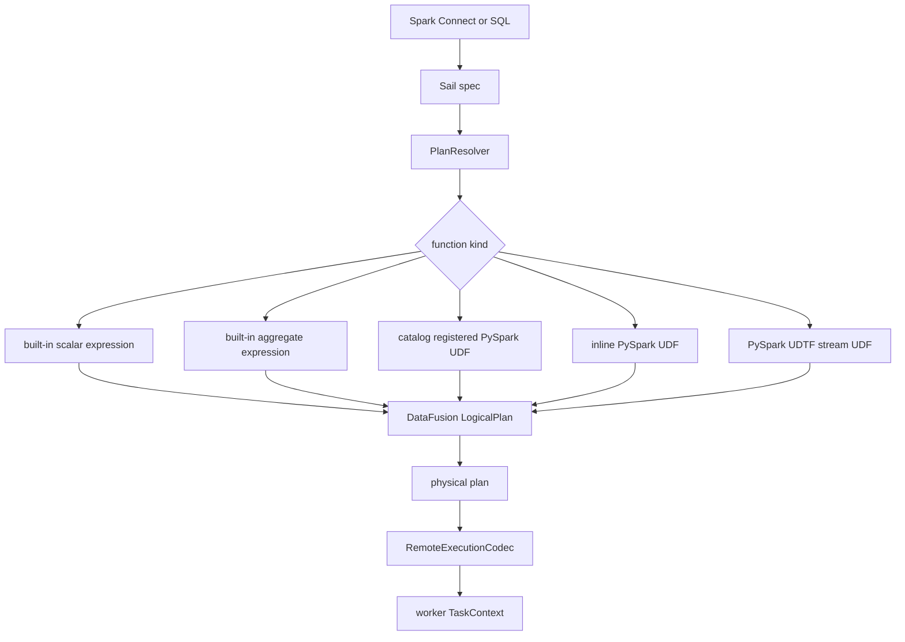
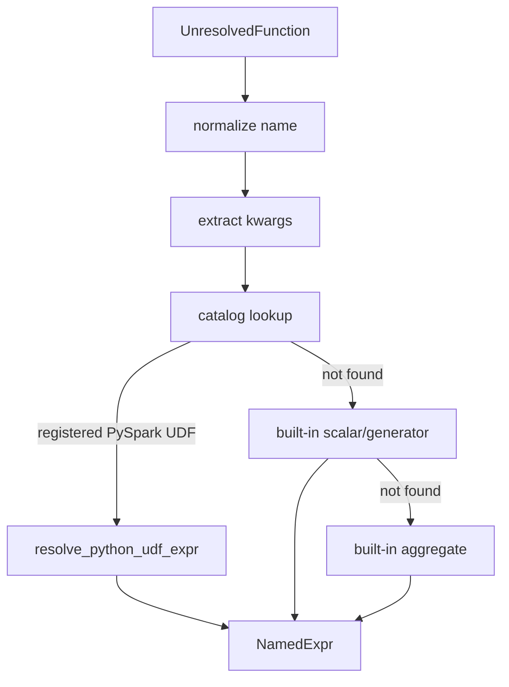
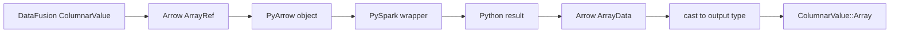
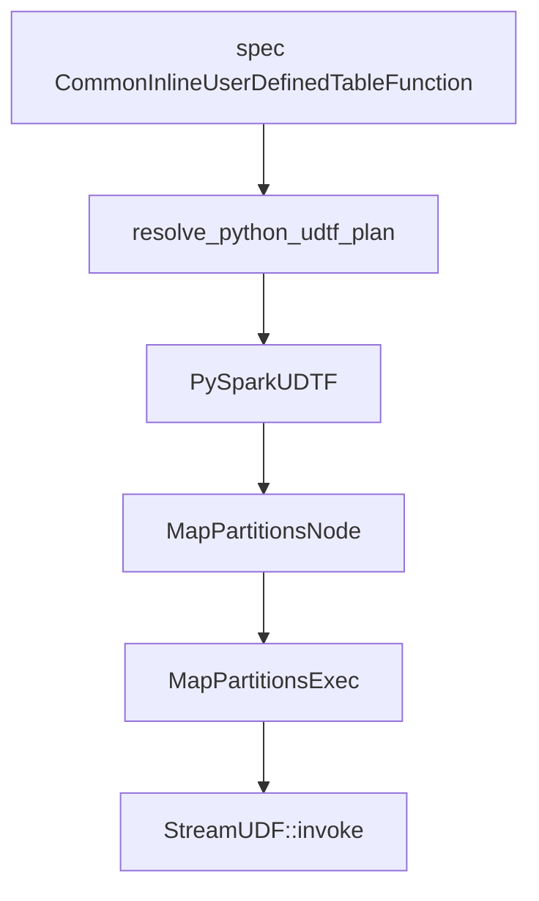
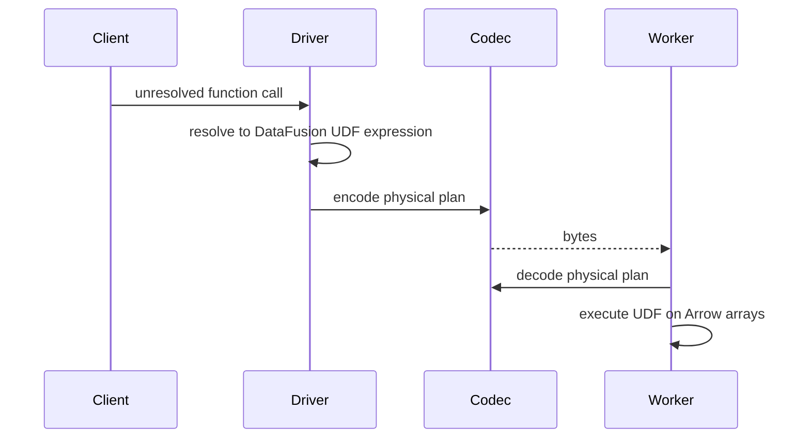
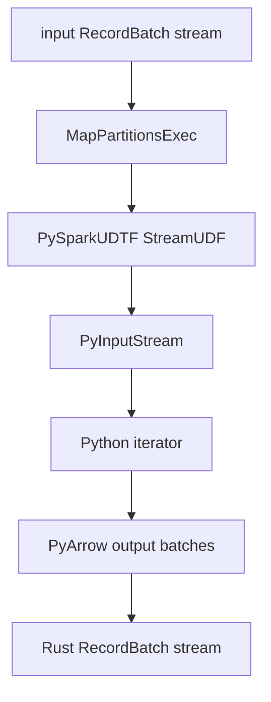

# Chapter 11: Functions, UDFs, And Codecs

A function call looks small in a query:

```sql
SELECT lower(name), my_python_udf(amount)
FROM orders
```

Inside a distributed engine, that little expression is a contract.

The driver must resolve the function name. The logical plan must carry the right
DataFusion expression. The physical plan must know how to execute it. If the query
runs on workers, the function implementation and all of its parameters must survive
serialization. If the function is a Python UDF, the worker must also reconstruct a
PySpark-compatible payload and call Python with Arrow data in the right shape.

This chapter is about that contract.

Sail's function architecture spans four layers:

```text
spec::Expr / spec::CommandNode
  -> PlanResolver function logic
  -> DataFusion UDF/UDAF/window/stream objects
  -> RemoteExecutionCodec for worker execution
```

That makes functions one of the best places to understand why extension proposal
#1810 is not just about registering names. Distributed extensions must be resolvable,
plannable, serializable, decodable, and executable everywhere the query can run.

## Code Map

The main files for this chapter are:

| Concern | File |
|---|---|
| Spec representation of UDFs and UDTFs | `crates/sail-common/src/spec/expression.rs` |
| Built-in function registry | `crates/sail-plan/src/function/mod.rs` |
| Built-in scalar groups | `crates/sail-plan/src/function/scalar/mod.rs` |
| Built-in aggregate functions | `crates/sail-plan/src/function/aggregate.rs` |
| Built-in table functions | `crates/sail-plan/src/function/table/mod.rs` |
| Function expression resolution | `crates/sail-plan/src/resolver/expression/function.rs` |
| Inline Python UDF resolution | `crates/sail-plan/src/resolver/expression/udf.rs` |
| Function registration commands | `crates/sail-plan/src/resolver/command/function.rs` |
| UDTF resolution | `crates/sail-plan/src/resolver/query/udtf.rs` |
| Catalog function storage | `crates/sail-catalog/src/manager/function.rs` |
| Stream UDF trait | `crates/sail-common-datafusion/src/udf.rs` |
| Map partitions physical operator | `crates/sail-physical-plan/src/map_partitions.rs` |
| PySpark scalar UDF implementation | `crates/sail-python-udf/src/udf/pyspark_udf.rs` |
| PySpark aggregate UDF implementation | `crates/sail-python-udf/src/udf/pyspark_udaf.rs` |
| PySpark UDTF implementation | `crates/sail-python-udf/src/udf/pyspark_udtf.rs` |
| PySpark payload building | `crates/sail-python-udf/src/cereal/pyspark_udf.rs` |
| PySpark stream bridge | `crates/sail-python-udf/src/stream.rs` |
| Remote execution codec | `crates/sail-execution/src/codec.rs` |
| Codec protobuf schema | `crates/sail-execution/proto/sail/plan/physical.proto` |
| Server session setup | `crates/sail-session/src/session_factory/server.rs` |
| Worker session setup | `crates/sail-session/src/session_factory/worker.rs` |

## The Function Lifecycle

A function in Sail can enter from several front doors:

- a Spark Connect `UnresolvedFunction`,
- a SQL function call,
- a Spark Connect inline Python UDF expression,
- a function registration command,
- a table-valued function relation,
- an internal rewrite that inserts a helper UDF.

All of those eventually need to become DataFusion expressions or Sail physical
operators.

The lifecycle looks like this:



The key point is that the resolver does not execute functions. It builds objects that
DataFusion and Sail can execute later.

## Spec Representation

The spec layer models inline user-defined functions in
`crates/sail-common/src/spec/expression.rs`.

Scalar UDFs use:

```rust
pub struct CommonInlineUserDefinedFunction {
    pub function_name: Identifier,
    pub deterministic: bool,
    pub is_distinct: bool,
    pub arguments: Vec<Expr>,
    pub function: FunctionDefinition,
}
```

The function definition can be:

```rust
pub enum FunctionDefinition {
    PythonUdf {
        output_type: DataType,
        eval_type: PySparkUdfType,
        command: Vec<u8>,
        python_version: String,
        additional_includes: Vec<String>,
    },
    ScalarScalaUdf { ... },
    JavaUdf { ... },
}
```

Table functions use:

```rust
pub struct CommonInlineUserDefinedTableFunction {
    pub function_name: Identifier,
    pub deterministic: bool,
    pub arguments: Vec<Expr>,
    pub function: TableFunctionDefinition,
}
```

Today, the table function definition is Python-specific:

```rust
pub enum TableFunctionDefinition {
    PythonUdtf {
        return_type: Option<DataType>,
        eval_type: PySparkUdfType,
        command: Vec<u8>,
        python_version: String,
    },
}
```

The `command: Vec<u8>` field is the serialized Python payload from PySpark. Sail treats
it as opaque bytes until it is time to construct a PySpark worker-compatible payload.

The `PySparkUdfType` enum mirrors PySpark evaluation modes:

```text
Batched
ArrowBatched
ScalarPandas
GroupedAggPandas
ScalarPandasIter
ScalarArrow
ScalarArrowIter
GroupedAggArrow
Table
ArrowTable
ArrowUdtf
...
```

Different evaluation types imply different execution shapes:

| Eval type family | Sail execution shape |
|---|---|
| Scalar batch UDF | DataFusion `ScalarUDFImpl` |
| Scalar Pandas or Arrow UDF | DataFusion `ScalarUDFImpl` with Python bridge |
| Grouped aggregate UDF | DataFusion `AggregateUDFImpl` |
| Map iterator UDF | Sail `StreamUDF` through `MapPartitionsExec` |
| UDTF | Sail `StreamUDF` through `MapPartitionsExec` |

This is why the function type must be explicit in the spec. The same surface concept,
"a Python function," can require very different execution machinery.

## Built-In Function Registry

Sail's built-in Spark-compatible functions are registered in static maps in
`crates/sail-plan/src/function/mod.rs`.

```rust
lazy_static! {
    pub static ref BUILT_IN_SCALAR_FUNCTIONS: HashMap<&'static str, ScalarFunction> =
        HashMap::from_iter(scalar::list_built_in_scalar_functions());

    pub static ref BUILT_IN_GENERATOR_FUNCTIONS: HashMap<&'static str, ScalarFunction> =
        HashMap::from_iter(generator::list_built_in_generator_functions());

    pub static ref BUILT_IN_TABLE_FUNCTIONS: HashMap<&'static str, Arc<TableFunction>> =
        HashMap::from_iter(table::list_built_in_table_functions());
}
```

The scalar registry is assembled from many focused modules:

```text
array
bitwise
collection
conditional
conversion
csv
datetime
geo
hash
json
lambda
map
math
misc
predicate
string
struct
url
variant
xml
```

This layout is worth copying in your mental model. There is no single monstrous
function resolver where every implementation lives. Instead:

- `sail-plan` maps Spark-compatible names to expression builders.
- `sail-function` implements many custom DataFusion UDFs and UDAFs.
- `datafusion-spark` and DataFusion built-ins provide additional behavior.
- `sail-python-udf` implements Python-backed functions.

The aggregate registry works similarly, but aggregate functions often have to adapt
Spark syntax to DataFusion's expected function shape.

For example, Spark's ordered-set syntax:

```sql
percentile_cont(0.5) WITHIN GROUP (ORDER BY col)
```

does not arrive in the same argument order DataFusion expects. Sail's aggregate
resolver extracts the ordered column and percentile argument, then builds the
DataFusion aggregate expression.

That pattern is common: Sail preserves Spark semantics while targeting DataFusion's
execution model.

## Function Resolution Order

Function calls are resolved in:

```text
crates/sail-plan/src/resolver/expression/function.rs
```

The core method is:

```rust
resolve_expression_function(...)
```

The resolution order is deliberate:

1. Normalize the function name.
2. Extract keyword arguments from `NamedArgument` expressions.
3. Merge named arguments from SQL analyzer paths.
4. Reject duplicate keyword arguments.
5. Check the `CatalogManager` for registered functions.
6. Resolve and type-check arguments.
7. If a registered PySpark UDF exists, build a Python UDF expression.
8. Otherwise try Sail built-in scalar or generator functions.
9. Otherwise try Sail built-in aggregate functions.
10. Format the output expression name with `PlanService`.

The catalog check happens before built-ins because Spark Connect does not reliably set
the `is_user_defined_function` flag. Sail chooses the behavior users expect: if a
function was registered by name, it should be found.



This is also where Sail handles Spark-specific display names. The expression object is
DataFusion-compatible, but the output name should still look like Spark.

## Registered PySpark UDFs

Registration commands are handled in:

```text
crates/sail-plan/src/resolver/command/function.rs
```

For a scalar Python UDF registration, Sail:

1. Enters a resolver config scope.
2. Enables large Arrow variable types for UDF resolution.
3. Resolves the Python UDF definition and output type.
4. Wraps the unresolved Python function in `PySparkUnresolvedUDF`.
5. Tracks the function in `CatalogManager`.
6. Creates a catalog command logical plan.

Conceptually:

```text
RegisterFunction command
  -> PySparkUnresolvedUDF
  -> CatalogManager::track_function
  -> CatalogCommand::RegisterFunction
```

`CatalogManager` stores functions case-insensitively:

```rust
fn canonical_function_name(name: &str) -> Arc<str> {
    name.to_ascii_lowercase().into()
}
```

When the query later calls that name, the expression resolver finds it in the catalog
and creates the real executable UDF expression with the correct input types.

That two-step model matters:

- Registration knows the Python command bytes and declared return type.
- Call-site resolution knows the actual argument expressions and input types.

You need both to build the runtime payload.

## Inline PySpark UDFs

Spark Connect can also carry a UDF inline inside an expression:

```rust
spec::Expr::CommonInlineUserDefinedFunction
```

That path is handled by:

```text
crates/sail-plan/src/resolver/expression/udf.rs
```

The resolver:

1. Extracts positional and keyword arguments.
2. Rejects duplicate kwargs.
3. Rejects positional arguments after keyword arguments.
4. Resolves argument expressions and display names.
5. Resolves the Python UDF definition.
6. Computes input Arrow data types from the resolved arguments.
7. Builds a PySpark worker-compatible payload.
8. Creates a DataFusion scalar or aggregate UDF expression.

The payload build step is the heart of the integration:

```rust
let payload = PySparkUdfPayload::build(
    &function.python_version,
    &function.command,
    function.eval_type,
    &arg_offsets,
    &input_types,
    kwarg_names,
    &self.config.pyspark_udf_config,
)?;
```

The output depends on the PySpark eval type.

| PySpark eval type | Sail object |
|---|---|
| `Batched` | `PySparkUDF` with `PySparkUdfKind::Batch` |
| `ArrowBatched` | `PySparkUDF` with `PySparkUdfKind::ArrowBatch` |
| `ScalarPandas` | `PySparkUDF` with `PySparkUdfKind::ScalarPandas` |
| `ScalarPandasIter` | `PySparkUDF` with `PySparkUdfKind::ScalarPandasIter` |
| `ScalarArrow` | `PySparkUDF` with `PySparkUdfKind::ScalarArrow` |
| `ScalarArrowIter` | `PySparkUDF` with `PySparkUdfKind::ScalarArrowIter` |
| `GroupedAggPandas` | `PySparkGroupAggregateUDF` with Pandas mode |
| `GroupedAggArrow` | `PySparkGroupAggregateUDF` with Arrow mode |

Unsupported eval types are rejected early if they do not make sense for a scalar inline
UDF.

## Scalar Python Execution

The executable scalar UDF object is `PySparkUDF` in:

```text
crates/sail-python-udf/src/udf/pyspark_udf.rs
```

It implements DataFusion's `ScalarUDFImpl`.

Its fields include:

```rust
kind: PySparkUdfKind,
name: String,
payload: Vec<u8>,
deterministic: bool,
input_types: Vec<DataType>,
output_type: DataType,
config: Arc<PySparkUdfConfig>,
udf: LazyPyObject,
```

The `LazyPyObject` is important. The Python callable is not eagerly loaded when the
plan is built. It is loaded when the UDF is invoked:

```text
payload bytes
  -> PySparkUdfPayload::load
  -> PySpark read_udfs
  -> PySpark wrapper function
```

At execution time, `invoke_with_args()`:

1. Converts DataFusion `ColumnarValue` inputs into Arrow arrays.
2. Converts those arrays into Python/PyArrow values.
3. Calls the Python wrapper.
4. Converts returned Python data back into Arrow `ArrayData`.
5. Casts the result to the declared output type.
6. Returns a DataFusion `ColumnarValue::Array`.



This is the practical meaning of "Arrow UDF" in Sail. Arrow is the boundary format
between Rust execution and Python execution.

## Grouped Aggregate Python UDFs

Grouped aggregate UDFs use:

```text
crates/sail-python-udf/src/udf/pyspark_udaf.rs
```

The central object is `PySparkGroupAggregateUDF`, which implements
`AggregateUDFImpl`.

It supports two modes:

```rust
pub enum PySparkGroupAggKind {
    Pandas,
    Arrow,
}
```

The accumulator path is important. DataFusion aggregate functions do not call a scalar
function once per input batch. They create accumulators. Sail uses
`BatchAggregateAccumulator` with a `BatchAggregator` implementation that calls Python
over collected Arrow arrays.

The resolver also enforces a Spark analysis rule: aggregate UDF arguments cannot
contain nested aggregate functions.

There is another small but revealing workaround: DataFusion requires at least one
input to an aggregate function. For a zero-argument Python aggregate UDF, Sail injects
a dummy `Int64` literal and records the actual argument count separately so the Python
function still receives the right argument list.

That is the kind of adapter code a compatibility engine accumulates. DataFusion and
Spark are close enough to compose, but not identical.

## UDTFs And Stream UDFs

Python table functions are not scalar expressions. They take input rows or batches and
emit zero or more output rows. Sail models them as stream transformations.

The common trait is:

```rust
pub trait StreamUDF: DynObject + Debug + Send + Sync {
    fn name(&self) -> &str;
    fn output_schema(&self) -> SchemaRef;
    fn invoke(&self, input: SendableRecordBatchStream) -> Result<SendableRecordBatchStream>;
}
```

That trait lives in:

```text
crates/sail-common-datafusion/src/udf.rs
```

`PySparkUDTF` implements `StreamUDF` in:

```text
crates/sail-python-udf/src/udf/pyspark_udtf.rs
```

The resolver creates a `MapPartitionsNode`, which the physical planner turns into
`MapPartitionsExec`.



`MapPartitionsExec` is simple:

1. Execute the input physical plan for one partition.
2. Pass the resulting `RecordBatch` stream to the `StreamUDF`.
3. Wrap the output stream with the expected schema.

That is exactly the right abstraction for UDTFs. A UDTF is not "one input value -> one
output value." It is "one stream partition -> another stream partition."

## The Python Stream Bridge

The stream bridge lives in:

```text
crates/sail-python-udf/src/stream.rs
```

`PyMapStream` converts a Rust `RecordBatch` stream into a Python iterator of PyArrow
batches, then converts the Python output iterator back into a Rust `RecordBatch`
stream.

The bridge uses a separate thread:

```text
Rust input stream
  -> PyInputStream.__next__
  -> Python function iterator
  -> output channel
  -> Rust RecordBatchStream
```

The separate thread exists because the Python iterator performs blocking calls into a
Tokio stream. The bridge uses a stop signal so the Rust side can tell the Python input
iterator to stop.

The output path:

1. Calls the Python function with the input iterator.
2. Iterates over Python output batches.
3. Ignores empty batches in compatibility-sensitive cases.
4. Converts PyArrow batches to Arrow `RecordBatch`.
5. Casts batches positionally to the declared output schema.
6. Sends them through a channel to the Rust stream.

This is a useful pattern for any extension that needs to cross a runtime boundary:
make the boundary stream-shaped, schema-aware, and cancellation-aware.

## The Remote Execution Codec

So far, we have talked about resolving and executing functions in one process. But Sail
has a distributed runtime. The driver builds a physical plan. Workers execute tasks.
Workers must reconstruct every custom physical plan node and every custom function
that appears inside physical expressions.

That is the job of `RemoteExecutionCodec`:

```text
crates/sail-execution/src/codec.rs
```

It implements DataFusion's `PhysicalExtensionCodec`.

The codec handles:

- extended physical plan nodes,
- extended physical expressions,
- scalar UDFs,
- aggregate UDFs,
- window UDFs,
- stream UDFs,
- schemas,
- data types,
- scalar values,
- partitioning,
- statistics,
- file scan configs,
- Sail lakehouse execution nodes,
- Python UDF configuration and payloads.

The protobuf definitions live in:

```text
crates/sail-execution/proto/sail/plan/physical.proto
```

The file starts with a telling comment: DataFusion data structures are often stored as
opaque bytes because DataFusion's protobuf definitions can change. Sail uses its own
extended protobuf messages for Sail-specific nodes and wraps DataFusion's protobuf
encoding where needed.

## Encoding Scalar UDFs

Scalar UDF encoding happens in `try_encode_udf()`.

The current design has two broad paths:

1. If the UDF is a known Sail/DataFusion built-in that the worker can reconstruct by
   name, encode it as `StandardUdf`.
2. If the UDF carries state or custom configuration, encode the required fields into a
   specific protobuf variant.

Examples of stateful scalar UDF variants:

```text
PySparkUdf
PySparkCoGroupMapUdf
DropStructFieldUdf
ExplodeUdf
SparkUnixTimestampUdf
StructFunctionUdf
ArraysZipUdf
UpdateStructFieldUdf
TimestampNowUdf
SparkTimestampUdf
SparkDateUdf
SparkFromCsvUdf
SparkFromJsonUdf
...
```

For `PySparkUDF`, the codec stores:

```text
kind
name
payload
deterministic
input_types
output_type
config
```

That is enough for a worker to reconstruct:

```rust
PySparkUDF::new(
    kind,
    name,
    payload,
    deterministic,
    input_types,
    output_type,
    Arc::new(config),
)
```

For a UDF like `StructFunction`, the codec only needs the field names. For a UDF like
`SparkTimestamp`, it needs timezone and `is_try`. The encoding shape follows the
state needed to reconstruct the function.

## Decoding Scalar UDFs

Decoding happens in `try_decode_udf()`.

The codec receives a function name and an extension buffer. If the extension buffer is
`StandardUdf`, it reconstructs the function by matching on the name:

```text
"spark_array" -> SparkArray::new()
"spark_split" -> SparkSplit::new()
"spark_xxhash64" -> SparkXxhash64::new()
...
```

If the buffer contains a richer variant, the codec decodes the fields and constructs
the object directly.

That distinction is a bit manual today. The code even has a TODO:

```text
Implement custom registry to avoid codec for built-in functions
```

This is another bright signpost for issue #1810. A third-party extension should not
need to patch a giant match statement in `RemoteExecutionCodec` just to make a custom
function work on workers.

## Encoding Aggregate And Window UDFs

Aggregate UDFs follow the same idea.

Known standard aggregate UDFs encode as:

```text
StandardUdaf
```

Then the worker decodes by name:

```text
bitmap_and_agg
histogram_numeric
kurtosis
max_by
mode
percentile
product
try_avg
try_sum
...
```

Python grouped aggregate UDFs carry their payload, input names, input types, output
type, deterministic flag, kind, config, and actual argument count.

Window UDF support is narrower. The codec has `ExtendedWindowUdf`, and currently the
standard custom path includes `ntile` through `SparkNtile`.

The broader lesson is the same: every non-standard callable object needs a worker-side
reconstruction story.

## Encoding Stream UDFs

Stream UDFs are not DataFusion scalar expressions, so they have their own codec path:

```rust
fn try_encode_stream_udf(&self, udf: &dyn StreamUDF) -> Result<ExtendedStreamUdf>
fn try_decode_stream_udf(&self, udf: ExtendedStreamUdf) -> Result<Arc<dyn StreamUDF>>
```

The current variants include:

```text
PySparkMapIterUdf
PySparkUdtf
```

For `PySparkUDTF`, the codec stores:

```text
kind
name
payload
input_names
input_types
passthrough_columns
function_return_type
function_output_names
deterministic
config
```

That mirrors the constructor for `PySparkUDTF::try_new()`.

This design is clean in one important way: stream UDFs are encoded with the physical
operator that uses them. `MapPartitionsExec` does not need to know how a Python UDTF
works. It only needs a `StreamUDF`.

## Worker Sessions And Built-Ins

The server session factory deliberately does not add all DataFusion default features:

```text
We do not add default features to the session state,
since we manage table formats and functions ourselves.
```

But the worker session factory does add default features:

```text
We still add default features for the worker session
since we need built-in functions to be available for the codec
when decoding the execution plan.
```

That comment is small but important. It tells us that decoding a physical plan is not
only a bytes-to-struct operation. It may depend on what functions and features are
registered in the worker's `SessionState`.

This is one of the hard requirements for extensions:

```text
The driver and every worker must agree on the callable universe.
```

If the driver can plan a function the worker cannot decode, the query fails at task
startup. If the worker can decode but not execute the function, the query fails during
batch execution.

## Distributed Example: Built-In Function

Consider:

```sql
SELECT xxhash64(customer_id)
FROM orders
```

The path is:

1. Spark Connect or SQL creates `spec::Expr::UnresolvedFunction`.
2. The resolver normalizes the function name.
3. The built-in scalar function registry maps it to a Spark-compatible expression.
4. DataFusion physical planning creates a physical expression containing a UDF.
5. The job graph planner splits the plan into distributed stages if needed.
6. The task definition serializes the physical plan with `RemoteExecutionCodec`.
7. The worker decodes the UDF as a known standard UDF by name.
8. The worker executes the function against Arrow arrays.

The function itself may feel local, but in cluster mode it has to survive this trip:



## Distributed Example: Python Scalar UDF

Now consider:

```python
@udf("long")
def plus_one(x):
    return x + 1

df.select(plus_one("amount"))
```

The path is richer:

1. PySpark serializes the Python function command.
2. Spark Connect sends the UDF information to Sail.
3. Sail stores or resolves the UDF as `CommonInlineUserDefinedFunction`.
4. The resolver computes input Arrow types from the call site.
5. `PySparkUdfPayload::build()` writes a PySpark-compatible payload:
   - eval type,
   - config,
   - optional input type JSON for certain PySpark versions,
   - profiling flag for PySpark 4,
   - argument offsets,
   - keyword argument names,
   - serialized command bytes.
6. Sail creates `PySparkUDF`.
7. The physical plan is encoded.
8. The codec encodes kind, payload, input types, output type, and config.
9. The worker decodes `PySparkUDF`.
10. At execution time, the UDF loads the Python callable lazily.
11. Arrow arrays cross into Python.
12. Python returns Arrow-compatible data.
13. Sail casts the result to the declared output type.

That is a lot of machinery, but each part has a job:

```text
spec       -> preserve user intent and Python command
resolver   -> bind arguments and types
UDF object -> implement DataFusion execution
codec      -> move the object to workers
Python     -> run user code over Arrow-shaped data
```

## Distributed Example: Python UDTF

A UDTF is stream-shaped:

```python
class SplitWords:
    def eval(self, text):
        for word in text.split():
            yield (word,)
```

The Sail path is:

1. Resolve the UDTF definition and arguments.
2. Determine the return type. If no static return type exists, call the Python
   `analyze` method during query analysis.
3. Build a `PySparkUdtfPayload`.
4. Create a `PySparkUDTF` stream UDF.
5. Build a `MapPartitionsNode`.
6. Physical planning creates `MapPartitionsExec`.
7. The codec encodes both the physical operator and its stream UDF.
8. The worker decodes `MapPartitionsExec` and `PySparkUDTF`.
9. At runtime, the input partition stream is passed into Python.
10. Python yields output batches, and Rust turns them back into `RecordBatch` streams.

Diagram:



This is the same distributed principle again: the operator and the callable object
must both be serializable.

## Codec Design Lessons

`RemoteExecutionCodec` is not glamorous code, but it is the backbone of cluster
execution.

It teaches several lessons:

First, function identity is not enough. Some functions need state:

- timezone,
- field names,
- ANSI mode,
- safe/try flags,
- input types,
- output types,
- Python payload bytes,
- PySpark config,
- passthrough column counts.

Second, the worker must reconstruct the same behavior, not merely a function with the
same name.

Third, built-ins and extensions need different handling. Built-ins can sometimes be
reconstructed by name. Extension functions need explicit registration and encoding.

Fourth, codecs are versioned contracts even when no version field is visible. If you
change a function's fields, you have changed the bytes a worker expects.

Fifth, DataFusion's extension codec hooks are exactly the right place to integrate
custom behavior, but Sail needs a registry around them to avoid central matches.

## Extension Implications

For issue #1810, functions and codecs expose the sharpest edge of the design.

A third-party extension may want to add:

- a scalar UDF,
- an aggregate UDF,
- a window UDF,
- a table function,
- a stream UDF,
- a physical expression,
- a physical operator,
- a logical optimizer rewrite,
- a Spark Connect custom expression,
- a Python package that registers all of the above.

To work in local mode, registering a DataFusion UDF may be enough.

To work in cluster mode, that is not enough.

A distributed extension needs:

| Need | Why |
|---|---|
| Logical name registration | So the resolver can bind function calls. |
| Type inference | So the logical plan can be checked and named. |
| Execution implementation | So DataFusion can evaluate the function. |
| Physical encoding | So the driver can serialize plans. |
| Physical decoding | So workers can reconstruct plans. |
| Worker installation | So the implementation exists in worker processes. |
| Version compatibility | So encoded bytes match decoder expectations. |
| Collision policy | So two extensions cannot silently claim the same name. |
| Ordering policy | So optimizer and planner hooks run deterministically. |

This is the difference between a plugin that works in a notebook and an extension that
works in a distributed query engine.

Everything in this section concerns what chapter 13 calls the *execution-time
boundary*: the work that happens once per batch on a worker. A separate
*plan-time boundary* - how user intent enters Sail in the first place - has its
own ABI story. Chapter 13 routes plan-time intent through Spark Connect's
`Relation.extension`, `Command.extension`, and `Expression.extension` messages
and uses the codec mechanism below only for execution-time concerns. The two
boundaries can ship independently, and a Pattern A extension (one that
decomposes to existing DataFusion operators) skips the codec work entirely.

## A Proposed Extension Codec Registry

The current codec knows about Sail's built-ins through downcasts and name matches.
That is fine for core code, but third-party extensions need a more open shape.

One possible design:

```rust
pub trait FunctionCodec: Send + Sync {
    fn type_url(&self) -> &'static str;

    fn encode_scalar_udf(&self, udf: &ScalarUDF) -> Option<PlanResult<Vec<u8>>>;
    fn decode_scalar_udf(&self, name: &str, bytes: &[u8]) -> Option<PlanResult<Arc<ScalarUDF>>>;

    fn encode_aggregate_udf(&self, udf: &AggregateUDF) -> Option<PlanResult<Vec<u8>>>;
    fn decode_aggregate_udf(&self, name: &str, bytes: &[u8]) -> Option<PlanResult<Arc<AggregateUDF>>>;

    fn encode_stream_udf(&self, udf: &dyn StreamUDF) -> Option<PlanResult<Vec<u8>>>;
    fn decode_stream_udf(&self, bytes: &[u8]) -> Option<PlanResult<Arc<dyn StreamUDF>>>;
}
```

The actual API could be different, but the design goal is clear:

```text
Core codec dispatches to registered extension codecs.
Extension codecs own their wire format.
Workers and drivers register the same codecs.
```

The protobuf could use a generic extension envelope:

```text
message ExtensionFunction {
  string provider = 1;
  string name = 2;
  string version = 3;
  bytes payload = 4;
}
```

Then an extension like a geospatial package could encode its own UDFs without editing
Sail's central codec every time.

## A Proposed Function Registration Model

The function side also wants a registry that separates names from implementations:

```rust
pub trait SailFunctionExtension: Send + Sync {
    fn name(&self) -> &'static str;

    fn register_scalar_functions(&self, registry: &mut ScalarFunctionRegistry) -> PlanResult<()>;
    fn register_aggregate_functions(&self, registry: &mut AggregateFunctionRegistry) -> PlanResult<()>;
    fn register_table_functions(&self, registry: &mut TableFunctionRegistry) -> PlanResult<()>;
    fn register_stream_functions(&self, registry: &mut StreamFunctionRegistry) -> PlanResult<()>;
    fn register_codecs(&self, registry: &mut CodecRegistry) -> PlanResult<()>;
}
```

This lets Sail enforce:

- duplicate-name errors,
- deterministic registration order,
- per-session enablement,
- worker compatibility checks,
- explain output that names which extension supplied a function.

The key design rule is that registration must happen on both driver and worker
sessions. Otherwise distributed execution becomes a coin toss.

## Reading Exercise

Trace this query:

```python
df.select(my_udf("x"))
```

Suggested path:

1. Start with `CommonInlineUserDefinedFunction` in
   `crates/sail-common/src/spec/expression.rs`.
2. Follow `resolve_expression_common_inline_udf()` in
   `crates/sail-plan/src/resolver/expression/udf.rs`.
3. Watch how input types are computed from resolved arguments.
4. Open `PySparkUdfPayload::build()` in
   `crates/sail-python-udf/src/cereal/pyspark_udf.rs`.
5. Follow the creation of `PySparkUDF`.
6. Open `PySparkUDF::invoke_with_args()`.
7. Then jump to `RemoteExecutionCodec::try_encode_udf()`.
8. Follow `UdfKind::PySpark`.
9. Read `RemoteExecutionCodec::try_decode_udf()`.
10. Confirm that the worker reconstructs the same `PySparkUDF`.

The key question:

```text
What data must cross the driver-worker boundary for this function to behave the same
on the worker as it did in the driver's plan?
```

That question is the whole chapter in miniature.

## Takeaways

Functions in Sail are distributed execution contracts:

- Built-ins are resolved through Sail's Spark-compatible function maps.
- Registered PySpark UDFs are stored in the catalog and materialized at call sites.
- Inline PySpark UDFs carry command bytes directly in the spec expression.
- Scalar Python UDFs implement DataFusion `ScalarUDFImpl`.
- Grouped Python aggregate UDFs implement DataFusion `AggregateUDFImpl`.
- Python UDTFs use Sail's `StreamUDF` abstraction and `MapPartitionsExec`.
- Arrow arrays and record batches are the runtime boundary between Rust and Python.
- `RemoteExecutionCodec` makes custom plans and functions executable on workers.
- Extension proposal #1810 must include codec, registration, and worker compatibility
  stories, not only a way to add names to a function map.

The next chapter moves from callable behavior to tables: catalogs, table formats,
lakehouse scans and writes, and how file and table providers cross the
Sail/DataFusion boundary.
